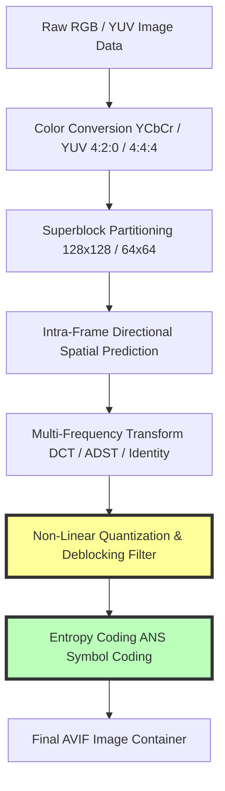
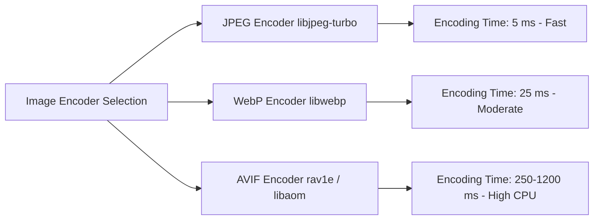

# AVIF Compression Explained: The Complete Technical Guide

The digital web relies on image compression to balance high visual fidelity with fast load times. For over two decades, legacy formats like JPEG and PNG served as default web standards. However, modern web applications demand higher compression efficiency to achieve top Core Web Vitals scores and reduce bandwidth overhead.

The **AV1 Image File Format (AVIF)** represents a major advancement in image compression technology. Developed by the Alliance for Open Media (AOMedia)—a consortium including Google, Mozilla, Microsoft, Apple, and Netflix—AVIF leverages keyframe compression technology from the AV1 video codec to achieve higher compression ratios than JPEG, PNG, and WebP.

This guide analyzes how AVIF compression works, examines its underlying AV1 algorithms, details color bit-depth and HDR capabilities, provides CPU encoding benchmark trade-offs, and demonstrates how to implement AVIF assets with WebP fallbacks using HTML `<picture>` elements.

---

## Technical Comparison: AVIF vs. WebP vs. JPEG vs. PNG

To understand AVIF's efficiency, we must compare its specs against established web image formats:

| Feature | AVIF (AV1 Image File Format) | WebP (VP8 Engine) | JPEG (DCT Quantization) | PNG (DEFLATE / Delta) |
| :--- | :--- | :--- | :--- | :--- |
| **Codec Architecture** | **AV1 Video Keyframes** | VP8 Video Keyframes | Discrete Cosine Transform | LZ77 + Huffman (Deflate) |
| **Relative Compression**| **50% smaller than JPEG** | 30% smaller than JPEG | Baseline Standard | Lossless Only (Heavy) |
| **Max Color Bit Depth** | **10-bit / 12-bit per channel**| 8-bit per channel | 8-bit per channel | 8-bit / 16-bit per channel |
| **HDR & Wide Gamut** | **Native (Rec. 2020 / PQ)** | SDR Only (sRGB) | SDR Only (sRGB) | Limited ICC Profiles |
| **Alpha Transparency** | **Yes (Full 10/12-bit Alpha)**| Yes (8-bit Alpha) | No (Solid Canvas) | Yes (8-bit Alpha) |
| **Encoding Speed** | Slow (High CPU load) | Fast | Extremely Fast | Fast |
| **Browser Compatibility**| Universal (Modern Browsers)| Universal (Modern Browsers)| Universal (100% Legacy) | Universal (100% Legacy) |

---

## The Mathematics of AVIF Compression Algorithms

AVIF is an image container format that encapsulates **AV1 intra-frame (keyframe) coded sequences** within an ISO Base Media File Format (ISOBMFF) container. Unlike video codecs that encode temporal motion across frames, AVIF uses AV1's spatial compression tools to compress static image frames.



The AVIF compression pipeline includes several advanced encoding mechanisms:

### 1. Superblock Partitioning Trees
Legacy JPEG divides images into fixed $8\times8$ pixel blocks. AVIF uses flexible **Superblocks** sized up to $128\times128$ or $64\times64$ pixels. 
These superblocks are recursively divided into smaller transform units (ranging from $128\times128$ down to $4\times4$ pixels) using a **Recursive Quadtree / 10-way Partitioning Structure**. Large, flat areas (like skies or plain backgrounds) are encoded using large superblocks to save data, while complex textures use smaller sub-blocks to preserve detail.

### 2. Directional Intra-Frame Spatial Prediction
AVIF analyzes neighboring blocks to predict pixel patterns within a block using **56 directional spatial modes**. Instead of encoding every pixel value explicitly, the encoder records a directional prediction vector and encodes only the **residual error** (the mathematical difference between the predicted pattern and the actual pixels). This significantly reduces the data needed to store repetitive patterns, gradients, and edge lines.

### 3. Multi-Frequency Discrete Transforms
After spatial prediction, the residual error matrix is converted into a frequency domain using advanced transform combinations:
*   **DCT (Discrete Cosine Transform):** Ideal for smooth, continuous gradients.
*   **ADST (Asymmetric Discrete Sine Transform):** Used for sharp boundary edges and text transitions.
*   **Identity Transforms:** Preserves exact pixel values for fine lines.

### 4. Asymmetric Numeral Systems (ANS) Entropy Coding
AVIF replaces legacy Huffman or arithmetic coding with **Asymmetric Numeral Systems (ANS)** entropy coding. ANS combines the high compression ratios of arithmetic coding with the fast decoding speeds of Huffman tables, allowing AVIF files to be uncompressed quickly by browser decoders.

---

## Advanced Color Capabilities: 10-Bit, 12-Bit, and HDR

One of AVIF's key advantages over JPEG and WebP is its support for high-precision color depth:

*   **8-Bit Limitations:** JPEG and WebP restrict color depth to **8 bits per channel** ($2^8 = 256$ shade steps per channel), yielding 16.7 million total colors. In smooth sky gradients or shadows, 8-bit color often creates visible color banding.
*   **10-Bit & 12-Bit Depth:** AVIF supports **10-bit** ($1,024$ steps) and **12-bit** ($4,096$ steps) color channels, offering billions of distinct shades. This eliminates color banding in high-contrast photographs and smooth gradients.
*   **High Dynamic Range (HDR):** AVIF supports **Rec. 2020** wide color gamuts and High Dynamic Range (HDR) transfer functions (such as Perceptual Quantizer / PQ and Hybrid Log-Gamma / HLG). This allows AVIF images to display brighter highlights, deeper blacks, and richer colors on modern HDR displays.

---

## CPU Encoding Benchmarks & Server Trade-offs

While AVIF offers superior compression efficiency, it requires significantly more CPU processing power to encode than JPEG or WebP:



*   **Encoding Speeds:** Encoding an AVIF file using `libaom` or `rav1e` at high compression presets can take **10 to 50 times longer** than encoding an equivalent JPEG or WebP file.
*   **Decoding Speeds:** Browser decoding speeds for AVIF are fast thanks to hardware-accelerated AV1 decoders built into modern GPUs (such as Apple Silicon M-series, Intel Xe, AMD RDNA3, and Nvidia RTX 40-series).
*   **Best Practice:** Pre-render and cache AVIF assets during your static build step or CI/CD pipeline rather than converting them on-the-fly during web requests.

---

## How to Implement AVIF with WebP Fallbacks Using the HTML Picture Tag

While all modern browsers (Chrome, Safari, Firefox, Edge, iOS Safari) support AVIF natively, you should still implement fallback strategies for older environments or legacy email readers using the HTML5 `<picture>` element:

```html
<picture>
  <!-- 1. Primary Choice: Next-Gen AVIF for modern supporting browsers -->
  <source srcset="/images/hero-banner.avif" type="image/avif">
  
  <!-- 2. Secondary Fallback: Universal Next-Gen WebP -->
  <source srcset="/images/hero-banner.webp" type="image/webp">
  
  <!-- 3. Legacy Fallback: Standard JPG for legacy browsers/clients -->
  
</picture>
```

### How the `<picture>` Element Works:
1.  **Top-Down Parsing:** The browser evaluates the `<source>` tags sequentially from top to bottom.
2.  **MIME Type Matching:** If the browser supports `image/avif`, it downloads `/images/hero-banner.avif` and skips the remaining sources.
3.  **Fallback Triggering:** If the browser does not support `image/avif`, it checks the next source (`image/webp`). If neither is supported, it falls back to the standard `` tag URL (`/images/hero-banner.jpg`).

---

## AVIF Encoding Configurations with Command Line Tools (libaom / ImageMagick)

If you are building an automated asset processing script, use these recommended `ffmpeg` or `magick` parameters:

### Using ImageMagick CLI:
```bash
# Convert JPEG to optimized 10-bit AVIF with quality 65
magick input.jpg -quality 65 -define heic:speed=4 output.avif
```

### Using FFmpeg CLI:
```bash
# Encode JPEG to AVIF using libaom-av1
ffmpeg -i input.jpg -c:v libaom-av1 -still-picture 1 -crf 23 -preset 4 output.avif
```

---

## Step-by-Step AVIF Optimization Checklist

Before deploying AVIF images across your site, run your assets through this checklist:

*   **Format Conversion:** Convert high-resolution photographic sources to **AVIF** using quality settings between **CRF 22 and 28**.
*   **HTML Implementation:** Implement AVIF assets using the HTML `<picture>` element with WebP and JPEG fallbacks.
*   **Dimensions & Layout:** Always declare `width` and `height` attributes on the `` fallback tag to reserve layout space and prevent Cumulative Layout Shift (CLS).
*   **Asset Compression:** Use our free, browser-based [Image Compressor](/tools/image-compressor) to reduce file sizes locally before uploading.

---

## Frequently Asked Questions

### What is the AVIF image format?
AVIF (AV1 Image File Format) is a modern image container format derived from the keyframe compression algorithms of the AV1 video codec. It offers higher compression efficiency than JPEG, PNG, and WebP.

### How much smaller is AVIF compared to WebP and JPEG?
AVIF files are typically **50% smaller than JPEGs** and **20% to 30% smaller than WebPs** at equivalent visual quality, making it an effective format for improving website load speeds and LCP scores.

### How do I implement AVIF with WebP fallbacks in HTML?
Use the HTML5 `<picture>` element. Place the AVIF `<source type="image/avif">` tag first, followed by the WebP `<source type="image/webp">` tag, and include a standard JPEG `` tag as the final fallback.

### Does AVIF support transparency and HDR?
Yes. AVIF supports full alpha transparency (at 10-bit or 12-bit precision), wide color gamuts (Rec. 2020), and High Dynamic Range (HDR) color profiles natively.

### Why is AVIF encoding slower than WebP?
AVIF uses AV1 video keyframe compression, which evaluates complex superblock partitions and spatial prediction modes. This requires significantly more CPU processing power during encoding compared to simpler codecs like JPEG or WebP.

### How can I convert images to AVIF securely?
To convert your images to modern formats without exposing assets to external cloud databases, use our free, browser-based [Image Converter](/image-converter). The tool runs locally in your browser, keeping your files private and secure.
