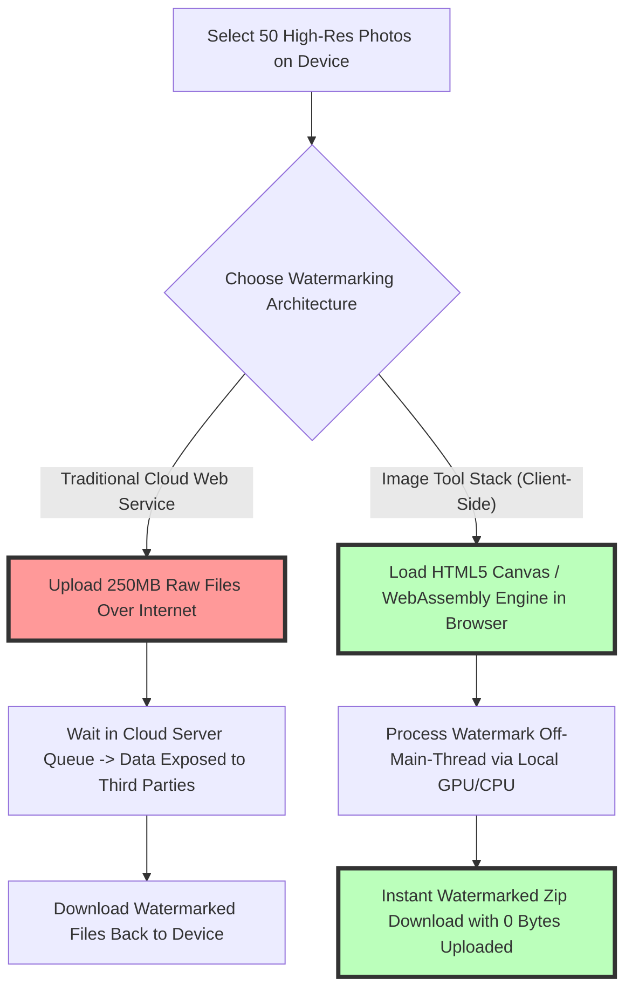
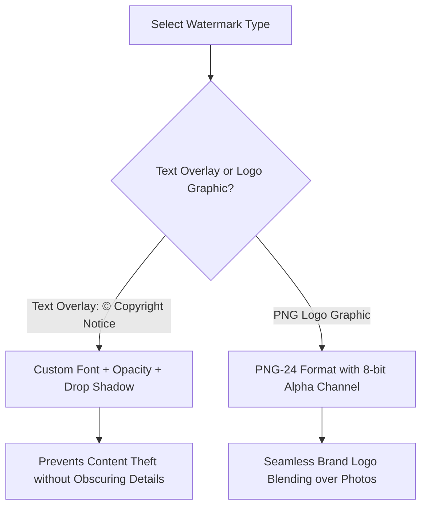

# Best Add Watermark Tool Online: Free Batch Photo Copyright No Upload Guide

Photographers, digital artists, real estate agents, e-commerce sellers, and content creators face a continuous challenge on the internet: protecting original visual assets from unauthorized hotlinking, content scraping, social media theft, and commercial copyright infringement. Stamping a custom logo or text attribution watermark onto your photos is the most effective visual deterrent against content theft.

However, traditional cloud-based watermarking websites (such as Watermark.ws, Watermarkly cloud, or ILoveIMG) force users to upload their personal photos to third-party remote servers. Uploading private family photos, confidential client portrait shoots, or unreleased product previews to external cloud databases creates severe privacy risks, exposes sensitive EXIF location metadata, and wastes bandwidth in slow upload queues.

This guide evaluates the best online watermarking tools, explains why **client-side WebAssembly browser processing** is the safest watermarking method, compares PNG logo transparency vs. text overlay rules, details anti-removal watermarking tactics (including 20-50% opacity and diagonal tiled patterns), and provides a step-by-step batch watermarking workflow.

---

## Master Comparison Matrix: Online Watermarking Solutions

To understand the difference between dangerous cloud upload services and modern browser-native watermarking utilities, review this comparison:

| Feature / Metric | Client-Side Tool (Image Tool Stack) | Traditional Cloud Watermark Sites | Desktop Software (Photoshop / Lightroom) |
| :--- | :--- | :--- | :--- |
| **Server File Upload** | **NO (100% On-Device Browser Memory)**| YES (Files uploaded to remote cloud)| NO (Installed local desktop app) |
| **Data & Photo Privacy** | **Absolute (Files never leave device)** | Vulnerable to server breaches & leaks | Absolute (Offline local software) |
| **File Size Limits** | **UNLIMITED (No MB file caps)** | Strict 5MB – 10MB caps on free tier | Unlimited (Hardware memory bound) |
| **Batch Processing** | **Instant (Parallel CPU/GPU threads)**| Slow (Constrained by upload speed) | Fast (Local processor rendering) |
| **Pricing Model** | **100% Free Forever (No Watermarks)** | Monthly subscriptions / Paid exports | Paid License / Creative Cloud sub |
| **Software Install** | **Zero Installation (Browser-Native)** | Zero Installation (Cloud Web App) | Heavy software installation |

---

## The Architecture of Client-Side WebAssembly Watermarking

Why is on-device browser watermarking vastly superior to server-side watermarking?



### How Client-Side Processing Protects Privacy:
When you open our browser-based [Add Watermark Tool](/tools/add-watermark), your web browser downloads a tiny execution script powered by **HTML5 Canvas and WebAssembly**. When you drag and drop 100 images into the workspace:
1.  **Zero Network Data Transfer:** Your photos are read directly into your device's transient RAM memory. **0 bytes of image data** are sent over the internet.
2.  **Hardware-Accelerated Rendering:** Your local computer or smartphone GPU renders text overlays, logo alpha channels, and opacity blending filters in parallel threads.
3.  **Instant Offline Execution:** Once loaded, you can disconnect your Wi-Fi or cellular network entirely—the watermarking engine functions 100% offline.

---

## Technical Strategy: Text Overlays vs. PNG Logo Transparency

Choosing the right type of watermark depends on your branding goals and visual presentation preferences:



### 1. PNG-24 Transparent Logos
For corporate branding, wedding photography studio marks, or e-commerce store logos, always use **24-bit PNG (`.png`)** files featuring transparent alpha channels. Using a PNG logo ensures that white or colored background bounding boxes are omitted, allowing your logo mark to blend smoothly over photo backgrounds.

### 2. Custom Text Overlays & Copyright Formatting
When adding text attributions, include formal copyright formatting signals to establish legal ownership:
*   **Format Example:** `© 2026 StudioName. All Rights Reserved. www.yourdomain.com`
*   **Font Selection:** Select clean, highly legible sans-serif typefaces (such as Inter, Roboto, or Arial).
*   **Drop Shadow & Stroke Controls:** Add a subtle 1-pixel dark drop shadow or white outer stroke behind text to ensure legibility over both dark backgrounds (night scenes) and light backgrounds (snow or overcast skies).

---

## Anti-Removal Watermarking Tactics: Opacity & Tiled Patterns

With modern AI image editing software capable of content-aware fill and watermark removal, applying watermarks strategically is essential to prevent easy deletion:

```
+-----------------------------------------------------------------------+
|  TILED DIAGONAL WATERMARK PATTERN (Maximum Security)                   |
|                                                                       |
|  © Studio  .  .  © Studio  .  .  © Studio  .  .  © Studio            |
|  .  .  © Studio  .  .  © Studio  .  .  © Studio  .  .  © Studio       |
|  © Studio  .  .  © Studio  .  .  © Studio  .  .  © Studio            |
|                                                                       |
|  - 15% Opacity Level (Subtle background coverage)                     |
|  - 45-Degree Diagonal Rotation (Covers high-frequency detail)        |
+-----------------------------------------------------------------------+
```

### Recommended Placement & Opacity Guidelines:
1.  **Corner Watermark (Standard Attribution):** Position logos in the bottom-right or bottom-left corner with **50% to 70% opacity**. Ideal for client proofing galleries where aesthetic presentation is prioritized.
2.  **Centered Subject Watermark (High Protection):** Position the logo over the central subject of the photo at **25% to 35% opacity**. This prevents thieves from cropping out corner marks without ruining photo composition.
3.  **Tiled Diagonal Grid (Maximum Anti-AI Theft):** Repeat a semi-transparent text string or logo pattern at a **45-degree angle** across the entire canvas at **15% to 20% opacity**. This pattern covers high-frequency texture areas (such as clothing weave, skin texture, or architectural lines), making AI-based removal impossible without destroying the underlying image.

---

## Step-by-Step Batch Watermarking Workflow

Follow this workflow to watermark hundreds of photos simultaneously in your browser:

1.  **Launch the Tool:** Open our client-side [Add Watermark Tool](/tools/add-watermark) in Chrome, Safari, Firefox, or Edge.
2.  **Drag & Drop Photos:** Select your photos or drag an entire folder into the browser drop zone.
3.  **Configure Watermark Elements:**
    *   Choose **Text Watermark** (type your copyright notice) or **Image Logo** (upload your PNG logo).
    *   Set **Opacity Slider** (recommended: 30% to 50%).
    *   Select **Positioning** (Corner, Center, or Diagonal Tiled Grid).
4.  **Batch Render & Download:** Click **Apply & Download All**. Your browser renders the watermarked images into a compressed ZIP file instantly.

---

## Step-by-Step Photo Watermarking Checklist

Before publishing watermarked images online, run your assets through this checklist:

*   **Privacy Check:** Ensure processing is performed **client-side** without server uploads.
*   **Logo File Format:** Export logo graphics as **PNG-24 with alpha transparency**.
*   **Opacity Calibration:** Keep opacity between **20% and 50%** for a balance of protection and legibility.
*   **Original Backup:** Always preserve un-watermarked original high-resolution master files in a secure backup location.
*   **EXIF Metadata Management:** Clean sensitive GPS coordinates and camera serial numbers before publishing using our free [EXIF Remover](/tools/exif-remover) to protect private location data.

---

## EXIF Copyright Tagging vs. Visual Watermarking

While visual watermarking adds a visible text or logo attribution overlay, digital copyright protection also relies on embedded metadata:
*   **EXIF/IPTC Copyright Tags:** Embedded IPTC metadata tags store copyright notices, creator names, contact emails, and licensing terms directly inside the file header.
*   **Dual Protection:** Combining a visual logo watermark with embedded IPTC copyright metadata ensures that even if an image is shared across social media networks, legal copyright ownership remains embedded within the file data.

---

## Frequently Asked Questions

### What is the best free add watermark tool online?
The best online watermark tool is our client-side [Add Watermark Tool](/tools/add-watermark). It processes photos 100% locally in your browser with zero file uploads, zero size caps, and zero paywalls.

### Is it safe to upload photos to online watermarking websites?
Traditional cloud watermarking sites force you to upload photos to remote servers, exposing private images, client contracts, and EXIF location metadata. Client-side browser tools eliminate server uploads entirely, ensuring 100% privacy.

### Should I use PNG or JPEG for watermark logos?
Always use **PNG-24** for watermark logos. PNG supports transparent alpha channels, ensuring your logo mark overlays cleanly on top of photos without ugly white rectangular background bounding boxes.

### How can I stop AI tools from removing my watermarks?
Apply a **tiled diagonal watermark pattern** across the entire photo at **15-20% opacity**. Tiling text or logos across key subject details makes AI object removal algorithms fail without ruining photo visibility.

### Can I batch watermark hundreds of photos at once for free?
Yes. Because our tool executes locally using your device's RAM and CPU/GPU, you can batch watermark hundreds of photos simultaneously without waiting in slow cloud upload queues.

### Does watermarking reduce the quality of my original photos?
No. Our tool processes exported JPEGs at **90%+ quality**, preserving full resolution, color depth, and sharpness while adding your custom attribution mark.
