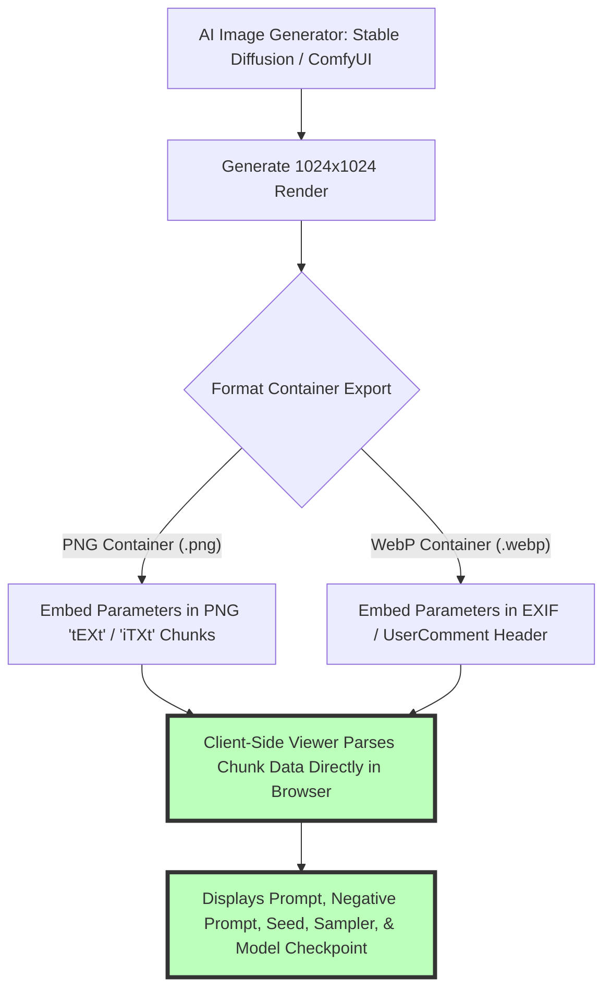

# Best AI Photo Metadata Viewer: Free Prompt Extraction & EXIF Guide

The explosion of generative AI image models—such as Stable Diffusion (SD 1.5, SDXL, SD3), Automatic1111 (A1111), ComfyUI, SwarmUI, Midjourney, and DALL-E 3—has transformed digital art generation. Every time an AI image generator produces a PNG or WebP artwork, it embeds rich generation metadata directly inside the file headers. This hidden data contains text prompts, negative prompts, random seed numbers, sampler steps, CFG scale values, model checkpoints, and LoRA weights.

However, extracting AI generation parameters from artwork online often presents challenges. Traditional EXIF readers fail to parse custom PNG `tEXt` / `iTXt` metadata chunks or ComfyUI node graph JSON trees. Meanwhile, cloud-based metadata viewers force users to upload their images to remote servers, exposing private prompts and artwork to third-party databases.

This guide evaluates the best AI photo metadata viewers, explains how to extract hidden text prompts from Stable Diffusion and ComfyUI PNGs, compares standard EXIF metadata vs. AI generation parameters, details client-side browser privacy, and demonstrates how to inspect or remove metadata.

---

## Master Comparison Matrix: AI Metadata & EXIF Tools

To understand how AI metadata inspectors differ from standard EXIF viewers, review this comparison:

| Feature / Metadata Tag | Modern AI Metadata Inspector (Image Tool Stack) | Standard EXIF Viewer (Traditional) | Cloud Metadata Web Tools |
| :--- | :--- | :--- | :--- |
| **Stable Diffusion Prompt Extraction** | **YES (Parses A1111 & WebUI tEXt chunks)**| NO (Shows basic dimensions/date) | YES (Requires cloud file upload) |
| **ComfyUI Node Graph Parser** | **YES (Parses JSON workflow & nodes)** | NO (Fails on JSON chunks) | Partial support |
| **Seed, Sampler & CFG Scale** | **YES (Extracts full generation parameters)**| NO | YES (Server upload required) |
| **Camera EXIF (ISO, Shutter, GPS)** | **YES (Parses standard EXIF & IPTC)** | YES | YES |
| **Data & Image Privacy** | **Absolute (100% Client-Side In-Browser)** | Varies | Low (Files cached on cloud servers) |
| **File Size Limit** | **UNLIMITED (Local memory bound)** | Limited | Strict 5MB – 10MB caps |

---

## Technical Architecture of AI Image Metadata Storage

How do AI art generators embed prompt text and generation workflows inside image file containers?



### 1. PNG `tEXt` and `iTXt` Chunks in Automatic1111
When Automatic1111 (A1111) or Forge WebUI exports a PNG image, it writes a custom `parameters` key into the PNG metadata header:
```text
parameters: A stunning cinematic portrait of a cyberpunk hacker in neon city, highly detailed, 8k resolution
Negative prompt: blurry, low quality, distorted, bad anatomy
Steps: 30, Sampler: DPM++ 2M Karras, CFG scale: 7, Seed: 3849201948, Size: 1024x1024, Model: sd_xl_base_1.0
```

### 2. ComfyUI Workflow JSON Trees
ComfyUI stores full procedural node graphs inside two distinct PNG metadata keys: `prompt` (the API execution graph) and `workflow` (the full UI visual node graph). An AI metadata viewer must parse raw JSON strings embedded inside these keys to reconstruct node connections, seed values, and model loaders.

---

## Why Client-Side Browser Privacy Matters for AI Creators

Digital artists, prompt engineers, and game developers often create proprietary AI art assets using custom-trained LoRAs, fine-tuned model checkpoints, and secret prompt recipes:

```mermaid
graph LR
    A[Private AI Artwork with Secret Prompt] --> B[Upload to Cloud Viewer Site]
    B --> C[Cloud Server Logs Image & Prompt in Public Database]
    C --> D[Result: Proprietary Prompt Recipe Leaked]
    A --> E[Inspect via Image Tool Stack (Client-Side)]
    E --> F[Browser Parses Metadata in Transient Local RAM]
    F --> G[Result: 100% Private Inspection, 0 Bytes Uploaded]
    style G fill:#bfb,stroke:#333,stroke-width:4px
```

### The Risks of Cloud Metadata Viewers:
Cloud-based metadata sites send your image over the internet to their servers. This allows third-party server administrators to index, log, or scrap your secret prompt structures, seed numbers, and proprietary LoRA combinations. 

Our client-side [Metadata Viewer](/tools/metadata-viewer) processes images **100% locally in your web browser**. Your files never leave your device, guaranteeing 100% prompt confidentiality.

---

## Traditional Camera EXIF vs. AI Generation Parameters

Understanding the difference between camera sensor EXIF metadata and AI parameter headers helps creators manage image metadata:

| Metadata Type | Data Elements Tracked | Typical Source File | Primary Purpose |
| :--- | :--- | :--- | :--- |
| **Traditional Camera EXIF** | Shutter speed, Aperture (f-stop), ISO, Focal Length, GPS Coordinates, Lens Model | DSLR / Mirrorless / iPhone JPEGs | Photography technical record & location tag |
| **IPTC / XMP Metadata** | Creator Name, Copyright Notice, Image Title, Rights Usage, Caption Description | Professional Photography JPEGs/TIFFs | Legal copyright & asset cataloging |
| **AI Generation Metadata** | Prompt, Negative Prompt, Seed, Sampler, CFG Scale, Model Hash, LoRA Weights | Stable Diffusion / ComfyUI PNGs | AI artwork reproducibility & prompt inspection |

---

## Step-by-Step AI Metadata Extraction & Removal Workflow

Follow this workflow to inspect or sanitize metadata from AI artwork:

1.  **Launch the Viewer:** Open our browser-based [Metadata Viewer](/tools/metadata-viewer).
2.  **Drag & Drop Image:** Select an AI-generated PNG, WebP, or JPEG file.
3.  **Inspect Generation Parameters:**
    *   **Positive Prompt:** Read the exact text string used to generate the image.
    *   **Negative Prompt:** Review excluded tokens and quality safeguards.
    *   **Seed & Sampler:** View the random seed number and sampler algorithm (e.g., Euler a, DPM++ 2M).
    *   **Model Checkpoint:** Identify the base model and fine-tuned LoRAs.
4.  **Sanitize Metadata Before Public Export:** If sharing artwork publicly without revealing prompts, use our free [EXIF Remover](/tools/exif-remover) to strip hidden metadata chunks in one click.

---

## Step-by-Step AI Metadata Inspection Checklist

Before sharing AI-generated artwork online, run your assets through this checklist:

*   **Privacy Check:** Verify processing is executed **client-side** without cloud file uploads.
*   **Prompt Verification:** Confirm positive and negative prompts are extracted cleanly.
*   **Seed Record:** Record random seed numbers for exact artwork reproducibility.
*   **LoRA Dependencies:** Identify embedded LoRA names and weight values.
*   **Metadata Scrubbing:** Strip prompt parameters using [EXIF Remover](/tools/exif-remover) if publishing proprietary commercial work.

---

## C2PA Content Credentials & AI Provenance Tagging

In addition to custom Stable Diffusion `tEXt` chunks, modern generative AI tools utilize the **C2PA (Coalition for Content Provenance and Authenticity)** open technical standard:
*   **Cryptographic Digital Signatures:** DALL-E 3, Adobe Firefly, and Bing Image Creator attach cryptographically signed C2PA manifest assertions to image headers.
*   **Tamper-Evident Provenance:** C2PA metadata records the AI generator application name, model version, generation timestamp, and editing history. If an image is modified in editing software, C2PA flags the modification, establishing transparent content provenance across digital media platforms.

---

## Technical Mechanics of PNG `iTXt`, `tEXt` & `zTXt` Metadata Chunks

Understanding how PNG containers structure metadata explains why generic image viewers fail to read AI prompts:
*   **`tEXt` Uncompressed Text Chunks:** Stores uncompressed Latin-1 strings (used by Automatic1111 for prompt parameter key-value pairs).
*   **`iTXt` International UTF-8 Chunks:** Stores UTF-8 encoded text supporting international character sets, multilingual prompts, and complex JSON strings.
*   **`zTXt` Deflate Compressed Chunks:** Stores compressed text payloads using zlib deflate compression. ComfyUI often compresses large 100-node workflow graphs into `zTXt` chunks to save file size.

---

## Frequently Asked Questions

### What is the best free AI photo metadata viewer?
The best free AI metadata viewer is our client-side [Metadata Viewer](/tools/metadata-viewer). It extracts prompts, seeds, samplers, and model checkpoints from Stable Diffusion, ComfyUI, and Midjourney 100% locally in your browser.

### How do I view Stable Diffusion prompts embedded in a PNG?
Drag and drop the PNG into our [Metadata Viewer](/tools/metadata-viewer). The tool parses the hidden PNG `tEXt` parameter chunks and displays the positive prompt, negative prompt, seed number, and sampler settings instantly.

### Can I extract workflows from ComfyUI images?
Yes. ComfyUI embeds full workflow JSON data inside PNG image chunks. Our metadata reader extracts and formats the node graph JSON, allowing you to reconstruct ComfyUI workflows.

### Is it safe to inspect private AI prompts online?
Traditional cloud viewers store uploaded photos on external servers, exposing secret prompts to public databases. Our client-side viewer processes files in local browser RAM, keeping your prompts 100% private.

### Do Midjourney and DALL-E embed metadata in exported images?
Midjourney embeds job IDs and generation metadata in PNG web downloads. DALL-E 3 embeds C2PA provenance metadata. Our metadata viewer reads all embedded header tags across major AI platforms.

### How can I remove AI prompt metadata from my images before posting online?
To strip hidden prompts, seeds, and EXIF tags from your AI artwork before publishing, run your files through our free, browser-based [EXIF Remover](/tools/exif-remover).
