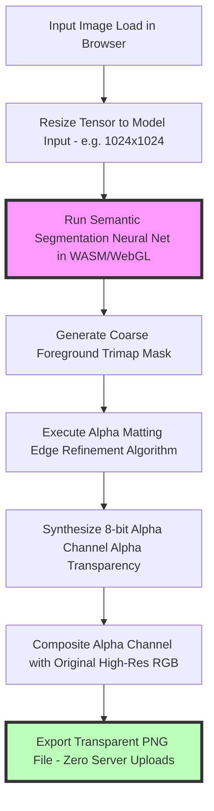

# Best Free Background Remover Online: Private Client-Side Guide

Removing image backgrounds to create isolated product photos, profile avatars, or transparent design assets is a common task in e-commerce, digital marketing, and web design. Traditionally, removing backgrounds required painstaking manual path tracing using desktop editing software like Adobe Photoshop.

Recent advances in computer vision have introduced **AI Semantic Segmentation Models** that automatically identify foreground subjects (such as people, products, clothing, or vehicles), isolate their outlines, and erase complex backgrounds in seconds.

However, many free online background removers require users to upload their images to cloud servers, introducing severe privacy and copyright risks for sensitive client work, proprietary product photos, or confidential documents.

This guide analyzes how in-browser AI background removal models work, examines neural network segmentation architectures, details alpha matting edge refinement algorithms, and demonstrates how to generate transparent PNGs privately using client-side WebGL and WebAssembly tools.

---

## Technical Comparison: Manual Path Tracing vs. Cloud AI vs. Client-Side AI

To understand the evolution of background removal tools, we must compare their operational mechanics:

| Feature / Aspect | Manual Clipping Path (Photoshop) | Cloud-Based AI Removal | Client-Side In-Browser AI |
| :--- | :--- | :--- | :--- |
| **Execution Mechanism** | Manual Pen Tool Selection | Remote Cloud Server Processing | **In-Browser WebGPU / WASM Engine** |
| **Processing Speed** | Slow (5 to 15 minutes per image)| Fast (2 to 5 seconds per image) | **Fast (1 to 3 seconds per image)** |
| **Fine Detail Handling**| High accuracy (Time consuming) | High accuracy | **High accuracy (Alpha Matting)** |
| **Server Data Upload** | None (Local Desktop App) | **High Risk (File uploaded to cloud)**| **Zero Uploads (100% Local Privacy)** |
| **Batch Capabilities** | Limited by manual effort | Often paywalled / API limits | **Unlimited Free Local Batching** |
| **Subscription Cost** | Paid Software Subscription | Paid Credits / Monthly Subscription | **100% Free Open Tool** |

---

## How In-Browser AI Background Removal Works (RMBG & MODNet Models)

Client-side background removers execute lightweight deep learning models—such as **RMBG (Robust Background Removal)** or **MODNet (Mobile Real-time Video Matting)**—directly within your browser using **WebAssembly (WASM)** and **WebGL / WebGPU** acceleration:

### 1. Semantic Segmentation (Foreground Detection)
The neural network analyzes the image array to categorize pixels into semantic classes (foreground vs. background). It generates a coarse binary mask (trimap) identifying the main subject boundaries.

### 2. Alpha Matting for Fine Details (Hair & Fringes)
A major challenge in background removal is handling semi-transparent or fine elements like hair strands, fur, or translucent glass. 

Client-side tools use **Alpha Matting Algorithms** to solve the compositing equation for edge boundary pixels:
$$I_i = \alpha_i F_i + (1 - \alpha_i) B_i$$
Where $I_i$ is the observed pixel color, $F_i$ is the foreground color, $B_i$ is the background color, and $\alpha_i$ is the alpha transparency value ($0$ to $1$). The model solves for $\alpha_i$, creating smooth, anti-aliased transparency masks that look natural on any background.

---

## Technical Conversion Steps: Mask Compositing to Transparent PNG

Let's examine how the raw output from the neural net model is converted into a transparent PNG file:

### Step 1: Tensor Output to Alpha Channel Matrix
The neural network outputs a 2D float array matching the image dimensions, with values ranging from `0.0` (fully transparent) to `1.0` (fully opaque). This array is converted into an 8-bit alpha mask ($0$ to $255$).

### Step 2: Canvas Memory Compositing
The client-side script initializes an HTML5 `OffscreenCanvas` matching the original image dimensions. It copies the original RGB color data and assigns the calculated alpha mask to the 4th channel ($A$) of the canvas `ImageData` array:
$$\text{ImageData}[i \times 4 + 3] = \text{AlphaMask}[i]$$

### Step 3: PNG DEFLATE Encoding
The canvas context converts the RGBA pixel array into a PNG binary stream, applying delta row filters (Sub, Up, Average, Paeth) and DEFLATE compression to generate a compact, transparent PNG asset.

---

## Privacy Advantages of Local In-Browser Background Removal

Uploading photos to cloud background removal services introduces significant privacy and copyright risks:

*   **Copyright & Asset Confidentiality:** Uploading unreleased product photos, client marketing assets, or proprietary e-commerce photography to cloud servers exposes your intellectual property to potential data leaks or server logging.
*   **Privacy Protection for Personal Images:** Removing backgrounds from personal family photos or identity photos should not require transferring un-sanitized files over public networks.
*   **Zero Server Uploads:** Using our client-side [Background Remover](/tools/image-redactor) guarantees complete privacy. The AI model executes entirely within your browser sandbox—your files are processed locally on your GPU/CPU and saved directly to your Downloads folder.

---

## Step-by-Step Guide: Removing Backgrounds Privately

To isolate background elements and generate transparent PNGs securely, follow this workflow:

1.  **Access the Local Tool:** Open our free, in-browser background removal tool.
2.  **Upload Target Image:** Drag and drop your image into the workspace. The browser loads the neural network model into local WebAssembly memory.
3.  **Execute Automated Segmentation:** The model analyzes foreground boundaries, executes alpha matting for edge details, and generates a clean transparent background.
4.  **Export Transparent PNG:** Download the transparent asset in **PNG** format to preserve the 8-bit alpha transparency channel.

---

## ONNX Runtime Web & WebGPU Pipeline Acceleration

Executing neural networks inside web browsers efficiently requires standardized cross-platform inference engines:
*   **ONNX Runtime Web:** Operates as a browser execution layer that parses Open Neural Network Exchange (ONNX) format models. It translates neural network graph operations into WebGL shader passes or WebGPU compute kernels.
*   **Zero-Copy Memory Buffers:** Raw canvas pixels are loaded directly into GPU texture buffers without transferring data back and forth to JavaScript CPU memory, accelerating background removal processing to under 2 seconds per image.

---

## Fast Guided Filter Algorithms for Hair & Edge Precision

While neural networks generate high-confidence bounding masks, fine details like hair strands or translucent fabrics require high-resolution edge filtering:
*   **Guided Filter Integration:** The low-resolution output mask ($1024\times1024$ pixels) is combined with the high-resolution original image guidance map using a **Fast Guided Filter**.
*   **Spatial Edge Refinement:** The filter computes local covariance matrices around edge boundaries, sharpening hair outlines and preventing grey halo artifacts when the transparent PNG is placed onto dark or patterned backgrounds.

---

## Background Removal Optimization Checklist

Before exporting transparent product assets or avatars, run your images through this checklist:

*   **Contrast Check:** Ensure reasonable contrast between the foreground subject and the background for optimal AI edge detection.
*   **Alpha Edge Refinement:** Inspect fine details (such as hair or transparent glass edges) to confirm clean alpha blending.
*   **Format Selection:** Export isolated assets in **PNG** or **lossless WebP** format to preserve background transparency.
*   **Local Processing:** Verify that the tool processes files locally in your browser to maintain data privacy.

---

## Frequently Asked Questions

### What is the best free background remover online?
The best background remover is a **client-side, browser-based tool**. It processes images locally within your browser using WebAssembly and WebGPU, providing fast processing speeds and complete privacy with zero server uploads.

### How does AI remove backgrounds from images automatically?
AI background removers use deep learning semantic segmentation models (such as RMBG or MODNet). The neural network identifies foreground objects, creates a binary foreground mask, and applies alpha matting algorithms to refine hair and edge transparency.

### What format should I save transparent images in?
Save transparent images in **PNG** format (or **WebP** with alpha transparency). Legacy JPEG files do not support alpha transparency and will force a solid white or black background color around your isolated subjects. PNG and WebP preserve the 8-bit alpha channel, allowing transparent assets to blend seamlessly over any web background color or design layout.

### Does in-browser background removal work offline?
Yes. Once the web application loads the lightweight AI model into your browser's temporary memory, you can disconnect from the internet and continue removing backgrounds offline on your device.

### Can I batch remove backgrounds from product photos?
Yes. Our client-side tools support batch processing, allowing you to isolate backgrounds from multiple e-commerce product photos concurrently using your local GPU hardware.

### How can I remove image backgrounds securely?
To remove image backgrounds without exposing your photos to external cloud databases, use our free, browser-based tools. All processing operations run locally within your browser sandbox using WebGL and WebAssembly, ensuring proprietary client designs, unreleased product photos, or confidential documents are never transmitted over the network or stored on third-party cloud servers. This local workflow maintains strict compliance with data privacy regulations.
