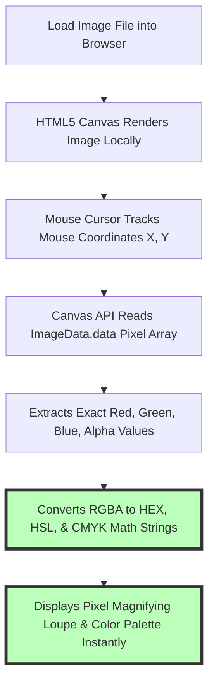

# Best Free Color Picker from Image: HEX, RGB & HSL Eye Dropper Guide

UI/UX designers, frontend web developers, graphic artists, digital illustrators, and brand marketers frequently need to extract exact color codes from images, brand logos, website screenshots, photo mood boards, and UI mockups. Identifying the precise **HEX color code** (`#FF5733`), **RGB color tuple** (`rgb(255, 87, 51)`), or **HSL color value** (`hsl(9, 100%, 60%)`) ensures visual consistency across web design systems, mobile apps, and marketing materials.

However, traditional online color picker sites require users to upload their images to remote cloud servers. Uploading unreleased product designs, client mockups, or personal screenshots to external servers creates privacy risks and wastes time in upload queues.

This guide evaluates the best free image color pickers, compares browser EyeDropper API capabilities vs. DevTools inspector shortcuts, details HEX/RGB/HSL/CMYK color space math, explains client-side browser processing, and provides a step-by-step workflow for extracting color palettes.

---

## Master Comparison Matrix: Image Color Picker Tools

To understand the difference between client-side browser eyedroppers and traditional cloud upload tools, review this comparison:

| Feature / Metric | Client-Side Color Picker (Image Tool Stack) | Cloud Upload Color Sites | Browser DevTools Inspector | Desktop Software (Photoshop / Figma) |
| :--- | :--- | :--- | :--- | :--- |
| **Server File Upload** | **NO (100% On-Device Browser RAM)**| YES (Files uploaded to cloud) | NO (Built into browser) | NO (Local desktop app) |
| **Color Code Formats** | **HEX, RGB, HSL, CMYK, HSV** | HEX, RGB | HEX, RGB, HSL | All professional color spaces |
| **Magnifying Loupe** | **YES (Pixel-perfect precision)** | Basic zoom | Native EyeDropper lens | High-precision pixel zoom |
| **Palette Generator** | **YES (Extracts top 6 dominant colors)**| Basic | NO | Built-in color libraries |
| **Data & Image Privacy** | **Absolute (Files never leave device)**| Low (Stored on servers) | Absolute | Absolute |
| **Software Install** | **Zero Installation (Browser-Native)** | Zero Installation | Built-in | Requires paid app install |

---

## Technical Architecture of Client-Side Canvas Color Extraction

Why is on-device browser color extraction faster and safer than cloud-based color pickers?



### How HTML5 Canvas Pixel Inspection Works:
When you load an image into our browser-based [Color Picker Tool](/tools/color-picker):
1.  **Local Memory Bitmap Rendering:** The browser draws your image onto an off-screen `<canvas>` element operating in your device's local memory.
2.  **`getImageData(x, y, 1, 1)` Precision:** As your mouse moves over the image, the Canvas API fetches the exact 4-byte 8-bit unsigned integer array `[R, G, B, A]` corresponding to the precise pixel coordinate beneath your cursor.
3.  **Real-Time Math Conversion:** The 8-bit integer values are converted instantly into HEX (`#RRGGBB`), HSL (Hue, Saturation, Lightness), and CMYK (Cyan, Magenta, Yellow, Black) code strings.

---

## Color Space Formats: HEX vs. RGB vs. HSL vs. CMYK

Understanding when to use different color code formats ensures smooth handoff between design, development, and print workflows:

```mermaid
graph TD
    A[Pixel Color Data] --> B{Select Output Color Format}
    B -- Web Development (CSS / Tailwind) --> C[HEX (#0070F3) or RGB (0, 112, 243)]
    C --> D[Direct CSS Property Assignment]
    B -- UI Design Systems & Color Manipulation --> E[HSL (212deg, 100%, 48%)]
    E --> F[Easy Lightness & Saturation Adjustments]
    B -- Commercial Print Production --> G[CMYK (100%, 54%, 0%, 5%)]
    G --> H[Physical Ink Formulations]
```

### 1. HEX (Hexadecimal Color Notation)
*   **Format:** `#RRGGBB` (e.g., `#3B82F6` for Tailwind primary blue).
*   **Best For:** CSS stylesheets, HTML markup, Figma components, and digital design tokens.

### 2. RGB / RGBA (Red, Green, Blue, Alpha)
*   **Format:** `rgb(59, 130, 246)` or `rgba(59, 130, 246, 0.8)` for opacity.
*   **Best For:** Dynamic CSS variable manipulation, canvas element rendering, and alpha transparency layering.

### 3. HSL (Hue, Saturation, Lightness)
*   **Format:** `hsl(217, 91%, 60%)`.
*   **Best For:** Designing harmonious color palettes, hover state variations, and accessible light/dark theme contrast steps.

---

## Native EyeDropper API & Browser DevTools Shortcuts

In addition to web-based color pickers, modern desktop web browsers feature built-in eyedropper APIs:

*   **JavaScript EyeDropper API:** Supported in Chromium browsers (Chrome, Edge, Opera), `new EyeDropper()` allows web applications to sample colors from anywhere on the user's desktop screen (outside the browser tab).
*   **Browser DevTools EyeDropper Shortcut:**
    1.  Right-click any web element and select **Inspect** (F12).
    2.  In the Styles tab, click any small color preview square.
    3.  Click the **EyeDropper icon** to pick any pixel color on the live web page.

---

## Step-by-Step Color Palette Extraction Workflow

Follow this workflow to extract brand colors and dominant palettes from any image:

1.  **Launch the Tool:** Open our client-side [Color Picker Tool](/tools/color-picker) in your browser.
2.  **Load Image:** Drag and drop an image file, paste a screenshot from clipboard (`Ctrl+V` / `Cmd+V`), or enter an image URL.
3.  **Inspect Pixels:** Move your cursor over the image. Use the **magnifying loupe** to zoom in on individual pixels.
4.  **Click to Lock Color:** Click on the target pixel to lock the color and automatically copy the **HEX code** to your clipboard.
5.  **Extract Dominant Palette:** View the automatically generated 6-color dominant palette derived from k-means color quantization.

---

## Step-by-Step Image Color Picker Checklist

Before finalizing color tokens for your design system, run your workflow through this checklist:

*   **Privacy Verification:** Ensure processing is **client-side** without cloud file uploads.
*   **Color Profile Tagging:** Verify source images use the **sRGB color space** to ensure accurate code handoff.
*   **Contrast Accessibility:** Test extracted text colors against background colors to ensure WCAG 2.1 AA compliance (4.5:1 ratio).
*   **Format Selection:** Use HEX for web CSS, HSL for theme variations, and CMYK for print handoff.
*   **Clipboard Handoff:** Copy both HEX and RGB values for frontend developer documentation.

---

## WCAG 2.1 Color Contrast Ratio Calculations

Extracting color codes from UI mockups is closely tied to digital accessibility standards governed by **WCAG 2.1 (Web Content Accessibility Guidelines)**:
*   **AA Compliance (4.5:1 Ratio):** Standard body text must achieve a minimum contrast ratio of **4.5:1** against its background color. Large text (18pt+ or 14pt bold) requires a minimum ratio of **3:1**.
*   **AAA Compliance (7:1 Ratio):** Enhanced accessibility standards require a **7:1 contrast ratio** for normal body text.
*   **Relative Luminance Formula:** Contrast ratio is calculated by determining the relative luminance ($L1$ and $L2$) of extracted foreground and background RGB values:
    $$\text{Contrast Ratio} = \frac{L1 + 0.05}{L2 + 0.05}$$

---

## Color Vision Deficiency (CVD) Simulation & Accessibility

Designing inclusive user interfaces requires testing extracted color palettes against common types of color blindness:
*   **Protanopia (Red-Blindness):** Affects roughly 1% of males, making red hues appear desaturated or brownish-green.
*   **Deuteranopia (Green-Blindness):** The most common form of color blindness (affecting ~6% of males), shifting green and red hues toward yellow-brown tones.
*   **Tritanopia (Blue-Blindness):** A rare condition affecting blue-yellow color perception.
*   **Palette Verification:** When building design tokens, ensure status indicators (such as Success Green and Error Red) are accompanied by icon shapes or text labels, rather than relying solely on color hue.

---

## Frequently Asked Questions

### What is the best free color picker from image tool?
The best free image color picker is our client-side [Color Picker Tool](/tools/color-picker). It allows you to inspect pixels, copy HEX/RGB/HSL codes, and generate dominant palettes 100% locally in your browser.

### Is it safe to upload private screenshots to online color pickers?
Traditional cloud color pickers upload your images to remote servers, risking data leaks. Our client-side color picker processes files entirely in your browser's local RAM, ensuring 100% privacy.

### How do I convert a HEX color code to RGB or HSL?
Our [Color Picker Tool](/tools/color-picker) automatically calculates and displays HEX, RGB, HSL, HSV, and CMYK values simultaneously as soon as you click any pixel in your image.

### Can I extract a color palette from an image automatically?
Yes. Our color picker includes an automated k-means color quantization algorithm that extracts the top 6 dominant colors from your image in one click.

### Does the browser EyeDropper API pick colors outside the web browser?
Yes. Chrome and Edge support the native EyeDropper API, allowing you to sample colors from external desktop apps, PDF readers, and background wallpapers.

### Can I paste screenshots directly into the color picker?
Yes. You can copy any screenshot to your clipboard and paste it directly into our tool using `Ctrl+V` (Windows) or `Cmd+V` (Mac) for instant color picking.
