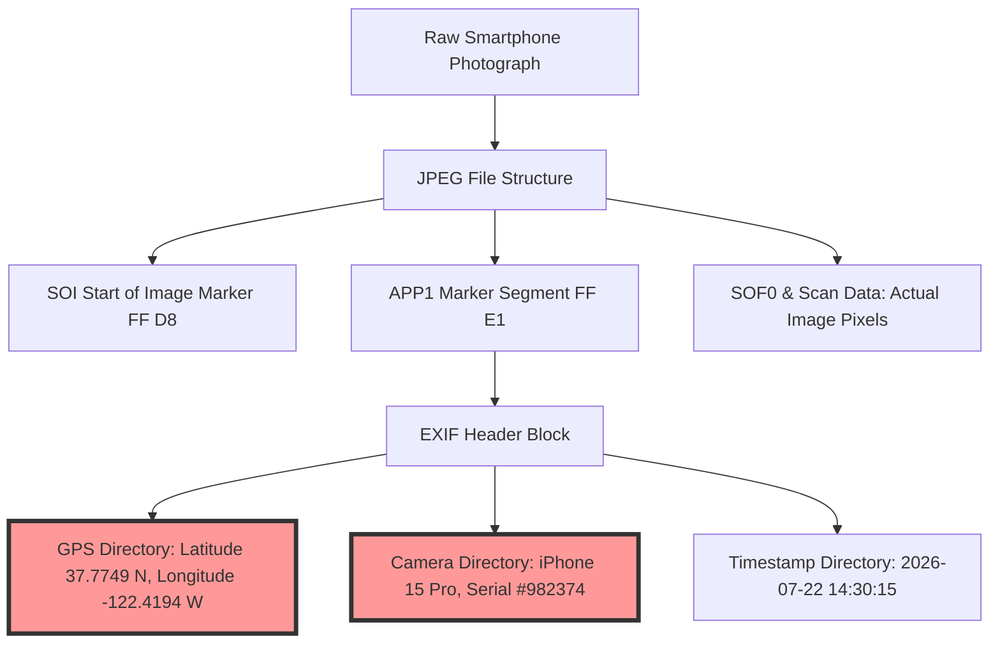
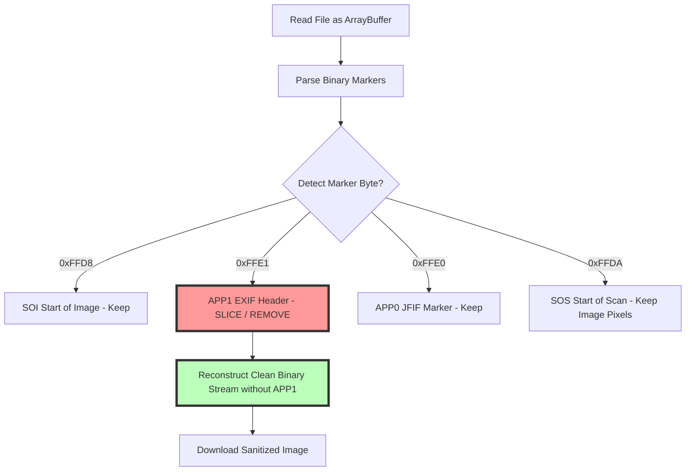

# How to Strip EXIF Metadata from Photos: Local Browser Guide

Every time you take a photo with a smartphone, digital camera, or drone, the device automatically embeds a comprehensive set of hidden metadata directly into the image file. This data—known as **EXIF (Exchangeable Image File Format)** metadata—stores detailed information about the camera hardware, shooting parameters, timestamp, and precise GPS location coordinates.

While EXIF metadata is useful for professional photographers organizing catalog archives, publishing raw EXIF data online poses serious privacy and security risks. Sharing photos on social media, blogs, or forums can inadvertently expose your home address, daily routine, camera hardware serial numbers, and personal device information.

This guide analyzes how EXIF metadata is structured inside image files, details the security risks of exposed GPS tags, explains how to strip EXIF data using client-side JavaScript APIs, and demonstrates how to clean image files privately without server uploads.

---

## Technical Overview: What Data is Hidden Inside EXIF Headers?

EXIF metadata is stored inside designated header segments of JPEG, TIFF, HEIC, and WebP image files.

| EXIF Metadata Category | Embedded Data Tag Fields | Privacy & Security Risk Level |
| :--- | :--- | :--- |
| **Geolocation Data (GPS)** | **Latitude, Longitude, Altitude, Timestamp** | **CRITICAL: Reveals home/work location** |
| **Camera Hardware Info** | Make, Model, Serial Number, Lens Specs | High: Device tracking & profiling |
| **Shooting Parameters** | ISO, Aperture, Shutter Speed, Focal Length | Low: Technical photography settings |
| **Creation Timestamps** | Date/Time Original, Digitized Timestamp | Moderate: Reveals personal daily routines |
| **Software & Firmware** | OS Version, Editing App, Firmware Build | Moderate: Operating system profiling |
| **Embedded Thumbnails** | Low-res embedded JPEG preview frame | High: May reveal uncropped original photo |

---

## The Privacy & Security Risks of Exposed EXIF Metadata

Publishing images containing un-sanitized EXIF headers creates several security vulnerabilities:

### 1. Physical Location Tracking (Cyberstalking Risk)
The most severe privacy risk is embedded **GPS Location Data**. Modern smartphones record exact latitude and longitude coordinates using satellite positioning systems. Stalkers or malicious actors can extract these coordinates from photos posted online to locate your home, workplace, or children's school with high precision.

### 2. Doxxing & Social Engineering
Camera serial numbers, lens specifications, and creation timestamps can be cross-referenced across different websites to link anonymous online profiles back to a single physical device or owner.

### 3. Hidden Embedded Thumbnail Vulnerability
When you crop or edit a photo using basic mobile editing apps, the app often crops the main image pixels while leaving the original, uncropped preview thumbnail inside the EXIF header. Extracting this embedded thumbnail can reveal sensitive details that were cropped out of the main picture.

---

## The Mathematics of EXIF Segment Removal (APP1 Parsing)

Inside a JPEG file binary stream, EXIF metadata is stored within the **APP1 (Application Marker 1)** segment, identified by the two-byte hex marker `0xFFE1`.

Client-side metadata removers strip EXIF data using low-level binary `ArrayBuffer` manipulation:

### Binary Segment Slicing Workflow:
1.  **Read Binary Stream:** The browser reads the input file into an `ArrayBuffer` and creates a `DataView` to inspect hexadecimal marker bytes.
2.  **Locate APP1 Marker:** The script scans for the `0xFFE1` marker immediately following the `0xFFD8` (SOI) start-of-image marker.
3.  **Calculate Segment Length:** The two bytes following `0xFFE1` store the integer length of the EXIF segment ($L_{\text{exif}}$).
4.  **Slice ArrayBuffer:** The script creates a new clean `Uint8Array` buffer, copying the image data while bypassing the `0xFFE1` marker and its $L_{\text{exif}}$ payload bytes.
5.  **Output Clean File:** The sanitized buffer is saved as a clean JPEG blob. This removes 100% of metadata while leaving the image pixel data untouched.

---

## Security Advantages of Local Browser EXIF Removal

Uploading photos to cloud-based metadata removal websites creates a paradox: to protect your privacy, you must upload your un-sanitized photos containing GPS coordinates to a third-party server.

Using our client-side [EXIF Data Remover](/tools/exif-data-remover) eliminates this risk:
*   **Zero Network Transmission:** All binary slicing and canvas operations execute locally within your browser's memory using JavaScript `ArrayBuffer` APIs.
*   **Offline Functionality:** The tool continues to work even if you disconnect from the internet after loading the page.
*   **Complete Privacy:** Your photos and embedded location coordinates are processed on your local CPU and saved directly to your Downloads folder.

---

## Step-by-Step Guide: How to Strip EXIF Data Privately

To sanitize image metadata before publishing photos online, follow this workflow:

1.  **Inspect Metadata First:** Use our free [Metadata Viewer](/tools/metadata-viewer) to inspect hidden EXIF tags, GPS coordinates, and camera specs.
2.  **Access the Local Sanitizer:** Open our free client-side [EXIF Data Remover](/tools/exif-data-remover).
3.  **Batch Process Photos:** Drag and drop your image files into the workspace. The tool scans the binary headers, slices out APP1 segments, and generates sanitized files instantly.
4.  **Verify Removal:** Re-inspect the sanitized output file to confirm that all EXIF directories and GPS tags have been completely removed.

---

## TIFF IFD Structure & SubIFD Pointer Inspection

Understanding how EXIF metadata is formatted inside binary segments helps clarify why thorough sanitization is necessary:
*   **Image File Directory (IFD) Trees:** EXIF data is organized into IFD directories (IFD0, IFD1, ExifIFD, GPSIFD, InteropIFD). Each directory contains 12-byte tag structures storing specific data parameters.
*   **SubIFD Offset Pointers:** The main IFD0 directory contains 4-byte offset pointers (`Tag 0x8769` for ExifIFD and `Tag 0x8825` for GPSIFD) that point to sub-directories elsewhere in the binary stream. Simply zeroing out `Tag 0x8825` without re-indexing the binary stream can corrupt the file structure. Binary header slicing removes the entire APP1 container, ensuring clean sanitization without file corruption.

---

## Canvas Redraw Method for Complete Metadata Wiping

In addition to binary segment slicing, client-side tools can perform a complete metadata wipe using the **Canvas Redraw Technique**:
*   **Pixel Raster Extraction:** The browser loads the image pixels onto a clean `HTML5 Canvas` element.
*   **Clean Export:** Calling `canvas.toDataURL()` or `canvas.toBlob()` generates a brand new JPEG or PNG binary stream containing only the raw raster pixels.
*   **Guaranteed Wipe:** Because the HTML5 Canvas API extracts pixel color buffers without reading file headers, the resulting file is guaranteed to contain zero EXIF metadata, IPTC tags, or embedded thumbnails.

---

## Step-by-Step EXIF Removal Checklist

Before sharing photographs publicly on social media or forums, run your files through this checklist:

*   **GPS Sanitization:** Verify that latitude, longitude, and altitude tags are completely erased.
*   **Hardware Anonymization:** Ensure camera serial numbers and device specs are removed.
*   **Thumbnail Verification:** Confirm that hidden embedded preview thumbnails are stripped.
*   **Local Execution:** Verify that the tool processes files locally in your browser to maintain data privacy.

---

## Frequently Asked Questions

### What is EXIF data in photos?
EXIF (Exchangeable Image File Format) data is hidden metadata embedded in digital photos. It stores camera hardware specs, shooting parameters (ISO, shutter speed), creation timestamps, and exact GPS location coordinates.

### Why should I strip EXIF data before posting photos online?
Stripping EXIF data protects your personal privacy. Un-sanitized photos posted online can expose your exact GPS location, home address, camera serial numbers, and daily routines to cyberstalkers or data harvesters.

### Does stripping EXIF data lower image quality?
No. Stripping EXIF metadata removes binary header tags while leaving the actual pixel data untouched. The visual quality of the photograph remains 100% identical.

### Do social media sites automatically remove EXIF data?
Some platforms (like Twitter and Instagram) strip EXIF data during upload. However, many blogs, forums, email clients, and cloud storage providers preserve original EXIF metadata intact. It is best practice to strip EXIF data locally before uploading.

### Can I view EXIF data before removing it?
Yes. You can use our free, browser-based [Metadata Viewer](/tools/metadata-viewer) to inspect camera settings, timestamps, and GPS coordinates hidden inside your photos.

### How can I strip EXIF data securely without uploading files?
To strip EXIF data without exposing your photos to external cloud databases, use our free, browser-based [EXIF Data Remover](/tools/exif-data-remover). The tool runs locally in your browser, keeping your files private and secure.
