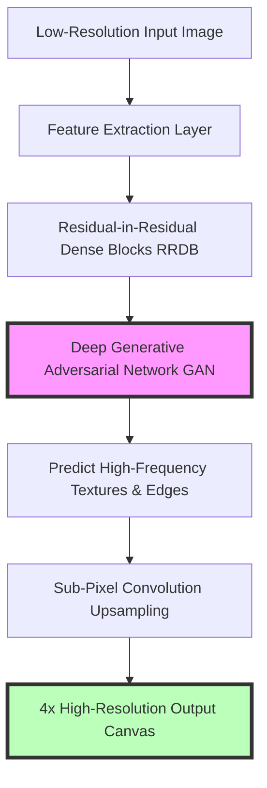
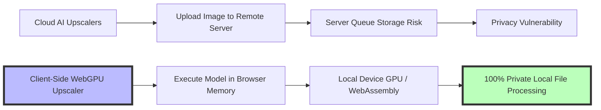

# Best Free AI Image Upscaler Online: Client-Side & Private

Digital photographs, graphics, and scanned documents often suffer from low resolution, pixelation, and compression artifacts. Whether you are scaling up a product image for print publishing, enhancing a low-resolution vintage photograph, or sharpening compressed graphics for website headers, traditional pixel-stretching methods produce blurry, unnatural results.

Recent breakthroughs in deep learning and computer vision have introduced **AI Image Super-Resolution**. Neural networks can analyze low-resolution images, predict missing high-frequency details, and generate sharp, photorealistic enlargements up to 400% of the original size.

However, many cloud-based AI upscalers present serious privacy concerns by uploading user images to external servers. This guide analyzes how AI super-resolution works, compares neural networks against traditional interpolation algorithms, details WebGPU and WebAssembly in-browser processing, and demonstrates how to use client-side upscaling tools securely.

---

## Technical Comparison: Traditional Interpolation vs. AI Super-Resolution

To understand why AI upscaling is superior to traditional methods, we must evaluate their mathematical mechanics:

| Feature | Nearest Neighbor | Bilinear / Bicubic | Lanczos Resampling | AI Super-Resolution (Real-ESRGAN) |
| :--- | :--- | :--- | :--- | :--- |
| **Mechanic** | Duplicates nearest pixel | Weighted polynomial average | Sinc function sinc(x) window | Deep Convolutional Neural Net |
| **New Detail Generation**| Zero (Grid duplication)| Zero (Blurs color boundaries)| Zero (Sharpening halos) | **Synthesizes realistic details** |
| **Pixelation Artifacts**| Extreme blockiness | Soft blurriness | Ringing artifacts around edges | **Eliminates pixelation cleanly** |
| **Text & Line Preservation**| Jagged edges | Soft, out-of-focus edges | Moderate edge contrast | **Reconstructs vector-sharp edges** |
| **Processing Location** | Local CPU (Fast) | Local CPU (Fast) | Local CPU (Fast) | Local GPU / WebGPU (WASM) |
| **Data Privacy** | 100% Local | 100% Local | 100% Local | **100% Private Client-Side** |

---

## How Neural Networks Upscale Images (Real-ESRGAN Architecture)

Traditional resizing algorithms calculate the colors of new pixels using mathematical equations based on neighboring pixels. They cannot add new visual information, which causes enlarged images to look blurry.

AI super-resolution models, such as **Real-ESRGAN (Enhanced Super-Resolution Generative Adversarial Networks)**, work differently:

### 1. Training on Degradation Models
Real-ESRGAN is trained on millions of high-resolution images that have been artificially degraded using complex combinations of blur, noise, compression artifacts, and downsampling. This allows the neural network to recognize and reverse real-world image degradation.

### 2. Feature Extraction & Residual Blocks
The network processes the image through **Residual-in-Residual Dense Blocks (RRDB)**. These deep layers extract structural features (such as facial contours, hair strands, fabric weaves, and text boundaries) at multiple feature scales.

### 3. Generative Adversarial Synthesis
Instead of mathematically averaging surrounding pixels, the Generative Adversarial Network (GAN) predicts the most plausible high-resolution details based on its training data. It synthesizes natural-looking textures, sharpens line edges, and removes JPEG compression noise simultaneously.

---

## The Privacy Revolution: Client-Side WebGPU & WebAssembly

Most online AI upscalers upload your files to remote cloud servers for processing. This presents significant privacy risks when working with:
*   Confidential client designs or unreleased product photos
*   Personal identity documents (passports, driver's licenses)
*   Private family photographs
*   Proprietary medical or financial scans

### How In-Browser AI Upscaling Works:
*   **WebAssembly (WASM):** Compiles high-performance C++ or Rust neural network execution engines directly into code that web browsers can execute natively.
*   **WebGPU Acceleration:** Allows JavaScript and WebAssembly applications to access your device's local GPU hardware (such as Apple Silicon Neural Engine, Nvidia RTX tensor cores, or AMD RDNA compute units) directly through the browser.
*   **Zero Server Uploads:** The AI model is loaded into your browser's temporary memory. All computation occurs locally on your CPU or GPU, ensuring your files never leave your device.

---

## Step-by-Step Guide: Upscaling Images Privately

To upscale low-resolution images without exposing your files to third-party servers, follow this workflow:

1.  **Access a Private Tool:** Open our free, in-browser [AI Image Upscaler](/tools/image-upscaler). Because it uses client-side APIs, it runs entirely on your local hardware.
2.  **Select Upscaling Factor:** Choose your target magnification level ($2\times$ or $4\times$). Scaling a $1000\times1000$ pixel image by $4\times$ yields a crisp $4000\times4000$ pixel output suitable for print publishing.
3.  **Process Locally:** Drag and drop your image into the workspace. The tool executes the neural network locally on your device's GPU, sharpening edges and removing compression noise.
4.  **Export in Lossless Quality:** Save the enlarged image as a **PNG** or high-quality **WebP** file to prevent new compression artifacts from being introduced.

---

## Use Cases for AI Image Super-Resolution

*   **E-Commerce Product Photography:** Scale up small supplier photos to $2048\times2048$ pixels to enable hover-to-zoom on Shopify and Amazon listings without introducing blurriness.
*   **Print Publishing:** Prepare low-resolution digital graphics for physical printing presses, converting 72 DPI web assets into high-density 300 DPI print files.
*   **Historical Photo Restoration:** Sharpen scanned family photographs, removing film grain, dust noise, and blurriness.
*   **Vector & Logo Enhancement:** Sharpen low-res raster logos before converting them to scalable SVG paths.

---

## Loss Functions in Generative Adversarial Networks (GANs)

To understand how Real-ESRGAN synthesizes realistic details without introducing distortion, we must examine its multi-part loss function:
$$\mathcal{L}_{\text{total}} = \mathcal{L}_{\text{perceptual}} + \alpha \mathcal{L}_{\text{adversarial}} + \beta \mathcal{L}_{1}$$
*   **Perceptual Loss ($\mathcal{L}_{\text{perceptual}}$):** Compares high-level feature maps extracted by a pre-trained VGG network rather than comparing raw pixel values directly. This ensures the output maintains spatial structures like facial features or geometric shapes.
*   **Adversarial Loss ($\mathcal{L}_{\text{adversarial}}$):** Evaluates how convincing the generated details are against real high-resolution photographs, encouraging the network to synthesize fine textures (such as skin pores, hair, or fabric weaves).
*   **Pixel $L_1$ Loss ($\mathcal{L}_{1}$):** Measures the absolute error between predicted and ground-truth pixels, preventing color shifts and maintaining color accuracy across enlargements.

---

## WebGPU Memory Management and Texture Tiling

Running deep neural networks directly in a web browser requires careful memory management to prevent GPU memory limits or browser crashes:
*   **Texture Tiling (Tile-Based Processing):** Large high-resolution canvases (e.g. $2000\times2000$ pixels) are split into smaller tiles (e.g. $512\times512$ pixels) before being passed to the WebGPU compute pipeline.
*   **Overlap Padding:** Each tile is padded with an overlapping boundary margin (e.g. 32 pixels) to prevent seam lines from appearing at tile borders during reassembly.
*   **Memory Buffer Garbage Collection:** WebAssembly memory buffers are released immediately after each tile finishes processing, preventing browser memory leaks and allowing the tool to run smoothly on laptops and mobile devices.

---

## Step-by-Step Image Upscaling Checklist

Before upscaling low-resolution assets, run your files through this checklist:

*   **Noise Removal:** Clean up heavy noise beforehand to prevent the AI model from mistaking film grain for sharp edges.
*   **Scaling Factor:** Select a $2\times$ scale for moderate enhancements or a $4\times$ scale for large poster prints.
*   **Local Execution:** Verify that the tool processes files locally in your browser to keep your images private.
*   **Lossless Export:** Save final upscaled files as PNGs or high-quality WebPs to preserve image detail.

---

## Frequently Asked Questions

### What is an AI image upscaler?
An AI image upscaler is a tool that uses deep learning neural networks (such as Real-ESRGAN) to increase the resolution of an image while synthesizing realistic details, sharpening edges, and removing noise.

### How does AI upscaling differ from traditional resizing?
Traditional resizing methods (like Bicubic or Lanczos interpolation) use mathematical formulas to average existing pixel colors, which blurs the enlarged image. AI upscaling uses trained neural networks to predict missing high-frequency details, keeping the enlarged output sharp.

### Is client-side AI image upscaling completely private?
Yes. Client-side upscaling tools use WebAssembly and WebGPU to process images directly within your browser's temporary memory using your device's GPU, ensuring your files are never uploaded to external servers.

### What is the maximum size I can upscale an image?
Our in-browser [AI Image Upscaler](/tools/image-upscaler) supports $2\times$ and $4\times$ enlargements. For example, a $1000\times1000$ pixel image can be upscaled to $4000\times4000$ pixels (16 Megapixels), providing sufficient resolution for large-format print layouts.

### Can AI upscaling fix extremely blurry photos?
AI upscalers can recover moderate blurriness, out-of-focus edges, and JPEG compression noise effectively. However, if an image is severely out of focus or heavily pixelated, the neural network may synthesize unnatural details.

### How can I upscale low-resolution images for print securely?
To enlarge low-resolution images for printing without uploading files to external cloud databases, use our free, browser-based [AI Image Upscaler](/tools/image-upscaler). The tool runs locally on your device, keeping your files private and secure.
