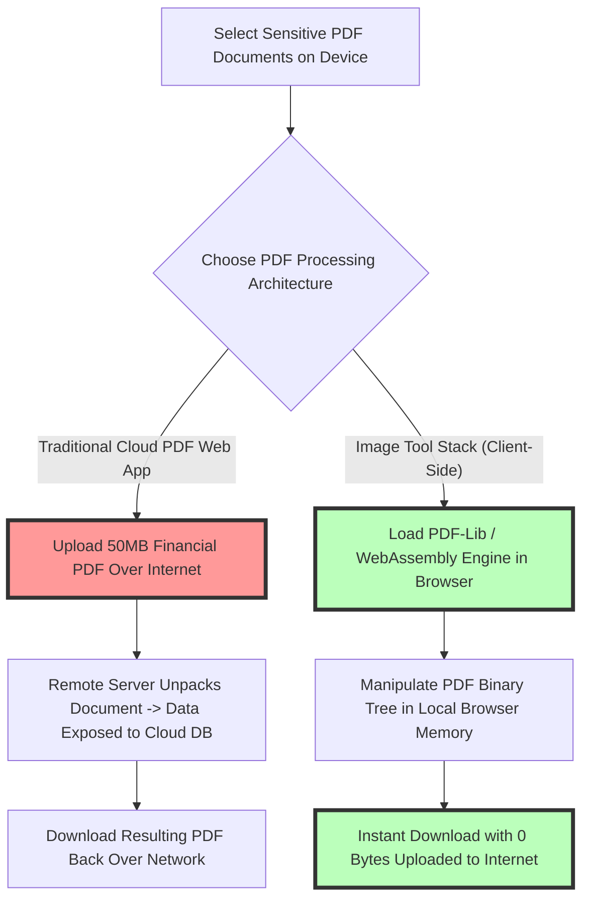
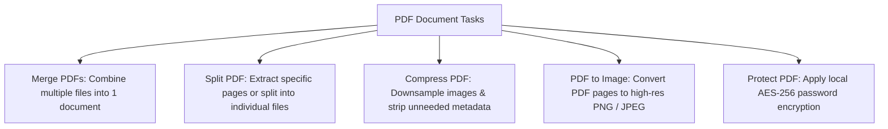

# Best Free PDF Tools Online: Merge, Split & Compress No Upload Guide

Managing PDF documents (Portable Document Format) is an everyday requirement for businesses, legal professionals, financial analysts, students, and remote workers. Common tasks include merging multiple PDF reports into a single file, splitting large documents into individual pages, compressing heavy PDFs under file size limits for email attachments, and converting PDF pages to high-resolution images.

However, traditional online PDF processing sites (such as SmallPDF, ILovePDF, or Adobe Acrobat Online) force users to upload their documents to remote cloud servers. Uploading confidential tax documents, signed legal contracts, medical records, or corporate financial reports to third-party cloud servers creates severe security risks, violates data privacy regulations (such as GDPR, HIPAA, and CCPA), and subjects users to strict upload file caps and paywalls.

This guide evaluates the best free online PDF tools, explains how **client-side WebAssembly (Wasm) PDF engines** process documents 100% locally in your browser, compares PDF utilities (Merge, Split, Compress, Convert), details data privacy safeguards, and provides step-by-step document workflows.

---

## Master Comparison Matrix: PDF Utilities & Security Architectures

To understand the critical difference between dangerous cloud PDF converters and client-side browser PDF tools, review this comparison:

| Feature / Metric | Client-Side PDF Tools (Image Tool Stack) | Traditional Cloud PDF Web Apps | Desktop PDF Software (Adobe Acrobat Pro) |
| :--- | :--- | :--- | :--- |
| **Server File Upload** | **NO (100% On-Device Browser Memory)**| YES (Files uploaded to cloud servers)| NO (Installed local desktop application) |
| **Data & Document Privacy**| **Absolute (Files never leave device)** | Vulnerable to server leaks & caching | Absolute (Offline local software) |
| **File Size Limits** | **UNLIMITED (No MB document caps)** | Strict 5MB – 15MB caps on free tier | Unlimited (Hardware RAM bound) |
| **Processing Speed** | **Instant (Zero network latency)** | Slow (Upload & download wait queues)| Instant (Local CPU processing) |
| **Pricing Model** | **100% Free Forever (No Watermarks)** | Monthly subscriptions / Daily limits | Paid Monthly Subscription ($20+/mo) |
| **Software Install** | **Zero Installation (Browser-Native)** | Zero Installation | Heavy software download & install |

---

## The Architecture of Client-Side WebAssembly PDF Processing

Why is on-device browser PDF processing vastly superior to cloud server document manipulation?

### How WebAssembly PDF Processing Guarantees Security:
When you open our [PDF Utilities Suite](/category/pdf) in Chrome, Safari, Firefox, or Edge, your browser loads a lightweight JavaScript and WebAssembly engine (powered by open-source libraries like `pdf-lib` and `pdfjs`).
1.  **Local Binary Parsing:** When you select PDF files, your browser parses the PDF cross-reference table (XRef table), object streams, and page catalog directly in your computer's local RAM.
2.  **Zero Network Traversal:** **0 bytes of document content** are uploaded to any external server or cloud database.
3.  **Complete Offline Execution:** Once the web page is loaded, you can turn off your internet connection entirely; all PDF operations (merging, splitting, compression) execute seamlessly offline.

---

## Comprehensive PDF Utility Breakdown

Our suite of browser-native PDF utilities handles common document management tasks:

### 1. PDF Merge (Combine Documents)
Combine multiple PDF files, presentation slides, or scanned invoice pages into a single organized document. Re-order pages drag-and-drop before exporting, with zero document size caps.

### 2. PDF Split & Extract Pages
Separate multi-page PDFs into individual single-page documents or extract specific page ranges (e.g., Pages 3–7) without re-encoding text vector fonts.

### 3. PDF Compressor (Reduce File Size)
Compress heavy PDF presentations and scanned documents under strict 2MB or 5MB email attachment limits by downsampling embedded raster images and purging redundant font streams.

### 4. PDF to Image Converter
Convert vector PDF pages into high-resolution **PNG** or **JPEG** image files at 300 DPI for presentation slides or web publishing.

---

## Regulatory Compliance: GDPR, HIPAA, & CCPA Safeguards

For legal practices, healthcare providers, accounting firms, and educational institutions, document security is mandatory:

*   **GDPR (EU General Data Protection Regulation):** Processing personal documents locally in the user's browser avoids international data transfers and third-party processor liabilities.
*   **HIPAA (Health Insurance Portability and Accountability):** Handling Patient Health Information (PHI) within local device memory prevents unauthorized cloud server exposure.
*   **CCPA (California Consumer Privacy Act):** Client-side processing guarantees that no consumer document data is collected, logged, or monetized by third-party tracking scripts.

---

## Step-by-Step PDF Management Workflow

Follow this workflow to process PDF documents securely in your browser:

1.  **Select Target Tool:** Open our [PDF Category Page](/category/pdf) and launch the desired tool (e.g., Merge PDF, Split PDF, or Compress PDF).
2.  **Select PDF Files:** Drag and drop PDF files from your desktop or file manager into the upload zone.
3.  **Configure Document Parameters:**
    *   For **Merge:** Drag pages into your preferred order.
    *   For **Split:** Enter desired page ranges (e.g., `1, 3-5, 8`).
    *   For **Compress:** Select target compression level (Standard vs. Maximum).
4.  **Instant Export:** Click **Process & Download**. The output PDF is compiled in local browser memory and saved to your device immediately.

---

## Step-by-Step PDF Security Checklist

Before handling sensitive PDF documents online, run your workflow through this checklist:

*   **Zero Upload Verification:** Confirm processing is **client-side** without network data transfer.
*   **Original File Safety:** Ensure original source PDF files remain untouched on your hard drive.
*   **Font Vector Integrity:** Verify that page merging and splitting preserve scalable vector text fonts.
*   **Compression Review:** Check that compressed PDF documents maintain readable text and legible figures.
*   **Password Removal:** Strip temporary passwords before archiving final document copies.

---

## PDF/A Archival Preservation Standards

For government agencies, universities, and legal institutions storing electronic records long-term, **PDF/A (ISO 19005)** is the universal archival format:
*   **Font Embedding Requirement:** PDF/A mandates that 100% of fonts used in a document must be embedded directly inside the file container, ensuring that document typography renders identically 50 years into the future regardless of system font availability.
*   **Zero External References:** PDF/A prohibits external links, embedded executable scripts, and video attachments, guaranteeing a self-contained, tamper-proof archival record.

---

## Client-Side AES-256 PDF Encryption & Permission Security

Securing confidential PDF files against unauthorized opening or editing relies on industry-standard cryptographic algorithms:
*   **AES-256 Encryption:** Modern PDF tools apply 256-bit Advanced Encryption Standard (AES) encryption to secure document payloads with master user passwords.
*   **Granular Owner Permissions:** PDF security flags allow authors to restrict specific document actions—such as disabling page printing, preventing text copying to clipboard, or restricting page extraction—without locking read access.

---

## Frequently Asked Questions

### What are the best free PDF tools online?
The best free online PDF tools are available in our client-side [PDF Toolkit](/category/pdf). They allow you to merge, split, compress, and convert PDF documents 100% locally in your browser with zero file uploads, zero size caps, and zero paywalls.

### Is it safe to merge or compress sensitive PDFs online?
Traditional cloud PDF sites upload your documents to remote servers, risking data leaks. Our client-side PDF tools process files entirely within your browser's local RAM, ensuring 100% document privacy and compliance with GDPR, HIPAA, and CCPA regulations.

### Can I merge large PDF files without file size limits?
Yes. Because our PDF tools run locally on your device's hardware, there are no artificial file size limits or paywalls. You can merge multi-gigabyte PDF files smoothly.

### How does client-side PDF compression work?
Our browser PDF compressor downsamples embedded raster images and purges unused font descriptors directly in local memory, reducing file size while preserving document legibility.

### Do I need to install software like Adobe Acrobat Pro to split PDFs?
No. You can split multi-page PDF documents into individual files or specific page ranges directly in your web browser without installing heavy software.

### Can I use these PDF tools offline without an internet connection?
Yes. Once the web page is loaded in your browser, all PDF operations execute locally without requiring an active internet connection.
