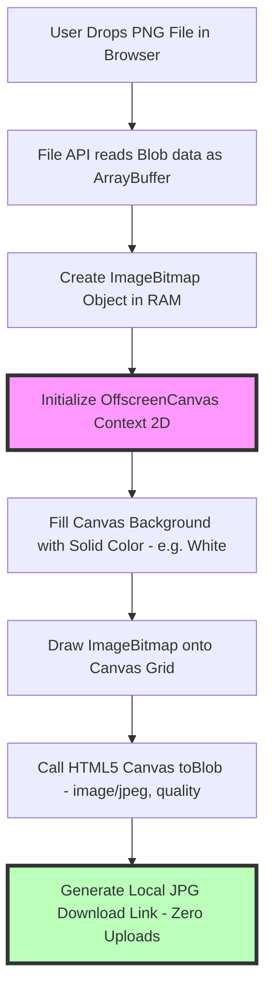

# Best Free PNG to JPG Converter: Private Client-Side Tool Guide

PNG and JPG are two of the most widely used image formats on the digital web. While PNG is ideal for graphics, logos, and screenshots that require lossless detail or transparent backgrounds, its file sizes can become unnecessarily large when storing complex photographs or detailed visual layouts.

Converting heavy PNG files to optimized JPEGs can reduce file sizes by **60% to 80%**, speeding up website load times, improving Core Web Vitals scores, and conserving storage space.

However, many free online PNG to JPG converters upload user images to remote cloud servers for processing. This presents significant security risks when converting sensitive documents, private screenshots, or proprietary client designs.

This guide analyzes the technical mechanics of PNG to JPG conversion, details HTML5 Canvas in-browser processing, explains background color fill strategies for transparent channels, and demonstrates how to use private client-side converters securely.

---

## Technical Comparison: PNG vs. JPG Architecture

To understand why converting PNG to JPG reduces file size, we must evaluate their codec architectures:

| Feature | PNG (Portable Network Graphics) | JPG / JPEG (Joint Photographic Experts) |
| :--- | :--- | :--- |
| **Compression Methodology** | **100% Lossless (DEFLATE / Delta)** | **Lossy (Discrete Cosine Transform)** |
| **Alpha Transparency** | **Supports 8-bit Alpha Channel** | No Transparency (Solid Background) |
| **Color Model** | RGB / Indexed / Greyscale | YCbCr Color Space |
| **Quantization Step** | None (Preserves exact pixels) | Non-Linear Quantization Division |
| **File Size for Photos** | Extremely Heavy (Uncompressed) | **Highly Compact (80% smaller)** |
| **Generation Loss** | None across multiple saves | Accumulates with each re-compression |
| **Best Use Case** | Vector logos, screenshots, text | Photography, continuous-tone web assets |

---

## How In-Browser PNG to JPG Conversion Works (HTML5 Canvas & Blob APIs)

Traditional online converters send your image across the network to a cloud server, where a server script (like ImageMagick or Sharp) processes the file and sends back a JPEG response.

Client-side converters work differently by leveraging web browser JavaScript APIs to execute the entire conversion locally within your device's memory:

### 1. The HTML5 Canvas Drawing Pipeline
The browser reads the incoming PNG file as an `ImageBitmap` object and draws it onto a virtual 2D HTML5 Canvas (`OffscreenCanvas`) element matching the image's pixel dimensions.

### 2. Handling Alpha Channel Transparency
Because JPEG does not support alpha channel transparency, converting a transparent PNG directly to JPEG without handling transparency results in a black background. 

Client-side converters solve this by filling the canvas background with a solid color (typically solid white `#FFFFFF` or solid black `#000000`) before rendering the transparent PNG elements.

### 3. In-Browser Quantization and Compression
Once the image is rendered onto the canvas, the browser executes the `canvas.toBlob('image/jpeg', quality)` method. The browser's internal image encoding engine converts the canvas pixel grid into a JPEG binary stream, applying Discrete Cosine Transforms (DCT) and quantization locally using your computer's CPU.

---

## Technical Conversion Steps: DEFLATE Un-filtering to JPEG DCT

To understand what happens to your image data during conversion, let's examine the mathematical transformations:

### Step 1: Reversing PNG Delta Filters
The PNG decoder reverses the spatial row filters (Sub, Up, Average, Paeth) and uncompresses the DEFLATE byte stream to reconstruct the raw RGBA pixel array ($R, G, B, A$ values from 0 to 255).

### Step 2: Alpha Blending Matrix
For pixels containing transparency ($A < 255$), the encoder blends the pixel color ($C_{\text{png}}$) with the selected background fill color ($C_{\text{bg}}$) using standard alpha compositing math:
$$C_{\text{final}} = \left( C_{\text{png}} \times \frac{A}{255} \right) + \left( C_{\text{bg}} \times \left(1 - \frac{A}{255}\right) \right)$$
This ensures smooth antialiased edges around text and objects without harsh borders.

### Step 3: Color Conversion & DCT Compression
The composite RGB data is converted to the **YCbCr** color space. The encoder applies $4:2:0$ chroma subsampling, divides the channels into $8\times8$ pixel blocks, calculates Discrete Cosine Transforms (DCT), and quantizes the coefficients using the selected JPEG quality factor.

---

## Privacy & Security Advantages of Local Conversion

Uploading images to external cloud conversion services introduces significant privacy risks:

*   **Risk of Data Interception:** Uploading sensitive documents (such as invoices, medical records, or passports) over public Wi-Fi networks exposes files to potential interception.
*   **Server Log Storage:** Many free converter websites log IP addresses, store uploaded files in temporary cloud directories, or retain images for internal data processing.
*   **Zero Server Uploads:** Using our on-device [PNG to JPG Converter](/tools/png-to-jpg) guarantees complete privacy. The conversion runs entirely in your browser's temporary memory—your files are processed locally on your CPU and saved directly back to your Downloads folder.

---

## Step-by-Step Guide: Converting PNG to JPG Privately

To convert PNG images to JPEG format securely, follow this workflow:

1.  **Access the Local Tool:** Open our free, client-side [PNG to JPG Converter](/tools/png-to-jpg).
2.  **Select Background Color:** If your PNG contains transparent elements, select a background fill color (white is recommended for standard photos and documents).
3.  **Adjust Quality Factor:** Set the target compression quality slider between **80% and 85%**. This quality range reduces file sizes by up to 80% while keeping visual quality identical to the original PNG.
4.  **Batch Process Files:** Drag and drop your PNG files into the converter workspace. The browser processes all files concurrently and generates JPEG download links instantly.

---

## OffscreenCanvas Multithreading via Web Workers

When batch-converting dozens of high-resolution PNG images simultaneously, running canvas operations on the main browser thread can cause user interface lag.
*   **OffscreenCanvas API:** Modern browsers support the `OffscreenCanvas` API, which allows canvas rendering and image encoding operations to be offloaded from the main UI thread to background Web Workers.
*   **Parallel Execution:** By instantiating multiple Web Workers matching your CPU core count (e.g. 4 to 8 workers), the browser converts multiple PNG files in parallel without freezing the user interface or delaying scrolling.

---

## Preserving sRGB Profiles and Color Accuracy

During PNG to JPG conversion, managing color profiles is essential for preventing color shifts across devices:
*   **ICC Profile Preservation:** PNG files often contain embedded ICC color profiles (such as sRGB, Display P3, or Adobe RGB). 
*   **The Conversion Rule:** When rendering PNG data onto an HTML5 Canvas, the browser maps the color coordinates to the output canvas context. To ensure color accuracy across Android, iOS, Windows, and macOS screens, client-side converters tag the generated JPEG stream with the standard **sRGB color space** profile.

---

## PNG to JPG Conversion Checklist

Before converting your PNG files, run your assets through this checklist:

*   **Asset Suitability:** Convert photographs, screenshots, and visual layouts to JPEG. Keep vector logos and icons as PNG or SVG to preserve sharp line edges.
*   **Transparency Color Fill:** Select a solid background fill color before converting transparent PNG assets.
*   **Compression Quality:** Use a quality setting between **80% and 85%** to balance file size savings with visual quality.
*   **Local Processing:** Verify that the conversion executes locally in your browser to maintain data privacy.

---

## Frequently Asked Questions

### What is the best free PNG to JPG converter online?
The best converter is a **client-side, browser-based tool** like our [PNG to JPG Converter](/tools/png-to-jpg). It processes files locally within your browser using HTML5 Canvas APIs, ensuring fast conversion speeds and total privacy with no file uploads.

### Why does converting PNG to JPG reduce file size?
PNG is a lossless format that preserves 100% of pixel data using heavy DEFLATE compression. JPEG uses lossy Discrete Cosine Transform (DCT) compression to discard minor visual details that are less noticeable to the human eye, reducing file sizes by up to 80%.

### What happens to transparent backgrounds when converting PNG to JPG?
Because JPEG does not support alpha channel transparency, converting a transparent PNG to JPEG requires filling the transparent areas with a solid background color (typically white).

### Does converting PNG to JPG lower image quality?
Because JPEG uses lossy compression, a minor amount of data is discarded. However, at quality settings between **80% and 85%**, the visual difference is invisible to the human eye, yielding "visually lossless" results.

### Can I convert multiple PNG files to JPG at once?
Yes. Our client-side [PNG to JPG Converter](/tools/png-to-jpg) supports batch processing, allowing you to convert dozens of files simultaneously directly on your device.

### How can I convert sensitive PNG documents to JPG securely?
To convert sensitive PNG documents (such as IDs, receipts, or confidential designs) without uploading them to external cloud databases, use our free, browser-based [PNG to JPG Converter](/tools/png-to-jpg). The tool processes files locally on your CPU, ensuring your assets never leave your device.
