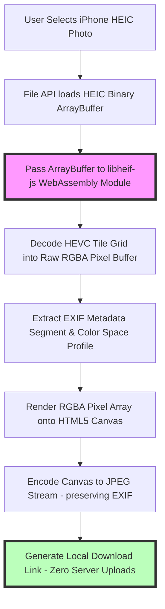

# Best HEIC to JPG Converter: Private Client-Side Tool Guide

When Apple adopted the **HEIC (High Efficiency Image Container)** format with iOS 11, it revolutionized mobile photography storage. Based on the High Efficiency Video Coding (HEVC / H.265) video standard, HEIC produces photo files that are **50% smaller than JPEGs** while supporting 10-bit color depth, live photo motion sequences, and depth-map transparency channels.

However, despite its technical efficiency, HEIC suffers from limited compatibility outside Apple's ecosystem. Windows PCs, web browsers, graphics software, and e-commerce upload portals often fail to decode HEIC files, forcing users to convert their iPhone photos to JPEG before sharing or publishing.

Many free online HEIC converters upload user photos to third-party cloud servers. This presents serious privacy risks when converting personal family photos, private document scans, or proprietary business assets.

This guide analyzes the technical mechanics of HEIC container decoding, details `libheif-js` WebAssembly in-browser processing, explains how EXIF metadata and color profiles are preserved during conversion, and demonstrates how to use private client-side converters securely.

---

## Technical Comparison: HEIC vs. JPEG Container Architecture

To understand why iPhone photos use HEIC and why conversion to JPEG is necessary, we must compare their technical characteristics:

| Feature / Aspect | HEIC (High Efficiency Image Container) | JPG / JPEG (Joint Photographic Experts) |
| :--- | :--- | :--- |
| **Codec Engine** | **HEVC (H.265 Video Keyframe)** | Discrete Cosine Transform (DCT) |
| **Container Format** | ISO Base Media File Format (ISOBMFF) | JFIF / EXIF File Wrapper |
| **Relative File Footprint**| **50% smaller than JPEG** | Standard Baseline Size |
| **Max Color Bit Depth** | **10-bit per channel (1024 shades)** | 8-bit per channel (256 shades) |
| **Multi-Item Sequences** | **Yes (Live Photos / Depth Maps)** | Single Flat Image Layer |
| **Windows / Web Support** | Unsupported natively by many web tools | **Universal 100% Native Support** |
| **License Royalty Model** | MPEG-LA / HEVC Patent Pools | Royalty-Free Open Standard |

---

## How In-Browser HEIC to JPG Conversion Works (`libheif-js` WebAssembly)

Converting HEIC images inside a web browser requires specialized decoding engines because standard web browser graphics libraries do not include native HEVC patent codecs.

Client-side converters solve this by compiling C/C++ HEIC decoders (such as `libheif` and `libde265`) into **WebAssembly (WASM)** modules that execute directly inside the browser sandbox:

### 1. Decoding HEVC Tiles via WebAssembly
The `libheif-js` WebAssembly module reads the HEIC ISOBMFF container structure, parses the image item header, and decodes the underlying HEVC tile grid into an uncompressed RGBA pixel array in memory.

### 2. Preserving EXIF Metadata and GPS Location Tags
iPhone HEIC files contain rich EXIF metadata, including camera settings (shutter speed, ISO, aperture), capture date, and GPS location coordinates. 

A proper conversion tool extracts the raw EXIF payload segment from the HEIC container before decoding, re-injecting the metadata bytes directly into the output JPEG file's APP1 segment.

### 3. Color Space Mapping (Display P3 to sRGB)
Modern iPhones capture photographs using the **Display P3** wide color gamut profile. During conversion to JPEG, the browser maps these wide-gamut color coordinates to the universal **sRGB** color space to ensure colors display accurately across non-Apple displays.

---

## Technical Decoding Steps: ISOBMFF Parsing to JPEG Stream

Let's examine the step-by-step conversion mechanics:

### Step 1: ISOBMFF Box Parsing
The decoder parses the top-level ISOBMFF boxes:
*   `ftyp`: Verifies the file type compatibility brand (`heic`, `heix`, or `mif1`).
*   `meta`: Locates the primary image item ID and extracts color profile information (`colr` box).
*   `mdat`: Reads the raw media data bytes containing the HEVC keyframe.

### Step 2: HEVC Keyframe De-quantization
The `libde265` WASM core decodes the HEVC bitstream, applying de-quantization, inverse Discrete Sine/Cosine Transforms, and deblocking filters to reconstruct the raw 10-bit YUV pixel matrix.

### Step 3: YUV to RGB Matrix Conversion
The 10-bit YUV matrix is converted to 8-bit RGB pixel data using standard color matrix equations:
$$\begin{aligned}
R &= Y + 1.402 \times (Cr - 128) \\
G &= Y - 0.344136 \times (Cb - 128) - 0.714136 \times (Cr - 128) \\
B &= Y + 1.772 \times (Cb - 128)
\end{aligned}$$
The resulting RGB buffer is rendered onto an HTML5 Canvas and re-encoded into a standard JPEG stream.

---

## Privacy Advantages of Local In-Browser Conversion

Uploading personal iPhone photos to cloud conversion websites introduces serious privacy risks:

*   **Exposure of Private Photos:** Personal family photos, vacation snapshots, or private document scans can be intercepted or retained by cloud servers.
*   **GPS Tracking Risks:** HEIC photos contain precise GPS coordinates. Uploading un-sanitized HEIC files to third-party conversion servers exposes your location history.
*   **Zero Server Uploads:** Using our client-side [HEIC to JPG Converter](/tools/heic-to-jpg) guarantees complete privacy. The conversion executes entirely within your browser's local sandbox—your photos are processed locally on your CPU and saved directly to your Downloads folder.

---

## Step-by-Step Guide: Converting HEIC to JPG Privately

To convert iPhone HEIC photos to JPEG format securely, follow this workflow:

1.  **Access the Local Tool:** Open our free, in-browser [HEIC to JPG Converter](/tools/heic-to-jpg).
2.  **Configure EXIF Settings:** Choose whether to preserve camera EXIF metadata (recommended for personal photo archives) or strip EXIF metadata to protect location privacy.
3.  **Adjust Compression Quality:** Set the JPEG quality slider between **80% and 85%**. This provides an optimal balance, keeping file sizes small while maintaining visual quality.
4.  **Batch Convert iPhone Photos:** Drag and drop your HEIC files into the converter workspace. The browser processes all files concurrently and generates JPEG download links instantly.

---

## WebAssembly SIMD Acceleration & Multithreaded Workers

Decoding HEVC video keyframes inside JavaScript requires significant CPU compute power:
*   **WASM SIMD (Single Instruction, Multiple Data):** Modern WebAssembly engines leverage CPU SIMD instructions (such as AVX2 on x86 or NEON on ARM processors). This accelerates vector math operations during HEVC de-quantization, speeding up conversion rates by up to **400%**.
*   **Background Worker Threads:** By running the `libheif-js` WebAssembly engine inside Web Workers, batch conversions execute in parallel across multiple CPU cores without freezing the browser user interface.

---

## Handling HEIC Auxiliary Images (Depth Maps & Live Photo Layers)

iPhone HEIC files are multi-item containers that often store additional auxiliary images alongside the primary photo:
*   **Portrait Mode Depth Maps:** Stores an auxiliary 8-bit greyscale depth map item (`auxC` box) that defines spatial distance for background bokeh effects.
*   **Live Photo Video Tracks:** Stores a short 3-second MOV video clip alongside the static image item.
*   **Conversion Rule:** Client-side converters extract the primary high-resolution static image item (`pitm` box) and flatten it to JPEG, discarding or saving auxiliary video tracks based on user preferences.

---

## HEIC to JPG Conversion Checklist

Before converting your iPhone photos, run your files through this checklist:

*   **Compatibility:** Convert HEIC photos to JPEG for sharing on Windows, uploading to web portals, or editing in legacy software.
*   **EXIF Metadata:** Choose whether to preserve EXIF camera data or strip GPS location coordinates before sharing publicly.
*   **Color Profile Tagging:** Ensure the output JPEGs are tagged with the sRGB color profile to prevent washed-out colors on non-Apple screens.
*   **Local Execution:** Verify that the converter runs locally in your browser to protect your privacy.

---

## Frequently Asked Questions

### What is the best free HEIC to JPG converter online?
The best converter is a **client-side, browser-based tool** like our [HEIC to JPG Converter](/tools/heic-to-jpg). It processes iPhone photos locally within your browser using WebAssembly (`libheif-js`), ensuring fast conversion speeds and complete privacy with zero server uploads.

### Why does iPhone shoot in HEIC format instead of JPG?
iPhones shoot in HEIC format because HEIC uses advanced HEVC video keyframe compression algorithms. This produces photos that are **50% smaller than JPEGs** while supporting 10-bit color depth and live photo motion sequences.

### Does converting HEIC to JPG lose quality?
Because JPEG uses lossy compression, a minor amount of visual data is re-quantized. However, at quality settings between **80% and 85%**, the visual difference is invisible to the human eye, preserving original photograph sharpness.

### Does converting HEIC to JPG keep photo metadata and location tags?
Yes. Our client-side [HEIC to JPG Converter](/tools/heic-to-jpg) extracts the EXIF payload segment from the HEIC container and re-injects it directly into the generated JPEG file, preserving capture dates, camera settings, and GPS coordinates.

### Can I batch convert HEIC photos on Windows without installing software?
Yes. You can batch convert dozens of iPhone HEIC photos directly in your web browser using our client-side converter without downloading third-party software or paying for codec extensions.

### How can I convert HEIC photos to JPG securely?
To convert iPhone photos without exposing your files to third-party cloud databases, use our free, browser-based [HEIC to JPG Converter](/tools/heic-to-jpg). The tool runs locally in your browser, keeping your photos private and secure.
