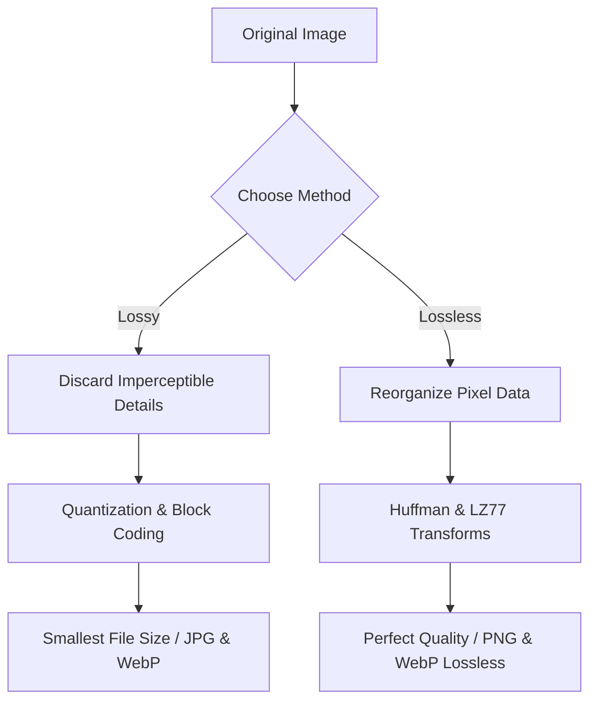

# Best Image Compressor Online: Free, Secure & Unlimited Compression

Every modern website, application, and digital product depends on fast loading times. Research shows that a one-second delay in page load time can reduce conversions by up to 20%, directly impacting sales and search engine rankings. Because images account for over 60% of average page weight, finding the **best image compressor online** is one of the most critical steps to optimize web performance and improve user experience.

However, the modern web is full of tool interfaces that are cluttered with pop-up ads, hidden subscription walls, strict file upload limits, and serious privacy concerns. 

This comprehensive guide breaks down the technical mechanisms of online image compression, compares the top 5 image compression platforms on the market, and explains why secure, on-device local processing is the modern standard for web optimization.

---

## What Makes a Great Online Image Compressor?

When comparing image compressors, developers, designers, and site owners must look beyond simple file-size reduction. A premium compressor is evaluated on four main criteria:

1.  **Compression Ratio vs. Visual Fidelity:** The compressor should reduce file sizes by 70% or more while maintaining clear pixel details without adding blur, artifacts, or color distortion.
2.  **Batch Processing Capabilities:** Optimizing images one by one is inefficient. The best tools allow users to drag and drop dozens of files simultaneously and compress them in parallel.
3.  **Data Privacy and File Security:** Uploading proprietary graphics, personal photos, or sensitive documents (such as screenshots or product mockups) to external cloud servers creates data security risks. A great tool should process files securely on your device.
4.  **Format Support and Versatility:** It must support modern web standards (JPEG, PNG, WebP, and AVIF) and allow users to convert formats during the compression process.

---

## The Visual Comparison: Lossy vs. Lossless Compression Algorithms

To select the right tool, it helps to understand the difference between the two main types of image compression:



### 1. Lossless Compression (Zero Quality Loss)
Lossless compression reduces file sizes by identifying and removing redundant data patterns without altering the original pixel values. When the file is decompressed, it matches the original bit-for-bit.
*   **How it works:** Algorithms like LZ77 and Huffman coding replace repeated color values with shorter reference codes.
*   **Best for:** Logos, text-heavy graphics, line art, and transparent images where sharp edges must be preserved (e.g., PNG).
*   **Result:** Moderate file size savings (typically 10% to 30%).

### 2. Lossy Compression (Maximum Savings)
Lossy compression discards color details that are less noticeable to the human eye.
*   **How it works:** In JPEG, this is done through Chrominance Subsampling (reducing color resolution while keeping brightness data) and Discrete Cosine Transforms (quantizing high-frequency details into simplified numerical values).
*   **Best for:** High-resolution photographs, complex backgrounds, and banners where slight quality adjustments are invisible to users.
*   **Result:** Significant file size savings (typically 50% to 80%).

---

## Local Browser-Based Compression vs. Cloud Uploads (Privacy & Speed)

Most traditional image compression tools rely on a **cloud-based client-server model**. When you drop an image into their interface:
1.  Your file is uploaded over the internet to their remote server.
2.  The server processes the compression queue.
3.  The compressed file is sent back to your browser for download.

### The Security & Speed Disadvantage of Cloud Tools
This cloud workflow has two major drawbacks:
*   **Data Vulnerability:** Your private assets are stored on third-party servers, exposing them to potential data leaks or server-side harvesting.
*   **Network Delays:** You are limited by your upload and download speeds. Uploading a batch of raw 10MB images can take minutes, even on fast connections.

### The Modern Alternative: On-Device Compression
**Image Tool Stack** uses a **client-side local architecture**. By compiling compression engines directly into JavaScript and WebAssembly (Wasm), the processing runs locally inside your browser sandbox:

```
[ Your Device / Web Browser ]
   │
   ├──> Drop Image Files (No Upload)
   │
   ├──> WebAssembly Codecs (Local CPU/GPU Processing)
   │
   └──> Instant Download (0ms Server Delay & 100% Private)
```

Since your images never leave your computer, your data is **100% private**, and processing is nearly instant because there are no upload or download queues.

---

## Top 5 Best Image Compressors Online (Detailed Analysis)

Here is a comparison of the top five online image compression platforms based on features, privacy, and performance:

| Platform | Processing Type | Batch Processing | Max File Size Limit | Ads / Paid Tiers | Privacy Rating |
| :--- | :--- | :--- | :--- | :--- | :---: |
| **Image Tool Stack** | **Local (On-Device)** | **Yes (Parallel)** | **Unlimited** | **100% Free / No Ads** | 🟢 **Excellent (Secure)** |
| **Squoosh.app** | Local (On-Device) | No (Single File Only) | Unlimited | Free (Google Project) | 🟢 **Excellent (Secure)** |
| **TinyPNG** | Cloud Server | Yes (Max 20 Files) | 5 MB | Paid Subscription Required | 🔴 **Risky (Uploads File)** |
| **ILoveIMG** | Cloud Server | Yes | 130 MB | Ads / Pro Upgrade | 🟡 **Moderate (Saves Files)** |
| **Ezgif** | Cloud Server | Yes | 100 MB | Intrusive Banner Ads | 🔴 **Risky (Uploads File)** |

### 1. Image Tool Stack (Score: 10/10)
Our [Image Compressor](/tools/image-compressor) combines client-side processing with batch support. It allows you to drag and drop multiple images at once, adjust compression levels on a slider, convert files to WebP or AVIF, and download the results instantly. Because it runs locally, you can use it offline with zero size limits.

### 2. Squoosh (Score: 8/10)
Developed by the Chrome Labs team, Squoosh is an excellent open-source tool for testing different codecs (such as WebP, AVIF, and MozJPEG) on individual images. It features a side-by-side comparison slider to preview quality changes. However, it does not support batch processing, making it less practical for larger workflows.

### 3. TinyPNG (Score: 6/10)
TinyPNG is a popular tool that uses smart lossy compression to reduce the size of PNG and JPEG files. It delivers high-quality results but is limited by a 5MB size limit for free users and requires uploading your files to their servers.

### 4. ILoveIMG (Score: 6/10)
ILoveIMG is a simple tool for compressing batches of images. However, it relies on server uploads, includes display ads, and restricts advanced features behind a paid subscription.

### 5. Ezgif (Score: 5/10)
Ezgif is a useful utility for editing and compressing animated GIFs and WebP files. It is limited by a clunky, outdated interface, heavy display ads, and slow upload queues for larger files.

---

## How to Choose the Right Compression Format for Your Website

Choosing the right format is key to balancing file size and quality on your site:

*   **AVIF (Next-Gen Standard):** Offers the highest compression efficiency. AVIF files are typically 50% smaller than JPEGs and 20% smaller than WebPs at equivalent quality. It is ideal for hero banners, illustrations, and colorful backgrounds.
*   **WebP (Modern Standard):** Supported by all modern browsers. It provides excellent lossy compression for photographs and lossless compression with transparency for graphics, making it a highly versatile default format.
*   **PNG (Legacy Lossless):** Use PNG only when you need pixel-perfect graphics with alpha transparency (like logos or icons containing fine text). For all other images, convert PNG to WebP to save up to 80% on file size.
*   **JPEG (Legacy Lossy):** Use JPEG for photography when compatibility with older browsers or systems is required. Otherwise, convert JPEG to WebP or AVIF for better web performance.

---

## Core Web Vitals & Image Optimization Best Practices

To maximize your page speeds and SEO rankings, combine image compression with these three practices:

1.  **Define Image Dimensions (`width` and `height`):** Always specify width and height values in your HTML image tags. This reserves the layout space on the page, preventing Cumulative Layout Shift (CLS) as images load.
2.  **Implement Lazy Loading:** Add the `loading="lazy"` attribute to all images below the fold. This tells the browser to defer loading off-screen images until the user scrolls near them, saving bandwidth and improving initial load speed.
3.  **Serve Responsive Images (`srcset`):** Do not serve a large desktop image to mobile visitors. Use the `srcset` attribute to specify different image sizes for different screens, ensuring mobile users only download smaller, optimized versions.

---

## Frequently Asked Questions About Online Image Compression

### Which is the best online image compressor?
**Image Tool Stack** is the best online image compressor because it uses client-side WebAssembly to compress files locally in your browser. This gives you unlimited batch processing, instant download speeds, and complete data privacy without paywalls or ads.

### Is it safe to upload images to online compressors?
Most online compressors upload your files to remote servers, which can expose sensitive documents or photos to data security risks. For complete privacy, use an on-device local compressor like Image Tool Stack, which processes your files entirely on your computer.

### What is the difference between lossy and lossless compression?
Lossless compression reduces file size by reorganizing data without changing any pixels, keeping the image at perfect quality. Lossy compression removes minor, imperceptible details to achieve much larger file size savings (often up to 80%).

### Will compressing an image reduce its print quality?
Yes, if you use lossy compression. High-ratio lossy compression can introduce visible artifacts that show up when printed. For printing, use lossless formats like TIFF or high-bit-depth PNG and avoid high levels of lossy compression.

### How does image compression affect SEO?
Image compression reduces page weight, helping your site load faster. Since page speed and Core Web Vitals are ranking factors for Google and Bing, optimizing your images directly improves your search engine visibility.

### How much can WebP compression reduce my file size?
Converting JPEGs or PNGs to WebP and applying compression can reduce file sizes by **25% to 35%** compared to JPEG, and up to **80%** compared to PNG, without visible loss in image quality.
