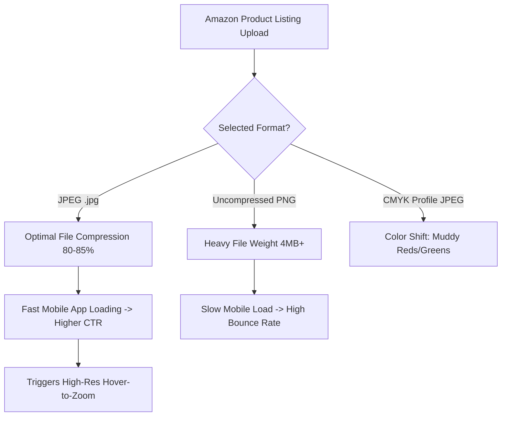
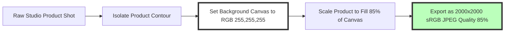

# Best Image Format for Amazon Product Listings: Requirements & Zoom Guide

Product imagery is the single most important factor driving conversion rates and click-through rates (CTR) on Amazon. Because online shoppers cannot physically touch or inspect products, they rely entirely on high-resolution product photography to evaluate build quality, scale, texture, and materials.

Amazon enforces strict Technical Image Guidelines across Seller Central and Vendor Central. Submitting non-compliant images can cause product listings to be suppressed from search results, lose buy box eligibility, or fail Amazon's automated quality audits.

This guide analyzes Amazon's official image requirements, compares JPEG, PNG, and TIFF formats for Seller Central, details the $2000\times2000$ pixel hover-to-zoom requirement, explains pure white background rules (`#FFFFFF`), and demonstrates how to optimize images to maximize Amazon A10 algorithm conversion signals.

---

## Master Specification Matrix: Amazon Image Requirements

To ensure your product listing complies with Amazon Seller Central policies, follow these specifications:

| Requirement Parameter | Main Listing Photo (MAIN) | Secondary & Lifestyle Photos | Amazon A+ Content Banners |
| :--- | :--- | :--- | :--- |
| **Recommended Format** | **JPEG (.jpg / .jpeg)** | **JPEG (.jpg) or PNG (.png)** | **JPEG (.jpg) or PNG (.png)** |
| **Optimal Dimensions** | **$2000 \times 2000$ pixels** | $2000 \times 2000$ pixels | $1464 \times 600$ pixels (Module) |
| **Minimum Zoom Threshold**| **$1000 \times 1000$ pixels** | $1000 \times 1000$ pixels | N/A |
| **Aspect Ratio** | **1:1 (Square)** | 1:1 (Square recommended) | Varies by module slot |
| **Background Color** | **Pure White (`#FFFFFF` / `255,255,255`)** | Lifestyle / Contextual | Designed Graphic / Brand BG |
| **Frame Occupancy** | **Product fills 85%+ of frame**| Product in use / Dimensions | Brand storytelling graphics |
| **Color Profile Space** | **sRGB Color Profile** | **sRGB Color Profile** | **sRGB Color Profile** |
| **Max File Size Limit** | **under 10 MB per file** | under 10 MB per file | under 10 MB per file |

---

## Why JPEG is the Preferred Format for Amazon Seller Central

While Amazon accepts JPEG, PNG, TIFF, and GIF files, **JPEG is the official gold standard** for Amazon product photography:



### Key Advantages of JPEG for Amazon:
1.  **Hover-to-Zoom Performance:** Amazon recommends images sized at **$2000\times2000$ pixels** to enable its high-resolution hover-to-zoom feature. A $2000\times2000$ pixel PNG file can exceed 4MB, whereas an optimized $2000\times2000$ pixel JPEG compressed at 85% quality weighs just **450KB to 700KB**.
2.  **Fast Mobile Rendering:** Over 60% of Amazon purchases are completed via mobile devices. Smaller JPEG file sizes allow listing images to load instantly over mobile 4G/5G networks, reducing bounce rates.
3.  **Color Space Stability:** JPEG files reliably embed **sRGB color space metadata**, preventing color shifts when rendered across different mobile screens and web browsers.

---

## Technical Guidelines for Main Product Photos (MAIN Image Rules)

Amazon enforces non-negotiable standards for your primary search result photo (the **MAIN** image):

### 1. Pure White Background (`RGB 255, 255, 255`)
The MAIN image background must be **100% pure white** (`#FFFFFF` or RGB `255, 255, 255`). Off-white backgrounds (`#FAFAFA`), subtle grey gradients, or room backgrounds are strictly prohibited for main images and will cause listing suppression.



### 2. 85% Frame Occupancy Rule
The product must occupy at least **85% of the total image frame**. Leaving excessive empty whitespace around the product makes it look small in search results, reducing mobile click-through rates.

### 3. Prohibited Elements on MAIN Images:
*   NO promotional text, sale badges, or discount callouts (e.g. "Best Seller", "50% Off").
*   NO watermarks, logos, or seller brand stamps superimposed over the image.
*   NO props or accessories that are not included in the actual product purchase.
*   NO colored or atmospheric background scenes for the MAIN image (keep lifestyle scenes for secondary slots 2 through 7).

---

## The $2000\times2000$ Pixel Zoom Rule & Pixel Density Math

Amazon enables an interactive **Hover-to-Zoom** feature when shoppers move their cursor over listing photos.

```
                   Is image size 1000px x 1000px or larger?
                                   /      \
                                  /        \
                              (YES)        (NO)
                              /                \
               Enables Hover-to-Zoom    NO ZOOM ALLOWED
               (Higher Conversions)     (Lower Sales)
```

### Why 2000px is Better Than 1000px:
*   **1000px Minimum:** At $1000\times1000$ pixels, Amazon enables zoom, but the magnification scale is only $1.2\times$, making fine product details look blurry.
*   **2000px Optimum:** At **$2000\times2000$ pixels**, Amazon provides a crisp **$2.5\times$ zoom magnification**, allowing buyers to inspect fine stitching, material grain, port connections, and small text clearly.

---

## Managing Color Profiles: Converting Adobe RGB to sRGB

A common mistake made by commercial photographers is uploading images saved in the **Adobe RGB** or **ProPhoto RGB** color space:

*   **The Color Shift Problem:** Professional camera sensors shoot in Adobe RGB to capture a wider color gamut. However, web browsers and mobile apps default to the narrower **sRGB color space**.
*   **The Visual Result:** If you upload an Adobe RGB image without converting it to sRGB, Amazon's image processor strips the profile, making vibrant red products look dull orange, and saturated greens look muddy grey.
*   **The Fix:** Always convert your product photos to the **sRGB color space profile** before uploading to Amazon Seller Central.

---

## Step-by-Step Optimization Workflow for Amazon Sellers

Follow this workflow to prepare your product photography for Amazon listing:

1.  **Shoot at High Resolution:** Capture product photos at 24 Megapixels or higher using a DSLR or mirrorless camera.
2.  **Isolate & Retouch Background:** Use a background removal tool to isolate the product and place it on a pure white `#FFFFFF` canvas.
3.  **Resize to Square:** Scale the image canvas to **$2000\times2000$ pixels** (1:1 aspect ratio), ensuring the product fills 85% of the frame.
4.  **Convert Color Space:** Convert the color profile to **sRGB**.
5.  **Compress Locally:** Use our free, on-device [Image Compressor](/tools/image-compressor) to compress your $2000\times2000$ pixel JPEGs to under **600KB** at 85% quality without losing sharpness.

---

## Step-by-Step Amazon Listing Image Checklist

Before uploading photos to Seller Central, run your assets through this checklist:

*   **MAIN Photo Background:** Verify that the background is **100% pure white (`#FFFFFF`)** with no grey tint.
*   **Frame Occupancy:** Confirm that the product occupies at least **85% of the frame space**.
*   **Zoom Activation:** Ensure dimensions are at least **$2000\times2000$ pixels** to enable $2.5\times$ hover-to-zoom.
*   **Color Profile:** Convert all files to the **sRGB color space profile** to prevent color shifts.
*   **File Format:** Export photos as **JPEG (.jpg)** files compressed at **80-85% quality**.

---

## Frequently Asked Questions

### What is the best image format for Amazon product listings?
The best format is **JPEG (.jpg / .jpeg)**. JPEG provides an optimal balance of high visual quality and small file size, allowing $2000\times2000$ pixel zoom images to load quickly on both desktop and mobile apps. JPEG files reliably preserve the **sRGB color profile**, preventing color shifts across iOS, Android, and web browsers, while ensuring high conversion rates through fast image load speeds.

### What are the required image dimensions for Amazon?
Amazon requires a minimum resolution of **$1000\times1000$ pixels** to enable hover-to-zoom. However, the recommended optimal resolution is **$2000\times2000$ pixels** (1:1 square aspect ratio) for maximum zoom magnification and clarity.

### What background color is required for Amazon main images?
Amazon requires a **100% pure white background (`RGB 255, 255, 255` / `#FFFFFF`)** for the primary MAIN listing image. Off-white, grey, or textured backgrounds are not allowed for main images and can cause listing suppression.

### Why do my product colors look washed out on Amazon?
Product colors look washed out when photos are saved in the Adobe RGB color space instead of **sRGB**. Always convert your images to the sRGB color profile before uploading to Seller Central.

### How many images should I upload to an Amazon listing?
Amazon allows up to 9 images per listing (7 are displayed on the main product detail page). We recommend uploading **7 high-resolution images**: 1 MAIN white-background shot, 4 lifestyle/in-use shots, and 2 infographic dimension/feature callout graphics.

### How can I compress Amazon listing images without losing quality?
To compress your $2000\times2000$ pixel product photos without exposing images to third-party cloud databases, use our free, browser-based [Image Compressor](/tools/image-compressor). The tool runs locally in your browser, keeping your files private and secure.
