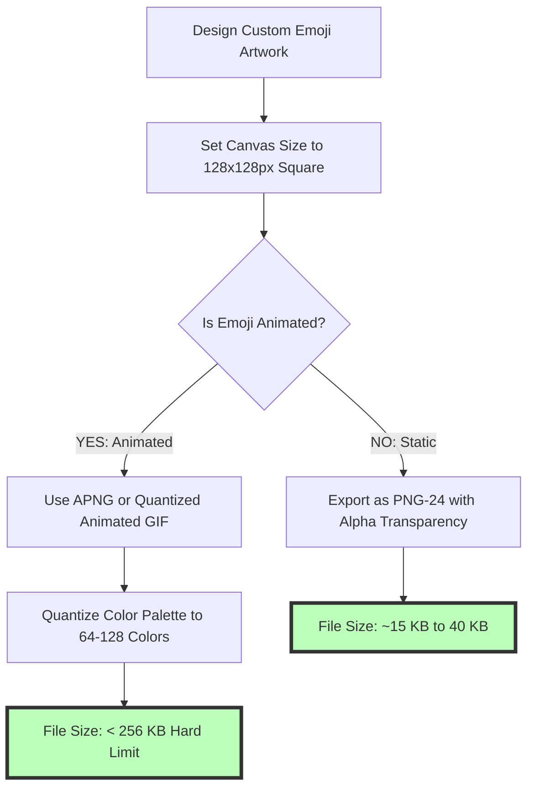
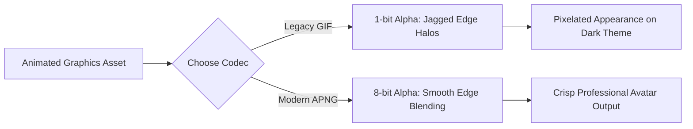

# Best Image Format for Discord: Emojis, Avatars & Server Banners

Discord is the primary community chat and streaming platform for gamers, Web3 developers, content creators, and digital communities. Visually customizing a Discord server with unique custom emojis, animated sticker packs, server icons, and header banners is essential for establishing community identity and building brand engagement.

However, Discord enforces strict file size limits and dimension rules across its desktop client and mobile app. Uploading incorrectly sized graphics or un-optimized animated GIFs can result in fuzzy emojis, truncated server banners, or upload rejection errors due to file size limits (such as the strict **256KB emoji limit**).

This guide analyzes Discord's official media specifications, compares PNG vs. GIF vs. APNG animated formats, details custom emoji and sticker compression techniques, and demonstrates how to optimize Discord graphics to render razor-sharp across desktop and mobile devices.

---

## Master Specification Matrix: Discord Media Assets

To ensure your community graphics comply with Discord platform guidelines, follow these official specifications:

| Asset Type / Slot | Recommended Format | Optimal Dimensions | Hard File Size Limit | Key Optimization Requirement |
| :--- | :--- | :--- | :--- | :--- |
| **Custom Emojis** | **PNG / GIF (.png / .gif)** | **$128 \times 128$ pixels** | **Under 256 KB** | Transparent background, 1:1 square |
| **Custom Stickers** | **APNG / Lottie / PNG** | **$320 \times 320$ pixels** | **Under 500 KB** | APNG or Lottie JSON animation |
| **Server Icon** | **PNG / Animated GIF** | **$512 \times 512$ pixels** | Under 10 MB | Circular crop mask, centered logo |
| **Server Banner Header**| **PNG (.png)** | **$960 \times 540$ pixels** | Under 10 MB | 16:9 widescreen ratio header |
| **Personal Avatar (PFP)**| **PNG / Animated GIF** | **$128 \times 128$ pixels** | Under 10 MB | Nitro users can use animated GIFs |
| **Profile Banner** | **PNG / Animated GIF** | **$600 \times 240$ pixels** | Under 10 MB | 5:2 ratio personal banner |

---

## Optimizing Custom Emojis Under the 256KB Limit

Discord allows community servers to upload custom emojis. However, every emoji file must be **under 256 KB in size**:

### Technical Strategies for Custom Emoji Compression:
1.  **Canvas Dimensions ($128\times128$ pixels):** While Discord renders inline chat emojis at $32\times32$ pixels, uploading at **$128\times128$ pixels** ensures high-DPI crispness when emojis are enlarged on mobile or desktop screens.
2.  **Alpha Transparency:** Always export static emojis as **PNG-24** files with alpha transparency. Transparent backgrounds allow emojis to render seamlessly over Discord's dark theme (`#313338`) and light theme (`#FFFFFF`).
3.  **Color Palette Quantization for Animated GIFs:** To keep animated GIF emojis under the **256KB limit**, reduce the GIF color palette from 256 colors down to **64 or 128 colors** using dithering tools.

---

## Technical Comparison: Animated GIF vs. APNG for Discord

When creating animated emojis, stickers, or server icons, choosing between **Animated GIF** and **APNG (Animated PNG)** impacts visual quality and file efficiency:

| Feature | Animated GIF | APNG (Animated PNG) |
| :--- | :--- | :--- |
| **Max Color Palette** | 256 Colors Total (Severe banding)| **16.7 Million Colors (Full RGB)** |
| **Alpha Transparency** | 1-bit Binary (Hard pixel edges) | **8-bit Alpha Channel (Smooth antialiasing)** |
| **File Compression Efficiency**| Outdated LZW compression | **Modern Deflate / Delta filtering** |
| **Text & Line Edge Crispness**| Fuzzy, pixelated edge halos | **Razor-sharp vector edge rendering** |
| **Discord Compatibility** | Universal across all platforms | Supported on modern Web/Desktop clients |

---

## Server Icon & Banner Dimensions Guide

A Discord server's visual identity relies on its **Server Icon** and **Server Banner Header**:

### 1. Server Icon ($512\times512$ pixels)
*   Discord masks server icons into a **circular crop**. 
*   Keep your community logo or mascot centered within a central safety circle (the middle 80% of the canvas) to prevent elements from being clipped by the circular mask.

### 2. Server Banner Header ($960\times540$ pixels)
*   Unlocked at Discord Server Boost Level 2, the server banner header appears at the top of the channel list.
*   Design banners at **$960\times540$ pixels** (16:9 widescreen ratio). Keep essential text and logos in the top 70% of the banner, as the bottom 30% is covered by the server name overlay.

---

## Step-by-Step Optimization Workflow for Discord Assets

Follow this workflow to prepare your graphics for Discord:

1.  **Canvas Setup:**
    *   Emoji: $128\times128$ pixels (PNG-24 transparent or GIF under 256KB).
    *   Sticker: $320\times320$ pixels (PNG or APNG under 500KB).
    *   Server Icon: $512\times512$ pixels (PNG or GIF).
    *   Server Banner: $960\times540$ pixels (PNG format).
2.  **Color Space Tagging:** Tag all files with the **sRGB color profile** to prevent desaturated color rendering in Discord's dark mode UI.
3.  **Compress Locally:** Use our free, client-side [Image Compressor](/tools/image-compressor) to reduce file sizes locally before uploading to Discord.

---

## Lottie JSON Vector Animations for Custom Stickers

Discord Nitro supports **Lottie JSON vector animations** for custom server stickers:
*   **Vector Scalability:** Lottie animations use JSON code to define vector keyframes and math paths. Unlike raster GIFs, Lottie stickers scale infinitely on 4K displays without losing resolution.
*   **Ultra-Compact File Footprint:** A 60-frame complex animation exported as a GIF might weigh 1.5MB (exceeding Discord's 500KB sticker limit). The same vector animation exported as a Lottie JSON file weighs just **45KB**, making it easy to stay under the 500KB cap.

---

## Discord Media Proxy (`media.discordapp.net`) Image Pipelines

When images are posted in Discord chat channels, they pass through the **Discord Media Proxy**:
*   **Automatic Resizing & Caching:** Discord caches attachments on its global CDN and generates low-res WebP preview thumbnails for mobile client rendering.
*   **EXIF Metadata Stripping:** Discord's media proxy automatically strips EXIF GPS location tags from images uploaded directly to chat channels, protecting user privacy when sharing photos in public servers.

---

## Step-by-Step Discord Media Checklist

Before uploading graphics to your Discord server or user profile, run your assets through this checklist:

*   **Emoji Size Limit:** Confirm that custom emoji files are under **256 KB**.
*   **Sticker Size Limit:** Confirm that custom sticker files are under **500 KB**.
*   **Transparency:** Export emojis and stickers as **PNG-24 or APNG** with alpha transparency.
*   **Server Icon Centering:** Keep server icon logos centered within a circular safety mask.
*   **Banner Occlusion:** Keep key text in the top 70% of server banners to avoid channel name overlap.

---

## Frequently Asked Questions

### What is the best image format for Discord emojis?
The best format for static custom emojis is **PNG-24** with a transparent background. For animated emojis, the best format is **APNG** or a compressed **Animated GIF** kept under the strict 256KB file size limit. PNG-24 preserves 8-bit alpha transparency, ensuring emojis render smoothly without jagged border halos on both Discord dark theme (`#313338`) and light theme modes.

### What is the maximum file size for Discord custom emojis?
Discord custom emojis have a strict hard file size limit of **256 KB**. If your uploaded static image or animated GIF exceeds 256KB, Discord will reject the upload until the file is compressed. Using color quantization to reduce GIF palettes from 256 to 128 colors helps keep files under the 256KB cap.

### What are the optimal dimensions for Discord server banners?
The optimal dimensions for a Discord server banner header are **$960\times540$ pixels** (16:9 widescreen ratio). For personal profile banners, the recommended size is **$600\times240$ pixels** (5:2 ratio).

### Why is APNG better than GIF for Discord stickers and emojis?
APNG supports **16.7 million colors** and **8-bit alpha channel transparency**, producing smooth antialiased edges without the jagged pixel halos and 256-color banding associated with legacy GIFs.

### What is the recommended size for a Discord server icon?
The recommended size for a Discord server icon is **$512\times512$ pixels** (1:1 square aspect ratio). Center your logo within the frame to accommodate Discord's circular crop mask.

### How can I compress custom Discord emojis under 256KB securely?
To compress your custom Discord emojis and server avatars without exposing files to external cloud databases, use our free, browser-based [Image Compressor](/tools/image-compressor). The tool runs locally in your browser, keeping your files private and secure.
