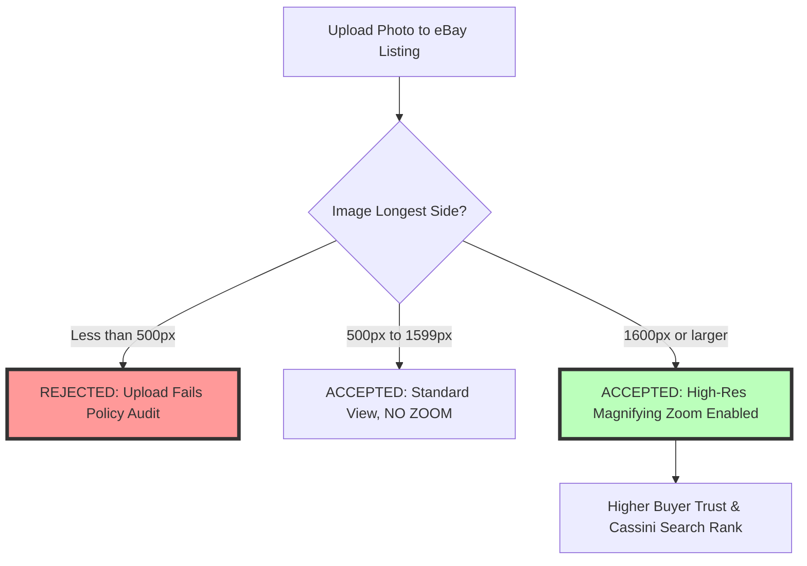
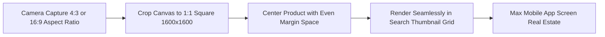

# Best Image Format for eBay Listings: 1600px Square JPG Guide

Selling successfully on eBay requires clear, professional product photography. Whether you are an enterprise seller listing hundreds of inventory items or an individual selling vintage collectibles, high-quality images directly impact buyer trust, search visibility in Cassini (eBay's search algorithm), and final selling prices.

eBay enforces explicit photo policies across its listing portal. Photos that fail to meet minimum resolution standards, contain unauthorized watermarks, or use improper file formats will fail validation or experience reduced search visibility.

This guide analyzes eBay's official image requirements, details the $1600\times1600$ pixel magnification rule, compares JPEG vs. PNG performance, outlines watermarking and text overlay restrictions, and demonstrates how to optimize eBay photos to maximize Cassini search rankings.

---

## Technical Comparison: eBay Photo Guidelines & Format Performance

To optimize your eBay listings, evaluate how different image formats perform under eBay's image processing engine:

| Feature / Parameter | JPEG (.jpg / .jpeg) | PNG (.png) | TIFF (.tif) / BMP |
| :--- | :--- | :--- | :--- |
| **Recommendation** | **Official Best Practice** | Supported (Best for logos) | Supported (Slow conversion) |
| **Optimal Dimensions** | **$1600 \times 1600$ pixels** | $1600 \times 1600$ pixels | $1600 \times 1600$ pixels |
| **Minimum Zoom Threshold**| **$1600 \times 1600$ pixels** | $1600 \times 1600$ pixels | $1600 \times 1600$ pixels |
| **Minimum Hard Limit** | 500 pixels on longest side | 500 pixels on longest side | 500 pixels on longest side |
| **Aspect Ratio** | **1:1 (Square)** | 1:1 (Square) | 1:1 (Square) |
| **File Compression** | **Optimal (Fast load speed)** | Heavy (Slower load speed) | Heavy (Uncompressed) |
| **Color Profile Space** | **sRGB Color Profile** | sRGB Color Profile | sRGB Color Profile |
| **Max File Size Limit** | **12 MB per photo** | 12 MB per photo | 12 MB per photo |
| **Max Photos Allowed** | **24 Photos per Listing** | 24 Photos per Listing | 24 Photos per Listing |

---

## The $1600\times1600$ Pixel Zoom Rule for eBay

eBay's photo viewer automatically enables a **Magnifying Glass Zoom Tool** when shoppers hover over listing images.

### Why $1600\times1600$ Pixels is the Sweet Spot:
*   **Below 500px:** Upload is rejected instantly by eBay's listing tool.
*   **500px to 1599px:** eBay accepts the photo, but the zoom feature is disabled. Buyers cannot inspect fine details, leading to lower conversion rates.
*   **$1600\times1600$ Pixels:** Enables full high-definition magnification, allowing shoppers to zoom in on fabric weaves, serial numbers, coin mint marks, or small scratches on vintage items.

---

## Aspect Ratio Guidelines: Why 1:1 Square Framing Wins

eBay displays search results across desktop browsers, mobile apps, and tablet screens using responsive grid layouts.

### Benefits of 1:1 Square Framing:
1.  **Eliminates Automatic Cropping:** If you upload a tall rectangular photo (e.g. 9:16 vertical), eBay's mobile app will crop the top and bottom in search thumbnails, hiding portions of your item.
2.  **Maximizes Mobile Display Area:** Square $1:1$ photos fill the maximum available pixel area in mobile search result grids, capturing more buyer attention as users scroll.

---

## eBay Watermark & Text Overlay Policy Compliance

eBay enforces strict policies regarding text overlays and watermarks on listing photos to maintain clean, professional search results:

### 1. Watermarks Are Strictly Prohibited
Adding custom logo watermarks, store names, or website links across listing photos is prohibited by eBay policy. Listings containing watermarked photos are penalized in Cassini search rankings or hidden from external search engines (like Google Shopping).

### 2. Prohibited Text & Border Overlays:
*   NO promotional text overlays (e.g. "Free Shipping", "Top Rated", "20% Off").
*   NO artificial borders, drop shadows, or colored frames around the photo.
*   NO stock photos for used, refurbished, or collectible items (sellers must provide actual photos of the physical item).

---

## Color Management: Converting ProPhoto & Adobe RGB to sRGB

Many eBay sellers take photos using professional camera settings and upload them directly without checking the embedded color profile:

*   **The Problem:** Professional cameras often tag images with the **Adobe RGB** or **ProPhoto RGB** color space.
*   **The Result:** When eBay compresses the photo for mobile web delivery, non-sRGB profiles are stripped, resulting in flat, muddy, or desaturated colors. A vibrant red jacket can look washed-out orange on a buyer's smartphone.
*   **The Solution:** Always convert your product photos to the **sRGB color space profile** before uploading to eBay.

---

## Step-by-Step Optimization Workflow for eBay Sellers

Follow this workflow to prepare your product photography for eBay:

1.  **Capture Clear Angles:** Shoot your product from multiple angles (front, back, sides, tags, defects) under bright, neutral lighting.
2.  **Crop to 1:1 Square:** Crop your images to a square $1:1$ aspect ratio, keeping the product centered with a clean background.
3.  **Resize to $1600\times1600$ Pixels:** Set the image canvas to **$1600\times1600$ pixels** to trigger eBay's high-definition magnifying zoom.
4.  **Convert to sRGB:** Verify that the color profile is set to **sRGB**.
5.  **Compress Locally:** Use our free, client-side [Image Compressor](/tools/image-compressor) to shrink file sizes to under **500KB** at 85% quality without losing sharpness.

---

## Cassini Search Algorithm & Visual Relevance Signals

Understanding how eBay's **Cassini search engine** evaluates product photography helps sellers improve listing visibility:
*   **Click-Through Rate (CTR) Weighting:** Cassini tracks buyer click behavior on search thumbnail grids. Listings featuring clear 1:1 square photos on clean, well-lit backgrounds achieve higher CTRs, signaling relevance to Cassini and boosting organic search rankings.
*   **Computer Vision Audits:** eBay uses automated image recognition models to scan uploaded photos. Images that fail compliance audits (e.g. containing superimposed watermarks, promotional banners, or blurry low-res pixels) are demoted in search results or excluded from Google Shopping indexing.

---

## eBay Picture Services (EPS) Cloud Pipeline

When you upload photos to eBay, they pass through **eBay Picture Services (EPS)**:
*   **Automatic WebP Conversion:** EPS converts uploaded JPEGs into responsive WebP derivatives to serve mobile app shoppers.
*   **Original Quality Safeguard:** If your uploaded JPEG is overly compressed (below 60% quality), EPS re-compresses an already degraded file, resulting in severe visual artifacts. Uploading $1600\times1600$ pixel JPEGs compressed at **80-85% quality** ensures EPS produces crisp mobile derivatives.

---

## Step-by-Step eBay Listing Image Checklist

Before publishing your eBay listing, run your photos through this checklist:

*   **Zoom Activation:** Verify that dimensions are at least **$1600\times1600$ pixels** (1:1 square).
*   **No Watermarks:** Ensure photos contain zero text overlays, logos, or watermarks.
*   **Actual Photos:** Confirm that used/vintage items feature real photographs showing physical condition.
*   **Color Profile:** Convert all files to the **sRGB color space profile**.
*   **Format & Size:** Save images as **JPEG (.jpg)** files compressed at **80-85% quality**.

---

## Frequently Asked Questions

### What is the best image format for eBay listings?
The best format is **JPEG (.jpg / .jpeg)**. JPEG offers fast loading speeds and reliable sRGB color rendition while enabling eBay's $1600\times1600$ pixel magnifying zoom feature. JPEG files compress efficiently, ensuring mobile shoppers on 4G/5G networks can view high-resolution listing photos instantly without triggering bounce penalties in eBay's Cassini search engine.

### What are the required image dimensions for eBay?
eBay requires a minimum size of **500 pixels** on the longest side. However, the recommended best practice is **$1600\times1600$ pixels** (1:1 square aspect ratio) to activate full-screen magnifying zoom.

### Are watermarks allowed on eBay listing photos?
No. eBay policy prohibits watermarks, promotional text overlays, store logos, and artificial borders on listing photos to ensure clean, professional search results.

### How many photos can I upload to an eBay listing for free?
eBay allows up to **24 photos per listing for free**. Taking advantage of all 24 photo slots to show different angles, close-up details, serial numbers, and packaging builds buyer trust and reduces returns.

### Why do my product photos look blurry on eBay?
Photos look blurry when uploaded below the $1600\times1600$ pixel zoom threshold or when heavily compressed by third-party editing apps. Exporting $1600\times1600$ pixel JPEGs at 85% quality ensures sharp visual results.

### How can I compress my eBay product photos securely?
To compress your $1600\times1600$ pixel eBay photos without exposing images to third-party cloud databases, use our free, browser-based [Image Compressor](/tools/image-compressor). The tool runs locally in your browser, keeping your files private and secure.
