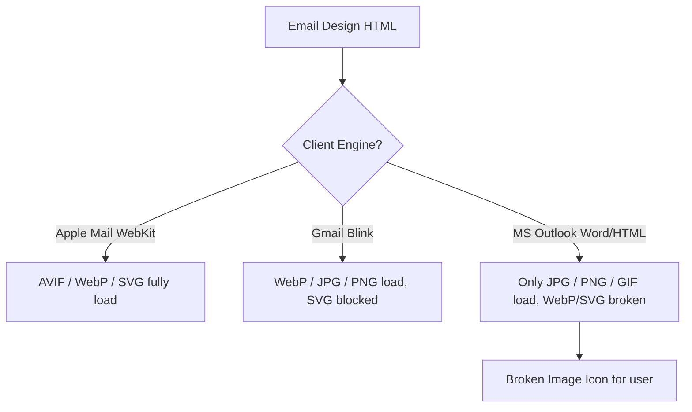

# Best Image Format for Email: Deliverability & Design Guide

Designing responsive email newsletters that look beautiful on every screen requires navigating the complex world of email client rendering engines. Unlike web browsers, which support modern next-generation formats, email clients (like Outlook, Gmail, Apple Mail, and Yahoo Mail) use a wide variety of legacy rendering engines.

If you use next-gen formats (like WebP or AVIF) or vector files (like SVG) in your emails, your designs will appear broken to many subscribers. To ensure your images load correctly for all readers, you must stick to universally supported formats and optimize their dimensions and file sizes.

This guide analyzes the best image format for email newsletters, explains client compatibility limitations, details high-DPI sizing techniques, and provides step-by-step export settings.

---

## Technical Comparison: PNG vs. JPG for Email Campaigns

For static email layouts, designers rely almost exclusively on **PNG** and **JPG**. Here is how they compare in the context of email client rendering:

| Feature | JPG / JPEG (Joint Photographic Experts Group) | PNG (Portable Network Graphics) |
| :--- | :--- | :--- |
| **Best Use Case** | Photographic banners, product photos | Logos, icons, text-heavy graphics |
| **Compression Mode**| Lossy (Reduces file size) | Lossless (Preserves detail) |
| **Outlook Support** | **100% (Universal)** | **100% (Universal)** |
| **Gmail Support** | **100% (Universal)** | **100% (Universal)** |
| **Transparency (Alpha)** | No | **Yes (8-bit alpha channel)** |
| **High-DPI Scaling** | Needs 2x export scaling | Needs 2x export scaling |

---

## Email Client Rendering Barriers (The Legacy Engine Trap)

The primary challenge in email design is that email clients do not update their rendering engines at the same rate as web browsers:



*   **Outlook's Rendering Engine:** Microsoft Outlook on Windows uses the Word rendering engine instead of a modern browser engine. Word does not support WebP, AVIF, or SVG. If your email contains a WebP image, Outlook users will see a broken link icon.
*   **SVG Security Blocks:** While SVG is a vector format ideal for logos, most Email Service Providers (ESPs) and clients block SVGs because they can contain embedded JavaScript, which poses a security risk.
*   **The Safe Standard:** **JPEG and PNG are the only two static formats supported by 100% of email clients.**

---

## Designing for High-DPI (Retina) Displays

Modern mobile devices and laptops use high-DPI (Retina) screens that display twice as many pixels per inch as older monitors. If you export your images at their exact layout dimensions, they will look blurry on these screens.

To ensure your images look crisp, use **2x export scaling**:
1.  **Define Layout Width:** The standard width for email columns is **600 pixels**.
2.  **Export at Double Size:** Export your image at a width of **1200 pixels**.
3.  **Define Dimensions in HTML:** Use HTML attributes to force the browser to render the 1200px image within a 600px wide space:
    ```html
    
    ```
    This ensures that high-DPI screens have enough pixel data to render the image sharply, while standard screens scale it down automatically.

---

## Optimizing for Deliverability and Inbox Placement

Large image files do more than just slow down load times; they can also trigger spam filters and hurt your deliverability:

*   **Attachment Flags:** If your email contains heavy images, some clients (like Gmail) will clip the message, hiding your call-to-action buttons, or flag the email as containing suspicious attachments.
*   **The Weight Limit:** Keep the total size of all images in a single email template **under 1 MB**. Individual banners should be kept **under 200 KB** whenever possible. Use our [Image Compressor](/tools/image-compressor) to reduce file sizes locally before uploading them to your ESP.

---

## Step-by-Step Export Checklist for Emails

Before sending your newsletter campaign, run your assets through this checklist:

*   **Format:** Use **sRGB JPG** for photos and banners. Use **sRGB PNG** for logos and icons requiring transparent backgrounds.
*   **Resolution:** Export assets at **exactly 2x** their intended display width (e.g., export at 1200px width for a 600px wide layout).
*   **Width Attributes:** Always declare the layout width using the HTML `width="..."` attribute to prevent Outlook from rendering the image at its raw 2x size.
*   **Alt Text:** Include descriptive `alt="..."` attributes for every image, as many email clients block images by default.

---


---

## Retina Screen Display Rendering Math for HTML Emails

To understand why 2x scaling is required, we must analyze how browsers handle pixels:
*   **CSS Pixels vs. Physical Pixels:** High-DPI screens use a device pixel ratio (DPR) of 2 or 3, meaning a layout defined as 600px wide actually contains 1200 or 1800 physical pixels on the screen.
*   **The Blurry Output:** If you serve a standard 600px width image, the device stretches the pixels to fill the physical grid, resulting in blurry text and soft details.
*   **The 2x Solution:** Serving a 1200px image and scaling it down in HTML matches the physical pixel grid, ensuring crisp text and sharp details.

---

## Spam Filter Rules Based on Image-to-Text Ratios

Spam filters analyze the balance of images and text in HTML email templates:
*   **The Spam Trigger:** Spammers historically sent emails containing only a single large image to bypass text scanners. As a result, spam filters flag emails that contain high image weight but little to no HTML text.
*   **The Golden Ratio:** Maintain a ratio of at least **60% text to 40% images**. Always write actual HTML text for headings and descriptions instead of placing text inside image banners. This improves deliverability, ensures accessibility for screen readers, and keeps emails readable if images are blocked.


---

## Email Client DPI Rendering Quirks & Outlook Scales

On Windows systems, Microsoft Outlook uses the system's Display Settings (DPI scale) to render HTML emails:
*   **The Layout Shift:** If a subscriber's display scale is set to **120%** or **150%**, Outlook will automatically scale up the pixel widths declared in your HTML code.
*   **The Blurry Fix:** If you do not declare the width using the HTML `width="..."` attribute (and instead rely solely on CSS width styles), Outlook will scale the image disproportionately, causing the layout to warp. Always define the width using the HTML `width="..."` attribute to ensure the layout renders correctly on high-DPI screens.


---

## W3C Email Inline CSS Constraints & Image Borders

To prevent email clients from adding unwanted borders or margins around your images, you must define styles carefully:
*   **Outlook's Border Bug:** Microsoft Outlook on Windows automatically adds a thin border around image tags unless they are explicitly zeroed out.
*   **The Solution:** Always include inline styles like `border: 0; display: block; outline: none;` directly on your image tags. This forces the rendering engine to hide unwanted gaps and borders, ensuring a seamless visual layout across all email clients. Additionally, wrapping your images in table cells (`<td>`) with explicit font sizes and line heights (e.g. `font-size: 0; line-height: 0;`) prevents Outlook from injecting vertical padding gaps below the banner graphics.

## Frequently Asked Questions About Email Image Formats

### What is the best image format for email newsletters?
The best formats are **sRGB JPG** for photographic banners and **sRGB PNG** for logos and icons. These are the only static formats supported by 100% of email clients.

### Can I use WebP images in emails?
No. While WebP is ideal for web pages, it is not supported by Microsoft Outlook and several older email clients. Using WebP will result in broken images for many subscribers.

### Can I use SVG files for email logos?
No. Most email clients (including Gmail and Outlook) block SVG files entirely because they can contain embedded XML scripts, which pose a security risk. Use transparent PNG files instead.

### What is the standard width for email newsletters?
The standard layout width is **600 pixels**. To ensure your images render crisply on high-DPI (Retina) screens, export your assets at **1200 pixels** width and define the layout size using HTML width attributes.

### How do I prevent email clipping in Gmail?
Gmail clips emails that have a total file size (HTML code and inline styles) exceeding **102 KB**. Additionally, large image files can trigger clipping alerts. Keep your HTML clean and compress your images to keep file sizes low.

### How can I compress my email banners securely?
To compress your email banners without exposing client assets to external databases, use our free, browser-based [Image Compressor](/tools/image-compressor). The tool runs locally in your browser, keeping your files private and secure.