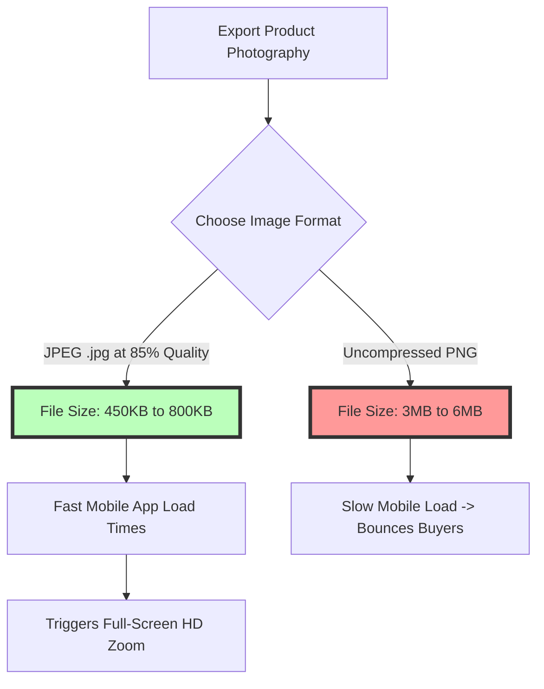
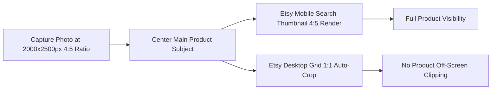

# Best Image Format for Etsy Listing Photos: 2000px & 4:5 Ratio Guide

Selling handmade crafts, vintage goods, and digital items on Etsy requires high-quality product photography. Because Etsy is a visual marketplace driven by aesthetic discovery, compelling listing photos directly influence search rank in Etsy's search engine (Etsy Search), social media sharing on Pinterest and Instagram, and buyer conversion rates.

Etsy enforces specific technical recommendations for listing photos. Photos uploaded below recommended resolution thresholds look blurry on high-DPI Retina screens, while uncompressed files slow down mobile app rendering and increase page load times.

This guide analyzes Etsy's official photo specifications, compares JPEG vs. PNG performance, details the $2000\text{px}$ resolution requirement, explains 4:5 and 1:1 thumbnail cropping behavior, and demonstrates how to compress listing photos to under 1MB for fast loading speeds.

---

## Master Specification Matrix: Etsy Listing Photo Requirements

To ensure your product listing displays sharply across desktop and mobile devices, follow these official Etsy specifications:

| Parameter | Primary Listing Photo | Secondary Listing Photos | Digital Download Items |
| :--- | :--- | :--- | :--- |
| **Recommended Format** | **JPEG (.jpg / .jpeg)** | **JPEG (.jpg) or PNG (.png)** | **PDF / PNG / ZIP Container** |
| **Optimal Resolution** | **$2000 \text{px}$ shortest side** | $2000 \text{px}$ shortest side | High-res vector or 300 DPI |
| **Aspect Ratio** | **4:5 Ratio or 1:1 Square** | 4:5 Ratio or 1:1 Square | N/A |
| **Optimal File Size** | **Under 1 MB (Fast Loading)** | Under 1 MB (Fast Loading) | Platform upload max |
| **Color Profile Space** | **sRGB Color Profile** | **sRGB Color Profile** | sRGB or CMYK (Printables) |
| **Max Listing Photos** | **10 Photos per Listing** | 10 Photos per Listing | 5 Digital Files |
| **Lighting Style** | Natural / Softbox Ambient | Lifestyle / Detail Closeup | Digital Mockup Framing |

---

## Why JPEG is the Best Format for Etsy Sellers

While Etsy accepts JPEG, PNG, and GIF files, **JPEG (.jpg)** is the strongly recommended format for physical product listings:



### Key Advantages of JPEG for Etsy:
1.  **Fast Loading Under 1MB:** Etsy recommends keeping listing photos under **1 MB** to ensure rapid page load speeds. A high-resolution $2000\times2500$ pixel JPEG compressed at 85% quality stays well under 1MB, whereas an equivalent PNG can exceed 4MB.
2.  **sRGB Color Accuracy:** Craft products (such as jewelry, ceramics, apparel, and woodworking) require accurate color representation. JPEG files reliably embed **sRGB color profile metadata**, ensuring buyers see the exact fabric or gemstone shade on their screens.
3.  **High-DPI Zoom Support:** High-resolution JPEGs enable Etsy's full-screen zoom tool without slowing down gallery scrolling.

---

## Aspect Ratio Guidelines: 4:5 Ratio vs. 1:1 Square Cropping

Etsy uses different aspect ratios across its desktop marketplace, mobile app, and search thumbnail grids:



### 1. The 4:5 Portrait Ratio ($2000\times2500$ pixels)
*   **Why it works:** The 4:5 portrait ratio occupies more vertical screen real estate on mobile devices as buyers scroll through Etsy feed recommendations.
*   **Optimal Framing:** Keep the primary product centered in the middle 80% of the frame to prevent critical details from being clipped when Etsy auto-crops thumbnails to 1:1 squares on desktop search grids.

### 2. The 1:1 Square Ratio ($2000\times2000$ pixels)
*   **Why it works:** Square photos map 1-to-1 with Etsy desktop search grids and Instagram post feeds, making cross-platform promotional sharing easier.

---

## Color Management: Fixing Washed-Out Colors (sRGB Conversion)

A frequent complaint among handmade jewelry and apparel sellers is that their product photos look vibrant on their computer but appear dull or washed-out once uploaded to Etsy:

*   **The Cause:** Professional cameras often capture raw files in the **Adobe RGB** or **Display P3** color space.
*   **The Result:** When Etsy's server converts uploaded files for mobile app delivery, non-sRGB color metadata is stripped, shifting saturated colors toward muted, desaturated tones.
*   **The Solution:** Always convert your product photos to the **sRGB color profile** before uploading to Etsy.

---

## Optimizing Secondary Photo Slots (Maximizing 10 Photo Slots)

Etsy allows up to **10 photos per listing**. Successful Etsy sellers take advantage of all 10 slots to address buyer questions and reduce return rates:

```
[Slot 1: Hero Cover Photo] ----> 4:5 Portrait on Clean / Styled Background
[Slot 2: Angle Variant 1]  ----> Side view or back details
[Slot 3: Lifestyle Context]----> Product in real-world use environment
[Slot 4: Close-Up Texture] ----> Macro detail shot of stitching / material
[Slot 5: Scale Reference]  ----> Product placed next to common items
[Slot 6: Size Infographic] ----> Diagram showing dimensions in inches & cm
[Slot 7: Packaging Shot]   ----> Gift box or branded wrapping presentation
[Slot 8-10: Variations]    ----> Color variants / personalization options
```

---

## Step-by-Step Optimization Workflow for Etsy Sellers

Follow this workflow to prepare your product photography for Etsy:

1.  **Shoot Under Soft Lighting:** Capture photos under natural indirect sunlight or softbox studio lights to avoid harsh glare.
2.  **Crop to 4:5 or 1:1:** Crop your canvas to $2000\times2500$ pixels (4:5 ratio) or $2000\times2000$ pixels (1:1 ratio), ensuring the subject is centered.
3.  **Convert Color Space to sRGB:** Verify that the file is tagged with the **sRGB color profile**.
4.  **Compress Under 1MB:** Use our free, on-device [Image Compressor](/tools/image-compressor) to shrink your JPEGs to under **800KB** at 85% quality.

---

## Etsy Search Algorithm & Computer Vision Relevance

Understanding how **Etsy Search** indexes visual content helps sellers improve rank in search feeds:
*   **Visual Similarity Matching:** Etsy's search engine uses AI visual recognition models to categorize product images based on color palettes, shapes, and product types. Clean 4:5 or 1:1 photos with clear contrast allow visual algorithms to categorize products accurately.
*   **Engagement Signals:** Etsy tracks buyer click-through rates (CTR) on thumbnail grids. Clear, high-contrast cover photos drive higher CTRs, which boosts the listing's organic search rank for target keyword queries.

---

## Social Media & Pinterest Rich Pin Integration

Over 30% of Etsy listing traffic originates from off-site social referrals (specifically Pinterest and Instagram):
*   **Pinterest 2:3 & 4:5 Aspect Ratios:** Pinterest favors vertical 4:5 and 2:3 aspect ratio images. Using a 4:5 portrait ratio ($2000\times2500$ pixels) for your primary Etsy photo ensures it looks great when pinned to Pinterest.
*   **Rich Pin Metadata:** Ensure your Etsy product listing title, price, and availability are synced to Pinterest Rich Pins by preserving clean EXIF and Open Graph image tags.

---

## Step-by-Step Etsy Listing Image Checklist

Before publishing your Etsy listing, run your photos through this checklist:

*   **Resolution:** Verify that the shortest side is at least **$2000\text{px}$**.
*   **File Size:** Keep file size **under 1 MB** per photo for fast mobile page loading.
*   **Centering:** Keep the product centered to prevent cropping in search thumbnails.
*   **Color Profile:** Convert all files to the **sRGB color space profile**.
*   **Format:** Export product photos as **JPEG (.jpg)** files compressed at **80-85% quality**.

---

## Frequently Asked Questions

### What is the best image format for Etsy listing photos?
The best format is **JPEG (.jpg / .jpeg)**. JPEG provides fast loading speeds, compact file sizes under 1MB, and reliable sRGB color rendition across desktop browsers and the Etsy mobile app.

### What are the recommended image dimensions for Etsy?
Etsy recommends a minimum resolution of **2000 pixels on the shortest side**. Ideal dimensions are **$2000\times2500$ pixels** (4:5 portrait ratio) or **$2000\times2000$ pixels** (1:1 square ratio).

### Why do my product photos look blurry on Etsy?
Photos look blurry when uploaded below the $2000\text{px}$ resolution threshold or when heavily compressed by mobile messaging apps. Uploading $2000\text{px}$ JPEGs compressed at 85% quality ensures sharp visual results on high-DPI Retina screens.

### What file size should my Etsy listing photos be?
Keep your Etsy listing photos **under 1 MB** (ideally between 400KB and 800KB). Keeping file sizes under 1MB ensures fast mobile page load speeds, improving shopper experience and conversion rates.

### Should I use PNG or JPEG for Etsy photos?
Use **JPEG** for physical product photos. PNG files produce unnecessarily large file sizes (often 3MB to 6MB) that slow down mobile page loading. Use PNG only for digital download graphics requiring transparent elements.

### How can I compress my Etsy listing photos securely?
To compress your $2000\text{px}$ Etsy photos without exposing images to third-party cloud databases, use our free, browser-based [Image Compressor](/tools/image-compressor). The tool runs locally in your browser, keeping your files private and secure.
