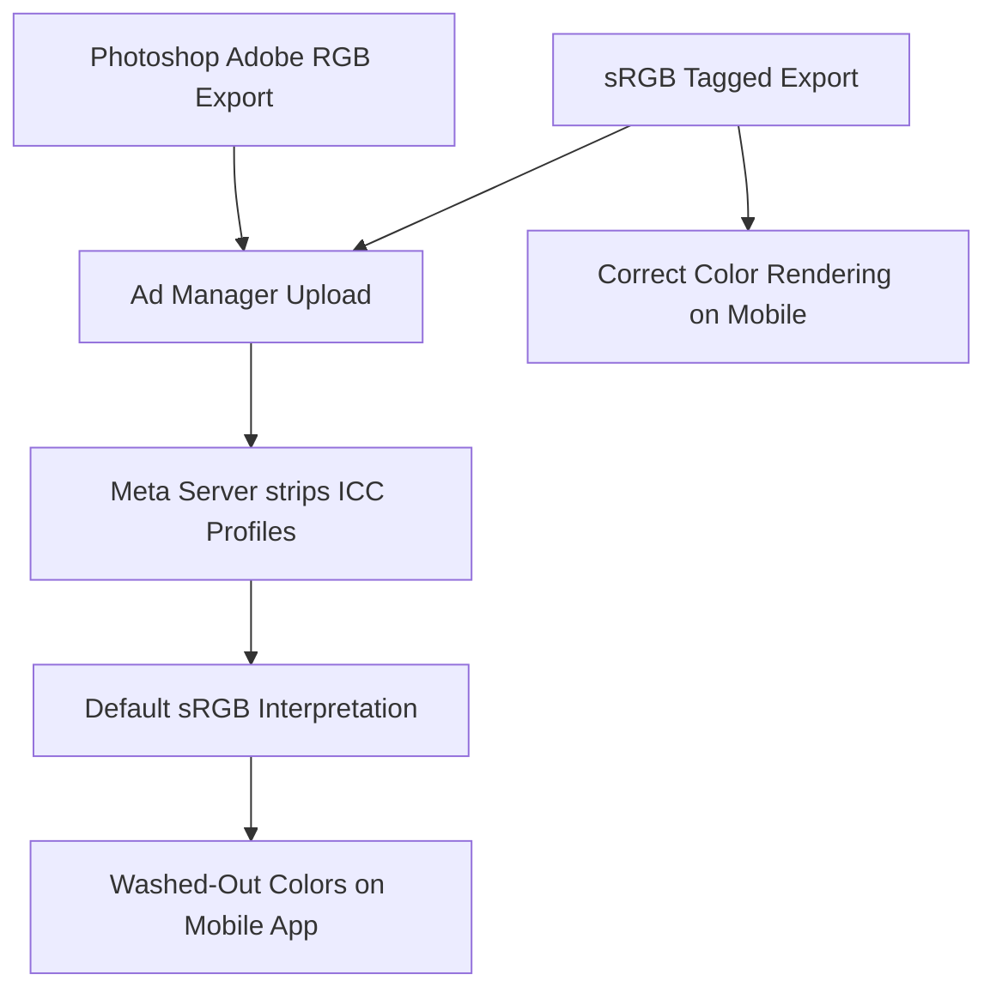

# Best Image Format for Facebook Ads: Complete Optimization Guide

With billions of active users, Facebook remains one of the most powerful advertising platforms in the world. However, to maximize the return on your ad spend, you need to optimize every detail of your campaigns, including the technical settings of your ad creatives.

When you upload an image to Facebook Ads Manager, Meta's servers process it through an automated image pipeline designed to reduce file sizes and standardise colors. If your image is saved in the wrong format, has incorrect dimensions, or lacks the proper color tagging, it will suffer from compression artifacts, blurry text, or shifted colors on mobile devices.

This guide analyzes the best image format for Facebook Ads, details how the platform handles color profiles, outlines resolution requirements, and provides step-by-step export settings.

---

## Technical Comparison: PNG vs. JPG for Facebook Ads

For static Facebook Ads, developers and designers typically choose between **PNG** and **JPG**. Here is how they compare in the context of Meta's advertising platform:

| Feature | JPG / JPEG (Joint Photographic Experts Group) | PNG (Portable Network Graphics) |
| :--- | :--- | :--- |
| **Best Use Case** | Photographic ads, continuous gradients | Text-heavy ads, logos, illustrations |
| **Compression Mode**| Lossy (Reduces file size) | Lossless (Preserves detail) |
| **Color Space Tag** | **Must be sRGB** | **Must be sRGB** |
| **Upload File Size** | Under 8MB (Ideal: < 1MB) | Under 30MB (Ideal: < 2MB) |
| **Text Rendering** | Moderate (Ringing noise around letters) | **Sharp (Clean vectors/raster text)** |
| **Meta Compression**| Re-compressed using platform tables | Converted to JPG/WebP internally |

---

## Preventing Mobile Color Shifts (The sRGB Standard)

A common issue with Facebook ads is that colors look vibrant on desktop monitors during design, but appear washed out, overly saturated, or shifted when viewed on the mobile app.

This happens because Meta's servers strip custom embedded color profiles (such as Adobe RGB or Display P3) during upload:

To maintain color accuracy, always set your export settings to the **sRGB color space** profile. Converting your files to sRGB before uploading ensures they render correctly on both Android and iOS devices, preventing any chromatic deviations or mismatched saturation values that could lead to poor user trust or reduced click-through rates. sRGB is the universal consensus standard for digital screens.

---

## Optimal Facebook Ad Resolutions and Dimensions

Facebook Ads Manager supports several ad formats, each with distinct layout dimensions:

### 1. Single Feed Ads (1:1 Ratio)
*   **Optimal Resolution:** $1080\times1080$ pixels
*   **Use Case:** Single-image feed ads. This square format occupies significant vertical space as users scroll, making it highly effective for capturing attention.

### 2. Link Share Ads (1.91:1 Ratio)
*   **Optimal Resolution:** $1200\times628$ pixels
*   **Use Case:** Link share posts and sidebar ads. Use this widescreen layout when driving traffic to external landing pages or articles.

### 3. Carousel Ads (1:1 Ratio)
*   **Optimal Resolution:** $1080\times1080$ pixels
*   **Use Case:** Multiple scrollable images in a single ad unit. Ensure all slides have matching dimensions and layouts to maintain consistency.

### 4. Collection Ads (1:1 Ratio)
*   **Optimal Resolution:** $1080\times1080$ pixels
*   **Use Case:** Widescreen hero video or image displayed above a grid of small product photos. This format is ideal for e-commerce stores.

---

## Text-Heavy Creatives and the "20% Text" Rule

Although Meta has retired the strict "20% text rule" (which rejected ads containing more than 20% text in the image), the platform's compression engine still struggles with text-heavy graphics:

*   **JPEG Ringing Noise:** Because JPEG uses frequency-based lossy compression, it creates fuzzy noise (ringing artifacts) around sharp edges like text.
*   **The PNG Advantage:** To keep text readable and sharp, save graphic designs as **24-bit PNGs**. PNG's lossless compression preserves clean edges. When Meta's servers convert the PNG to JPG, the output remains significantly sharper than if you uploaded a pre-compressed JPG.

---

## Step-by-Step Export Checklist for Facebook Ads

Before launching your campaigns, run your ad creatives through this checklist:

*   **Format:** Export photographic assets as **high-quality JPG** (quality 85-90%). Export graphic layouts with text or logos as **24-bit PNG**.
*   **Color Profile:** Convert and tag your file with the **sRGB color space** profile. Do not use Adobe RGB, ProPhoto, or Display P3.
*   **Width Resolution:** Set the width to exactly **1080 pixels** for square ads or **1200 pixels** for link share ads.
*   **File Size Limit:** Keep the final file size **under 1.6 MB** to prevent Meta's servers from applying aggressive compression. If your file is too large, use our [Image Compressor](/tools/image-compressor) to reduce the size locally before uploading.

---

---

## Quantifying Color Shift Issues (Gamut Mapping Formulas)

The shifting of colors on Facebook mobile screens is a direct result of **Gamut Mapping**. When Meta's servers strip custom ICC profiles, they default the color interpolation to sRGB, which has a narrower color gamut compared to Adobe RGB. 
If your file uses Adobe RGB coordinates, the browser maps the wider color coordinates to the nearest sRGB values. Because green and cyan channels suffer the largest coordinates shifts, the mapped output looks dull and desaturated. Converting to sRGB before upload ensures that the color coordinates fit within the standard sRGB gamut, avoiding washed-out colors.

---

## Facebook Instant Experiences (IX) Speed Benchmarks

Facebook **Instant Experiences (IX)** (formerly Canvas Ads) load full-screen landing pages directly inside the Facebook mobile app. 
*   **Speed is Key:** Meta's servers require Instant Experience assets to load instantly to prevent users from closing the app. 
*   **Optimization:** While the platform handles caching, you should compress background images to under **200 KB** using WebP/JPG settings. Keeping asset weight low ensures the interactive components render smoothly, maximizing conversion rates on budget mobile connections.

---

## Facebook Carousel Pixel Limits & Aspect Ratio Alignment

When deploying multiple slides in a Carousel ad, maintaining consistent dimensions is key:
*   **The Ingestion Limit:** Facebook Ads Manager requires all images in a Carousel ad unit to have matching aspect ratios. If you upload a mix of $1080	imes1080$ pixel (1:1) and $1080	imes1350$ pixel (4:5) assets, the system will automatically crop or pad the mismatched slides.
*   **The Fix:** Always export Carousel slides using the exact same dimensions ($1080	imes1080$ pixels) and the sRGB color profile to prevent visual inconsistency and layout shifts between slides.

---

## Facebook Ad Ingestion Pipelines & API Upload Limits

For agencies utilizing Facebook Ads API, marketing automation scripts, or bulk upload tools, file size management is critical:
*   **The API Cap:** While the Ads Manager web portal allows file uploads up to **30 MB**, the Graph API enforces strict connection timeout limits for raw payload streams. Uploading uncompressed or bloated files via automated API scripts causes socket timeouts and batch campaign failures.
*   **The Best Practice:** Always downscale dimensions and compress files to under **2 MB** before triggering API uploads. This prevents connection timeouts and ensures batch campaigns launch without formatting errors. Using local client-side compressor tools in your automation pipeline ensures smooth uploads and consistent ad deliveries. Additionally, this preprocessing prevents unexpected API error codes (such as error 100 subcode 33) which are triggered when Meta's ingestion endpoints reject oversized payloads.

## Frequently Asked Questions About Facebook Ads Formats

### What is the best image format for Facebook Ads?
The best format is **sRGB JPG** for photos and **sRGB PNG** for graphic designs with text. JPG keeps photographic files lightweight, while PNG keeps text and vector shapes sharp during upload.

### Why do my ad colors look washed out on Facebook?
This happens when you export your images using the **Adobe RGB** or **Display P3** color profiles. Meta's servers strip these profiles and convert the colors to sRGB. To maintain color accuracy, always convert your file to **sRGB** before exporting.

### What is the ideal file size for Facebook Ads?
Keep your file size **under 1.6 MB**. Files larger than 1.6 MB are compressed aggressively by Meta's servers, which can make the image look blurry.

### Does Facebook support WebP or SVG uploads for ads?
No. Facebook's ad manager does not accept modern formats like WebP or SVG. You must upload your assets as standard JPEGs or PNGs.

### What is the best resolution for Facebook Carousel ads?
The optimal resolution for Carousel ads is **$1080\times1080$ pixels** (1:1 aspect ratio) per image. Keep dimensions consistent across all slides in the carousel.

### How can I optimize my ad images securely?
To compress your ad files without exposing client assets to external databases, use our free, browser-based [Image Compressor](/tools/image-compressor). The tool runs locally in your browser, keeping your assets secure and private.
