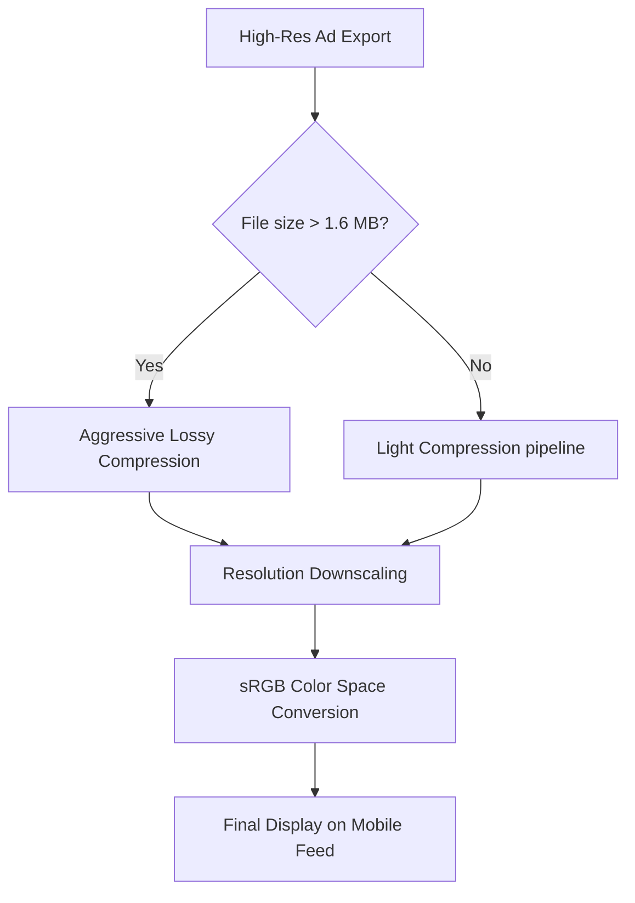

# Best Image Format for Instagram Ads: Complete Performance Guide

Running high-converting advertising campaigns on Instagram requires more than just eye-catching visuals and persuasive ad copy. Behind every successful Instagram ad is a technical optimization process that ensures your images render crisply, load instantly, and maintain their intended colors on mobile devices.

When you upload an ad image, Instagram's automated system processes it through a strict compression engine. If your image is not saved in the optimal format, at the correct dimensions, and using the correct color settings, it will suffer from compression blur, fuzzy text (ringing artifacts), or shifted colors.

This guide analyzes the best image format for Instagram Ads, explains how the platform's compression engine works, outlines aspect ratio configurations, and provides step-by-step export settings.

---

## Technical Comparison: PNG vs. JPG for Instagram Ads

For static ad layouts, advertisers generally choose between **PNG** and **JPG**. Here is how they compare in the context of Instagram's ad system:

| Feature | JPG / JPEG (Joint Photographic Experts Group) | PNG (Portable Network Graphics) |
| :--- | :--- | :--- |
| **Best Use Case** | Photographic ads, continuous gradients | Text-heavy ads, logos, illustrations |
| **Compression Mode**| Lossy (Reduces file size) | Lossless (Preserves detail) |
| **Color Space Tag** | **Must be sRGB** | **Must be sRGB** |
| **Upload File Size** | Under 8MB (Ideal: < 1MB) | Under 30MB (Ideal: < 2MB) |
| **Text Rendering** | Moderate (Ringing noise around letters) | **Sharp (Clean vectors/raster text)** |
| **Instagram Compression**| Re-compressed using platform tables | Converted to JPG/WebP internally |

---

## How Instagram's Compression Engine Works

To save bandwidth and speed up scrolling for millions of mobile users, Instagram compresses all uploaded media files using its own compression algorithms. 

When you submit an image, the platform applies a multi-step processing pipeline:
1.  **File Size Check:** If your file size exceeds **1.6 MB**, Instagram applies aggressive lossy compression to reduce the file footprint.
2.  **Resolution Adjustment:** If the width exceeds **1080 pixels**, Instagram downscales the image width to 1080px while maintaining the aspect ratio.
3.  **Color Space Check:** Instagram strips embedded custom color profiles (like Adobe RGB or Display P3) and converts the colors to **sRGB**. If your image was exported using Adobe RGB, this conversion makes the colors look washed out or shifted on mobile screens.

---

## Optimal Instagram Ad Aspect Ratios and Dimensions

Instagram supports several ad formats, each with distinct layout dimensions:

### 1. Square Feed Ads (1:1 Ratio)
*   **Optimal Resolution:** $1080\times1080$ pixels
*   **Use Case:** Single-image carousel ads in the main feed. This is the most versatile ad layout.

### 2. Vertical Feed Ads (4:5 Ratio)
*   **Optimal Resolution:** $1080\times1350$ pixels
*   **Use Case:** Single-image feed ads. This format occupies more vertical screen space as users scroll, making it highly effective for capturing attention.

### 3. Stories & Reels Ads (9:16 Ratio)
*   **Optimal Resolution:** $1080\times1920$ pixels
*   **Use Case:** Full-screen immersive ads on Instagram Stories and Reels. Keep key text and logos within a "safe zone" (14% from the top and bottom) to prevent them from being covered by user interface overlays.

---

## Preventing Double-Compression and Blurry Text

A common problem with text-heavy ads on Instagram is fuzzy noise (ringing artifacts) around the letters. This happens when the image is compressed twice: once during design export, and again by Instagram's servers.

To prevent this issue, use the following export strategy:
*   **For illustrations, graphics with text, and logos:** Export your design as a **24-bit PNG**. PNG uses lossless compression, which keeps the text edges clean. When Instagram converts the PNG to JPG on its servers, the resulting file remains significantly sharper than if you uploaded a pre-compressed JPG.
*   **For high-contrast borders:** Avoid placing thin, red text on solid dark backgrounds, as YUV 4:2:0 subsampling will cause color bleeding and make the text look fuzzy.

---

## Step-by-Step Export Checklist for Instagram Ads

Before launching your campaign, run your ad images through this checklist:

*   **Format:** Export photographic assets as **high-quality JPG** (quality 85-90%). Export graphic layouts with text or logos as **24-bit PNG**.
*   **Color Profile:** Convert and tag your file with the **sRGB color space** profile. Do not use Adobe RGB, ProPhoto, or Display P3.
*   **Width Resolution:** Set the width to exactly **1080 pixels**. Let the height scale to match your target aspect ratio (1080px for 1:1, 1350px for 4:5, 1920px for 9:16).
*   **File Size Limit:** Keep the final file size **under 1.6 MB** to prevent Instagram's servers from applying aggressive compression. If your file is too large, use our [Image Compressor](/tools/image-compressor) to reduce the size locally before uploading.

---

---

## Analyzing Instagram Stories Safe-Zone Boundary Coordinates

When exporting $1080	imes1920$ pixel graphics for Stories or Reels ads, you must strictly account for user interface overlays. Instagram renders the advertiser's profile icon, handle, and sponsored tag at the top of the screen, and the swipe-up call-to-action bar and mute buttons at the bottom. 
*   **The Top Safe Boundary:** Leave at least **250 pixels** ($14%$) of empty visual space at the top of the canvas. Placing text or key subjects here will result in them being covered by your account logo.
*   **The Bottom Safe Boundary:** Leave at least **250 pixels** ($14%$) of empty space at the bottom. This prevents interactive swipe-up links or purchase buttons from covering critical marketing messages.

---

## Instagram Reels Video Ad Cover Image Specifications

For Reels ads, the cover frame is a critical static element that determines whether users stop scrolling. 
*   **The Feed Crop Rule:** While Reels display full-screen at a $9:16$ aspect ratio ($1080	imes1920$ pixels), when they appear in the main user feed, Instagram crops them to a $4:5$ vertical ratio ($1080	imes1350$ pixels).
*   **Action Plan:** Always center the main visual subject and text of your Reels cover image within the middle $1080	imes1350$ pixel box. If you place text at the absolute top or bottom edge of a Reels cover frame, it will be cropped out in the feed view, rendering your ad copy unreadable.

---

## Instagram's Dynamic Frame Rate Overrides & Cover Frames

For advertisers deploying Reels or video ads, managing the static cover frame requires careful timing alignment.
*   **The Render Clock:** Instagram's video ingestion servers parse uploaded MP4 or MOV files and dynamically extract the first frame (or a user-selected frame) to render as the static cover image in grid views. 
*   **The Technical Trap:** If your cover frame has high color contrast or complex details, the platform's compression engine will apply heavy spatial quantization, which can cause color bleeding and make the frame look blurry. To prevent this, ensure your video starts with a clean, high-resolution static graphic frame for at least **0.5 seconds** at the beginning of the video timeline.

---

## Instagram's Content Delivery Network (CDN) & Edge Caching

To ensure ad creatives load instantly, Instagram distributes them across Facebook's edge CDN nodes:
*   **The Cache Hit Benefit:** When you upload optimized files at exactly 1080px width, Instagram stores them in pre-compiled formats at CDN edges close to users.
*   **The Load Time Impact:** Using pre-optimized files reduces server-side latency and ensures your ads load immediately as users scroll, reducing bounce rates and maximizing ad engagement.

## Frequently Asked Questions About Instagram Ads Formats

### What is the best image format for Instagram Ads?
The best format is **sRGB JPG** for photos and **sRGB PNG** for graphic designs with text. JPG keeps photographic files lightweight, while PNG keeps text and vector shapes sharp during upload.

### Why do my ad colors look washed out on Instagram?
This happens when you export your images using the **Adobe RGB** or **Display P3** color profiles. Instagram's servers strip these profiles and convert the colors to sRGB. To maintain color accuracy, always convert your file to **sRGB** before exporting.

### What is the ideal file size for Instagram Ads?
Keep your file size **under 1.6 MB**. Files larger than 1.6 MB are compressed aggressively by Instagram's servers, which can make the image look blurry.

### What are the safe zones for Instagram Stories ads?
For $1080\times1920$ stories ads, keep all critical text, buttons, and logos within a central safe zone. Leave **250 pixels** free at the top (under the profile icon) and **250 pixels** free at the bottom (above the swipe-up call-to-action button).

### Will Instagram support WebP or SVG uploads for ads?
No. Instagram's ad manager does not accept modern formats like WebP or SVG. You must upload your assets as standard JPEGs or PNGs.

### How can I optimize my ad images securely?
To compress your ad files without exposing client assets to external databases, use our free, browser-based [Image Compressor](/tools/image-compressor). The tool runs locally in your browser, keeping your assets secure and private.
