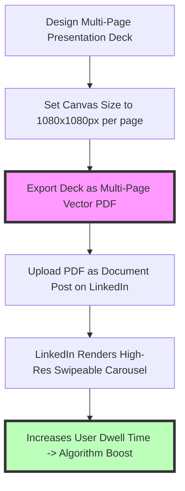
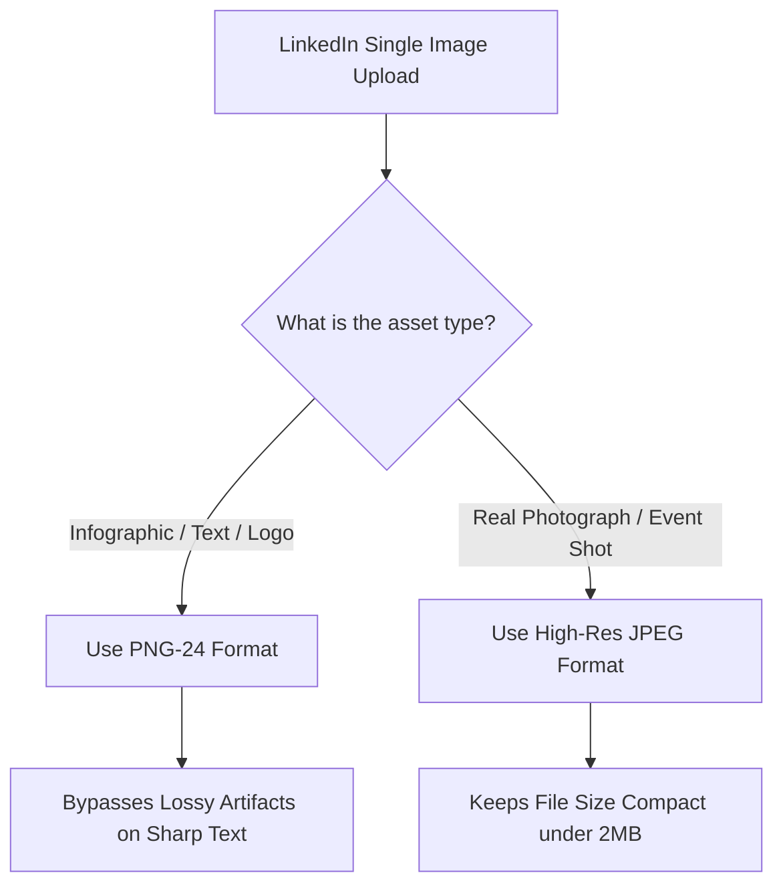

# Best Image Format for LinkedIn Posts: Carousels, Banners & Photos

LinkedIn is the leading professional networking platform for B2B marketing, personal branding, corporate recruiting, and thought leadership. In LinkedIn's algorithm (which prioritizes visual engagement and dwell time), posts with high-quality visual media generate **2x higher engagement** and **5x higher comment rates** compared to text-only updates.

However, LinkedIn applies aggressive server-side compression algorithms to uploaded images. Submitting improperly sized graphics, low-resolution profile photos, or uncompressed JPEGs can result in blurry text on infographics, distorted brand banners, and pixelated carousel slides.

This guide analyzes LinkedIn's official image dimensions, evaluates PNG vs. JPEG vs. PDF document carousels, details cover banner and profile avatar specs, and demonstrates how to optimize LinkedIn graphics for crisp rendering across desktop and mobile feeds.

---

## Master Specification Matrix: LinkedIn Media Dimensions

To ensure your professional brand assets display crisp and un-distorted across LinkedIn, follow these official specifications:

| Asset Type / Slot | Recommended Format | Optimal Dimensions | Aspect Ratio | Primary Optimization Rule |
| :--- | :--- | :--- | :--- | :--- |
| **Carousel Posts** | **PDF (.pdf Document)** | **$1080 \times 1080$ pixels** | **1:1 Square** | Multi-page PDF creates swipeable slides |
| **Single Feed Images** | **PNG-24 (.png)** | **$1200 \times 1200$ pixels** | **1:1 or 4:5** | PNG preserves sharp text on infographics |
| **Personal Profile Photo**| **JPEG (.jpg) or PNG** | **$400 \times 400$ pixels** | **1:1 Square** | Centered headshot, clear lighting |
| **Personal Cover Banner** | **PNG (.png)** | **$1584 \times 396$ pixels** | **4:1 Widescreen** | Keep text centered away from profile avatar |
| **Company Page Banner** | **PNG (.png)** | **$1128 \times 191$ pixels** | **5.9:1 Banner** | Crisp vector logo and brand tagline |
| **Shared Link Preview** | **JPEG (.jpg) or PNG** | **$1200 \times 627$ pixels** | **1.91:1 Landscape**| Open Graph `og:image` meta tag setup |

---

## The PDF Document Hack: How to Create LinkedIn Carousel Posts

One of the most effective content formats on LinkedIn is the **Swipeable Carousel Post**. 

While LinkedIn previously allowed native image carousels, it now restricts swipeable multi-card posts to **PDF Document Uploads**:



### Technical Specs for PDF Carousel Decks:
1.  **Canvas Size:** Design each slide at **$1080\times1080$ pixels** (1:1 square ratio) or **$1080\times1350$ pixels** (4:5 portrait ratio).
2.  **Vector PDF Export:** Export the slide deck as a multi-page PDF document. Using vector PDF export ensures that text, typography, and logos remain razor-sharp when rendered in LinkedIn's embedded document viewer.
3.  **Dwell Time Boost:** PDF carousels encourage users to swipe through multiple pages, increasing **dwell time** (time spent on your post). Dwell time is a primary ranking signal in LinkedIn's feed algorithm.

---

## Technical Comparison: PNG vs. JPEG for LinkedIn Feed Posts

Choosing between PNG and JPEG for LinkedIn single-image posts depends on the visual content of the asset:



### 1. Why PNG-24 is Best for Infographics & Quotes
LinkedIn's server-side image engine re-compresses JPEGs heavily. If you upload an infographic or quote graphic containing text as a JPEG, LinkedIn's compression will introduce fuzzy **compression halos** around the letterforms. 

Uploading text-heavy graphics as **24-bit PNGs** (`.png`) bypasses text-degradation filters, keeping typography crisp.

### 2. Why JPEG is Best for Photographs
For real photography (event photos, office team shots, speaking engagements), **JPEG (.jpg)** compressed at **85% to 90% quality** is ideal. A $1200\times1200$ pixel JPEG provides excellent visual clarity while keeping file sizes small.

---

## LinkedIn Cover Banner Layout & Avatar Occlusion Rules

A common mistake on personal and company LinkedIn profiles is placing key text or logos in areas that get covered by the circular profile avatar:

```
+-----------------------------------------------------------------------+
|  PERSONAL BANNER CANVAS: 1584px x 396px                               |
|                                                                       |
|  +--------------+                                                     |
|  | AVATAR AREA  |  <--- KEEP THIS LEFT AREA CLEAR OF TEXT             |
|  | (Overlaps    |       Place Taglines & Logos in the Right 60%       |
|  |  Banner)     |       of the Banner Canvas                          |
|  +--------------+                                                     |
+-----------------------------------------------------------------------+
```

### Banner Design Best Practices:
*   **Personal Banner Canvas:** $1584\times396$ pixels (4:1 ratio).
*   **Company Page Banner Canvas:** $1128\times191$ pixels (5.9:1 ratio).
*   **Safe Zone Rule:** The circular profile avatar overlaps the bottom-left corner of the cover banner. Keep the left 30% of your banner free of text or logos, concentrating key branding and taglines in the right 70% of the canvas.

---

## Step-by-Step Optimization Workflow for LinkedIn Media

Follow this workflow to prepare your graphics for LinkedIn:

1.  **Select Target Canvas Dimensions:**
    *   Carousel Deck: $1080\times1080$ pixels per page (Export as multi-page PDF).
    *   Single Feed Post: $1200\times1200$ pixels (PNG for text, JPEG for photos).
    *   Personal Banner: $1584\times396$ pixels (PNG format).
2.  **Convert Color Space to sRGB:** Ensure all graphics are saved in the **sRGB color profile** to prevent desaturated color shifts.
3.  **Compress Files Locally:** Use our free, client-side [Image Compressor](/tools/image-compressor) to reduce image file sizes before uploading.

---

## Open Graph (`og:image`) Link Preview Meta Tags

When sharing links to external blog posts or websites on LinkedIn, LinkedIn's crawler reads Open Graph HTML meta tags to render link preview cards:
*   **Optimal Preview Resolution:** Set your website's `og:image` meta tag dimension to **$1200\times627$ pixels** (1.91:1 landscape aspect ratio).
*   **Code Implementation:**
    ```html
    <meta property="og:image" content="https://imagetoolstack.com/images/linkedin-preview.png">
    <meta property="og:image:width" content="1200">
    <meta property="og:image:height" content="627">
    ```
*   **Debugging Cache:** Use the official **LinkedIn Post Inspector** tool to clear LinkedIn's 7-day link preview cache when updating thumbnail images.

---

## The Feed Dwell Time Algorithm & PDF Carousel Engagement

LinkedIn's feed algorithm prioritizes posts that generate long **Dwell Time** (the exact time users spend consuming your content):
*   **Why PDF Carousels Outperform Single Images:** A user scrolling past a single image spends an average of 1.5 seconds. In contrast, swiping through a 10-slide PDF carousel deck keeps users engaged on your post for 15 to 30 seconds.
*   **Algorithmic Signal:** High dwell time signals to LinkedIn's AI classifier that your post contains valuable content, causing the algorithm to distribute your post to a wider audience outside your immediate network.

---

## Step-by-Step LinkedIn Image Checklist

Before publishing content to LinkedIn, run your assets through this checklist:

*   **Carousel Format:** Export multi-page slide decks as **PDF documents** ($1080\times1080$ pixels per slide).
*   **Text Sharpening:** Export infographics, text quotes, and logos as **PNG-24** files.
*   **Banner Occlusion:** Ensure personal cover banner text is located in the right 70% of the canvas to avoid avatar overlap.
*   **Color Profile:** Tag all images with the **sRGB color space profile**.

---

## Frequently Asked Questions

### What is the best image format for LinkedIn posts?
The best format for single feed images is **PNG-24** for infographics and text graphics, and **JPEG** for photographs. For multi-slide carousel posts, the best format is a **multi-page PDF document**. Uploading multi-page PDF files renders high-resolution swipeable cards on mobile feeds, increasing user dwell time and signaling post relevance to LinkedIn's feed algorithm.

### How do I create a swipeable carousel post on LinkedIn?
To create a swipeable carousel post on LinkedIn, design your slides at $1080\times1080$ pixels (1:1 square ratio), export the presentation deck as a **multi-page PDF file**, and upload the PDF as a document post.

### What are the required dimensions for LinkedIn personal banners?
The optimal dimensions for a LinkedIn personal cover banner are **$1584\times396$ pixels** (4:1 aspect ratio). For company pages, the recommended banner size is **$1128\times191$ pixels**.

### Why do infographics look blurry on LinkedIn feeds?
Infographics look blurry when uploaded as JPEGs because LinkedIn's server applies lossy JPEG compression, creating fuzzy artifacts around text. Uploading infographics as **PNG-24** files preserves sharp typography.

### What is the recommended size for LinkedIn profile photos?
The recommended size for a LinkedIn profile photo is **$400\times400$ pixels** (1:1 square aspect ratio). Center your headshot so that your face fills 60% of the circular crop area, and save the file in **PNG or high-res JPEG** format to prevent pixelation on high-DPI Retina screens.

### How can I compress LinkedIn graphics without losing quality?
To compress your LinkedIn graphics and banners without exposing files to external cloud databases, use our free, browser-based [Image Compressor](/tools/image-compressor). The tool runs locally in your browser, keeping your files private and secure.
