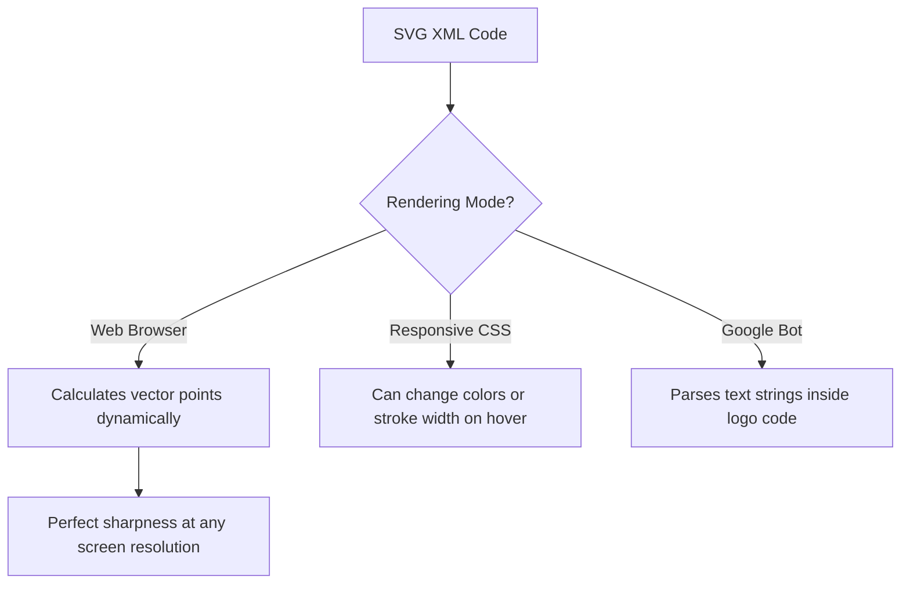

# Best Image Format for Logos: Web & Print Optimization Guide

A logo is the foundation of a brand's visual identity. It represents the brand across various platforms, from small website icons (favicons) to massive billboards and print marketing materials. 

To maintain the quality of your logo, you must choose the correct file formats for both digital and print delivery. Using the wrong format can cause your logo to look blurry, distorted, or have incorrect colors.

This guide analyzes the best image formats for logos, compares SVG and PNG, details print publishing options, and explains how to optimize logos to prevent layout shifts.

---

## Technical Comparison: SVG vs. PNG for Logo Integration

For digital design and web layouts, developers and designers typically choose between **SVG** and **PNG**:

| Feature | SVG (Scalable Vector Graphics) | PNG (Portable Network Graphics) |
| :--- | :--- | :--- |
| **Asset Class** | **Vector (XML Coordinates)** | Raster (Pixel Grid) |
| **Scalability** | **Infinite (Never pixelates)** | Fixed (Lossy when enlarged) |
| **Transparency (Alpha)**| **Yes (Path transparency)** | **Yes (8-bit alpha channel)** |
| **Web Vitals Impact** | Extremely Low (Loads instantly) | Moderate (Higher byte weight) |
| **DPI Constraints** | None (Resolution-independent) | Needs 300 DPI for print layouts |
| **Editable Code** | **Yes (Stylable with CSS)** | No (Static binary file) |

---

## The Undisputed Web Standard: SVG Vectors

For website headers, footers, and app interfaces, **SVG (Scalable Vector Graphics)** is the best choice for logos.



*   **XML Structure:** SVG files are written in XML code that defines points, lines, curves, and shapes mathematically. This allows the browser to calculate and render the shapes dynamically at any size, ensuring perfect sharpness on standard and high-DPI (Retina) screens.
*   **Infinite Scalability:** Unlike raster images (which stretch and pixelate when enlarged), SVG files scale infinitely without losing quality.
*   **CSS Styling:** Because SVGs are part of the web document code, developers can style them using CSS (e.g. changing color on hover or applying transitions) and animate them using JavaScript.
*   **SEO Advantage:** Search engine crawlers can read the XML code inside SVG files. Any text strings embedded in the logo shape are searchable, giving SVG a minor SEO benefit over raster files.

---

## The Raster Standard: Transparent PNG Fallback

While SVG is ideal for web layouts, some systems (like older email clients or specific catalog portals) do not support SVG. In these cases, **PNG (Portable Network Graphics)** is the preferred raster fallback:

*   **Lossless Compression:** PNG uses DEFLATE lossless compression, which preserves details and color boundaries. This prevents the fuzzy noise (ringing artifacts) common in JPG compression.
*   **Alpha Transparency:** PNG supports standard 8-bit transparency, allowing logos to render cleanly over dark, light, or patterned backgrounds without solid borders.
*   **sRGB Standard:** To ensure colors display correctly on all devices, always export web-ready PNGs using the sRGB color profile.

---

## Print Formats: Vector PDF, EPS, and High-Res TIFF

Digital web formats (sRGB, SVG, PNG) are not suitable for physical printing presses, which require different color systems:

*   **Vector PDF (Portable Document Format):** The modern industry standard for print layouts. It preserves vector coordinates and supports CMYK color profiles, which are required by professional printing presses.
*   **EPS (Encapsulated PostScript):** A legacy vector format used by professional publishers. While still common in branding packages, it has largely been replaced by PDF.
*   **TIFF (Tagged Image File Format):** If a raster format is required for printing (e.g., placing the logo onto a photograph), use a high-resolution TIFF file saved at **300 DPI** using the **CMYK color profile**. This preserves color accuracy and detail for physical prints.

---

## Core Web Vitals & Logo Layout Optimization

Using a logo file without declaring its size can cause **Cumulative Layout Shift (CLS)**, a metric that measures layout stability as a page loads.

To prevent layout shifts and keep LCP (Largest Contentful Paint) times low, follow these guidelines:
1.  **Declare Dimensions:** Always define the `width` and `height` attributes directly on the image element:
    ```html
    
    ```
2.  **Define Aspect Ratio:** Declaring these dimensions tells the browser to reserve the exact layout space for the logo before the file finishes loading, preventing the rest of the page from shifting.

---

## Step-by-Step Logo Export Checklist

When compiling a logo asset package for clients or web projects, include these files:

*   **Web Default:** A clean **SVG** file optimized to strip editor metadata.
*   **Web Fallback:** A transparent **24-bit PNG** exported at 2x layout size (e.g., 600px width for a 300px display) in the sRGB color space.
*   **Print Vectors:** A vector **PDF** file using CMYK color channels.
*   **Favicon:** A small $32\times32$ pixel or $48\times48$ pixel transparent PNG or ICO file.

---


---

## SVG ViewBox and XML Namespace Optimizations

To render SVG logos cleanly, you must define the **ViewBox** and XML namespace parameters correctly:
*   **The ViewBox Attribute:** The ViewBox attribute (e.g. `viewBox="0 0 500 100"`) defines the internal coordinate grid of the vector canvas. If you omit the ViewBox and set static width and height attributes instead, the logo will not scale responsively in CSS layouts, causing it to crop or distort.
*   **Clean Code:** Always remove redundant namespaces (like `xmlns:serif` or `xmlns:sketch`) and editor tags generated by design programs. Stripping this extra code reduces file sizes by up to 50% and prevents rendering conflicts across different browsers.

---

## Print Pre-Press Standards: Bleed and Margin Settings

When exporting logo files for physical printing presses, you must configure layout margins:
*   **The Bleed Margin:** Set a bleed margin of at least **0.125 inches (3mm)** around the print canvas. This ensures that when the printed paper is cut, no white borders appear around your design.
*   **CMYK Profiles:** Always use standardized print profiles (like GRACoL or ISO Coated v2) to ensure the printed colors match your digital branding.


---

## SVG Path Coordinates & Curve Simplification

To minimize the file size of SVG logos, you should optimize the vector paths:
*   **The Node Overhead:** Every anchor point (node) in a vector shape adds coordinate numbers to the SVG file code, which increases the file size.
*   **Optimization:** Use vector editing tools to simplify curves, merge overlapping shapes, and convert text paths to outlines. Stripping this unnecessary data reduces file sizes and speeds up rendering times on mobile devices.


---

## SVG Precision & Coordinate Rounding Limits

When exporting vector logos, you can reduce file sizes by adjusting the decimal precision of coordinates:
*   **The coordinate Bloat:** Design programs often export coordinates with high precision (e.g. `d="M12.34567 89.01234"`), which increases the file size without adding visible detail.
*   **The Solution:** Set decimal precision to **1** or **2** places during export. This rounds coordinates to a standard level, reducing file sizes without affecting visual quality on high-resolution screens.

## Frequently Asked Questions About Logo Formats

### What is the best image format for a website logo?
The best format is **SVG**. It is a lightweight vector file that scales infinitely without pixelating and can be styled dynamically using CSS.

### Can I use JPEG for my logo?
No. JPEG uses lossy compression that throws away color data, which creates fuzzy noise (ringing artifacts) around sharp edges like text. Additionally, JPEG does not support transparent backgrounds, which forces a solid white box around the logo.

### What is the difference between vector and raster files?
Vector files (like SVG, PDF, and EPS) define shapes mathematically using XML coordinates, allowing them to scale infinitely without losing quality. Raster files (like PNG, JPG, and TIFF) store images as a grid of colored pixels, which will blur and pixelate when enlarged.

### Why do I need a CMYK format for print?
Computer screens display colors using the RGB model (Red, Green, Blue light). Printing presses print colors using the CMYK model (Cyan, Magenta, Yellow, Black ink). To ensure your printed logo colors match your digital branding, you must export print assets using a CMYK color profile.

### How do I optimize an SVG file for the web?
SVG files exported from design programs (like Adobe Illustrator or Figma) often contain redundant code and editor metadata. Use optimization tools to strip this unnecessary data, which reduces file sizes and speeds up page load times.

### How can I resize my fallback PNG logo securely?
To change the pixel dimensions of your fallback PNG logo without exposing assets to external databases, use our free, browser-based [Image Resizer](/tools/image-resizer). The tool runs locally in your browser, keeping your design files private and secure.