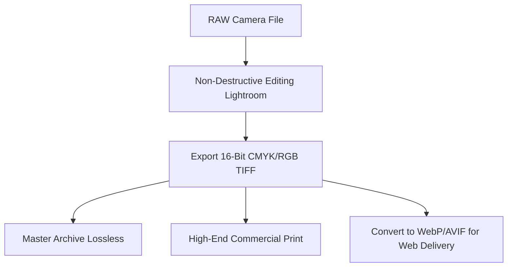

# Best Image Format for Photography: RAW vs. JPEG vs. TIFF

For digital photographers, choosing the correct image formats at each stage of the creative workflow—from initial capture to editing, print publishing, and web delivery—is essential for preserving image quality.

Different formats are designed for different tasks. Using the wrong format during post-processing can lead to color banding, loss of detail, and limited dynamic range. Similarly, serving large uncompressed files on your website will slow down page load speeds and hurt your user experience.

This guide analyzes the best image formats for photography, examines editing and archiving standards, compares color space configurations, and details web delivery options.

---

## Technical Comparison: RAW vs. TIFF vs. JPEG

Digital photography workflows typically rely on three primary formats:

| Feature | RAW (Camera Sensors) | TIFF (Archive & Print) | JPEG (Web Delivery) |
| :--- | :--- | :--- | :--- |
| **Asset Class** | Unprocessed Sensor Data | Lossless Raster Container | Lossy Raster Standard |
| **Color Depth** | **12-bit to 14-bit** | **8-bit to 16-bit** | 8-bit only |
| **Dynamic Range** | **Extremely High** | High | Low (Highlights clip) |
| **Compression Mode**| Uncompressed or Lossless | Lossless (LZW/ZIP) | Lossy (Quantized DCT) |
| **Editable Settings**| **Non-destructive (EXIF)** | Baked-in layers | Baked-in (Destructive) |
| **Web Compatibility**| Unsupported | Unsupported | **100% (Universal)** |

---

## Camera Capture: The Power of RAW

When you press the shutter button, your camera's sensor captures raw luminance data for millions of pixels. 
*   **Raw Sensor Data:** Unlike a JPEG (which bakes in camera adjustments and discards extra detail), a **RAW** file (e.g. CR3, NEF, ARW) stores the unprocessed pixel data directly from the sensor.
*   **Dynamic Range & Bit Depth:** RAW files support **12-bit or 14-bit color depth** (allowing for billions of color values per channel), while JPEGs are limited to 8-bit (16.7 million colors). This provides significant headroom to recover details in shadows and highlights during post-processing.
*   **Non-destructive Editing:** Adjusting settings like white balance, exposure, and color curves in a RAW editor (like Adobe Lightroom) modifies the file metadata rather than the pixel bytes. This allows you to revert or adjust edits at any time without degrading image quality.

---

## Editing & Master Archives: 16-Bit TIFF

Once you finish editing a photo, you need to export a master file for archiving or high-end printing. The industry standard for this task is **TIFF (Tagged Image File Format)**:



*   **Lossless Compression:** TIFF files use LZW or ZIP lossless compression, which preserves every pixel of detail. Saving the file repeatedly will never cause generation loss.
*   **16-Bit Color Depth:** Exporting your files as 16-bit TIFFs preserves the wide color depth and dynamic range of the raw capture. This prevents color banding in smooth gradients, such as skies or shadows, during subsequent edits.
*   **Multi-layer Support:** TIFF can store Photoshop layers, transparency channels, and custom paths, making it a highly versatile format for graphic design master files.

---

## Color Space Management: Adobe RGB vs. sRGB

For photographers, managing color spaces is critical for maintaining color accuracy across different screens:

*   **Adobe RGB:** This profile supports a wide gamut of green and cyan shades, making it ideal for professional photography, photo editing, and high-end printing.
*   **sRGB:** The default color space for the web, mobile apps, and consumer monitors.
*   **The Conversion Rule:** While you should edit photos in a wide color space (Adobe RGB), you must convert them to **sRGB** before exporting them for the web. If you upload an Adobe RGB file to a website, browsers will strip the profile and display the image using sRGB colors, making the photo look washed out or shifted.

---

## Web Delivery: Modern Next-Gen Pipelines

To display your photos on a website without slowing down page load speeds, you should convert your heavy TIFF files into optimized web formats:

*   **JPEG Fallback:** JPEG is supported by 100% of browsers and devices, making it a reliable default option.
*   **Next-Gen AVIF & WebP:** For modern browsers, use next-generation formats. WebP files are **25-35% smaller** than equivalent JPEGs, and AVIF files are **20% smaller** than WebPs at equivalent visual quality. Use HTML5 `<picture>` tags to serve AVIF and WebP files to compatible browsers while providing a JPEG fallback for older devices:
    ```html
    <picture>
      <source srcset="/images/portfolio.avif" type="image/avif">
      <source srcset="/images/portfolio.webp" type="image/webp">
      
    </picture>
    ```

---

## Step-by-Step Photography Export Checklist

Use this checklist to ensure your photos maintain high quality at every stage of your workflow:

*   **Camera Capture:** Set your camera to shoot in **RAW** format to capture maximum dynamic range and color depth.
*   **Master Archive:** Save your final edited files as **16-bit RGB TIFFs** to preserve details and prevent color banding.
*   **Print Export:** Export files for professional printing as **300 DPI CMYK PDFs** or **TIFFs**.
*   **Web Export:** Export web-ready assets in the **sRGB color space** as optimized WebP, AVIF, or JPG files using quality settings around 80-85%.

---


---

## Comparing RAW Bit-Depth Math: 12-Bit vs. 14-Bit

The bit depth of a RAW file determines the amount of shadow and highlight detail you can recover:
*   **12-Bit RAW:** Stores **4,096 discrete steps** of tone per channel, resulting in 68 billion total color combinations.
*   **14-Bit RAW:** Stores **16,384 discrete steps** of tone per channel, resulting in 4.3 trillion color combinations.
*   **The Impact:** Shooting in 14-bit RAW provides four times more shadow and highlight detail than 12-bit, allowing you to recover dark shadows and bright highlights in high-contrast scenes (like sunsets) without introducing noise or color banding.

---

## Generation Loss in Recurrent JPEG Saving Cycles

Every time you edit and save a file as a JPEG, the image data is re-compressed:
*   **The Re-compression Penalty:** JPEG uses lossy DCT compression. When you open a JPEG, edit a few pixels, and save it again, the encoder divides the image into $8\times8$ blocks and quantizes the frequency coefficients again.
*   **The Accumulation:** This repeated compression discards additional details and accumulates artifacts, causing the image to look blurry and degraded after just a few saves. To prevent this, always edit and save your master files in a lossless format (like TIFF) and export to JPEG only as the final delivery step.


---

## RAW Sensor Quantization Curves & Noise Distribution

Camera sensors capture light linearly, but the human eye perceives light logarithmically:
*   **Linear Capture:** RAW files store the linear sensor data directly, allocating equal data blocks to highlights and shadows.
*   **Logarithmic Conversion:** When you edit a photo, the RAW editor applies a non-linear tone curve to convert the linear data into standard RGB values, matching human perception. Shooting in RAW preserves this linear data, allowing you to recover details in shadows and highlights without introducing noise or color banding.


---

## Color Channel Clipping and Gamut Overflows

When editing photos, adjusting saturation or contrast settings can cause color channels to clip:
*   **The Gamut Overflow:** This occurs when a color value exceeds the maximum value supported by the color space (e.g., exceeding 255 in 8-bit sRGB).
*   **The Solution:** Edit photos in a wide color space (Adobe RGB or ProPhoto) using a high bit depth (16-bit) to prevent color clipping during editing. Convert to sRGB only during final export to ensure consistent color rendering on consumer screens.

## Frequently Asked Questions About Photography Formats

### What is the best image format for shooting photos?
The best format is **RAW**. It captures the unprocessed data directly from your camera's sensor, providing maximum dynamic range and color depth for post-processing.

### Why are my raw files not opening on my computer?
RAW formats are proprietary and differ by camera manufacturer (e.g., Canon uses `.CR3`, Nikon uses `.NEF`). To open these files, you need to use a compatible photo editor (like Adobe Lightroom, Capture One, or Photoshop) or install the raw codec pack provided by your operating system.

### What is the difference between Adobe RGB and sRGB?
Adobe RGB has a wider color gamut (range of colors) than sRGB, especially in green and cyan tones. It is preferred for professional photo editing and high-end printing. sRGB is the standard color profile for the web, mobile apps, and consumer monitors, ensuring consistent color rendering across different screens.

### Can I upload raw files directly to my website?
No. Web browsers cannot decode proprietary camera RAW formats natively. You must convert and export your photos as standard web formats like WebP, AVIF, or JPEG before uploading them.

### What is the difference between LZW and ZIP compression in TIFF files?
Both are lossless compression algorithms. LZW is highly efficient for flat graphics with solid colors, while ZIP compression generally achieves better compression ratios for complex photographs. Both methods preserve original image quality.

### How can I inspect my photo's metadata safely?
To view hidden camera parameters, location coordinates, and color profiles without uploading your files to external servers, use our free, browser-based [Metadata Viewer](/tools/metadata-viewer). The tool runs locally in your browser, keeping your photography files secure and private.