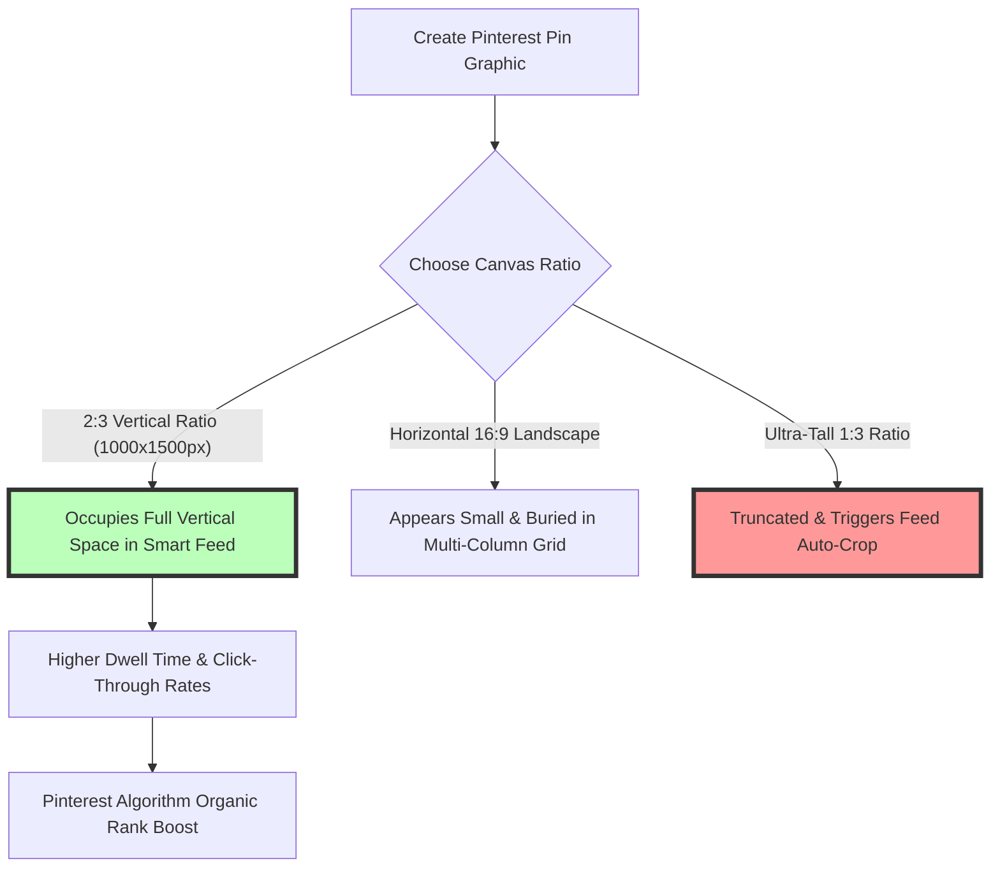
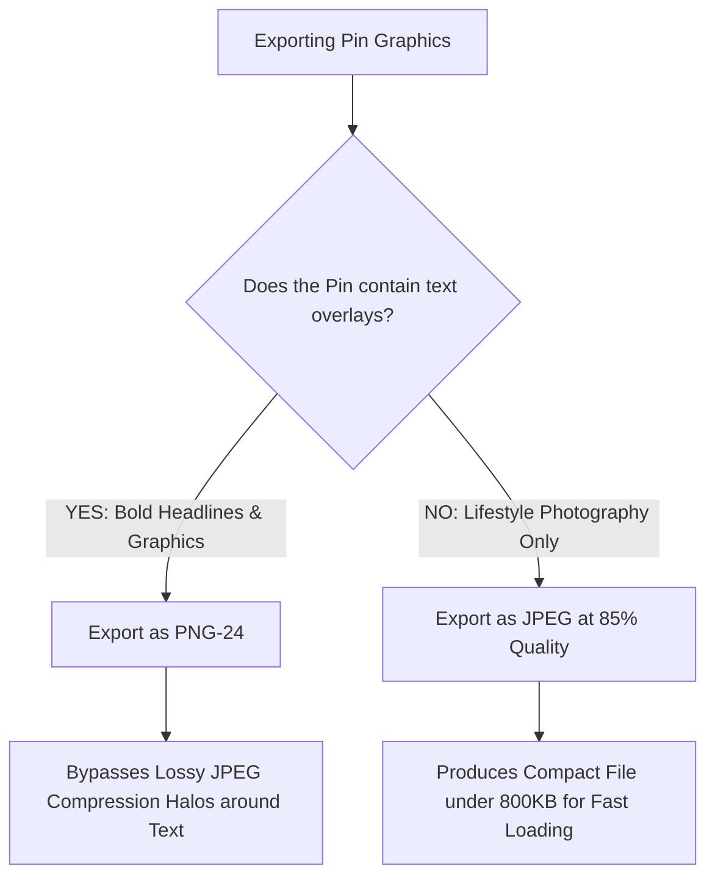

# Best Image Format for Pinterest Pins: 2:3 Aspect Ratio & 1000x1500 Guide

Pinterest is a visual search engine and product discovery platform driven by high-intent shoppers, bloggers, e-commerce brands, and digital creators. Unlike social feeds (such as X or Facebook) where content rapidly decays, high-performing Pins drive organic traffic, referral clicks, and sales conversions for months or years.

To succeed on Pinterest, your Pin graphics must stand out in Pinterest's multi-column vertical feed (the Smart Feed). Uploading improperly formatted images, low-resolution graphics, or horizontal landscape photos can cause your content to be cropped, truncated, or deprioritized by Pinterest's visual recognition algorithm.

This guide analyzes Pinterest's official media specifications, compares JPEG vs. PNG performance for typography overlays, details the $2:3$ vertical aspect ratio ($1000\times1500\text{px}$), covers Idea Pins and Carousel format rules, and demonstrates how to compress Pin graphics for fast mobile rendering.

---

## Master Specification Matrix: Pinterest Pin Formats

To ensure your Pins render with maximum visual impact across mobile apps and desktop screens, follow these official Pinterest specifications:

| Pin Type / Format | Recommended Format | Optimal Resolution | Aspect Ratio | Maximum File Size |
| :--- | :--- | :--- | :--- | :--- |
| **Standard Static Pin**| **JPEG (.jpg) or PNG (.png)**| **$1000 \times 1500$ pixels**| **2:3 Vertical Ratio**| **Under 20 MB** (Keep < 1MB) |
| **Carousel Pin Deck** | **JPEG (.jpg) or PNG (.png)**| **$1000 \times 1500$ or $1000 \times 1000$**| **2:3 or 1:1 Square**| Up to 5 cards per carousel |
| **Idea / Video Pin** | **MP4, MOV, or M4V** | **$1080 \times 1920$ pixels**| **9:16 Full Vertical** | **Under 2 GB** (H.264 / AAC) |
| **Board Cover Image** | **JPEG (.jpg) or PNG (.png)**| **$600 \times 600$ pixels** | **1:1 Square** | Under 10 MB |
| **Profile Display Photo**| **JPEG (.jpg) or PNG (.png)**| **$165 \times 165$ pixels** | **1:1 Circular Crop**| Under 10 MB |

---

## The 2:3 Aspect Ratio Gold Standard ($1000\times1500\text{px}$)

Why is the **2:3 vertical aspect ratio** ($1000\times1500$ pixels) universally recommended by Pinterest engineers?



### 1. Vertical Screen Real Estate
Over **85% of Pinterest users** browse the platform using the Pinterest mobile app on iOS and Android. In a two-column mobile masonry feed, vertical images occupy up to 60% more screen space than square or landscape images, capturing buyer attention as users scroll.

### 2. Auto-Cropping Penalties for Non-Standard Ratios
If you upload an image taller than a **1:2.1 ratio** (for example, a $1000\times2500$ pixel infographic), Pinterest's feed engine will automatically truncate the bottom half of the image in the search grid, displaying a truncated preview that hurts click-through rates.

---

## Technical Comparison: JPEG vs. PNG for Pinterest Graphics

Choosing between JPEG and PNG depends on whether your Pin features real-life photography or graphic text overlays:



### 1. Why PNG-24 is Essential for Text-Heavy Pins
Many top-performing Pins feature bold text headlines over background images (e.g., "10 Easy Dinner Recipes" or "SEO Checklist 2026"). 

When saved as a lossy JPEG, Pinterest's server-side compression creates fuzzy **compression halos** around letterforms. Exporting text-heavy Pins as **24-bit PNGs** (`.png`) keeps typography sharp and legible on mobile displays.

### 2. Why JPEG is Superior for Pure Lifestyle Photography
For food photography, fashion shots, home decor, and travel photos without text overlays, **JPEG (.jpg)** compressed at **80-85% quality** is ideal. A $1000\times1500$ pixel JPEG provides vivid color and detail while keeping file sizes between 400KB and 800KB.

---

## Pinterest Visual Search & AI Computer Vision Signals

Pinterest operates as a visual search engine powered by sophisticated **computer vision and AI image recognition models**:

*   **Pinterest Lens & Object Recognition:** Pinterest automatically scans every uploaded image to detect objects (e.g., shoes, cameras, furniture, plants). Uploading clear, high-resolution $1000\times1500\text{px}$ images with distinct object contrast helps Pinterest's visual indexer categorize your Pin for related search queries.
*   **Text Recognition (OCR):** Pinterest's OCR (Optical Character Recognition) engine reads text embedded directly within your Pin image. Sharp text overlays exported in PNG format allow Pinterest to index your headline keywords directly into search rankings.
*   **Color Profile Tagging:** Always tag your graphics with the **sRGB color profile** to prevent desaturated color shifts when Pinterest converts uploaded images to WebP preview derivatives.

---

## Carousel Pins & Multi-Card Design Consistency

**Carousel Pins** allow users to swipe through up to 5 cards within a single Pin post:

```
+------------------+  +------------------+  +------------------+
| Card 1: 1000x1500|  | Card 2: 1000x1500|  | Card 3: 1000x1500|
| Cover Headline   |  | Step 1 Detail    |  | Step 2 Detail    |
| (2:3 Aspect)     |  | (2:3 Aspect)     |  | (2:3 Aspect)     |
+------------------+  +------------------+  +------------------+
```

### Key Rules for Carousel Pins:
1.  **Aspect Ratio Uniformity:** All cards within a carousel deck must share the exact same aspect ratio (either 2:3 or 1:1). Mixing square and vertical cards causes Pinterest to crop cards unevenly.
2.  **Card File Sizes:** Keep individual card file sizes **under 1 MB** so that mobile app users can swipe smoothly between cards without loading lag.

---

## Step-by-Step Optimization Workflow for Pinterest Creators

Follow this workflow to prepare your graphics for Pinterest:

1.  **Set Canvas Dimensions:** Create a canvas of **$1000\times1500$ pixels** (2:3 aspect ratio).
2.  **Add High-Contrast Typography:** Place text headlines in the top or middle 70% of the canvas.
3.  **Convert Color Space to sRGB:** Ensure the image is saved in the **sRGB color space profile**.
4.  **Compress File Locally:** Use our free, browser-based [Image Compressor](/tools/image-compressor) to reduce JPEG/PNG file sizes below **800KB**.

---

## Step-by-Step Pinterest Image Checklist

Before publishing Pins to Pinterest, run your graphics through this checklist:

*   **Aspect Ratio:** Confirm the image uses the vertical **2:3 aspect ratio** ($1000\times1500\text{px}$).
*   **File Size:** Keep file size **under 1 MB** for rapid mobile feed loading.
*   **Typography Format:** Export text-heavy infographics as **PNG-24**.
*   **Photo Format:** Export photo-only Pins as **JPEG** compressed at 85% quality.
*   **Color Profile:** Tag all files with the **sRGB color space profile**.

---

## Pinterest Rich Pins & Open Graph Tag Synchronization

For bloggers and e-commerce store owners, **Pinterest Rich Pins** automatically sync real-time metadata from your website to the Pin card:
*   **Article & Product Rich Pins:** Rich Pins read Open Graph (`og:image`, `og:title`, `og:description`) and Schema.org structured data from your web pages. Setting your website's `og:image` to $1000\times1500\text{px}$ ensures that when readers pin images directly from your blog, Pinterest generates high-resolution vertical pins.
*   **Price & Availability Sync:** Product Rich Pins display live pricing and stock status directly below the $1000\times1500\text{px}$ image, increasing conversion rates for e-commerce listings.

---

## Pinterest Smart Feed Dwell Time & Save Signals

Pinterest's organic ranking algorithm (the **Smart Feed**) evaluates user engagement signals to determine pin distribution:
*   **Save Rate & Close-Up Signals:** When users tap a $1000\times1500\text{px}$ Pin to inspect close-up details or save it to a personal board, Pinterest registers positive quality signals, boosting the Pin in related search categories.
*   **Dwell Time Boost:** High-resolution vertical graphics that hold a user's visual attention for more than 3 seconds signal quality content to Pinterest's AI ranker.

---

## Frequently Asked Questions

### What is the best image format for Pinterest pins?
The best format for static Pins with text headlines is **PNG-24**. For lifestyle photography without text overlays, the best format is **JPEG (.jpg)** compressed at 80-85% quality.

### What are the optimal dimensions for Pinterest pins?
The optimal dimensions for a standard Pinterest Pin are **$1000\times1500$ pixels** (2:3 vertical aspect ratio). This ratio maximizes vertical screen space in Pinterest's mobile feed.

### What happens if I upload horizontal images to Pinterest?
Horizontal landscape images (e.g., 16:9 ratio) occupy significantly less vertical space in Pinterest's mobile masonry grid, appearing small and buried compared to vertical 2:3 Pins, resulting in lower click-through rates.

### What is the maximum file size for Pinterest image uploads?
Pinterest supports image file sizes up to **20 MB**. However, for optimal mobile loading speeds and higher organic reach, you should keep your file sizes **under 1 MB** (ideally between 400KB and 800KB).

### Why does text on my Pinterest Pins look blurry?
Text looks blurry when Pins containing text overlays are saved as lossy JPEGs. Uploading text-heavy graphics as **PNG-24** files preserves sharp typography and prevents compression halos around letterforms.

### How can I compress Pinterest graphics without losing quality?
To compress your $1000\times1500\text{px}$ Pinterest graphics without exposing images to third-party cloud servers, use our free, browser-based [Image Compressor](/tools/image-compressor). The tool processes files locally in your browser, preserving privacy and quality.
