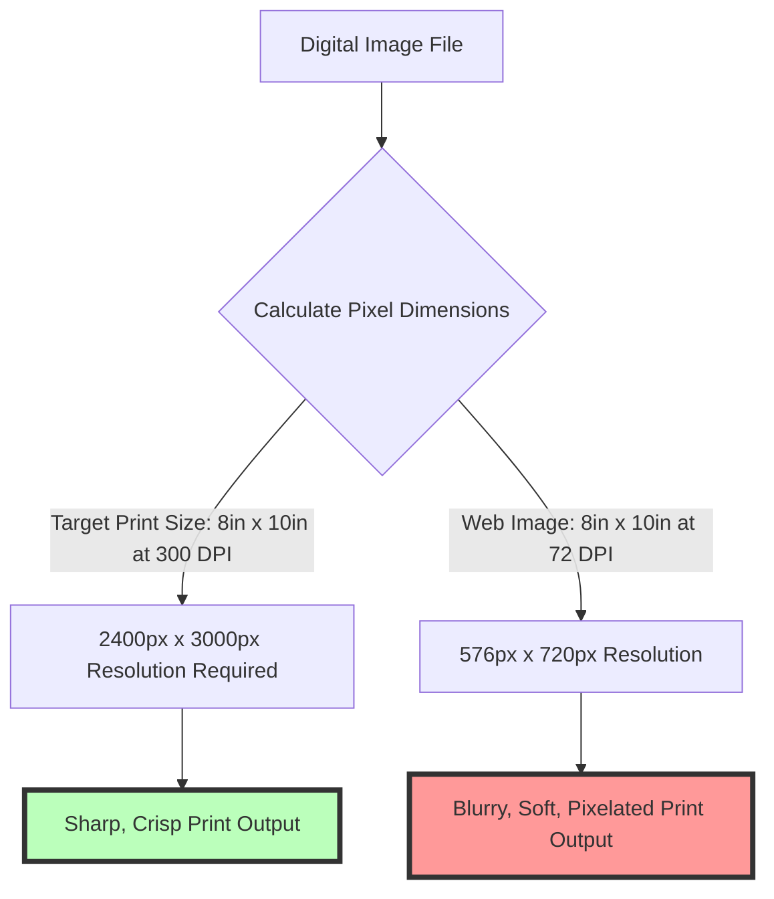

# Best Image Format for Printing: 300 DPI, TIFF vs PNG vs JPEG & CMYK Guide

Preparing digital artwork, fine art photography, brochures, posters, business cards, or merchandise prints requires adhering to strict high-resolution print standards. Unlike digital screens (where pixels are rendered dynamically at 72 or 96 PPI in the sRGB color space), commercial printing presses and photo printers require high-density pixel mapping (**300 DPI**) and subtractive physical ink color management (**CMYK**).

Submitting low-resolution files, web-compressed graphics, or un-flattened RGB files to a print shop can result in pixelated imagery, soft/blurry text, clipped borders, and muted color shifts.

This guide analyzes professional print specifications, compares TIFF vs. PDF vs. JPEG vs. PNG performance, details 300 DPI resolution calculations, explains CMYK ink gamut mapping, and demonstrates how to optimize digital image files for high-quality printing.

---

## Master Specification Matrix: Print Image Formats

To ensure your printed materials produce sharp detail and accurate color rendition, follow these industry-standard print specifications:

| Print Asset Type | Recommended Format | Optimal Resolution | Color Profile Space | Primary Advantage |
| :--- | :--- | :--- | :--- | :--- |
| **Fine Art & Photography Prints**| **TIFF (.tif / .tiff)** | **300 DPI at physical print size** | **CMYK or Adobe RGB** | Uncompressed lossless pixel preservation |
| **Commercial Press & Brochures** | **PDF (PDF/X-1a:2001)** | **300 DPI at physical print size** | **CMYK (SWOP / GRACoL)**| Preserves vector fonts & layout integrity |
| **Everyday Photo Lab Prints** | **JPEG (.jpg)** | **300 DPI at physical print size** | **sRGB Color Space** | Accepted universally by retail photo labs |
| **Large Format Banners / Signage**| **PDF or Vector EPS** | **150 to 300 DPI (Scaled)** | **CMYK Color Space** | Scalable vector typography without pixelation |
| **Web Graphics (Do Not Print)**| **PNG (.png)** | 72 DPI (Screen PPI) | sRGB Color Space | **RGB only (No CMYK support)** |

---

## The 300 DPI Industry Standard (Pixels vs. Inches)

Resolution in printing is measured in **DPI (Dots Per Inch)** or **PPI (Pixels Per Inch)**:



### How to Calculate Required Dimensions for 300 DPI:
To determine the pixel resolution required for any physical print size, multiply the physical dimensions in inches by **300**:

$$\text{Required Width (Pixels)} = \text{Print Width (Inches)} \times 300$$
$$\text{Required Height (Pixels)} = \text{Print Height (Inches)} \times 300$$

#### Standard Print Dimension Reference Table:
*   **$4\times6$ Inch Photo Print:** $1200 \times 1800$ pixels at 300 DPI.
*   **$8\times10$ Inch Print:** $2400 \times 3000$ pixels at 300 DPI.
*   **$11\times17$ Inch Poster:** $3300 \times 5100$ pixels at 300 DPI.
*   **$24\times36$ Inch Large Poster:** $7200 \times 10800$ pixels at 300 DPI.

---

## Technical Format Battle: TIFF vs. PDF vs. JPEG vs. PNG

Why is **TIFF** or **PDF** preferred over web formats for professional printing?

```mermaid
graph TD
    A[Evaluating Print Formats] --> B{What is the print requirement?}
    B -- Fine Art Photography --> C[TIFF (.tif)]
    C --> D[16-bit Lossless Color, No Compression Artifacts]
    B -- Marketing Brochures & Text Layouts --> E[PDF/X-1a]
    E --> F[Embeds Vector Fonts & CMYK ICC Profiles]
    B -- Standard Consumer Photo Prints --> G[JPEG (.jpg - Max Quality)]
    G --> H[Compact File Size Accepted by Retail Labs]
    B -- Web Graphics with Transparency --> I[PNG (.png)]
    I --> J[NOT RECOMMENDED FOR PRINT: Lacks CMYK Support]
```

### 1. TIFF (Tagged Image File Format): The Fine Art Standard
**TIFF (.tif)** is the preferred format for museum-quality fine art printing, gallery photography, and high-end publishing. 

Unlike lossy JPEGs, TIFF uses **lossless LZW or ZIP compression**, preserving every pixel and supporting **16-bit color depth per channel** alongside **CMYK color spaces**.

### 2. PDF (PDF/X): Commercial Printing Press Standard
For multi-page brochures, magazines, and business cards containing both images and text, commercial printers require **PDF/X (PDF/X-1a or PDF/X-4)**. PDF embeds vector fonts, preserving sharp typography regardless of scale.

### 3. Why PNG is NOT Recommended for Professional Printing
While **PNG** is a popular lossless format for web graphics, **PNG does not support the CMYK color space**. PNG files are locked exclusively to the RGB color model. Printing a PNG directly on a 4-color press can lead to unpredictable color shifts.

---

## Color Space Mechanics: CMYK Ink Gamut vs. sRGB Screen Light

Understanding the fundamental difference between **RGB screen light** and **CMYK printing ink** prevents color disappointment:

```mermaid
graph LR
    A[RGB Color Model (Screen Light)] --> B[Additive Red, Green, Blue Light Emission]
    B --> C[Wider Color Gamut (Neon Pinks, Electric Blues)]
    D[CMYK Color Model (Print Ink)] --> E[Subtractive Cyan, Magenta, Yellow, Key/Black Ink]
    E --> F[Narrower Color Gamut (Reflective Light)]
    C --> G[Converting RGB to CMYK Mutes Neon Vibrancy]
```

### Key Differences:
*   **sRGB (Additive Light):** Monitors generate colors by emitting Red, Green, and Blue light. sRGB has a wide color gamut capable of displaying bright neon tones.
*   **CMYK (Subtractive Ink):** Commercial presses create colors by mixing Cyan, Magenta, Yellow, and Black inks on paper. CMYK has a narrower gamut, meaning bright neon colors on screen will appear slightly desaturated when translated to physical ink.

---

## Bleed, Trim & Safe Area Margins

When preparing artwork for commercial printing (such as business cards, flyers, or book covers), graphics must include **Bleed and Trim Margins**:

```
+-----------------------------------------------------------------------+
|  BLEED AREA (Extra 0.125 in / 3mm background extension)               |
|                                                                       |
|  +-----------------------------------------------------------------+  |
|  |  TRIM LINE (Where physical paper guillotine cuts)               |  |
|  |                                                                 |  |
|  |  +-----------------------------------------------------------+  |  |
|  |  |  SAFE ZONE (Keep all critical text & logos inside)        |  |  |
|  |  +-----------------------------------------------------------+  |  |
|  +-----------------------------------------------------------------+  |
+-----------------------------------------------------------------------+
```

### Margin Definitions:
1.  **Bleed Line (Outer Margin):** Extend background images **0.125 inches (3mm)** past the final trim line to ensure no white paper edges show if the mechanical cutter shifts slightly.
2.  **Trim Line (Cut Line):** The actual edge of the final printed document.
3.  **Safe Zone (Inner Margin):** Keep all critical text and logos at least **0.125 inches (3mm)** *inside* the trim line to prevent text from being clipped.

---

## Step-by-Step Optimization Workflow for Print Graphics

Follow this workflow to prepare your digital files for printing:

1.  **Set 300 DPI Resolution:** Ensure canvas density is set to **300 DPI** at the physical print size in inches.
2.  **Convert Color Space:** Convert color mode to **CMYK** (or keep as **sRGB** if printing via a consumer retail photo lab).
3.  **Add Bleed Margins:** Add a **0.125-inch (3mm)** bleed allowance on all four sides.
4.  **Export Format:** Export as **TIFF** for photography, **PDF/X** for commercial press, or **JPEG (100% quality)** for retail photo prints.
5.  **Compress Securely:** Use our free, browser-based [Image Compressor](/tools/image-compressor) to reduce JPEG file sizes without compromising 300 DPI clarity.

---

## Step-by-Step Print Image Checklist

Before sending digital files to a print shop, run your assets through this checklist:

*   **Resolution:** Verify density is set to **300 DPI/PPI** at full physical size.
*   **Format:** Export as **TIFF (.tif)**, **PDF/X**, or high-quality **JPEG**. Avoid PNG for commercial press.
*   **Color Mode:** Convert to **CMYK** for offset printing or **sRGB** for photo labs.
*   **Bleed Margins:** Confirm **0.125-inch (3mm)** bleed extension on all artwork borders.
*   **Font Embedding:** Convert fonts to vector outlines when saving PDF press files.

---

## Frequently Asked Questions

### What is the best image format for professional printing?
The best format for fine art photography and high-end publishing is **TIFF (.tif)**. For commercial printing presses, marketing brochures, and business cards, the best format is **PDF (PDF/X)**.

### Why is 300 DPI required for high-quality prints?
At 300 DPI (Dots Per Inch), individual printed ink dots are small enough to be invisible to the human eye, producing continuous, razor-sharp detail. Lower resolutions (like 72 DPI) result in visible pixels and soft, blurry prints.

### Can I print a PNG file?
While you can print a PNG on home inkjet printers, **PNG is not recommended for professional printing**. PNG files do not support the CMYK color space required by commercial printing presses, leading to color conversion inaccuracies.

### What is the difference between CMYK and sRGB for printing?
**sRGB** is an additive light color space designed for digital screens. **CMYK** is a subtractive physical ink color model (Cyan, Magenta, Yellow, Black) used by printing presses. Commercial press printing requires converting sRGB files to CMYK.

### How do I calculate the required pixel resolution for an 8x10 print?
Multiply physical dimensions in inches by 300 DPI: $8 \times 300 = 2400\text{px}$ width, and $10 \times 300 = 3000\text{px}$ height. An $8\times10$ inch print requires a **$2400\times3000$ pixel** resolution.

### How can I compress high-resolution print JPEGs securely?
To compress your 300 DPI print JPEGs without exposing image files to external cloud servers, use our free, browser-based [Image Compressor](/tools/image-compressor). The tool runs locally in your browser, maintaining full privacy.