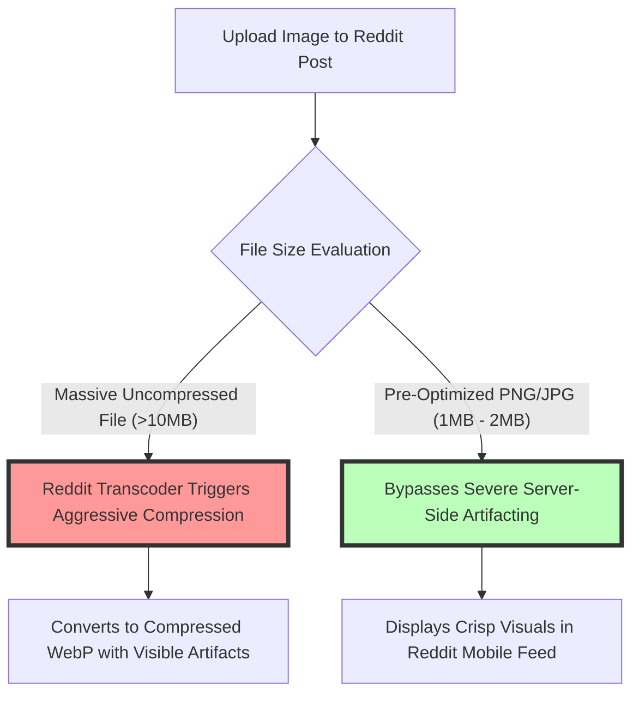
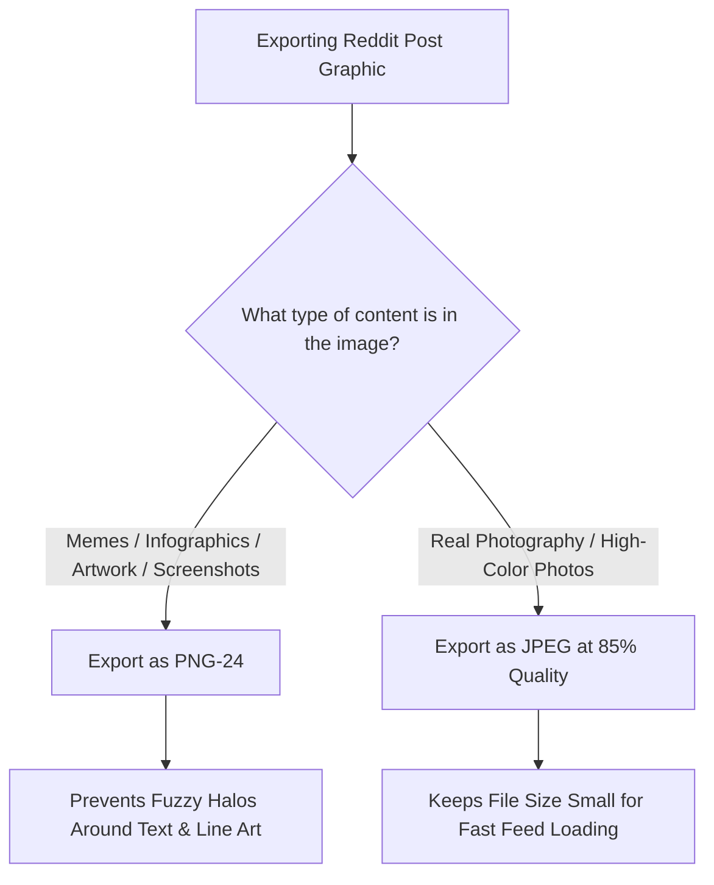

# Best Image Format for Reddit Posts: 20MB Limit, Banners & Profile Guide

Reddit is one of the internet's largest community discussion platforms, hosting thousands of specialized subreddits covering digital art, photography, gaming, memes, infographics, and technical tutorials. With millions of daily active users browsing Reddit's desktop site and mobile apps (iOS and Android), sharing high-quality visual content is critical for driving upvotes, comments, and community engagement.

However, Reddit applies server-side transcoding algorithms to uploaded media. Submitting improperly formatted images, low-resolution memes, or uncompressed graphics can result in blurry text on infographics, ugly compression halos around artwork, or upload failures caused by exceeding Reddit's **20MB post image file limit**.

This guide analyzes Reddit's official media specifications, compares PNG vs. JPEG vs. WebP for Reddit posts, details subreddit banner and profile avatar guidelines, explains Reddit's automatic WebP conversion pipeline, and demonstrates how to optimize graphics for crisp rendering across all subreddits.

---

## Master Specification Matrix: Reddit Image Assets

To ensure your posts, banners, and profile assets display with maximum visual quality across Reddit feeds, follow these official specifications:

| Asset Type / Slot | Recommended Format | Optimal Dimensions | Hard File Size Limit | Key Optimization Requirement |
| :--- | :--- | :--- | :--- | :--- |
| **Standard Post Image**| **PNG (.png) or JPEG (.jpg)**| **$1200 \times 900$ pixels** (4:3 ratio)| **Under 20 MB** (Keep < 2MB) | PNG preserves sharp text on infographics |
| **Subreddit Banner (Desktop)**| **PNG (.png)**| **$1920 \times 384$ pixels** (5:1 ratio)| **Under 500 KB** | Keep main logo centered in safe zone |
| **Subreddit Banner (Mobile)** | **PNG (.png)**| **$1600 \times 480$ pixels** (10:3 ratio)| **Under 500 KB** | Centered composition for mobile screens |
| **User Profile Banner** | **PNG (.png)**| **$1000 \times 300$ pixels** (10:3 ratio)| **Under 500 KB** | Clean background graphic |
| **Profile Avatar (PFP)**| **PNG (.png) or JPEG**| **$256 \times 256$ pixels** (1:1 ratio)| **Under 64 KB** | Circular crop mask, centered face/icon |

---

## The 20MB Image Limit & Server-Side WebP Compression

Reddit allows image uploads up to a **20 MB hard file limit**. However, uploading massive 15MB or 20MB uncompressed files often triggers aggressive server-side compression algorithms:



### Why Pre-Compressing Files Improves Quality:
When you upload an image over 10MB, Reddit's image processing server (i.redd.it CDN) re-encodes the file into responsive WebP derivatives for mobile app users. Pre-compressing your image to between **1 MB and 2 MB** before uploading prevents Reddit's automated pipeline from introducing severe compression artifacts or color shifts.

---

## Technical Comparison: PNG vs. JPEG for Reddit Submissions

Choosing between PNG and JPEG for Reddit post submissions depends on the visual content of your upload:



### 1. Why PNG-24 is Essential for Memes, Comics & Infographics
Subreddits like `r/infographics`, `r/comics`, `r/dataisbeautiful`, and `r/memes` rely heavily on sharp text and line graphics. 

Uploading text-heavy graphics as lossy JPEGs causes Reddit's compression engine to generate fuzzy **compression halos** around letterforms. Exporting as **24-bit PNG (`.png`)** preserves pixel-perfect text legibility across desktop monitors and mobile screens.

### 2. Why JPEG is Best for Photography Subreddits
For photography subreddits (such as `r/itookapicture`, `r/earthporn`, or `r/streetphotography`), **JPEG (.jpg)** compressed at **85% quality** is ideal. A $1200\times900$ pixel JPEG delivers rich sRGB color gradients while keeping file sizes compact.

---

## Subreddit Banners: Dimensions & Mobile Safe Zones

Moderators and community managers customizing subreddits must ensure header banners display properly across desktop widescreen displays and mobile devices:

```
+-----------------------------------------------------------------------+
|  SUBREDDIT DESKTOP BANNER: 1920px x 384px (5:1 Aspect Ratio)          |
|                                                                       |
|  +------------------+                                                 |
|  | MOBILE SAFE ZONE | <--- KEEP IMPORTANT LOGOS & TEXT CENTERED       |
|  |  (1600px x 480px) |      Outer edges get cropped on mobile apps    |
|  +------------------+                                                 |
+-----------------------------------------------------------------------+
```

### Banner Guidelines:
1.  **Desktop Banner Canvas:** $1920\times384$ pixels (5:1 ratio). Keep file size **under 500 KB**.
2.  **Mobile Banner Canvas:** $1600\times480$ pixels (10:3 ratio).
3.  **Centered Safe Zone:** Place community logos and subhead text in the middle 60% of the canvas. The left and right edges of desktop banners are cropped out when viewed on smaller mobile screens.

---

## Reddit GIF vs. MP4 Video Rules for Looping Content

Many subreddits (such as `r/gifs` or `r/perfectloops`) showcase short looping animations:

*   **Legacy GIF Uploads:** While Reddit accepts `.gif` uploads, uncompressed animated GIFs often exceed the 20MB limit and load slowly over cellular networks.
*   **MP4 / WebM Conversion:** Reddit automatically converts uploaded GIFs into MP4 video containers (served via `v.redd.it`). Uploading a native **MP4 video file** (H.264 video codec) instead of a GIF results in smaller file sizes, smoother frame rates, and higher visual quality.

---

## Step-by-Step Optimization Workflow for Reddit Users

Follow this workflow to prepare your graphics for Reddit:

1.  **Select Aspect Ratio & Dimensions:**
    *   Single Post: $1200\times900$ pixels (4:3 ratio) or $1080\times1080$ pixels (1:1 square).
    *   Subreddit Banner: $1920\times384$ pixels (PNG format under 500KB).
    *   Profile Avatar: $256\times256$ pixels (PNG format under 64KB).
2.  **Convert Color Space to sRGB:** Ensure graphics are saved in the **sRGB color space profile** to prevent desaturated colors.
3.  **Compress File Locally:** Use our free, browser-based [Image Compressor](/tools/image-compressor) to reduce image file sizes to under **2 MB** before uploading.

---

## Step-by-Step Reddit Image Checklist

Before submitting posts or banners to Reddit, run your assets through this checklist:

*   **File Size Limit:** Verify post images are **under 20 MB** (ideally between 1MB and 2MB).
*   **Text Sharpening:** Export infographics, memes, and digital art as **PNG-24**.
*   **Photo Format:** Export real-life photos as **JPEG (.jpg)** compressed at 85% quality.
*   **Banner File Size:** Keep subreddit banners **under 500 KB**.
*   **Color Profile:** Tag all files with the **sRGB color space profile**.

---

## Reddit CDN Architecture (`i.redd.it`) & Image Pipelines

When you upload photos to Reddit, the platform processes files through its dedicated `i.redd.it` content delivery network:
*   **Automated Responsive Variants:** Reddit creates multiple scaled image variants ($108\text{px}$, $216\text{px}$, $320\text{px}$, $640\text{px}$, $960\text{px}$, and $1080\text{px}$) to serve different screen sizes across desktop, mobile web, and official app clients.
*   **WebP Transcoding Pipeline:** Standard JPEGs and PNGs are automatically converted into optimized WebP derivatives for fast rendering in mobile app feeds, while preserving original source assets for full-screen lightbox viewing.

---

## Imgur External Link Hosting vs. Native Reddit Uploads

Professional photographers and digital artists often compare native Reddit uploads (`i.redd.it`) against third-party image hosts (such as Imgur or Flickr):
*   **Native `i.redd.it` Direct Uploads:** Direct image uploads generate inline expanded post previews in Reddit feeds, driving **3x to 5x higher upvotes** and comment engagement compared to external URL links.
*   **Imgur Link Submissions:** Sharing an external Imgur link displays a smaller thumbnail preview in many Reddit app clients. Use native Reddit direct uploads for maximum visibility, keeping source files pre-compressed between 1MB and 2MB.

---

## Frequently Asked Questions

### What is the best image format for Reddit posts?
The best format for memes, infographics, and text graphics is **PNG-24**. For real photography, the best format is **JPEG (.jpg)** compressed at 85% quality.

### What is the maximum file size for Reddit image uploads?
Reddit has a maximum image file size limit of **20 MB**. However, keeping file sizes between **1 MB and 2 MB** prevents aggressive server-side WebP re-compression.

### What are the optimal dimensions for a subreddit banner?
The optimal desktop subreddit banner dimensions are **$1920\times384$ pixels** (5:1 aspect ratio) with a file size under 500KB. For mobile banners, use **$1600\times480$ pixels**.

### Why do memes look blurry when posted to Reddit?
Memes look blurry when uploaded as lossy JPEGs because Reddit's compression engine creates fuzzy halos around text letterforms. Uploading memes as **PNG-24** preserves crisp typography.

### What is the recommended size for a Reddit profile avatar?
The recommended size for a Reddit profile picture (avatar) is **$256\times256$ pixels** (1:1 square aspect ratio) kept under 64KB in file size.

### How can I compress images for Reddit securely?
To compress your images for Reddit without uploading files to external third-party servers, use our free, browser-based [Image Compressor](/tools/image-compressor). The tool processes files locally in your browser, maintaining full privacy.
