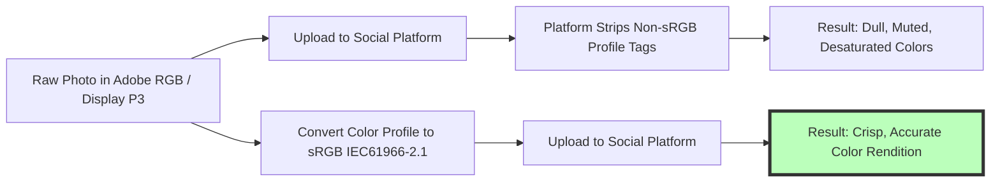

# Best Image Format for Social Media 2026: WebP vs PNG vs JPG Guide

Managing social media brand presence across multiple platforms requires navigating a complex matrix of image specifications, aspect ratios, file size caps, and automated server-side compression algorithms. A single visual asset published across Instagram, LinkedIn, Pinterest, TikTok, Reddit, and X (formerly Twitter) undergoes different transcoding pipelines on each platform.

Uploading incorrectly formatted or uncompressed images leads to blurry text on infographics, desaturated color shifts on mobile screens, truncated thumbnails, and poor user engagement.

This guide provides a comprehensive 2026 social media image format cheat sheet, compares WebP vs. PNG-24 vs. JPEG performance, details sRGB color space profile management, and demonstrates how to optimize social media graphics for fast mobile rendering.

---

## Master Specification Cheat Sheet: 2026 Social Media Image Matrix

To ensure your brand assets display sharply across major social media networks, follow these platform-specific guidelines:

| Social Platform | Recommended Format | Primary Aspect Ratio | Optimal Resolution | Maximum File Size |
| :--- | :--- | :--- | :--- | :--- |
| **Instagram** | **JPEG (.jpg)** | **4:5 Portrait / 1:1 Square** | **$1080 \times 1350$ pixels** | Under 8 MB (Keep < 1MB) |
| **LinkedIn** | **PNG-24 or PDF Deck** | **1:1 Square / 4:5 Portrait** | **$1200 \times 1200$ pixels** | Under 10 MB (PDF Decks) |
| **Pinterest** | **PNG-24 or JPEG** | **2:3 Vertical Ratio** | **$1000 \times 1500$ pixels** | Under 20 MB (Keep < 1MB) |
| **TikTok (Photo Mode)**| **JPEG or PNG** | **9:16 Full Vertical** | **$1080 \times 1920$ pixels** | Under 10 MB (Keep < 500KB)|
| **Reddit** | **PNG-24 or JPEG** | **4:3 Ratio / 1:1 Square** | **$1200 \times 900$ pixels** | Under 20 MB (Keep < 2MB) |
| **X (Twitter)** | **JPEG (.jpg) or PNG** | **16:9 Landscape / 1:1** | **$1200 \times 675$ pixels** | Under 5 MB |

---

## Format Comparison: WebP vs. PNG vs. JPEG for Social Media

Choosing the right format depends on the visual content of your social graphic:

```mermaid
graph TD
    A[Social Media Graphic Export] --> B{What is the primary asset content?}
    B -- Infographic / Quote Text / Logo --> C[Use PNG-24 Format]
    C --> D[Bypasses Lossy Server Compression Halos]
    B -- Photography / Lifestyle Shots --> E[Use JPEG Format (85% Quality)]
    E --> F[Ensures Universal Browser & Mobile Compatibility]
    B -- Web Banners / Modern Web Apps --> G[Use WebP Format]
    G --> H[30% Smaller Footprint than JPEG]
    style C fill:#bfb,stroke:#333,stroke-width:4px
    style E fill:#bfb,stroke:#333,stroke-width:4px
```

### 1. PNG-24: Best for Text, Logos & Infographics
Social media platforms use automated server compression to re-encode uploaded JPEGs. When an image containing text or vector artwork is saved as a lossy JPEG, compression artifacts produce fuzzy halos around letters. Exporting text-heavy graphics as **24-bit PNG (`.png`)** preserves sharp, legible typography.

### 2. JPEG (.jpg): Best for High-Color Photography
For lifestyle photos, event photography, and product shots without text overlays, **JPEG (.jpg)** compressed at **80% to 85% quality** is ideal. JPEGs compress complex photographic detail efficiently, keeping file sizes under 1MB for fast mobile feed loading.

### 3. WebP (.webp): The Modern Web Standard
WebP provides **25% to 34% smaller file sizes** than JPEG at equivalent visual quality. While social media CDNs (like Instagram and Pinterest) convert uploaded JPEGs/PNGs into WebP derivatives internally, uploading pre-optimized WebP files to web applications speeds up page loading.

---

## Color Space Management: Why sRGB is Mandatory

A common issue social media managers encounter is that photos look vibrant in editing software (such as Photoshop or Lightroom) but appear dull or desaturated after being uploaded to social apps:



### The sRGB Conversion Rule:
Monitors, smartphone OLED screens, and social media CDNs are calibrated around the **sRGB color space** (sRGB IEC61966-2.1). Always convert your graphics to sRGB before exporting to prevent color shifts across mobile clients.

---

## Mobile Feed Dwell Time & Aspect Ratio Optimization

Social media feed algorithms prioritize content that keeps users engaged on screen:

*   **Vertical Aspect Ratios (4:5 and 9:16):** Vertical graphics occupy significantly more screen real estate on mobile devices than horizontal 16:9 images, capturing visual attention and increasing **dwell time**.
*   **Safe Zone Layouts:** Keep critical headlines, logos, and call-to-action buttons in the middle 70% of the canvas to avoid being obscured by native app UI overlays (such as captions, username tags, and audio bars).

---

## Step-by-Step Multi-Platform Optimization Workflow

Follow this workflow to prepare your brand graphics for social media publishing:

1.  **Set Platform Dimensions:** Consult our matrix above for target aspect ratios (e.g., $1080\times1350\text{px}$ for Instagram portrait).
2.  **Select Format:** Use **PNG-24** for graphics with text/logos; use **JPEG** (85% quality) for real photography.
3.  **Embed sRGB Metadata:** Verify that the exported file is tagged with the **sRGB color profile**.
4.  **Compress Locally:** Use our free, browser-based [Image Compressor](/tools/image-compressor) to reduce file sizes under **1 MB**.

---

## Step-by-Step Social Media Image Checklist

Before publishing assets across social networks, run your graphics through this checklist:

*   **Dimensions:** Confirm canvas matches platform-specific aspect ratios (e.g., 4:5, 2:3, or 9:16).
*   **File Size:** Keep file sizes **under 1 MB** per image for fast mobile rendering.
*   **Typography Format:** Export text-heavy graphics as **PNG-24**.
*   **Photo Format:** Export photos as **JPEG** compressed at 85% quality.
*   **Color Space:** Verify all exported graphics are tagged with the **sRGB color space profile**.

---

## EXIF Metadata Stripping & Privacy Across Platforms

When uploading photos to public social media platforms (such as X, Reddit, or Instagram), user privacy is a key consideration:
*   **Automatic GPS Metadata Removal:** Most major social platforms automatically strip EXIF metadata (including GPS coordinates, camera model, shutter speed, and timestamp) upon upload to protect user location privacy.
*   **Manual EXIF Pre-Cleaning:** Before uploading images to public forums or third-party blogs, you can strip sensitive camera and location tags locally using our privacy-focused [EXIF Remover](/tools/exif-remover) tool without uploading files to external servers.

---

## Open Graph (`og:image`) & Social Sharing Protocol Setup

When users share links to your website across LinkedIn, Facebook, X, or Slack, social web crawlers parse Open Graph HTML tags to render preview cards:
*   **Optimal Preview Resolution:** Set your website's `og:image` dimension to **$1200\times630$ pixels** (1.91:1 landscape aspect ratio).
*   **HTML Implementation:**
    ```html
    <meta property="og:image" content="https://imagetoolstack.com/images/social-card.png">
    <meta property="og:image:width" content="1200">
    <meta property="og:image:height" content="630">
    <meta property="og:image:type" content="image/png">
    ```
*   **Format Selection:** Export Open Graph preview cards as **PNG-24** to ensure typography, brand taglines, and logo graphics stay razor-sharp when shared across social channels.

---

## Frequently Asked Questions

### What is the best image format for social media in 2026?
The best format for infographics, logos, text graphics, and branding assets is **PNG-24**. For real photography and complex lifestyle images, the best format is **JPEG (.jpg)** compressed at 80-85% quality. Exporting PNG-24 for text prevents fuzzy halos caused by platform lossy compression, while JPEG ensures fast loading for rich photographic content.

### Why do my photos look desaturated after uploading to social media?
Photos look desaturated when exported in **Adobe RGB** or **Display P3** color spaces. Mobile browsers and social app media players require the **sRGB color profile**; non-sRGB files lose color saturation during platform conversion, making vibrant colors appear dull and washed out.

### Which aspect ratio gets the most engagement on mobile social feeds?
Vertical aspect ratios—such as **4:5 ($1080\times1350\text{px}$)** on Instagram, **2:3 ($1000\times1500\text{px}$)** on Pinterest, and **9:16 ($1080\times1920\text{px}$)** on TikTok—occupy maximum screen real estate on smartphones, capturing buyer attention and driving higher engagement and algorithm dwell time.

### Is WebP supported for social media uploads?
Major social networks (including Meta, Pinterest, and TikTok) convert uploaded JPEGs and PNGs into WebP internally for client delivery. While platforms like TikTok support direct WebP uploads, PNG-24 and high-quality JPEG remain the safest universal source upload formats to prevent double-compression degradation across legacy mobile devices.

### What is the maximum recommended file size for social media images?
Keep social media image file sizes **under 1 MB** (ideally between 400KB and 800KB). While platforms allow up to 20MB uploads, keeping files under 1MB ensures fast mobile feed loading speeds, prevents bounce penalties, and stops automated server encoders from applying aggressive compression.

### How can I compress social media graphics securely without losing quality?
To compress your social media images without exposing files to external third-party servers, use our free, browser-based [Image Compressor](/tools/image-compressor). The tool runs locally in your browser, keeping your data private.