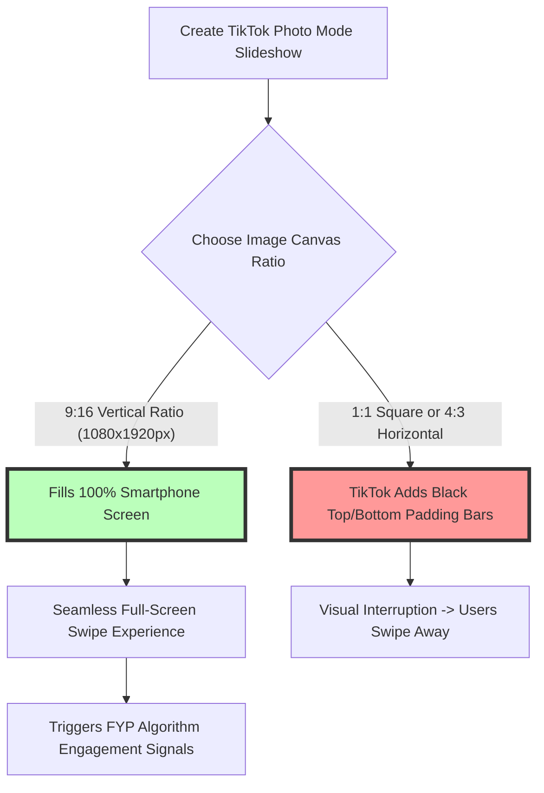

# Best Image Format for TikTok: Photo Mode 9:16 Carousel & 1080x1920 Guide

TikTok has evolved beyond short-form vertical video into a major visual storytelling platform. With the introduction of **TikTok Photo Mode** (multi-slide swipeable photo carousels accompanied by trending audio tracks), creators and brands can publish photo galleries, educational guides, storytelling slideshows, and product showcases directly to TikTok's For You Page (FYP).

However, TikTok applies automated compression pipelines to uploaded images. Publishing improperly sized graphics, horizontal landscape photos, or uncompressed image files results in blurred text on educational slides, unwanted black padding bars, or distorted UI overlays.

This guide analyzes TikTok's official image specifications, evaluates JPEG vs. PNG performance for Photo Mode slides, details the $9:16$ vertical aspect ratio ($1080\times1920\text{px}$), outlines interface UI safe zones, and demonstrates how to compress TikTok graphics for fast mobile rendering.

---

## Master Specification Matrix: TikTok Media Formats

To ensure your Photo Mode carousels, profile avatars, and video thumbnail covers render sharply across mobile screens, follow these official TikTok specifications:

| Asset Type / Slot | Recommended Format | Optimal Dimensions | Aspect Ratio | Maximum File Size |
| :--- | :--- | :--- | :--- | :--- |
| **Photo Mode Carousel**| **JPEG (.jpg) or PNG (.png)**| **$1080 \times 1920$ pixels**| **9:16 Full Vertical**| **Under 10 MB** (Keep < 500KB) |
| **Profile Picture (PFP)**| **JPEG (.jpg) or PNG (.png)**| **$200 \times 200$ pixels** | **1:1 Circular Crop**| Under 5 MB |
| **Video Thumbnail Cover**| **JPEG (.jpg) or PNG (.png)**| **$1080 \times 1920$ pixels**| **9:16 Full Vertical**| Under 10 MB |
| **Sticker / Overlay** | **PNG (.png)** | **$512 \times 512$ pixels** | **1:1 Square** | Under 2 MB (Alpha Channel) |

---

## The 9:16 Full-Screen Vertical Ratio ($1080\times1920\text{px}$)

Why is the **9:16 vertical aspect ratio** ($1080\times1920$ pixels) essential for TikTok Photo Mode?



### 1. Full-Screen Visual Immersion
TikTok is built entirely around an immersive, full-screen vertical feed on mobile devices. Standardizing your Photo Mode slides at **$1080\times1920$ pixels** ensures your content occupies 100% of the display canvas without letterboxing.

### 2. Aspect Ratio Uniformity Across Slides
When publishing a Photo Mode carousel deck (containing up to 35 slides), every slide must share the exact same aspect ratio. Mixing square (1:1) and vertical (9:16) photos within a single carousel post causes TikTok to inject uneven background padding, breaking the swipe flow.

---

## TikTok UI Safe Zones: Avoiding Overlap Distortions

A common design mistake on TikTok Photo Mode slides is placing essential text headlines, subtitles, or logos in areas obscured by native TikTok application interface elements:

```
+-----------------------------------------------------------------------+
|  TOP SAFE ZONE: Keep headlines below top 150px (Avoid Status Bar)    |
|                                                                       |
|  +-------------------------------------------------------------+  +---+
|  |                                                             |  | L |
|  |  PRIMARY DESIGN CANVAS (Center 80% of 1080x1920px)          |  | I |
|  |  Place text headlines, product graphics & logos here        |  | K |
|  |                                                             |  | E |
|  +-------------------------------------------------------------+  +---+
|                                                                       |
|  BOTTOM SAFE ZONE: Keep text clear of bottom 300px (Caption/Music)    |
+-----------------------------------------------------------------------+
```

### Safe Zone Rules for Designers:
*   **Top Margin:** Keep text headlines at least **150 pixels** down from the top edge to clear phone status bars and top navigation tabs.
*   **Bottom Margin:** Keep text at least **300 pixels** above the bottom edge to avoid being covered by user account handles, sound titles, and slide indicator dots.
*   **Right Edge Margin:** Keep key visual elements **120 pixels** away from the right edge to avoid overlap with native Like, Comment, Bookmark, and Share buttons.

---

## Technical Comparison: PNG vs. JPEG for TikTok Slides

Choosing between PNG and JPEG for TikTok Photo Mode depends on slide content:

```mermaid
graph TD
    A[Exporting TikTok Photo Mode Deck] --> B{Does the slide contain typography or graphics?}
    B -- YES: Educational Text & Vector Art --> C[Export as PNG-24]
    C --> D[Preserves Sharp Letterform Edges against Server Compression]
    B -- NO: High-Color Photography Only --> E[Export as JPEG at 85% Quality]
    E --> F[Keeps File Size Compact (< 500KB per slide)]
```

### 1. Why PNG-24 is Essential for Educational Slides
Educational and storytelling carousels (e.g., "5 Photoshop Hacks" or "Recipe Step-by-Step") rely heavily on clear text overlays. 

Saving text-heavy slides as lossy JPEGs causes TikTok's automated transcoding engine to create fuzzy **compression halos** around letterforms. Exporting text slides as **24-bit PNGs (`.png`)** preserves crisp legibility.

### 2. Why JPEG is Best for Pure Photography Carousels
For travel photography, fashion lookbooks, and aesthetic lifestyle slideshows, **JPEG (.jpg)** compressed at **80-85% quality** is ideal. A $1080\times1920$ pixel JPEG provides rich sRGB color rendering while keeping file sizes under 500KB per slide.

---

## TikTok Algorithm Dwell Time & FYP Recommendations

TikTok's recommendation algorithm (the **For You Page / FYP**) uses viewer engagement metrics to score content:

*   **Slide Completion & Swipe Velocity:** When users swipe through all slides in a Photo Mode carousel, TikTok registers high completion rate signals, pushing the post to broader audience feeds.
*   **Dwell Time Boost:** High-resolution 9:16 graphics with legible text headlines encourage viewers to pause and read, increasing dwell time on your post.
*   **Color Space Accuracy:** Tag all exported graphics with the **sRGB color profile** to prevent desaturated color shifts on smartphone OLED screens.

---

## Step-by-Step Optimization Workflow for TikTok Creators

Follow this workflow to prepare your graphics for TikTok Photo Mode:

1.  **Set Canvas Dimensions:** Create a vertical canvas of **$1080\times1920$ pixels** (9:16 aspect ratio).
2.  **Apply Safe Zone Layout:** Position text headlines and logos within the central safe zone (150px top margin, 300px bottom margin).
3.  **Convert Color Space to sRGB:** Ensure files are saved in the **sRGB color profile**.
4.  **Compress File Locally:** Use our free, browser-based [Image Compressor](/tools/image-compressor) to reduce JPEG/PNG file sizes below **500KB** per slide.

---

*   **Color Space:** Verify all exported graphics are tagged with the **sRGB color space profile**.

---

## TikTok Content Delivery Network (CDN) & WebP Pipelines

When you upload Photo Mode carousels to TikTok, images pass through TikTok's global media edge servers (`p16-sign-va.tiktokcdn.com`):
*   **Automated WebP/AVIF Transcoding:** TikTok transcodes uploaded PNG and JPEG source files into responsive WebP and AVIF derivatives tuned for mobile 4G/5G client connections.
*   **Color Profile Preservation:** Uploading files with embedded **sRGB color profiles** ensures TikTok's automated WebP encoders reproduce colors accurately on both iOS Super Retina OLED displays and Android LCD displays.

---

## Trending Audio Alignment & Dwell Time Optimization

TikTok Photo Mode carousels combine static slides with background music or voiceovers:
*   **Audio Pacing & Slide Count:** Structuring your carousel deck into **5 to 8 slides** at $1080\times1920\text{px}$ aligns naturally with standard 15-second trending audio tracks.
*   **Rewind & Pause Signals:** When users pause on a slide or swipe backward to re-read text, TikTok's FYP algorithm interprets this user behavior as an implicit quality signal, resulting in broader distribution across viewer feeds.

---

## Step-by-Step TikTok Image Checklist

Before uploading Photo Mode carousels to TikTok, run your assets through this checklist:

*   **Aspect Ratio:** Confirm every slide uses the vertical **9:16 aspect ratio** ($1080\times1920\text{px}$).
*   **Safe Zone Clearance:** Ensure text is clear of the top 150px, bottom 300px, and right 120px overlay zones.
*   **Typography Format:** Export text-heavy slides as **PNG-24**.
*   **Photo Format:** Export lifestyle photos as **JPEG** compressed at 85% quality.
*   **Color Space:** Verify all exported graphics are tagged with the **sRGB color space profile**.

---

## Frequently Asked Questions

### What is the best image format for TikTok Photo Mode?
The best format for educational slides with text overlays is **PNG-24**. For photographic slideshows without text, the best format is **JPEG (.jpg)** compressed at 80-85% quality.

### What are the optimal dimensions for TikTok Photo Mode slides?
The optimal dimensions for TikTok Photo Mode carousels are **$1080\times1920$ pixels** (9:16 vertical aspect ratio). This resolution fills the full smartphone screen without letterboxing padding.

### Why do my TikTok slideshow images have black bars on top and bottom?
Black padding bars appear when images are uploaded in non-vertical aspect ratios (such as 1:1 square or 16:9 landscape). Exporting all slides at a $9:16$ ratio ($1080\times1920\text{px}$) eliminates black bars.

### What are the UI safe zone margins for TikTok Photo Mode?
Keep headlines and logos clear of the top 150 pixels (status bar), bottom 300 pixels (caption and audio overlay), and right 120 pixels (engagement buttons).

### What is the recommended file size for TikTok carousel slides?
Keep individual slide file sizes **under 500 KB** (ideally between 200KB and 400KB). Compact file sizes enable instant swiping between slides without loading lag.

### How can I compress TikTok images securely?
To compress your $1080\times1920\text{px}$ TikTok graphics without exposing files to external third-party servers, use our free, browser-based [Image Compressor](/tools/image-compressor). The tool processes files locally in your browser, maintaining full privacy.
