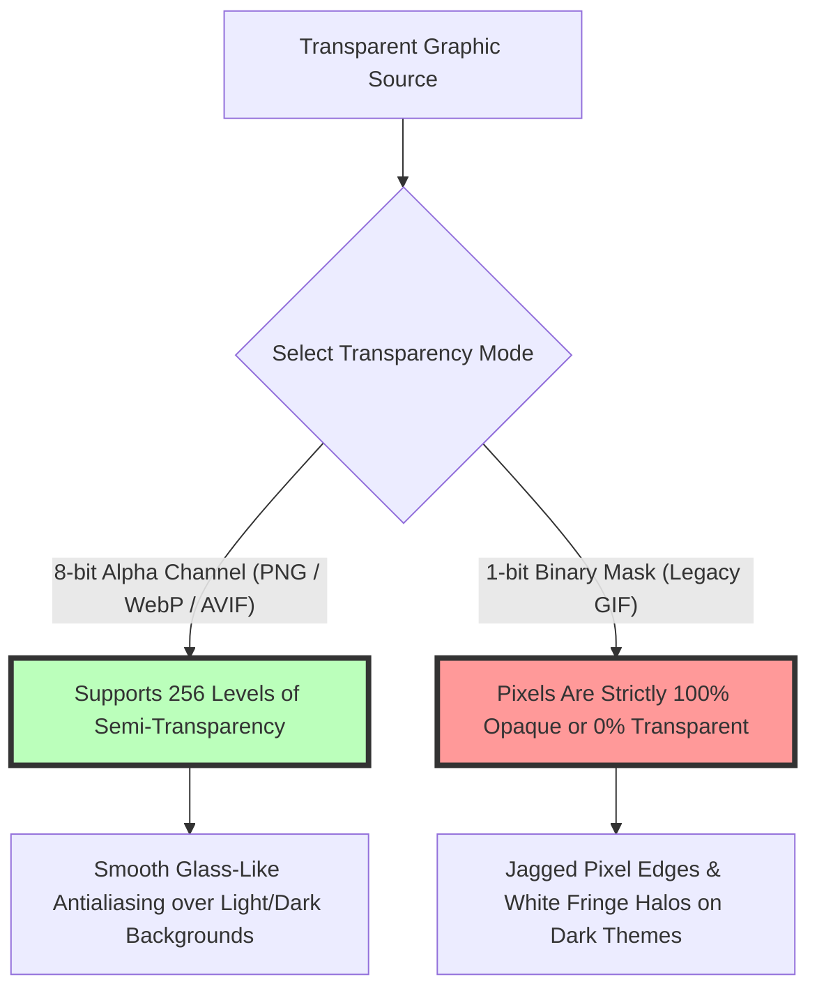

# Best Image Format for Transparency: WebP vs PNG vs AVIF Guide

Transparent background graphics are essential components of modern web design, digital branding, software UI interfaces, and e-commerce product catalogs. Whether you are placing a company logo over a dynamic gradient header, overlaying product cutout shots on floating cards, or displaying custom icons over dark and light theme toggles, using the correct image format for transparency prevents ugly white bounding boxes and keeps page payloads compact.

However, web developers and digital designers must navigate competing transparent image formats: **PNG-24**, **WebP**, **AVIF**, and legacy **GIF**. Selecting the wrong transparent format can lead to bloated file sizes (such as 4MB uncompressed PNGs), jagged 1-bit background halo artifacts, or missing browser compatibility.

This guide evaluates the best image formats for transparency, compares **WebP vs. PNG-24 vs. AVIF** alpha channel mechanics, details lossy vs. lossless transparent compression, explains HTML5 Canvas compositing performance, and demonstrates how to optimize transparent assets.

---

## Master Comparison Matrix: Transparent Image Formats

To understand how modern alpha channel formats compare to legacy transparency standards, review this specification matrix:

| Feature / Metric | PNG-24 (.png) | WebP (.webp) | AVIF (.avif) | GIF (.gif) |
| :--- | :--- | :--- | :--- | :--- |
| **Alpha Channel Support** | **8-bit Alpha (256 Opacity Levels)**| **8-bit Alpha Channel**| **8-bit & 12-bit Alpha Channel**| 1-bit Binary (Transparent or Opaque) |
| **Edge Antialiasing** | **Smooth Glass Blending**| **Smooth Glass Blending**| **Smooth Glass Blending**| Jagged "Fringing" Border Halos |
| **Transparent Compression**| Lossless Flate / Deflate | **Lossless & Lossy Alpha** | **Lossy & Lossless AV1 Alpha** | Lossless LZW Palette |
| **Relative File Size** | Baseline (Large Payload) | **30% to 45% Smaller than PNG**| **50% to 70% Smaller than PNG** | Variable (256 color limit) |
| **Browser Compatibility** | **100% Universal** | **99%+ Universal Support** | **95%+ Modern Browsers** | 100% Universal |

---

## Alpha Channel Mechanics: 8-Bit Alpha vs. 1-Bit Binary Transparency

Why do modern transparent PNG, WebP, and AVIF files look smooth while legacy GIFs exhibit jagged edges?



### 1. 8-Bit Alpha Channel (Smooth Semi-Transparency)
Modern formats like **PNG-24**, **WebP**, and **AVIF** dedicate a full 8-bit channel specifically to opacity (the Alpha channel). This allows each pixel to vary across **256 distinct levels of transparency** (from $0 = \text{completely invisible}$ to $255 = \text{completely opaque}$).

8-bit alpha transparency enables soft drop shadows, glowing halos, semi-transparent frosted glass interfaces, and smooth antialiased edges that blend seamlessly over any background color or video stream.

### 2. 1-Bit Binary Transparency (Legacy GIF)
Legacy **GIF** files use a 1-bit transparency mask. A pixel in a GIF is either 100% visible or 100% invisible. Because there are no intermediate semi-transparent pixels to blend edges into background colors, cutting out subjects in a GIF leaves a jagged white or dark "fringing halo" around object outlines.

---

## Technical Battle: PNG vs. WebP vs. AVIF for Transparent Assets

Comparing modern transparent formats reveals significant performance advantages for web applications:

```mermaid
graph TD
    A[Transparent Cutout Graphic (2 MB PNG-24)] --> B{Select Web Export Codec}
    B -- Lossless WebP (.webp) --> C[File Size: ~1.2 MB (40% Savings vs PNG)]
    C --> D[Universal Browser Support & Pixel-Perfect Alpha]
    B -- Lossy WebP with Alpha --> E[File Size: ~400 KB (80% Savings vs PNG)]
    E --> F[Ideal for Complex Transparent Product Cutouts]
    B -- AVIF with Lossy Alpha --> G[File Size: ~280 KB (86% Savings vs PNG)]
    G --> H[Maximum Compression for Modern Web Applications]
    style E fill:#bfb,stroke:#333,stroke-width:4px
    style G fill:#bfb,stroke:#333,stroke-width:4px
```

### 1. PNG-24: The Lossless Quality Standard
*   **Pros:** PNG-24 uses lossless Deflate compression, guaranteeing 100% exact pixel fidelity and pristine alpha transparency.
*   **Cons:** File sizes are extremely large. A high-resolution transparent product photo can easily exceed 3MB to 5MB, slowing down web page rendering.

### 2. Transparent WebP: The Balanced Default
*   **Lossless WebP:** Produces files **26% to 45% smaller than PNG-24** while preserving identical pixel-perfect lossless transparency.
*   **Lossy WebP with Alpha:** WebP supports **lossy RGB color compression combined with lossless alpha transparency**. For complex transparent photography (such as e-commerce shoes or models), lossy WebP shrinks 4MB PNG files down to **300KB** with imperceptible visual loss.

### 3. Transparent AVIF: Next-Gen Performance
*   **Extreme Compression:** AVIF compresses transparent assets up to **70% smaller than PNG** and **30% smaller than WebP**.
*   **10-bit Color Depth:** Supports high-precision alpha channels and wide color gamuts for fine art and HDR graphics.

---

## Performance Benchmark: Transparent Image File Sizes

To see how format selection impacts page load payload, examine this benchmark of a $1200\times1200$ pixel transparent product cutout:

| Format / Codec Setting | File Size | Reduction vs. PNG | Perceived Quality | Browser Support |
| :--- | :--- | :--- | :--- | :--- |
| **PNG-24 (Uncompressed Master)** | 2.4 MB | Baseline (0%) | 100% Perfect | 100% |
| **PNG-8 (Quantized 256 Colors)**| 540 KB | 77.5% Savings | Loss of smooth color gradients | 100% |
| **WebP (Lossless Alpha)** | 1.3 MB | 45.8% Savings | 100% Perfect | 99%+ |
| **WebP (Lossy Alpha at 85%)** | **320 KB** | **86.6% Savings** | Excellent (Imperceptible) | 99%+ |
| **AVIF (Lossy Alpha at 80%)** | **210 KB** | **91.2% Savings** | Excellent (Imperceptible) | 95%+ |

---

## Step-by-Step Transparent Image Optimization Workflow

Follow this workflow to optimize transparent assets for web applications:

1.  **Remove Background:** Isolate your subject using our free, on-device [Background Remover](/tools/remove-bg) to generate a clean 8-bit alpha channel cutout.
2.  **Select Target Format:**
    *   For UI icons & logos: Export as **Lossless WebP** or **PNG-24**.
    *   For product photos & cutouts: Export as **Lossy WebP** or **AVIF** at 85% quality.
3.  **Implement `<picture>` Format Negotiation:**
    ```html
    <picture>
      <source srcset="product-cutout.avif" type="image/avif">
      <source srcset="product-cutout.webp" type="image/webp">
      
    </picture>
    ```
4.  **Compress File Locally:** Use our free, browser-based [Image Compressor](/tools/image-compressor) to reduce transparent file sizes without server uploads.

---

## Step-by-Step Transparent Format Checklist

Before deploying transparent graphics to production, run your assets through this checklist:

*   **Alpha Channel Verification:** Confirm the image uses an **8-bit alpha channel** for smooth edge antialiasing.
*   **Format Selection:** Use **WebP or AVIF** for web performance; reserve **PNG-24** for master archiving.
*   **Edge Cleanup:** Remove stray white border pixels before exporting transparent cutouts.
*   **Dimensions Calibration:** Crop unnecessary transparent padding space around object bounds.
*   **Format Negotiation:** Implement HTML5 `<picture>` tags with WebP and PNG fallbacks.

---

## HTML5 Canvas Alpha Blending Math (`source-over`)

Rendering transparent images onto an HTML5 2D canvas uses the standard porter-duff **`source-over` compositing operator**:
*   **Alpha Weighting Equation:** For every pixel, the resulting color ($C_{result}$) is calculated by blending source foreground RGBA values with destination background RGBA values:
    $$C_{result} = C_{src} \cdot A_{src} + C_{dst} \cdot A_{dst} \cdot (1 - A_{src})$$
*   **Smooth Edge Transparency:** Because 8-bit alpha channels provide continuous $A_{src}$ values between 0.0 and 1.0, object edges calculate smooth weighted color transitions against any dynamic DOM background element.

---

## WebGL & Game Engine Premultiplied Alpha

In GPU-accelerated WebGL applications, 2D game engines (such as PixiJS or Phaser) process transparent textures using **Premultiplied Alpha**:
*   **Premultiplication Concept:** RGB color values are pre-multiplied by their alpha channel value during image export ($R_{pre} = R \cdot A$).
*   **GPU Texture Performance:** Premultiplied alpha textures eliminate dark border halos during texture atlas filtering and reduce GPU shader math overhead during real-time 60fps rendering.

---

## Frequently Asked Questions

### What is the best image format for transparency in web design?
The best overall format for web transparency is **WebP**. WebP provides 8-bit alpha transparency with file sizes up to **80% smaller than PNG** and near-universal (99%+) browser support.

### Does JPEG support transparent backgrounds?
No. **JPEG (.jpg) does not support transparency**. Saving a transparent image as a JPEG will fill transparent areas with a solid white (or black) background box.

### What is the difference between PNG-8 and PNG-24 transparency?
**PNG-8** uses a 256-color palette with 1-bit binary transparency (resulting in jagged edges). **PNG-24** supports 16.7 million colors with an **8-bit alpha channel**, producing smooth, glass-like semi-transparency.

### Can I make a lossy WebP image transparent?
Yes. WebP uniquely supports **lossy color compression paired with lossless alpha transparency**. This allows complex transparent product photos to be compressed to under 300KB while keeping cutout edges crisp.

### Is AVIF better than WebP for transparent images?
**AVIF** provides even higher compression efficiency than WebP (often 20-30% smaller). Serving AVIF via HTML5 `<picture>` tags with a WebP fallback delivers peak performance for modern browsers.

### How can I convert PNG images to transparent WebP securely?
To convert heavy transparent PNG files to optimized WebP graphics without exposing images to external cloud servers, use our free, browser-based [Image Converter](/tools/image-converter). The tool processes files locally in your browser.
