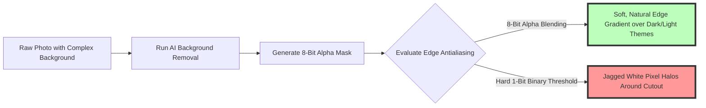

# Best Image Format for Transparent Images: PNG-24 vs WebP 2026 Guide

Transparent background images are fundamental assets in web development, UI design systems, e-commerce stores, and digital marketing campaigns. Whether you are adding a transparent company logo to a website header, showcasing product cutouts on an online store, or embedding icon graphics inside dark mode interfaces, selecting the correct transparent image format determines page loading speed and visual polish.

However, designers and developers face confusing choices when exporting transparent assets: **PNG-24**, **WebP (Lossless and Lossy Alpha)**, **AVIF**, and legacy **PNG-8**. Exporting transparent cutouts in outdated formats can lead to massive 5MB payloads, fuzzy text borders, or unsightly background halos.

This guide provides a comprehensive 2026 breakdown of transparent image formats, evaluates **PNG-24 vs. WebP**, explains alpha channel mechanics, details background removal and optimization workflows, and demonstrates how to deliver lightning-fast transparent graphics.

---

## Master Comparison Matrix: Transparent Asset Formats (2026)

To determine the ideal format for your transparent graphics, review this comprehensive specification matrix:

| Format / Asset Type | Recommended Use Case | Alpha Channel Depth | Compression Efficiency | Browser Support |
| :--- | :--- | :--- | :--- | :--- |
| **WebP (Lossy Alpha)** | **Product Cutouts & Photos** | **8-bit (256 Levels)** | **Highest (80% smaller than PNG)** | **99%+ Universal** |
| **WebP (Lossless Alpha)** | **Logos & Vector Icons** | **8-bit (256 Levels)** | **High (40% smaller than PNG)** | **99%+ Universal** |
| **PNG-24** | **Master Master Files / Print**| **8-bit (256 Levels)** | Baseline (Large Payload) | 100% Universal |
| **AVIF (Alpha)** | **Next-Gen Web Apps** | **8-bit & 12-bit Alpha** | **Maximum (90% smaller than PNG)**| 95%+ Modern |
| **PNG-8** | Legacy Low-Color Icons | 1-bit or 256 Colors | Moderate | 100% Universal |

---

## Technical Battle: PNG-24 vs. WebP for Transparent Assets

Why is **WebP** replacing PNG-24 as the default transparent image format for modern web applications?

```mermaid
graph TD
    A[Transparent Cutout Graphic (3 MB PNG-24 Source)] --> B{Select Web Export Codec}
    B -- PNG-24 (Lossless Deflate) --> C[File Size: 3.0 MB (Slow Page Loading)]
    C --> D[Pristine Quality but Bloats Core Web Vitals Payload]
    B -- WebP Lossless Alpha --> E[File Size: 1.8 MB (40% Savings vs PNG)]
    E --> F[Identical Pixel Quality with Smaller Footprint]
    B -- WebP Lossy Alpha (85% Quality) --> G[File Size: 450 KB (85% Savings vs PNG)]
    G --> H[Crisp Product Cutout with Instant Mobile Loading]
    style G fill:#bfb,stroke:#333,stroke-width:4px
    style E fill:#bfb,stroke:#333,stroke-width:4px
```

### 1. PNG-24: High Quality, Massive File Size
PNG-24 uses lossless Deflate compression, storing exact RGBA pixel data for every point in the canvas. While PNG-24 guarantees pristine visual fidelity, complex transparent photos (such as a model cutout or detailed shoe photo) generate file sizes between **2MB and 6MB**, severely hurting mobile page load speed and Google LCP scores.

### 2. WebP: Lossless and Lossy Alpha Flexibility
WebP offers two distinct modes for transparent images:
*   **WebP Lossless Alpha:** Replaces PNG-24 for logos, typography, and line art, offering **26% to 45% smaller file sizes** with 100% identical pixel quality.
*   **WebP Lossy Alpha:** Applies lossy compression to RGB color channels while keeping the 8-bit alpha transparency channel pristine. This mode shrinks 4MB transparent product photos down to **400KB**, saving 85% bandwidth with zero visible visual loss.

---

## Background Removal & Edge Antialiasing Mechanics

Creating professional transparent images requires isolating subjects cleanly without edge artifacts:



### Key Edge Cleanup Steps:
1.  **AI Subject Isolation:** Use our free, client-side [Background Remover](/tools/remove-bg) to isolate objects automatically using on-device machine learning models.
2.  **Alpha Matting & Defringing:** Ensure edge pixels calculate soft alpha gradients ($A = 0.1 \dots 0.9$) rather than hard binary cuts. Defringing removes residual background color halos before web export.

---

## Performance Benchmark: Transparent Image File Sizes

To visualize real-world bandwidth savings across different transparent formats, consider a $1400\times1400$ pixel transparent e-commerce product asset:

| Format / Preset | File Size | Bandwidth Savings vs. PNG | Perceived Visual Quality | Ideal Use Case |
| :--- | :--- | :--- | :--- | :--- |
| **PNG-24 (Uncompressed Master)** | 3.2 MB | Baseline (0%) | 100% Perfect | Master Archiving |
| **WebP (Lossless Alpha)** | 1.8 MB | 43.7% Savings | 100% Perfect | Logos & Typography |
| **WebP (Lossy Alpha at 85%)** | **420 KB** | **86.8% Savings** | Excellent (Imperceptible) | E-commerce Cutouts |
| **AVIF (Lossy Alpha at 80%)** | **260 KB** | **91.8% Savings** | Excellent (Imperceptible) | Modern Web Apps |

---

## Step-by-Step Transparent Image Workflow

Follow this workflow to prepare transparent graphics for web publishing:

1.  **Isolate Subject:** Remove photo backgrounds using our client-side [Background Remover](/tools/remove-bg).
2.  **Crop Transparent Canvas Bounds:** Trim empty transparent padding around object borders to shrink canvas size.
3.  **Choose Export Format:**
    *   Logos / Icons: Export as **WebP (Lossless)** or **PNG-24**.
    *   Product Photography: Export as **WebP (Lossy 85%)** or **AVIF**.
4.  **Implement HTML5 `<picture>` Markup:**
    ```html
    <picture>
      <source srcset="transparent-product.avif" type="image/avif">
      <source srcset="transparent-product.webp" type="image/webp">
      
    </picture>
    ```
5.  **Compress Files Locally:** Use our free, browser-based [Image Compressor](/tools/image-compressor) to optimize transparent file sizes without uploading files to remote servers.

---

## Step-by-Step Transparent Image Checklist

Before deploying transparent assets to live websites, run your graphics through this checklist:

*   **Alpha Channel Check:** Confirm graphics use an **8-bit alpha channel** for smooth edge antialiasing.
*   **Format Selection:** Export web cutouts as **WebP or AVIF** to achieve 80%+ file size savings.
*   **Canvas Trimming:** Crop empty transparent margin padding around object bounds.
*   **Theme Contrast Check:** Test transparent assets over dark (`#121212`) and light (`#FFFFFF`) backgrounds.
*   **Format Negotiation:** Implement HTML5 `<picture>` fallback tags for legacy browser compatibility.

---

## SVG Vector Transparency vs. Raster Alpha Channels

When choosing transparent formats for web UI elements, developers compare **SVG (Scalable Vector Graphics)** against raster alpha formats (PNG/WebP):
*   **SVG Vector Transparency:** SVG uses XML math paths (`fill-opacity="0.5"`, `opacity="0.8"`) to define scalable transparency. SVGs scale infinitely to 4K and 8K display resolutions without pixelation, making SVG ideal for UI icons, simple logos, and geometric graphic accents.
*   **Raster Alpha Channels (PNG / WebP):** For complex photographic cutouts (such as hair, apparel texture, or 3D renders), raster alpha channels are mandatory because vector paths cannot represent millions of individual pixel transparency variations.

---

## CSS `mask-image` Transparency Layering Techniques

Modern web layouts use transparent WebP and PNG graphics as compositing masks via CSS `mask-image`:
*   **Dynamic Image Masking:**
    ```css
    .hero-banner {
      mask-image: url('gradient-mask.webp');
      mask-size: cover;
      mask-repeat: no-repeat;
    }
    ```
*   **UI Effects:** Using an 8-bit alpha transparent WebP asset as a CSS mask allows frontend developers to create dynamic image transitions, non-rectangular card crops, and complex UI clip paths without duplicating DOM elements.

---

## Frequently Asked Questions

### What is the best image format for transparent images in 2026?
The best overall format for transparent web graphics is **WebP**. WebP provides 8-bit alpha transparency with file sizes up to **80% smaller than PNG-24** and near-universal (99%+) browser support across desktop and mobile devices.

### Is WebP better than PNG for transparent logos?
Yes. **Lossless WebP** produces transparent logos, brand marks, and vector icons that are **26% to 45% smaller than PNG-24** while preserving 100% identical pixel-perfect visual quality and smooth alpha antialiasing.

### Can I save transparent images as JPEGs?
No. **JPEG (.jpg) does not support transparency** because the standard JPEG container lacks an alpha channel. Saving a transparent cutout image as a JPEG fills transparent background regions with a solid white or black background box, obscuring lower web DOM elements.

### What is the difference between lossy and lossless transparent WebP?
**Lossless WebP** preserves 100% exact pixel data and is ideal for brand logos and typography. **Lossy WebP** applies lossy RGB color compression while keeping alpha transparency intact, shrinking 4MB transparent e-commerce product cutouts down to 400KB without visible quality loss.

### Is AVIF supported for transparent images?
Yes. **AVIF** supports 8-bit and 10-bit alpha channels, producing transparent cutouts up to 90% smaller than PNG-24. Serving AVIF with a WebP fallback via HTML5 `<picture>` tags delivers peak performance for modern browsers while preserving complete backward compatibility.

### How can I remove image backgrounds and convert to transparent WebP for free?
Use our free, browser-based [Background Remover](/tools/remove-bg) to isolate subjects automatically using on-device machine learning, then convert files to transparent WebP using our client-side [Image Converter](/tools/image-converter).