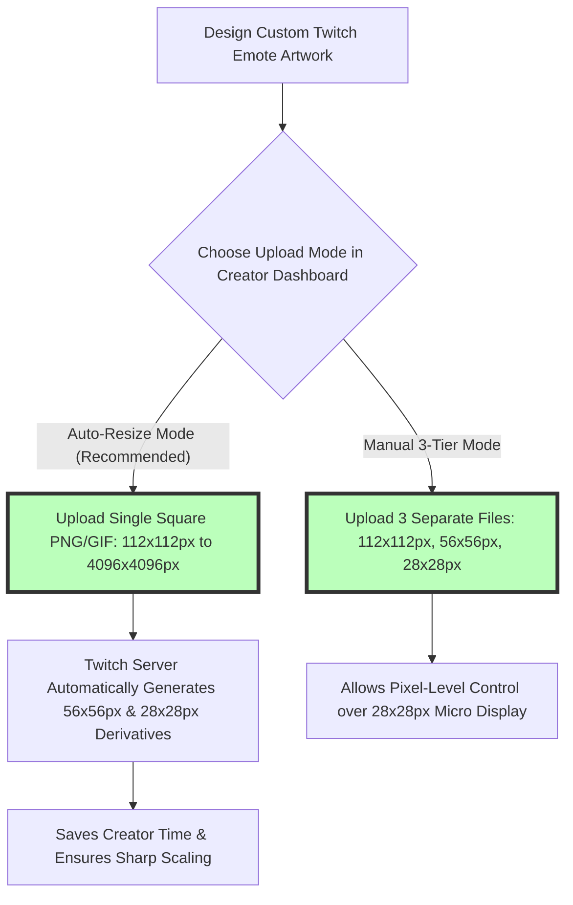

# Best Image Format for Twitch Emotes: 112x112, PNG, APNG & GIF Rules

Twitch streamer channels rely heavily on custom subscriber emotes, Tier 1/2/3 loyalty badges, and channel point rewards to build channel identity, foster community engagement, and reward subscribing fans. Whether you are an Affiliate or Partner streamer commissioning custom emote artwork or a digital illustrator designing pixel graphics for Twitch chat, meeting Twitch's strict technical emote guidelines is mandatory for channel approval.

However, Twitch enforces strict file format rules, resolution constraints, aspect ratios, file size limits (such as the **1MB auto-resize cap** or **512KB manual cap**), and anti-flicker policies. Submitting improperly formatted emotes can lead to blurry pixel rendering in mobile chat feeds, rejected uploads, or jagged white border halos against Twitch's dark theme (`#18181B`).

This guide analyzes Twitch's official emote specifications, compares static PNG vs. animated GIF vs. APNG formats, details auto-resize mode vs. manual 3-tier sizing ($112\times112$, $56\times56$, $28\times28\text{px}$), outlines chat theme contrast rules, and demonstrates how to optimize Twitch emotes.

---

## Master Specification Matrix: Twitch Channel Emotes & Badges

To ensure your channel graphics pass Twitch's automated moderation and manual review systems, follow these official Twitch specifications:

| Asset Type / Emote Slot | Recommended Format | Optimal Resolution | Sizing Mode | File Size Limit |
| :--- | :--- | :--- | :--- | :--- |
| **Static Subscriber Emotes** | **PNG-24 (.png)** | **$112 \times 112$ pixels** (1:1 Square)| Auto-Resize Mode | **Under 1 MB** (Auto-Resize) |
| **Static Emotes (Manual Sizing)**| **PNG-24 (.png)** | **$112\times112$, $56\times56$, $28\times28$** | Manual 3-Tier Mode | Under 512 KB per file |
| **Animated Subscriber Emotes**| **Animated GIF (.gif)** | **$112 \times 112$ pixels** (1:1 Square)| Auto-Resize Mode | **Under 1 MB** (Max 60 frames) |
| **Animated Emotes (Manual)** | **Animated GIF (.gif)** | **$112\times112$, $56\times56$, $28\times28$** | Manual 3-Tier Mode | Under 512 KB per file |
| **Sub Loyalty Badges** | **PNG-24 (.png)** | **$72\times72$, $36\times36$, $18\times18$** | Manual 3-Tier Sizing | Under 512 KB per file |

---

## Auto-Resize Mode vs. Manual 3-Tier Resolution Sizing

Twitch offers two methods for uploading emote artwork to Creator Dashboard:



### 1. Auto-Resize Mode (Recommended)
*   **Source Canvas:** Upload a single square 1:1 image between **$112\times112$ pixels and $4096\times4096$ pixels**.
*   **Server Processing:** Twitch's server automatically converts your high-res master file into the three required chat display sizes ($112\times112\text{px}$ for web popovers, $56\times56\text{px}$ for high-DPI Retina screens, and $28\times28\text{px}$ for standard inline chat).

### 2. Manual 3-Tier Mode
*   For intricate pixel art emotes or complex text lettering where automated scaling causes line blurriness, artists export three individual PNG files tuned specifically to **$112\times112\text{px}$**, **$56\times56\text{px}$**, and **$28\times28\text{px}$**.

---

## Technical Comparison: Static PNG vs. Animated GIF vs. APNG

Choosing the right file format for Twitch emotes depends on animation and transparency requirements:

```mermaid
graph TD
    A[Exporting Twitch Emote Artwork] --> B{Is the Emote Animated?}
    B -- NO: Static Emote --> C[Use PNG-24 with 8-bit Alpha Channel]
    C --> D[Smooth Edge Antialiasing over Dark & Light Chat Themes]
    B -- YES: Animated Emote --> E{Platform Upload Requirement}
    E -- Twitch Creator Dashboard Upload --> F[Export as Animated GIF (.gif)]
    F --> G[Keep under 60 Frames & 1MB File Cap]
    E -- Off-Platform / Better Quality --> H[Export as Animated PNG (.apng)]
    H --> I[Supports 16.7M Colors & Smooth 8-bit Alpha Transparency]
```

### 1. PNG-24 for Static Emotes (Mandatory Alpha Transparency)
Static emotes **must use PNG-24 format with alpha channel transparency**. Solid background squares are strictly discouraged by Twitch. Using 8-bit alpha transparency allows the emote to float smoothly over Twitch Dark Theme (`#18181B`) and Light Theme (`#FFFFFF`) without white border halos.

### 2. Animated GIF for Twitch Animated Emote Slots
Twitch requires **Animated GIF (`.gif`) format** for official subscriber animated emote slots:
*   **Frame Limit:** Maximum of **60 frames total**.
*   **Frame Rate & Flashing Policy:** Emotes must not flash or flicker more than **3 times within a 1-second period** to comply with photo-epileptic safety standards.
*   **File Size Limit:** Keep file size **under 1 MB** in auto-resize mode (or under 512KB per file in manual mode).

---

## Dark Theme & Light Theme Contrast Optimization

Over **75% of Twitch chat users** utilize Twitch Dark Mode (`#18181B`). Designers must ensure emotes remain legible against dark, light, and custom chat theme backgrounds:

```
+-----------------------------------------------------------------------+
|  EMOTE CONTRAST OUTLINE SAFEGUARD (Dark Mode vs Light Mode)           |
|                                                                       |
|  DARK THEME (#18181B)          LIGHT THEME (#FFFFFF)                  |
|  +-----------------------+     +-----------------------+              |
|  | [Dark Character]      |     | [Dark Character]      |              |
|  |  Subtle 1px White     |     |  Subtle 1px White     |              |
|  |  Outer Stroke (#FFF)  |     |  Outer Stroke (#FFF)  |              |
|  +-----------------------+     +-----------------------+              |
+-----------------------------------------------------------------------+
```

### Design Best Practices for Emote Artists:
1.  **Add a 1-Pixel Outer Stroke:** Adding a subtle 1-pixel white or light-gray outer stroke (`#FFFFFF` at 50% opacity) around dark-colored emote characters ensures they remain visible against Twitch's dark chat background.
2.  **Avoid Micro-Text:** Text smaller than 14pt becomes unreadable when scaled down to the inline $28\times28$ pixel chat size. Use large facial expressions, bold exaggerated features, and high-contrast color blocks.

---

## Step-by-Step Twitch Emote Optimization Workflow

Follow this workflow to create and export Twitch emotes:

1.  **Set Square Canvas:** Create a square $112\times112$ pixel (or $512\times512$ pixel) canvas in Photoshop, Illustrator, or Procreate.
2.  **Draw Artwork with Transparent Background:** Ensure the background layer is hidden.
3.  **Add Outer Stroke:** Apply a 1-pixel outer stroke to guarantee dark/light theme contrast.
4.  **Export Format:**
    *   Static Emote: Export as **PNG-24 with alpha transparency**.
    *   Animated Emote: Export as **Animated GIF** under 60 frames and under 1MB.
5.  **Compress Files Locally:** Use our free, client-side [Image Compressor](/tools/image-compressor) to reduce file sizes under **512 KB**.

---

## Step-by-Step Twitch Emote Checklist

Before submitting emotes to Twitch Creator Dashboard, run your files through this checklist:

*   **Aspect Ratio:** Verify canvas is a perfect **1:1 square**.
*   **File Size Cap:** Confirm static files are **under 1 MB** (auto-resize) or **under 512 KB** (manual).
*   **Transparency:** Confirm background is transparent with smooth 8-bit alpha antialiasing.
*   **Theme Contrast:** Test emote visibility against `#18181B` (Dark Theme) and `#FFFFFF` (Light Theme).
*   **Animated Frame Cap:** Verify animated GIFs contain **under 60 frames** with no rapid flashing.

---

## Twitch Channel Points Emotes vs. Subscriber Tier Slots

Streamers unlock emote slots progressively based on subscriber points and partner tier status:
*   **Tier 1, 2, and 3 Emote Slots:** Tier 1 subscribers unlock baseline channel emotes. Tier 2 and Tier 3 subscriber slots allow creators to offer exclusive animated GIF variants or special color modifications.
*   **Channel Points Emote Rewards:** Viewers redeem channel points for temporary emote rewards (such as "Modify Emote" filters like sunglasses or ghost effects). Designing static PNG-24 emotes with clean transparent background channels ensures Twitch's automated image filters apply correctly without visual distortion.

---

## Twitch Automated Copyright Image Hash Scans

Twitch enforces strict Terms of Service (ToS) and Community Guidelines covering copyright infringement:
*   **Perceptual Image Hash Matching:** Uploaded PNG and GIF emote files undergo automated perceptual hashing. Images featuring trademarked game logos, copyrighted anime characters, or celebrity portraits are flagged and rejected automatically.
*   **Original Asset Creation:** Always commission custom vector artwork or draw original digital illustrations to avoid channel emote strikes or creator dashboard suspensions.

---

## Frequently Asked Questions

### What is the best image format for Twitch emotes?
The best format for static Twitch emotes is **PNG-24 with alpha transparency**. For animated subscriber emotes, the required format is **Animated GIF (.gif)**.

### What are the required dimensions for Twitch emotes?
In **Auto-Resize Mode**, upload a single square PNG between **$112\times112\text{px}$ and $4096\times4096\text{px}$**. In **Manual Mode**, upload three separate files: **$112\times112\text{px}$**, **$56\times56\text{px}$**, and **$28\times28\text{px}$**.

### What is the maximum file size for Twitch emotes?
In Auto-Resize Mode, the maximum file size is **1 MB**. In Manual 3-Tier Mode, the maximum file size is **512 KB per file**.

### Why does my Twitch emote look blurry in chat?
Emotes look blurry when complex artwork with fine lines or small text is scaled down to inline $28\times28\text{px}$ chat size. Designing bold, exaggerated expressions with 1-pixel outer strokes preserves clarity.

### Can I use APNG for Twitch animated emotes?
Twitch Creator Dashboard requires **Animated GIF** format for animated emote slots. However, APNG can be used for Discord emojis or off-platform web graphics.

### How can I compress Twitch PNG emotes under 512KB securely?
To compress your Twitch PNG emotes without uploading files to external third-party cloud servers, use our free, browser-based [Image Compressor](/tools/image-compressor). The tool processes files locally in your browser.
