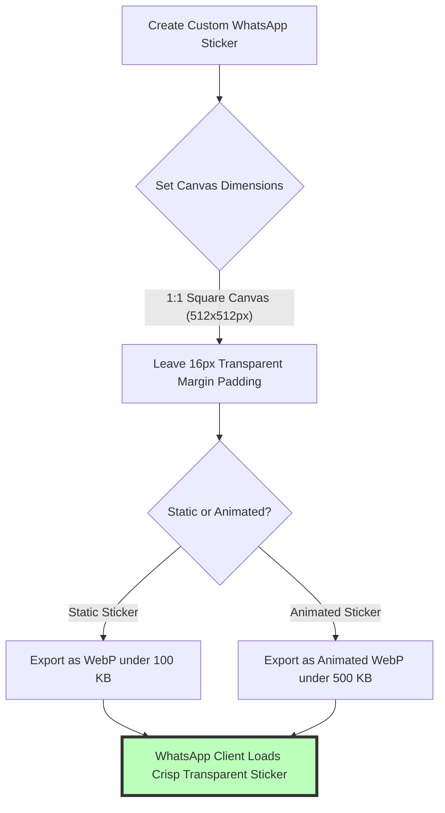

# Best Image Format for WhatsApp: DP, Status Stories & WebP Stickers Guide

WhatsApp is one of the world's most popular instant messaging and business communication platforms, serving over 2 billion active users daily across iOS, Android, macOS, Windows, and WhatsApp Web. Whether you are updating your personal profile picture (DP), publishing vertical Status story updates, creating custom WebP sticker packs, or sharing high-resolution photos with clients, navigating WhatsApp's compression engine is essential for clear media delivery.

However, WhatsApp applies aggressive automated server compression algorithms to media shared through standard chat channels. Uploading improperly formatted images, low-resolution profile photos, or un-optimized sticker packs can result in blurry, pixelated photos, truncated circular avatars, or sticker rejection errors.

This guide analyzes WhatsApp's official image specifications, compares JPEG vs. PNG vs. WebP performance, details Display Picture ($1080\times1080\text{px}$) and 9:16 Status story ($1080\times1920\text{px}$) dimensions, outlines custom WebP sticker guidelines ($512\times512\text{px}$ under 100KB), and demonstrates how to bypass compression using Document mode.

---

## Master Specification Matrix: WhatsApp Media Assets

To ensure your profile pictures, status updates, custom stickers, and chat photos render cleanly across WhatsApp clients, follow these official specifications:

| Media Asset / Slot | Recommended Format | Optimal Resolution | Aspect Ratio | Maximum File Size Limit |
| :--- | :--- | :--- | :--- | :--- |
| **Custom Stickers** | **WebP (.webp)** | **$512 \times 512$ pixels**| **1:1 Square**| **Under 100 KB** (Static) / < 500KB (Anim) |
| **Profile Picture (DP)** | **JPEG (.jpg) or PNG** | **$1080 \times 1080$ pixels**| **1:1 Circular Crop**| Under 5 MB |
| **WhatsApp Status Story**| **JPEG (.jpg)** | **$1080 \times 1920$ pixels**| **9:16 Full Vertical**| Under 16 MB |
| **Standard Chat Photo** | **JPEG (.jpg)** | **$1600 \times 1200$ pixels**| Free Aspect Ratio | Under 16 MB (Server compressed) |
| **Uncompressed Document**| **PNG / RAW / JPEG** | Original Master Resolution | Any Ratio | **Up to 2 GB per file** (Document Mode) |

---

## Technical Guide: Custom WebP Stickers ($512\times512\text{px}$)

Creating custom static or animated sticker packs for WhatsApp requires adhering to strict platform encoding rules:



### Key Technical Rules for WhatsApp WebP Stickers:
1.  **Canvas & Aspect Ratio:** Design sticker artwork on a square **$512\times512$ pixel canvas** (1:1 ratio).
2.  **16-Pixel Margin Padding:** Leave a **16-pixel transparent margin** around the outer border of your sticker graphic. Placing artwork directly against canvas edges causes clipping when rendered in chat bubbles.
3.  **Strict File Caps:** Static stickers must stay **under 100 KB** in file size. Animated WebP stickers must stay **under 500 KB**.

---

## WhatsApp Status Stories & Profile Picture (DP) Guidelines

Optimizing profile photos and vertical status updates prevents auto-cropping distortions:

### 1. Profile Picture / Display Picture ($1080\times1080\text{px}$)
*   WhatsApp crops profile photos using a **circular crop mask**. 
*   Center your face, brand logo, or mascot within a central safety circle (the middle 80% of the canvas) to prevent corners from being cropped out.

### 2. WhatsApp Status Stories ($1080\times1920\text{px}$)
*   Design vertical status updates at **$1080\times1920$ pixels** (9:16 vertical ratio). 
*   Keep text headlines and call-to-action buttons clear of the top 150 pixels (status bar) and bottom 200 pixels (reply bar).

---

## How to Bypass WhatsApp Compression: The Document Sharing Trick

WhatsApp automatically re-encodes photos sent via the standard "Gallery / Photo" button, downsampling resolution to 1600px and compressing file size down to ~150KB:

```mermaid
graph TD
    A[Share High-Res Photo on WhatsApp] --> B{Select Upload Method}
    B -- Standard Photo Upload --> C[WhatsApp Transcoder Downsamples to 1600px & Compresses heavily]
    C --> D[Result: Loss of Fine Detail & Color Artifacts]
    B -- Send as Document (Paperclip -> Document) --> E[File Transmitted as 100% Uncompressed Binary Data]
    E --> F[Result: Recipient Gets Original 24MP Master File (Up to 2GB)]
    style F fill:#bfb,stroke:#333,stroke-width:4px
    style C fill:#f99,stroke:#333,stroke-width:4px
```

### How to Send Uncompressed Photos:
1.  Open your WhatsApp chat conversation.
2.  Tap the **Attachment icon (Paperclip / +)** and select **Document** (do NOT select "Gallery" or "Photos").
3.  Browse and select your original JPEG, PNG, or RAW photo file.
4.  WhatsApp transmits the exact binary file up to **2 GB in size** with **0% compression loss**.

---

## Step-by-Step Optimization Workflow for WhatsApp Assets

Follow this workflow to prepare graphics for WhatsApp:

1.  **Set Target Canvas:**
    *   Stickers: $512\times512$ pixels (WebP format under 100KB with 16px padding).
    *   Profile Picture: $1080\times1080$ pixels (JPEG format centered).
    *   Status Story: $1080\times1920$ pixels (JPEG format 9:16 ratio).
2.  **Tag sRGB Color Space:** Verify files are saved in the **sRGB color profile** to avoid muted colors on mobile OLED displays.
3.  **Compress Locally:** Use our free, client-side [Image Compressor](/tools/image-compressor) to pre-compress JPEGs to under **1 MB** before sending.

---

## Step-by-Step WhatsApp Image Checklist

Before uploading media to WhatsApp, run your assets through this checklist:

*   **Sticker Format:** Confirm custom stickers use **WebP format** at $512\times512\text{px}$ under 100KB.
*   **Profile Centering:** Keep profile logos centered within a circular crop safety mask.
*   **Status Dimensions:** Confirm status graphics use the vertical **9:16 ratio** ($1080\times1920\text{px}$).
*   **HD Option / Document Share:** Use the "HD" upload button or Document mode for master photo delivery.
*   **Color Profile:** Tag all images with the **sRGB color space profile**.

---

## WhatsApp Business Product Catalog Image Specifications

For e-commerce sellers and small businesses using **WhatsApp Business**, product catalog listings showcase inventory directly inside customer chat threads:
*   **Optimal Catalog Dimensions:** $500\times500$ pixels or **$1024\times1024$ pixels** (1:1 square aspect ratio).
*   **Format & Compression:** Upload catalog product photos as **JPEG (.jpg)** compressed at **80-85% quality**. Square 1:1 photos with clean white background lighting increase conversion rates on mobile screens.
*   **Multi-Photo Gallery:** WhatsApp Business permits up to 10 photos per catalog item listing. Keep file sizes between 300KB and 600KB per image for fast mobile browsing.

---

## End-to-End Encryption & Local Media Storage

Understanding how WhatsApp handles media security protects private user data:
*   **End-to-End Media Encryption:** Photos, videos, and documents sent through WhatsApp chat channels are encrypted with unique keys on the sender's device before transmission over Meta's servers, ensuring only the intended recipient can decrypt and view media payload data.
*   **Local Device Caching:** Sent and received media assets are stored locally in smartphone device storage (such as the `WhatsApp/Media` folder on Android). Regularly cleaning cached duplicate media prevents phone storage overload.

---

## Animated WebP Sticker Technical Specifications

Animated sticker packs must comply with strict animation parameters to ensure smooth chat playback:
*   **Animation Frame Rate:** Limit animation playback to **15 to 30 frames per second (FPS)**.
*   **Looping Rules:** Animated WebP stickers must loop infinitely or stop on a clean static final frame.
*   **Memory Footprint:** Keep total animated WebP sticker payload under **500 KB** to prevent animation stuttering on budget mobile devices.

---

## Frequently Asked Questions

### What is the best image format for WhatsApp stickers?
The required format for WhatsApp stickers is **WebP (.webp)**. Static stickers must be **$512\times512$ pixels** (1:1 square ratio) and under **100 KB** in file size with a 16-pixel transparent margin padding around outer artwork borders.

### How can I send photos on WhatsApp without losing quality?
To send photos without any compression quality loss, tap the attachment paperclip icon and select **Document** mode instead of "Gallery". This transmits original master files up to 2GB in size directly without server-side re-encoding or downsampling.

### What are the optimal dimensions for WhatsApp Status photos?
The optimal dimensions for WhatsApp Status stories are **$1080\times1920$ pixels** (9:16 vertical aspect ratio). Keep key text headlines in the central 70% of the canvas to clear top navigation bars and bottom reply overlays.

### What is the recommended size for a WhatsApp profile picture?
The recommended size for a WhatsApp profile picture (DP) is **$1080\times1080$ pixels** (1:1 square ratio). Center your brand logo or face within the central safety circle to fit within WhatsApp's circular crop mask cleanly.

### Why do photos look blurry when sent on WhatsApp?
WhatsApp's server automatically compresses standard chat photos to save cellular bandwidth. Pre-compressing photos under 1MB using local browser tools or using **HD mode** / **Document mode** prevents severe server-side compression degradation.

### How can I create and compress WebP stickers securely?
To create and compress WebP stickers without uploading files to external third-party cloud servers, use our free, browser-based [Image Converter](/tools/image-converter). The tool processes files locally in your browser RAM, guaranteeing 100% data privacy and instant file exports.
