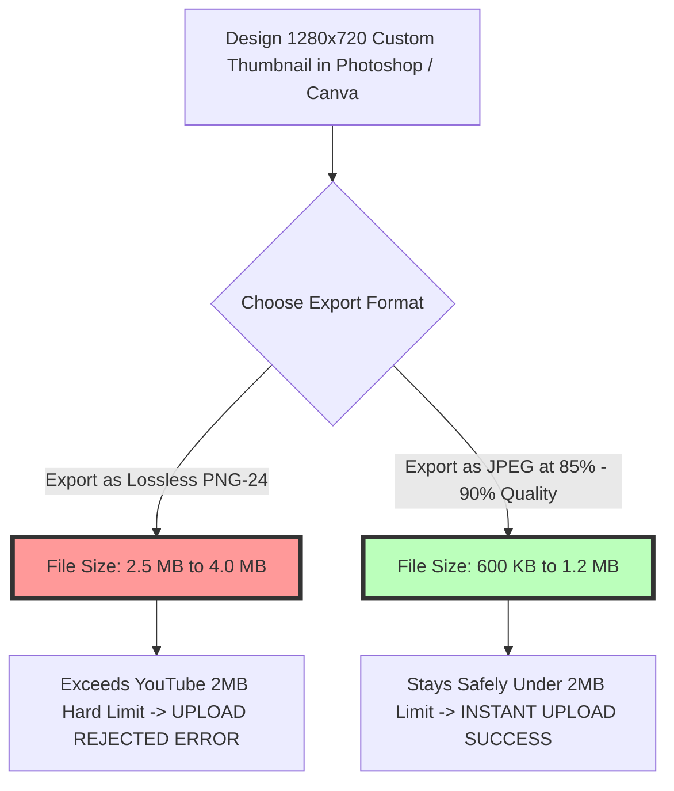

# Best Image Format for YouTube Thumbnails: 1280x720 & 2MB Limit Guide

On YouTube, video thumbnails are the single most influential factor driving **Click-Through Rate (CTR)**, viewer impressions, and channel subscriber growth. Along with video titles, custom thumbnails act as visual movie posters across YouTube search results, home feed recommendations, related video sidebars, and TV app interfaces. Over **90% of top-performing YouTube videos** feature custom thumbnail graphics.

However, YouTube enforces strict technical rules: a **2 MB hard file size limit**, a mandatory **16:9 widescreen aspect ratio**, an optimal **$1280\times720$ pixel resolution**, and bottom-right corner timestamp overlays. Submitting improperly formatted graphics or bloated uncompressed PNGs leads to upload failure errors (e.g., "File exceeds 2MB limit") or fuzzy compression halos around thumbnail text.

This guide analyzes YouTube's official thumbnail specifications, compares JPEG vs. PNG performance under the 2MB limit, details 16:9 aspect ratio rules, outlines timestamp UI safe zones, and demonstrates how to compress YouTube thumbnails to maximize CTR.

---

## Master Specification Matrix: YouTube Thumbnail Requirements

To ensure your custom thumbnails upload cleanly and render with maximum visual punch across desktop monitors, mobile phones, and 4K TV screens, follow these official YouTube specifications:

| Parameter / Feature | Official YouTube Requirement | Optimal Best Practice Target | Key Optimization Rule |
| :--- | :--- | :--- | :--- |
| **Recommended Format** | **JPEG (.jpg), PNG (.png), GIF** | **JPEG (.jpg) compressed at 85-90%**| JPEG stays well under 2MB cap |
| **Optimal Dimensions** | **$1280 \times 720$ pixels** | $1280 \times 720$ pixels | Minimum width 640px |
| **Aspect Ratio** | **16:9 Widescreen Ratio** | 16:9 Widescreen Ratio | Matches YouTube video player |
| **Hard File Size Cap** | **Strict 2 MB Limit** | **800 KB to 1.5 MB** | Exceeding 2MB rejects upload |
| **Color Profile Space** | **sRGB Color Space** | **sRGB Color Space** | Vivid saturation on mobile screens |
| **Timestamp Safe Zone**| Bottom-Right Corner Overlay | Keep text clear of bottom-right 20% | Avoid duration badge coverage |

---

## The 2MB File Cap: Technical Battle of JPEG vs. PNG

Why is **JPEG (.jpg)** strongly recommended over PNG for high-impact YouTube thumbnails?



### 1. The PNG 2MB File Cap Trap
Modern YouTube thumbnails feature complex visual elements: cutout photo headshots, high-saturation gradient backgrounds, glowing neon text, brush strokes, and 3D render graphics. 

Exporting a complex, multi-layered $1280\times720$ graphic as a 24-bit PNG results in file sizes between **2.5 MB and 4.5 MB**, triggering YouTube's strict **2MB upload rejection error**.

### 2. Why JPEG at 85-90% Quality is the Winner
Exporting as a **JPEG (.jpg)** compressed at **85% to 90% quality** delivers crisp visual details while maintaining file sizes between **600 KB and 1.2 MB**—well below YouTube's 2MB cap. JPEG efficiently compresses photographic background textures and face cutouts while keeping text readable.

---

## YouTube UI Safe Zones: Avoiding Timestamp Overlays

A frequent design mistake on YouTube thumbnails is placing crucial text headlines, subject faces, or brand logos in the bottom-right corner of the canvas:

```
+-----------------------------------------------------------------------+
|  YOUTUBE THUMBNAIL CANVAS: 1280px x 720px (16:9 Aspect Ratio)         |
|                                                                       |
|  +-------------------------------------------------------------+       |
|  |  PRIMARY VISUAL SAFE ZONE                                   |       |
|  |  Place Creator Face, Main Headline Text & Subject Here      |       |
|  |                                                             |       |
|  +-------------------------------------------------------------+       |
|                                                     +-----------------+ |
|  KEEP CLEAR OF BOTTOM-RIGHT CORNER                  | DURATION BADGE  | |
|  (Avoid placing key text or small faces here)       | [ 14:25 ]       | |
+-----------------------------------------------------|-----------------|-+
```

### Safe Zone Rules for Thumbnail Creators:
*   **Bottom-Right Timestamp Overlay:** YouTube overlays a dark video duration timestamp badge (e.g., `14:25` or `LIVE`) in the bottom-right corner of every thumbnail card across search grids and mobile feeds.
*   **Design Rule:** Keep all critical text, facial expressions, and graphic elements at least **150 pixels away** from the bottom-right corner to prevent timestamp occlusion.

---

## Visual Psychology & Click-Through Rate (CTR) Optimization

To maximize YouTube search rankings and recommendation distribution, thumbnails must trigger visual curiosity:

```mermaid
graph LR
    A[Thumbnail Displayed in YouTube Search / Feed] --> B[Visual Contrast Taps Eye Attention]
    B --> C[Expressive Human Face + High-Contrast 3-Word Headline]
    C --> D[Higher Click-Through Rate (CTR %)]
    D --> E[YouTube Recommendation Engine Pushes Video to FYP]
    style E fill:#bfb,stroke:#333,stroke-width:4px
```

### Key Visual Rules:
1.  **3-Word Headline Rule:** Never repeat the exact video title on the thumbnail. Use 2 to 4 bold, high-contrast words (e.g., "STOP DOING THIS!") using clean typography (such as Impact, Montserrat, or Bebas Neue).
2.  **High Color Saturation & Contrast:** Boost background saturation by +15% and sharpen face cutouts to ensure the thumbnail pops against YouTube's dark mode (`#0F0F0F`) and light mode (`#FFFFFF`) feed backgrounds.
3.  **sRGB Color Profile Tagging:** Always export thumbnails in the **sRGB color space** to prevent color desaturation on smartphone displays.

---

## Step-by-Step Optimization Workflow for YouTubers

Follow this workflow to prepare custom thumbnails for YouTube:

1.  **Set Canvas Dimensions:** Create a canvas of **$1280\times720$ pixels** (16:9 widescreen ratio).
2.  **Apply Safe Zone Layout:** Position creator face cutouts on the left or center, placing bold text headlines on the top/left, keeping the bottom-right clear.
3.  **Convert Color Space to sRGB:** Ensure file is saved in the **sRGB color profile**.
4.  **Compress File Under 2MB:** Use our free, browser-based [Image Compressor](/tools/image-compressor) to reduce JPEG file sizes below **1.2 MB**.

---

## Step-by-Step YouTube Thumbnail Checklist

Before uploading custom thumbnails to YouTube Studio, run your assets through this checklist:

*   **File Size Cap:** Verify file size is **strictly under 2 MB** (ideally 600KB – 1.2MB).
*   **Dimensions:** Confirm canvas resolution is **$1280\times720$ pixels** (16:9 ratio).
*   **Format:** Export as **JPEG (.jpg)** compressed at 85-90% quality.
*   **Timestamp Safe Zone:** Ensure bottom-right corner is clear of key text and logos.
*   **Color Profile:** Tag all images with the **sRGB color space profile**.

---

## YouTube Image CDN Architecture (`i.ytimg.com`) & WebP Derivatives

When custom thumbnails are uploaded to YouTube Studio, YouTube processes files through its dedicated `i.ytimg.com` content delivery network:
*   **Automated Responsive Resizing:** YouTube generates scaled thumbnail derivatives ($120\times90\text{px}$, $320\times180\text{px}$, $480\times360\text{px}$, and $1280\times720\text{px}$) to serve different viewports across mobile apps, desktop feeds, and Smart TV interfaces.
*   **WebP Transcoding Pipeline:** Source JPEGs are automatically re-encoded into WebP format for fast mobile client delivery. Pre-compressing source JPEGs to **800KB–1.2MB** prevents double-compression visual artifacts during YouTube's internal WebP encoding.

---

## YouTube "Test & Compare" (A/B Thumbnail Testing) Workflows

YouTube's built-in **Test & Compare** feature allows creators to upload up to 3 thumbnail variations for a single video:
*   **A/B Test Execution:** YouTube displays thumbnail variations equally across audience feeds, tracking watch time share to declare a winning thumbnail.
*   **Batch Export Preparation:** Export all 3 test thumbnail variations at $1280\times720\text{px}$ in **JPEG format** under 1.2MB to ensure fast automated processing during A/B testing cycles.

---

## Frequently Asked Questions

### What is the best image format for YouTube thumbnails?
The best format for YouTube thumbnails is **JPEG (.jpg)** compressed at 85-90% quality. JPEG delivers sharp visual quality while keeping file sizes between 600KB and 1.2MB, well below YouTube's strict 2MB upload limit.

### What are the official dimensions for YouTube thumbnails?
The official dimensions for YouTube thumbnails are **$1280\times720$ pixels** with a minimum width of 640 pixels and a mandatory **16:9 widescreen aspect ratio** that matches the YouTube video player.

### What happens if my YouTube thumbnail exceeds 2MB?
If your thumbnail file exceeds the strict **2 MB limit**, YouTube Studio will reject the upload with a "File exceeds 2MB limit" error message. Using our free client-side [Image Compressor](/tools/image-compressor) shrinks files under 2MB without quality loss.

### Can I use PNG for YouTube thumbnails?
Yes, YouTube accepts PNG format. However, complex multi-layered PNG graphics with background gradients frequently exceed the 2MB file size cap. Saving as an 85-90% quality JPEG is strongly recommended for large thumbnail files.

### Why do my thumbnail colors look dull on mobile phones?
Thumbnail colors look dull when exported in non-standard color spaces (like Adobe RGB or Display P3). Exporting files tagged with the **sRGB color profile** ensures vivid color saturation across mobile phones and TV screens.

### How can I compress YouTube thumbnails under 2MB securely?
To compress your $1280\times720\text{px}$ YouTube thumbnails without exposing files to external third-party cloud servers, use our free, browser-based [Image Compressor](/tools/image-compressor). The tool processes files locally in your browser RAM, ensuring 100% data privacy.
