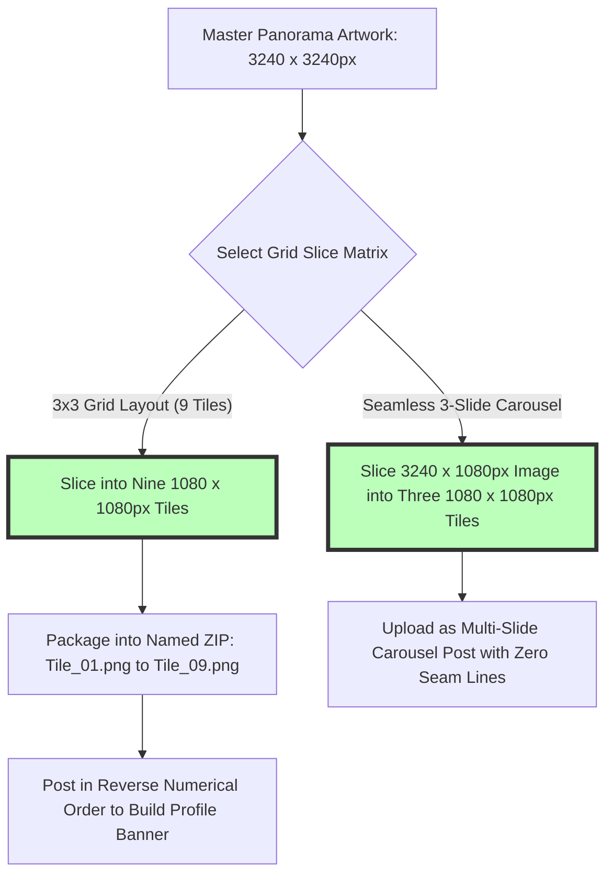
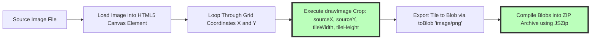

# Best Image Splitting Tool Online: Instagram 3x3 Grid & Tiles Guide

Creative digital marketing on visual platforms like Instagram, Pinterest, TikTok, and LinkedIn relies heavily on multi-image storytelling, panoramic grid banners, and interactive swipeable carousel posts. Splitting a high-resolution panorama or single artwork into a seamless **3x3 grid banner** (9 individual square posts) or a multi-slide seamless carousel transforms standard profile feeds into immersive visual experiences that double engagement rates.

However, content creators and graphic designers often face technical frustrations: online image splitters that force users to upload personal photos to third-party cloud servers, tools that compress images into blurry low-res tiles, interfaces that add intrusive watermarks, or platforms that require paid monthly subscriptions for simple 3x3 grid exports.

This guide evaluates the best online image splitting tools, details **Instagram 3x3 grid dimensions** ($3240\times3240\text{px}$ to nine $1080\times1080\text{px}$ tiles), explains seamless carousel cutting mechanics, provides chronological posting guidelines, and demonstrates how to slice images locally in your browser.

---

## Master Comparison Matrix: Image Splitting Tools & Features

To evaluate how browser-based image splitters compare to cloud services and desktop editing applications, review this specification matrix:

| Feature / Capability | On-Device Browser Splitter | Cloud Photo Splitters | Professional Desktop Editors |
| :--- | :--- | :--- | :--- |
| **Privacy & Security** | **100% Private (Local Memory)**| Low (Uploaded to Remote Cloud) | High (Local Machine RAM) |
| **Processing Speed** | **Instant (Zero Upload Delay)**| Slow (Network Dependent) | Fast (CPU / GPU Processing) |
| **Grid Preset Support** | **3x3, 3x1, 3x2, Custom NxM**| 3x3 Only / Fixed Presets | Manual Slicing Guides |
| **Export Format** | **ZIP Archive & Individual PNG**| Single Image Downloads | Export As Layers / Slice Tool |
| **Cost & Watermarks** | **100% Free / No Watermarks**| Watermarked / Subscription | Expensive Monthly Subscriptions |

---

## Instagram Grid Math: 3x3 Banner & Multi-Slide Carousel Slicing

How do high-resolution master graphics translate into seamless tiles across mobile feeds?



### 1. Instagram 3x3 Giant Grid Specifications
*   **Master Canvas Size:** Create your master graphic at **$3240 \times 3240$ pixels** (1:1 square master aspect ratio).
*   **Grid Slicing:** The image splitter cuts the canvas into 9 identical square tiles, each measuring exactly **$1080 \times 1080$ pixels** (the native high-definition resolution for Instagram feed posts).
*   **Sequential Numbering:** Tiles are exported as numbered assets (`Tile_01.png` through `Tile_09.png`) to ensure hassle-free uploading.

### 2. Seamless Panoramic Carousel Specifications
*   **Master Panorama Size:** For a 3-slide seamless carousel, create a master banner measuring **$3240 \times 1080$ pixels** (3:1 aspect ratio).
*   **Horizontal Slice:** Slicing the master banner horizontally yields three $1080\times1080$ pixel slides. When viewers swipe through the carousel post, continuous visual elements (such as text or subjects across slide boundaries) align seamlessly without gap lines.

---

## Technical Mechanics: HTML5 Canvas Slice Math & Zero-Compression Export

How does an on-device image splitter slice graphics directly in browser memory without quality loss?



### HTML5 Canvas Crop Equation
For an image of width $W$ and height $H$ divided into $cols$ columns and $rows$ rows:
1. Each tile width ($w_{tile}$) and height ($h_{tile}$) are calculated as:
   $$w_{tile} = \frac{W}{cols}, \quad h_{tile} = \frac{H}{rows}$$
2. For tile at column $c$ and row $r$, the source crop origin $(x_{src}, y_{src})$ is positioned at:
   $$x_{src} = c \cdot w_{tile}, \quad y_{src} = r \cdot h_{tile}$$
3. The tool executes `ctx.drawImage(sourceImg, x_src, y_src, w_tile, h_tile, 0, 0, w_tile, h_tile)`, rendering the sub-region into local memory without server round-trips.

---

## Step-by-Step Instagram Grid Posting Order (Reverse Sequence)

Uploading a 3x3 grid banner requires posting tiles in **strict reverse order** so that Instagram's profile layout places the images in the correct visual position:

```
+---------------------------------------------------------------+
|  INSTAGRAM PROFILE 3x3 GRID POSTING ORDER GUIDE               |
|                                                               |
|  Tiles On Disk:            Correct Posting Sequence:          |
|  [ 1 ] [ 2 ] [ 3 ]         Post 9th -> Post 8th -> Post 7th    |
|  [ 4 ] [ 5 ] [ 6 ]         Post 6th -> Post 5th -> Post 4th    |
|  [ 7 ] [ 8 ] [ 9 ]         Post 3rd -> Post 2nd -> Post 1st    |
|                                                               |
|  Resulting Profile View:                                      |
|  [ Tile 1 ] [ Tile 2 ] [ Tile 3 ]                             |
|  [ Tile 4 ] [ Tile 5 ] [ Tile 6 ]                             |
|  [ Tile 7 ] [ Tile 8 ] [ Tile 9 ]                             |
+---------------------------------------------------------------+
```

### Posting Steps for Creators:
1.  **Start with Tile #9:** Upload `Tile_09.png` (bottom-right tile) as your first Instagram post.
2.  **Post in Descending Order:** Continue posting tiles in reverse sequence: #8, #7, #6, #5, #4, #3, #2.
3.  **Finish with Tile #1:** Post `Tile_01.png` (top-left tile) as your final 9th upload.
4.  **Verify Layout:** Open your Instagram profile page to view your complete, high-resolution $3\times3$ grid banner.

---

## Use Cases for Online Image Splitting

Image splitters are indispensable tools across multiple social media platforms:

1.  **Instagram Profile Banners:** Transform Instagram profile pages into huge, eye-catching visual showcases for product launches, brand campaigns, and music album releases.
2.  **Seamless Swipe Carousels:** Cut long infographic diagrams or panoramic landscape photos into continuous multi-card carousel slides.
3.  **Pinterest Pin Grids:** Split tall vertical infographics into structured pin series for Pinterest mood boards.
4.  **Print & Poster Tiling:** Slice giant artwork files into smaller printable sections (such as A4 or Letter sheets) for DIY wall poster assembly.

---

## Step-by-Step Image Splitting & Export Workflow

Follow this simple workflow to split your images using our free tool:

1.  **Upload Image:** Drag and drop your graphic into our free [Image Splitter](/tools/image-splitter).
2.  **Select Grid Configuration:** Choose a preset (3x3 Grid, 3x1 Carousel, 3x2 Banner) or specify custom rows ($1\dots10$) and columns ($1\dots10$).
3.  **Preview Crop Lines:** Inspect interactive grid overlay lines to ensure important subjects aren't split across awkward tile boundaries.
4.  **Download ZIP Archive:** Click "Download All Tiles as ZIP" to download your processed, zero-loss PNG files in one click.

---

## Step-by-Step Grid Splitting Checklist

Before posting grid tiles to social media, run your graphics through this quality checklist:

*   **Master Resolution:** Verify source image is at least **$3240 \times 3240$ pixels** for 3x3 grids.
*   **Tile Quality:** Export tiles as **PNG or 90%+ JPEG** to prevent compression artifacts.
*   **Reverse Posting Order:** Confirm you post tiles starting from #9 down to #1.
*   **Seam Verification:** Test carousel slide edges side-by-side to verify 100% seamless alignment.

---

## Frequently Asked Questions

### What is the best image splitting tool online in 2026?
The best online image splitter is **Image Tool Stack's [Image Splitter](/tools/image-splitter)**. It splits images 100% locally in your browser with zero server uploads, offering custom grid sizes, instant ZIP downloads, and zero quality loss across desktop and mobile devices.

### How do I split an image into a 3x3 grid for Instagram?
Upload your image to our [Image Splitter](/tools/image-splitter), select the **3x3 Grid preset**, and click download. You will receive 9 numbered $1080\times1080\text{px}$ high-definition tiles packed in a convenient ZIP file ready for uploading.

### In what order should I post 3x3 grid tiles on Instagram?
Post the tiles in **reverse numerical order** starting with Tile #9, then Tile #8, down to Tile #1. This ensures Instagram's feed places the images in the correct visual sequence on your profile page.

### Does splitting an image reduce its quality?
No. Our client-side image splitter uses lossless HTML5 Canvas rendering to slice your source graphic at **100% native resolution** without re-compression degradation.

### Can I split images into custom grid sizes like 3x2 or 4x4?
Yes. You can specify any custom row and column combination (from 1x2 up to 10x10) to create carousels, vertical banners, or custom puzzle grids.

### Is my photo uploaded to a server when using the image splitter?
No. All image cropping, slicing, and ZIP file generation happen **entirely inside your local web browser RAM**. Your images never leave your computer or smartphone.
