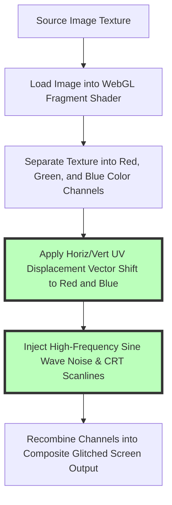

# Best Online Glitch Effect Generator: Free VHS & Cyberpunk Art Guide

Glitch art, VHS retro aesthetics, and cyberpunk digital distortion have exploded across modern graphic design, music album cover art, gaming thumbnails, synthwave marketing campaigns, and video production. Recreating authentic 1980s analog TV tracking errors, CRT scanline artifacts, chromatic aberration color splits, and datamosh digital noise gives photographs an edgy, futuristic, and nostalgic aesthetic.

However, content creators and graphic designers often encounter frustrating hurdles when generating glitch art online: cloud services like PhotoMosh or Pixoate that force users to upload personal photos to third-party servers, tools that hide high-resolution exports behind subscription paywalls, interfaces that apply intrusive watermarks, or laggy web apps that crash under 4K image loads.

This guide evaluates the best online glitch effect generators, details **chromatic aberration (RGB color channel shifting)**, explains WebGL fragment shader displacement math, outlines VHS scanline and CRT monitor emulation parameters, and demonstrates how to generate glitch art locally in your browser.

---

## Master Comparison Matrix: Glitch Effect Generators & Shaders

To evaluate how browser-based WebGL glitch generators compare to cloud filter web apps and desktop video suites, review this specification matrix:

| Feature / Effect | On-Device WebGL Generator | Cloud Filter Web Apps | Desktop Photoshop / After Effects |
| :--- | :--- | :--- | :--- |
| **Privacy & Security** | **100% Private (Local RAM)** | Low (Uploaded to Cloud) | High (Local Machine RAM) |
| **Render Performance** | **60 FPS Real-Time GPU** | Slow (Pre-rendered GIFs) | Fast (GPU Shader Pipeline) |
| **RGB Chromatic Split** | **Custom Offset & Angle** | Fixed Preset Filters | Manual Channel Offset Layers |
| **VHS CRT Scanlines** | **Adjustable Frequency & Density**| Basic Overlays | Custom Scanline Texture Masks |
| **Cost & File Limits** | **100% Free / Zero Limits** | Subscription Paywalls | Expensive Monthly Subscriptions |

---

## Technical Mechanics: WebGL Shaders & RGB Chromatic Aberration

How do real-time WebGL fragment shaders transform standard photographs into cyberpunk digital glitch art?



### 1. RGB Chromatic Aberration (Color Channel Shifting)
In real-world camera optics, chromatic aberration occurs when lenses fail to focus all color wavelengths to the same convergence point. In digital glitch art:
* The shader decouples the image texture into three distinct color channels ($R$, $G$, $B$).
* The shader applies a directional displacement offset vector $(\Delta x, \Delta y)$ to the Red and Blue channels while keeping the Green channel anchored:
  $$R_{pixel}(x, y) = \text{Texture}_R(x + \Delta x, y + \Delta y), \quad B_{pixel}(x, y) = \text{Texture}_B(x - \Delta x, y - \Delta y)$$
* Recombining the offset channels produces striking cyan/magenta color fringes around object edges.

### 2. CRT Scanline & VHS Tracking Error Emulation
To simulate vintage cathode-ray tube (CRT) monitors and analog magnetic tape jitter:
* **Horizontal Scanlines:** A sine wave function modulates brightness across vertical Y coordinates:
  $$I_{scanline}(y) = 1.0 - A \cdot \sin^2(y \cdot \text{Frequency})$$
* **Vertical Jitter / Datamoshing:** Pseudorandom noise blocks slice horizontal strips of UV coordinates, displacing slice rows horizontally to simulate corrupt video tracking.

---

## Interactive Aesthetic Controls: Designing Retro Synthwave Art

Our free online glitch generator allows creators to fine-tune digital distortion across multiple parameters:

```
+-----------------------------------------------------------------------+
|  GLITCH EFFECT GENERATOR PARAMETER CONTROL PANEL                      |
|                                                                       |
|  [ RGB Channel Split ]  ====================|==== 75%                 |
|  [ Scanline Intensity ] ============|========== 45%                 |
|  [ Jitter / Displacement ] =================|====== 65%               |
|  [ VHS Grain & Noise ]  ========|============== 30%                 |
|                                                                       |
|  OUTPUT PREVIEW: Real-Time 60 FPS GPU Render                          |
+-----------------------------------------------------------------------+
```

### Parameter Tuning Guide:
1. **Cyberpunk Glitch:** Maximize **RGB Channel Split (80%)** and **Horizontal Jitter (70%)** for sharp, neon-drenched futuristic aesthetics.
2. **Lo-Fi VHS Tape:** Combine **Scanline Intensity (50%)**, **VHS Noise (40%)**, and subtle **Color Bleed** for warm, nostalgic 1980s VHS tape aesthetics.
3. **8-Bit Datamosh:** Set high **Block Displacement** and low **RGB Split** to create corrupted digital video feed distortions.

---

## Use Cases for Online Glitch Effect Generators

Glitch art generation is utilized across creative industries:

1. **Music Album Covers & Synthwave Artwork:** Create distinctive electronic, vaporwave, and darksynth album artwork for Spotify and SoundCloud releases.
2. **Cyberpunk Gaming Graphics:** Design glitch-styled stream overlays, twitch banners, and YouTube thumbnails for sci-fi and esports gaming content.
3. **Poster & Event Promotions:** Generate eye-catching promotional posters for music festivals, tech hackathons, and digital art exhibitions.
4. **Social Media Profile Aesthetic:** Stylize profile avatars and banner headers with subtle chromatic aberration color splits.

---

## Step-by-Step Glitch Art Generation Workflow

Follow this simple workflow to generate glitch art using our free tool:

1. **Upload Photo:** Drag and drop your image into our free [Glitch Effect Generator](/tools/glitch-effect).
2. **Adjust Shaders:** Move sliders for **RGB Split**, **Scanlines**, **Jitter**, and **Noise** to customize distortion.
3. **Generate Random Seeds:** Click "Randomize Glitch" to instantly test unique procedural distortion seeds.
4. **Export High-Res Image:** Click download to save your finished glitch artwork as a zero-loss PNG or WebP file.

---

## Step-by-Step Glitch Art Quality Checklist

Before publishing glitch graphics, run your assets through this visual checklist:

* **Subject Visibility:** Ensure core facial features or typography remain legible beneath distortion layers.
* **Color Balance:** Tag exported images with the **sRGB color space** to keep neon colors vibrant on mobile screens.
* **Resolution Preservation:** Export at **100% native resolution** without canvas downsampling.
* **Privacy Verification:** Confirm processing occurs 100% locally in browser RAM without server uploads.

---

## GLSL Fragment Shader Code Math (`gl_FragColor`)

Inside our WebGL rendering pipeline, custom **OpenGL Shading Language (GLSL)** fragment shaders process each pixel parallelly on your GPU:
```glsl
precision mediump float;
uniform sampler2D u_image;
uniform float u_amount;
uniform float u_time;
varying vec2 v_texCoord;

float random(vec2 st) {
    return fract(sin(dot(st.xy, vec2(12.9898, 78.233))) * 43758.5453123);
}

void main() {
    vec2 uv = v_texCoord;
    float split = u_amount * 0.05;
    
    // Calculate horizontal jitter line displacement
    float lineNoise = random(vec2(trunc(uv.y * 50.0), u_time));
    if (lineNoise > 0.85) {
        uv.x += (lineNoise - 0.85) * split * 2.0;
    }
    
    // Sample offset color channels
    float r = texture2D(u_image, vec2(uv.x + split, uv.y)).r;
    float g = texture2D(u_image, uv).g;
    float b = texture2D(u_image, vec2(uv.x - split, uv.y)).b;
    
    gl_FragColor = vecvec4(r, g, b, 1.0);
}
```

---

## Procedural Matrix Bitwise Noise & CRT Phosphor Decay

Simulating retro television hardware requires combining digital bitwise noise with CRT phosphor decay:
* **Bitwise XOR Noise Generation:** Generating pseudo-random noise matrices via bitwise operators ($x \oplus y$) produces authentic 8-bit digital artifact patterns resembling corrupted video memory buffers.
* **CRT Phosphor Decay Emulation:** Simulates the lingering glow of red, green, and blue phosphors when high-brightness pixels shift positions, adding soft, glowing trailing halos across high-speed glitch transitions.

---

## Frequently Asked Questions

### What is the best online glitch effect generator in 2026?
The best online glitch generator is **Image Tool Stack's [Glitch Effect Generator](/tools/glitch-effect)**. It uses WebAssembly and WebGL fragment shaders to generate real-time 60fps glitch art 100% locally in your web browser with zero server uploads, zero watermarks, and instant high-resolution exports across desktop and mobile hardware.

### How does RGB chromatic aberration work in glitch art?
RGB chromatic aberration decouples a digital photo into separate Red, Green, and Blue color channels, offsetting the Red and Blue channels in opposite vector directions to create signature cyan, magenta, and yellow color fringes around high-contrast object edges.

### Can I generate glitch art without uploading files to a server?
Yes. Our client-side WebGL generator processes images entirely inside your browser's local RAM using your device's hardware graphics processing unit (GPU). Your photos, private personal files, and visual artwork are never transmitted across the internet to external cloud servers, guaranteeing 100% data privacy.

### What is the difference between VHS effects and digital datamoshing?
**VHS effects** emulate analog cathode-ray tube scanlines, 1980s magnetic tape noise, and phosphor color bleeding. **Datamoshing** simulates digital video compression artifacts, block displacement, and missing I-frame pixel buffer corruption.

### Can I export high-resolution 4K glitch images for free?
Yes. Unlike competing cloud services that lock high-res exports behind paid monthly subscriptions, our tool exports your glitched artwork at its **100% original master resolution** for free with zero watermarks or artificial file size restrictions.

### What image formats work best for glitch effects?
High-contrast photos with bold neon lighting, night streetscapes, or dark backgrounds work best. Export finished graphics as **PNG or WebP** to preserve crisp color channel edges and prevent JPEG block compression halos.
