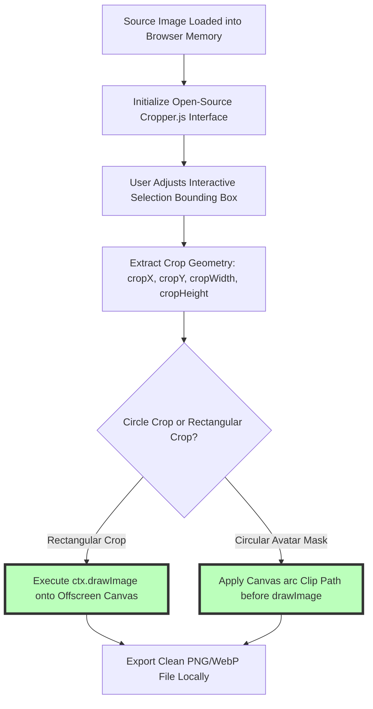

# Best Online Image Cropper: Free Circle Crop & Aspect Ratio Guide

Precision image cropping is one of the most fundamental tasks in web development, social media management, digital photography, and UI design. Whether you are cropping a profile headshot into a clean circular avatar for LinkedIn or Twitter, adjusting product photography to standard e-commerce ratios ($1:1$ square or $4:5$ vertical), framing hero banner graphics for responsive web layouts ($16:9$ widescreen), or trimming unwanted background clutter, using an online image cropper ensures perfect framing.

However, content creators and website owners frequently encounter annoying limitations when cropping images online: cloud cropping web apps like ILoveIMG or Canva that force users to upload personal photos to third-party servers, tools that restrict custom aspect ratios behind paid monthly subscriptions, laggy touch interfaces on mobile phones, or platforms that apply destructive lossy re-compression to exported files.

This guide evaluates the best online image croppers, details **client-side Cropper.js canvas integration**, explains circular avatar crop masking, outlines social media aspect ratio standards, and demonstrates how to crop images locally in your browser.

---

## Master Comparison Matrix: Online Image Cropping Tools

To evaluate how browser-based image croppers compare to cloud photo utilities and desktop editing software, review this specification matrix:

| Feature / Metric | On-Device Browser Cropper | Cloud Editing Services | Desktop Photoshop / Lightroom |
| :--- | :--- | :--- | :--- |
| **Privacy & Security** | **100% Private (Local RAM)** | Low (Uploaded to Cloud) | High (Local Machine RAM) |
| **Processing Speed** | **Instant (Zero Upload Delay)**| Slow (Network Dependent) | Fast (Hardware Accelerated) |
| **Aspect Ratio Presets**| **Freeform, 1:1, 4:5, 16:9, 9:16**| Limited / Gated Presets | Infinite Custom Options |
| **Circle / Oval Masking**| **YES (Transparent PNG Export)**| Basic / Subscription Only | Vector Layer Masking |
| **Cost & File Limits** | **100% Free / Zero Caps** | Monthly Subscriptions & Caps | Expensive Subscription Fees |

---

## Social Media Aspect Ratio Standards Matrix (2026)

Cropping graphics to exact platform aspect ratios prevents auto-cropping distortion and black bar letterboxing:

| Platform / Slot | Target Aspect Ratio | Optimal Pixel Dimensions | Primary Use Case |
| :--- | :--- | :--- | :--- |
| **Instagram Portrait Feed** | **4:5 Vertical Ratio** | **$1080 \times 1350$ pixels** | Maximum mobile feed real estate |
| **Instagram / TikTok Stories**| **9:16 Full Vertical** | **$1080 \times 1920$ pixels** | Fullscreen mobile video & stories |
| **Profile Avatars (Circle)**| **1:1 Square Mask** | **$500 \times 500$ pixels** | Circular profile icons across apps |
| **YouTube Thumbnails** | **16:9 Widescreen** | **$1280 \times 720$ pixels** | Video player cards & TV feeds |
| **Twitter / X Header Banner**| **3:1 Widescreen** | **$1500 \times 500$ pixels** | Channel profile cover headers |

---

## Technical Mechanics: Client-Side Cropper.js & Canvas Crop Math

How does an on-device image cropper crop graphics directly in browser memory without sending data to servers?



### 1. Canvas Crop Coordinate Extraction
When you adjust the interactive crop box, the tool calculates pixel coordinates relative to the original un-scaled master image:
1. Scaling factor $S$ is calculated between displayed preview width $W_{preview}$ and natural image width $W_{natural}$:
   $$S = \frac{W_{natural}}{W_{preview}}$$
2. Master crop origin $(X_{crop}, Y_{crop})$ and dimensions $(W_{crop}, H_{crop})$ are extracted:
   $$X_{crop} = X_{box} \cdot S, \quad Y_{crop} = Y_{box} \cdot S, \quad W_{crop} = W_{box} \cdot S, \quad H_{crop} = H_{box} \cdot S$$

### 2. Circular Avatar Masking Math (`clip()`)
To create a circular profile photo:
1. Create a square target canvas of size $N \times N$ (where $N = W_{crop}$).
2. Draw a circular clipping path centered at $(N/2, N/2)$ with radius $R = N/2$:
   ```javascript
   ctx.beginPath();
   ctx.arc(N / 2, N / 2, N / 2, 0, Math.PI * 2, true);
   ctx.closePath();
   ctx.clip(); // Mask subsequent drawImage execution
   ```
3. Render the cropped image onto the canvas and export as **PNG or WebP** to preserve transparent alpha background corners.

---

## Circle Crop vs. Rectangular Crop: Profile Picture Best Practices

Understanding how social platforms render avatar pictures prevents text and facial clipping:

```
+-----------------------------------------------------------------------+
|  PROFILE AVATAR CIRCLE CROP SAFETY ZONE                               |
|                                                                       |
|  +-------------------------------------------------------------+       |
|  |  SQUARE CROP CANVAS (1:1 Ratio)                             |       |
|  |                                                             |       |
|  |             /-----------------------------\                 |       |
|  |            /   CIRCULAR MASK SAFETY ZONE   \                |       |
|  |           |     Center Headshot / Logo      |               |       |
|  |           |     Clear of Outer Corners      |               |       |
|  |            \                               /                |       |
|  |             \-----------------------------/                 |       |
|  |                                                             |       |
|  +-------------------------------------------------------------+       |
+-----------------------------------------------------------------------+
```

### Avatar Design Best Practices:
* **Center Subject:** Place faces, brand logos, or personal avatars inside the central 80% circle area.
* **Remove Corner Text:** Avoid placing logos or typography near square canvas corners, as Instagram, LinkedIn, Twitter, and WhatsApp automatically crop corners into circles.

---

## Step-by-Step Online Image Cropping Workflow

Follow this simple workflow to crop images securely using our free tool:

1. **Upload File:** Drag and drop your image into our free [Image Cropper](/tools/crop-image).
2. **Select Preset or Custom Ratio:** Choose a preset (1:1 Square, 4:5 Portrait, 16:9 Widescreen, or Circle Crop) or adjust selection handles freely.
3. **Fine-Tune Framing:** Zoom, rotate, or drag the crop box to frame your subject perfectly.
4. **Export Crop Asset:** Click download to save your cropped asset as PNG, WebP, or JPEG.

---

## Step-by-Step Image Cropping Quality Checklist

Before uploading cropped images to websites or social media, run your graphics through this checklist:

* **Aspect Ratio Verification:** Confirm the crop matches target platform dimensions (e.g., 4:5 for Instagram feed).
* **Transparent Alpha Channel:** Export circle crops as **PNG or WebP** to ensure transparent background corners.
* **Resolution Preservation:** Verify cropped width and height satisfy minimum platform requirements.
* **Local Processing Check:** Confirm processing occurs 100% locally in browser RAM without server uploads.

---

## EXIF Orientation Auto-Correction & Matrix Rotation

Smartphone camera photos (especially from iPhones and Android devices) often embed metadata EXIF Orientation flags (values 1 through 8) that dictate how the image should be rotated:
* **EXIF Orientation Parsing:** Client-side JavaScript reads EXIF headers to parse rotation flags (such as 90° clockwise or 180° flip).
* **Canvas Transformation Matrix:** Applying `ctx.rotate()` and `ctx.transform()` before crop bounds calculation ensures smartphone photos load right-side up without sideways orientation glitches.

---

## High-DPI Retina Display Crop Pixel Density Math

Modern mobile phones and MacBook screens feature 2x and 3x **Device Pixel Ratios (DPR)**:
* **Physical vs. CSS Pixels:** On a 3x Retina display, a CSS crop box measuring $400 \times 400$ pixels corresponds to a physical canvas export size of $1200 \times 1200$ pixels.
* **Sharp Output Scaling:** Our cropper calculates crop bounds against natural raw image dimensions rather than CSS viewport coordinates, guaranteeing ultra-sharp, high-DPI output graphics for Retina displays.

---

## Frequently Asked Questions

### What is the best online image cropper in 2026?
The best online image cropper is **Image Tool Stack's [Image Cropper](/tools/crop-image)**. It crops images 100% locally in your web browser with zero server uploads, offering circular avatar masking, custom aspect ratios, and zero quality loss across desktop and mobile hardware.

### How do I crop an image into a circle?
Upload your photo to our [Image Cropper](/tools/crop-image), select the **Circle Crop** toggle, adjust the circular selection mask around your headshot or brand logo, and download the finished transparent PNG file with clean alpha background corners.

### What is the best aspect ratio for Instagram photos?
The best aspect ratio for Instagram feed posts is **4:5 vertical portrait ($1080\times1350\text{px}$)**. This ratio occupies maximum screen real estate on smartphones, driving higher engagement.

### Does cropping an image reduce its resolution?
Cropping removes outer pixels beyond the selection box. However, our client-side cropper crops your image at **100% native pixel density** without applying unnecessary downsampling or compression loss.

### Can I crop images on mobile phones?
Yes. Our image cropper features responsive touch-friendly handles, allowing you to crop, zoom, and rotate photos effortlessly on iOS Safari and Android Chrome devices.

### Is my photo uploaded to a server when using the image cropper?
No. All canvas cropping, matrix transformation, and file generation happen **100% inside your local web browser RAM**. Your personal photos, legal documents, and graphics never leave your computer or smartphone.
