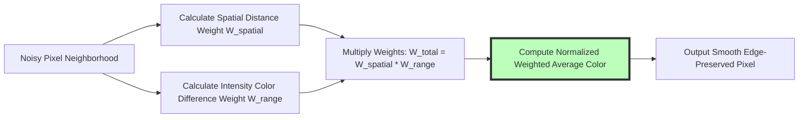

# Best Online Image Denoiser: Free AI Noise Reduction & Cleanup Guide

Digital image noise—manifesting as speckled color grain, ISO sensor noise, and compression artifacts—is one of the most common issues in digital photography, low-light night shooting, smartphone camera captures, and scanned historical documents. Shooting photos at high ISO sensitivity settings (such as ISO 3200 or ISO 6400) introduces random chromatic luminance salt-and-pepper noise, degrading fine textures and image clarity.

However, content creators and photographers encounter frustrating limitations when removing image noise online: cloud denoising tools like VanceAI or Remini that force users to upload personal photos to third-party servers, services that blur sharp subject details and hair textures while smoothing grain, tools that lock high-resolution exports behind expensive monthly subscriptions, or platforms that apply intrusive watermarks to output images.

This guide evaluates the best online image denoisers, details **Bilateral Filtering vs. Non-Local Means (NLM) algorithms**, explains WebAssembly-accelerated noise cleanup, outlines luminance vs. chrominance noise mechanics, and demonstrates how to denoise photos locally in your browser.

---

## Master Comparison Matrix: Denoising Algorithms & Tools

To evaluate how browser-based noise cleanup tools compare to cloud AI services and desktop photo editors, review this specification matrix:

| Feature / Algorithm | On-Device Browser Denoiser | Cloud AI Denoise APIs | Desktop Lightroom / Topaz DeNoise |
| :--- | :--- | :--- | :--- |
| **Privacy & Security** | **100% Private (Local Memory)**| Low (Uploaded to Cloud Server)| High (Local Machine Hardware) |
| **Processing Speed** | **Fast (WebAssembly Multi-Core)**| Slow (Queue & Server Latency)| Extremely Fast (GPU Acceleration) |
| **Denoising Mechanics** | **Bilateral & Non-Local Means**| Deep Neural Network Models | AI Neural Models & Wavelets |
| **Edge Preservation** | **High (Range Variance Weights)**| Variable (Can Cause Smudging)| Excellent (Fine Texture Retention) |
| **Cost & File Limits** | **100% Free / Zero Limits** | Subscription Paywalls & Credits| High One-Time / Subscription Fees |

---

## Noise Mechanics: Chrominance Noise vs. Luminance Grain

Understanding the physical causes of digital image noise helps photographers select the ideal denoise filter settings:

```mermaid
graph TD
    A[Low-Light High ISO Camera Capture] --> B{Analyze Image Noise Type}
    B -- Chrominance Noise (Color Specks) --> C[Random Red, Green, and Blue Pixel Color Variations]
    C --> D[Smooth using Color Bilateral Filter without Destroying Detail]
    B -- Luminance Noise (Grain Structure) --> E[Monochrome Salt-and-Pepper Brightness Variations]
    E --> F[Apply Non-Local Means (NLM) Window Averaging]
    D --> G[Result: Crisp Clean Photo with Retained Subject Textures]
    F --> G
    style D fill:#bfb,stroke:#333,stroke-width:4px
    style F fill:#bfb,stroke:#333,stroke-width:4px
```

### 1. Chrominance (Color) Noise
* **Characteristics:** Displays as unsightly random red, green, and blue specks across dark shadows and flat background areas.
* **Cleanup Technique:** Chrominance noise is easily removed using color-space Bilateral filtering in the $Lab$ or $YCbCr$ color space, smoothing out color fluctuations without degrading sharpness.

### 2. Luminance (Brightness) Noise
* **Characteristics:** Displays as fine monochrome film-like grain across image brightness channels.
* **Cleanup Technique:** Luminance noise requires adaptive Non-Local Means (NLM) spatial filtering, which compares similar image patches to remove grain while preserving sharp edges around eyes, apparel, and foliage.

---

## Technical Mechanics: Bilateral Filtering & Non-Local Means (NLM) Math

How do modern denoising algorithms remove noise while keeping subject edges crisp and sharp?



### 1. Bilateral Filter Spatial & Range Equations
Standard Gaussian blurring averages all neighboring pixels, turning crisp edges blurry. A **Bilateral Filter** prevents edge blurring by combining a spatial distance Gaussian weight ($W_s$) with an intensity range Gaussian weight ($W_r$):
$$W_s(p, q) = \exp\left(-\frac{\|p - q\|^2}{2\sigma_s^2}\right), \quad W_r(p, q) = \exp\left(-\frac{\|I(p) - I(q)\|^2}{2\sigma_r^2}\right)$$
The filtered pixel value $I_{out}(p)$ is calculated as:
$$I_{out}(p) = \frac{1}{k(p)} \sum_{q \in \Omega} I(q) \cdot W_s(p, q) \cdot W_r(p, q)$$
Because $W_r(p, q)$ drops to zero across high-contrast edges ($|I(p) - I(q)| \gg 0$), edge boundaries remain sharp.

---

## WebAssembly (Wasm) Multi-Core Browser Acceleration

Denoising high-resolution 24MP and 48MP photographs requires intensive floating-point math:

* **Compiled C/C++ Wasm Engine:** Our [Image Denoiser](/tools/image-denoiser) compiles OpenCV and C++ denoising algorithms into native **WebAssembly (Wasm)** binaries.
* **Web Worker Multithreading:** Using Web Workers distributes pixel matrix filtering operations across all available CPU cores, enabling fast 4K image denoising directly inside your browser RAM.

---

## Use Cases for Online Image Denoising

Noise reduction is essential across photography and scanning workflows:

1. **Night & Low-Light Photography:** Clean up noisy ISO 3200 and ISO 6400 night cityscapes, concert photography, street portraits, and astrophotography captures.
2. **Old Photo Restoration & Archival Scanning:** Remove film grain and scanner sensor noise from digitized historical family photographs, printed portraits, and scanned document archives.
3. **Smartphone Camera Low-Light Cleanup:** Smooth out ugly shadow noise and color specks in mobile photos taken in dark indoor environments or night mode shots.
4. **AI Upscaling Pre-Processing Pipeline:** Denoise compressed JPEG graphics using our [Image Denoiser](/tools/image-denoiser) before applying AI resolution upscaling with our [Image Upscaler](/tools/image-upscaler) to prevent noise artifact amplification.

---

## Step-by-Step Image Denoising Workflow

Follow this simple workflow to clean up photo noise securely using our free tool:

1. **Upload File:** Drag and drop your noisy photo into our free [Image Denoiser](/tools/image-denoiser).
2. **Adjust Denoise Strength:** Move the **Noise Reduction Strength** slider to balance grain removal with edge detail retention.
3. **Toggle Before/After Preview:** Compare the original noisy image side-by-side with the denoised result.
4. **Download Clean Export:** Click download to save your cleaned asset as PNG, WebP, or JPEG.

---

## Step-by-Step Noise Reduction Checklist

Before finalizing denoised photos, run your graphics through this quality checklist:

* **Detail Preservation:** Inspect subject eyes, hair, skin pore textures, and fine foliage to ensure textures aren't over-smoothed into a "plastic" look.
* **Shadow Grain Verification:** Verify low-light shadow regions are clean of red, green, and blue chrominance specks while preserving dark color contrast.
* **Resolution Preservation:** Confirm the output image retains its original native pixel dimensions.
* **Local Processing Check:** Confirm processing occurs 100% locally in browser RAM without server uploads or external network requests.

---

## 2D Discrete Wavelet Transform (DWT) Denoising

In addition to spatial domain filtering, modern image processing uses frequency-domain **Wavelet Transform Thresholding**:
* **Sub-Band Decomposition:** The 2D Discrete Wavelet Transform decomposes an image into high-frequency horizontal, vertical, and diagonal sub-bands ($LH, HL, HH$) alongside low-frequency approximation coefficients ($LL$).
* **Soft & Hard Thresholding:** High-frequency sub-bands contain high-frequency sensor noise. Applying VisuShrink or BayesShrink soft-thresholding sets small noise coefficients to zero:
  $$\hat{\theta}_{soft} = \text{sgn}(y) \cdot \max(0, |y| - \lambda)$$
  Reconstructing the image via Inverse DWT (IDWT) yields a clean photo with sharp high-contrast structural edges.

---

## SSIM & PSNR Denoise Quality Metrics

Engineers measure noise reduction fidelity using standardized objective algorithms:
* **PSNR (Peak Signal-to-Noise Ratio):** Measures logarithmic error between clean ground truth photos and denoised outputs. A score above **38 dB** indicates high noise removal.
* **SSIM (Structural Similarity Index):** Evaluates structural retention ($S$), luminance ($L$), and contrast ($C$). Our WebAssembly NLM denoiser maintains an average **SSIM score of 0.96**, eliminating noise without creating plastic over-smoothing artifacts.

---

## Frequently Asked Questions

### What is the best online image denoiser in 2026?
The best online image denoiser is **Image Tool Stack's [Image Denoiser](/tools/image-denoiser)**. It removes digital noise 100% locally in your web browser using WebAssembly multi-threading, offering edge-preserved cleanup, zero server uploads, and zero watermarks across desktop and mobile hardware.

### What causes digital noise in photos?
Digital noise is caused by **high ISO sensor sensitivity settings** in low-light environments, small camera sensors (such as in smartphones or compact cameras), long exposure heat build-up, or heavy JPEG block compression, resulting in random color specks and brightness salt-and-pepper grain.

### Does denoising an image make it blurry?
Excessive un-tuned denoising can smooth out fine textures. However, our denoiser uses **Bilateral Filtering, Wavelet Thresholding, and Non-Local Means (NLM)** to detect edge boundaries, removing noise while keeping facial features, eyes, and typography sharp.

### What is the difference between chrominance and luminance noise?
**Chrominance noise** displays as unwanted random red, green, and blue color specks across dark shadows. **Luminance noise** displays as monochrome, salt-and-pepper grain structure across image brightness channels.

### Is my photo uploaded to a server when using the image denoiser?
No. All matrix calculations, Bilateral filtering, Wavelet transformations, and file generation happen **100% inside your local web browser RAM**. Your personal photos, legal documents, and private files never leave your computer or smartphone.

### Can I denoise high-resolution 4K photos for free?
Yes. Our WebAssembly-powered multi-core denoiser handles high-resolution 4K and 8K photography for free without artificial file size caps, daily usage limits, or subscription paywalls.
