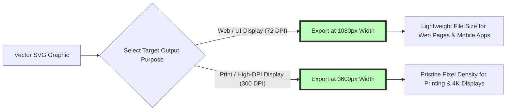

# Best SVG to PNG Converter Free: High-Resolution & Transparency Guide

Scalable Vector Graphics (SVG) are the gold standard for digital vector artwork, brand logos, UI icons, typography, and web illustrations. Because SVGs are defined using XML code paths rather than fixed pixel grids, vector graphics scale infinitely without pixelation or loss of clarity. However, many digital workflows—including social media publishing, office presentation software (like Microsoft PowerPoint or Google Slides), mobile app asset pipelines, print production, and legacy image viewers—do not support raw vector SVG rendering and require high-resolution **PNG (Portable Network Graphics)** files.

However, content creators, web designers, and software engineers frequently face frustrating roadblocks when converting SVG to PNG online: cloud converters like Convertio or CloudConvert that upload private vector files to third-party servers, tools that export blurry low-resolution 72 DPI PNGs, services that replace transparent vector backgrounds with solid white boxes, or platforms that lock batch conversions behind paid monthly subscriptions.

This guide evaluates the best free online SVG to PNG converters, details **vector XML rasterization math**, explains high-DPI resolution scaling (such as 300 DPI for print), outlines transparent alpha channel preservation, and demonstrates how to convert SVG graphics locally in your browser.

---

## Master Comparison Matrix: SVG to PNG Conversion Tools

To evaluate how browser-based SVG converters compare to traditional cloud services and desktop vector editing software, review this specification matrix:

| Feature / Capability | On-Device Browser Converter | Cloud Conversion Services | Professional Desktop Editors |
| :--- | :--- | :--- | :--- |
| **Privacy & Security** | **100% Private (Local Memory)**| Low (Uploaded to Remote Cloud) | High (Local Machine Hardware) |
| **Processing Speed** | **Instant (Zero Upload Delay)**| Slow (Network Dependent) | Fast (CPU / GPU Hardware) |
| **Custom Resolution Scaling**| **Custom DPI / Custom Width & Height**| Fixed Dimensions / Preset Caps| Infinite Custom DPI Options |
| **Transparency Support** | **8-bit Alpha Channel (PNG-24)**| Variable / Solid White Fallbacks| Full Alpha Channel Control |
| **Batch Conversion** | **Unlimited Parallel Files (ZIP)**| 2 to 5 Files (Paywall Limits) | Batch Actions / Scripts |
| **Cost & File Limits** | **100% Free / Zero Caps** | Subscription Paywalls | Expensive Monthly Subscriptions |

---

## Technical Mechanics: How SVG Vector Rasterization Works

How does a web browser convert resolution-independent XML vector math into a crisp raster PNG pixel grid?

```mermaid
graph TD
    A[Raw Vector SVG File (XML Paths)] --> B[Parse SVG DOM & ViewBox Coordinates]
    B --> C[Set Target Output Dimensions (e.g. 3000x3000px @ 300 DPI)]
    C --> D[Render Vector Math onto Offscreen HTML5 Canvas]
    D --> E[Rasterize Paths & Gradients using Sub-Pixel Antialiasing]
    E --> F[Encode Canvas RGBA Pixel Buffer into PNG-24 Binary Blob]
    style D fill:#bfb,stroke:#333,stroke-width:4px
    style F fill:#bfb,stroke:#333,stroke-width:4px
```

### 1. XML ViewBox Coordinate Scaling
An SVG file defines graphics using mathematical XML elements (`<path>`, `<rect>`, `<circle>`, `<path d="M10 80 Q 52.5 10..." />`). The SVG `viewBox="0 0 100 100"` attribute defines the internal coordinate space ratio.
* When converting to PNG, the rasterization engine calculates the scale multiplier $M$:
  $$M = \frac{\text{Target Width}}{\text{viewBox Width}}$$
* All coordinate points and stroke widths are multiplied by $M$, allowing a $100\times100$ unit SVG vector to be rendered into a crisp $4000\times4000$ pixel PNG without pixelation.

### 2. Sub-Pixel Antialiasing & Alpha Channel Retention
Vector edges are rasterized using sub-pixel antialiasing. By blending edge pixel transparency ($A = 0.0 \dots 1.0$), curved paths remain smooth over any background color. Disabling default white canvas backgrounds ensures the exported PNG retains its **8-bit alpha channel transparency**.

---

## Resolution Scaling: Web Resolution (72 DPI) vs. Print Resolution (300 DPI)

Setting the correct pixel dimensions before rasterization is crucial to prevent blurry PNG exports:



### DPI Resolution Conversion Calculator:
For physical print projects (such as merchandise, t-shirts, business cards, or posters), calculate pixel width using the formula:
$$\text{Pixel Width} = \text{Physical Width (Inches)} \times \text{Target DPI}$$

* **Example (12-Inch Shirt Print at 300 DPI):** $12 \text{ in} \times 300 \text{ DPI} = 3600 \text{ pixels}$.
* Converting your SVG to a **3600px PNG** guarantees sharp, professional print output without fuzzy edges.

---

## Use Cases for Free SVG to PNG Conversion

SVG to PNG converters are essential tools across multiple creative workflows:

1. **Brand Logo Export:** Convert vector SVG logos into transparent PNGs for corporate email signatures, social media avatars, and watermarks.
2. **Social Media Graphics:** Rasterize vector illustrations into high-res PNGs for Instagram, LinkedIn, Twitter, and Facebook posts.
3. **Office Presentations:** Insert transparent vector icons into PowerPoint, Keynote, and Google Slides presentations without XML rendering errors.
4. **Merchandise & Print Design:** Export high-DPI transparent PNGs for print-on-demand services (like Redbubble, Merch by Amazon, or Printify).

---

## Interactive Features: On-Device SVG to PNG Converter

Our free online converter offers advanced vector rasterization controls directly in your browser:

* **Custom Width & Height Multiplier:** Instantly scale vector output up to $10,000 \times 10,000$ pixels for ultra-high-definition exports.
* **Transparent Alpha Background Toggle:** Keep background transparency enabled or choose custom solid background colors.
* **Batch Conversion & ZIP Packaging:** Drag and drop dozens of SVG files to convert them simultaneously, downloading the converted PNGs in one organized ZIP archive.
* **100% On-Device Memory Processing:** Powered by HTML5 Canvas and WebAssembly, your files are read into local browser RAM and are **never uploaded to external servers**.

---

## Step-by-Step SVG to PNG Conversion Workflow

Follow this simple workflow to convert SVG vectors to PNG graphics securely:

1. **Upload SVG Files:** Drag and drop your vector SVG graphics into our free [SVG to PNG Converter](/tools/svg-to-png).
2. **Set Target Dimensions:** Enter custom width/height values or select a scale multiplier ($2\times$, $4\times$, $8\times$).
3. **Toggle Transparency:** Confirm background transparency is enabled for clean alpha channel output.
4. **Download PNG Export:** Click "Convert & Download" to save your crisp PNG files locally.

---

## Step-by-Step SVG Conversion Quality Checklist

Before publishing converted PNG graphics, run your assets through this quality checklist:

* **Resolution Verification:** Confirm output pixel width satisfies target print or display requirements (e.g., 3000px+ for print).
* **Alpha Channel Check:** Verify the background is transparent (no solid white bounding box).
* **Font Embedding Check:** Ensure SVG text elements use system fonts or converted vector paths (`<path>`) to prevent missing font errors.
* **Privacy Check:** Verify conversion occurred 100% locally in browser memory without server uploads.

---

## SVG ViewBox Matrix Transformations (`transform="matrix(...)"`)

Complex vector graphics often utilize affine transformation matrices to position, scale, and rotate group elements (`<g>`):
* **Affine Matrix Equation:** Point coordinates $(x, y)$ are transformed to $(x', y')$ using a $3\times3$ transformation matrix:
  $$\begin{bmatrix} x' \\ y' \\ 1 \end{bmatrix} = \begin{bmatrix} a & c & e \\ b & d & f \\ 0 & 0 & 1 \end{bmatrix} \begin{bmatrix} x \\ y \\ 1 \end{bmatrix}$$
* **Precision Canvas Rendering:** Our browser engine evaluates nested affine matrices directly inside the HTML5 2D rendering context (`ctx.transform(a, b, c, d, e, f)`), ensuring complex vector paths, gradients, and clip paths align perfectly during rasterization.

---

## Color Space Tagging: sRGB vs. Wide Color Gamut (Display P3)

Preserving vibrant brand colors during vector rasterization requires proper color space management:
* **sRGB Color Space:** Standard sRGB color tagging guarantees consistent logo color reproduction across all consumer desktop monitors, budget mobile displays, and web browsers.
* **Display P3 Wide Gamut:** For high-end digital signage and modern Apple Retina displays, rasterizing SVG vectors into wide-gamut PNGs preserves 25% more vivid green and red color tones without clipping color gamuts.

---

## Frequently Asked Questions

### What is the best free SVG to PNG converter online in 2026?
The best online converter is **Image Tool Stack's [SVG to PNG Converter](/tools/svg-to-png)**. It converts vector SVG graphics to high-resolution PNGs 100% locally in your web browser with zero server uploads, custom resolution scaling, and transparent background preservation.

### How do I convert SVG to PNG with high resolution?
Upload your SVG file to our [SVG to PNG Converter](/tools/svg-to-png), set the custom width multiplier to $4\times$ or enter explicit pixel dimensions (e.g., $3600\times3600\text{px}$ for 300 DPI), and download your ultra-sharp PNG export.

### Will converting SVG to PNG maintain background transparency?
Yes. Our converter preserves the **8-bit alpha channel transparency** embedded in your SVG file, exporting a clean transparent PNG without adding unwanted white background boxes.

### Why do some SVG files look broken or missing text when converted?
If an SVG file uses external web fonts that aren't embedded in the XML code, the renderer might fall back to a system font. Converting text to vector outlines (`Object > Expand` in Illustrator) before exporting ensures perfect conversion.

### Is my vector file safe when using the converter?
Yes. All vector parsing, DOM rendering, and PNG encoding happen **100% inside your local web browser RAM**. Your vector files never leave your computer or smartphone.

### Can I convert multiple SVG files to PNG at once?
Yes. Drag and drop multiple SVG files into our batch converter to process them simultaneously and download all converted PNG graphics in a single ZIP archive.
