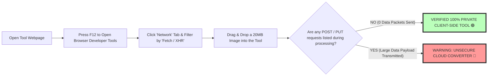

# Secure Browser-Based Image Tools: Free WebAssembly Privacy Guide

The modern web ecosystem has undergone a monumental architectural transformation. Traditionally, editing, compressing, converting, or processing digital media online forced users to upload personal files to third-party cloud servers. Cloud photo processing platforms—such as Convertio, ILoveIMG, or Ezgif—receive raw user graphics on remote web servers, introducing severe data privacy vulnerabilities, bandwidth delays, strict file size upload caps, and potential data breach risks.

Today, cutting-edge web technologies—specifically **WebAssembly (Wasm)**, **HTML5 Canvas API**, **Web Workers**, and **WebGL fragment shaders**—allow modern web browsers (Google Chrome, Apple Safari, Mozilla Firefox, Microsoft Edge) to execute high-performance binary code directly on client-side hardware. Browser-based image tools perform complex photo editing, bulk format conversion, AI background removal, and file compression **100% locally in browser RAM**, establishing a privacy-first operational model where personal data never leaves your device.

This guide evaluates browser-based image tools, details **WebAssembly sandboxing architecture**, explains how to audit client-side privacy using browser Developer Tools, compares local processing against cloud server converters, and highlights our free on-device utility suite.

---

## Master Comparison Matrix: Local Browser Tools vs. Traditional Cloud Converters

To understand why browser-based Wasm utilities represent the future of web privacy and processing speed, review this architectural comparison matrix:

| Feature / Metric | On-Device Browser Tools (Wasm) | Traditional Cloud Converters | Legacy Desktop Software |
| :--- | :--- | :--- | :--- |
| **Data Privacy & Security**| **100% Private (Zero Uploads)**| Low (Files Transmitted to Server)| High (Local Machine Memory) |
| **Network Dependency** | **Offline Capable (PWA Cached)**| High (Requires Fast Internet) | Offline Capable |
| **Processing Speed** | **Instant (Zero Latency)** | Slow (Upload & Queue Delay) | Fast (Hardware Accelerated) |
| **File Size Caps** | **Zero Caps (Unlimited RAM)** | 5MB to 25MB Free Limits | Unlimited Machine Storage |
| **DevTools Auditing** | **0 XHR Network Payloads** | Massive File POST Requests | N/A (Local Executable) |
| **Software Cost** | **100% Free / Zero Paywalls** | Monthly Subscriptions & Caps | Expensive Perpetual/Sub Fees |

---

## Technical Architecture: How WebAssembly & Client-Side Sandboxing Work

How can a web browser execute complex image manipulation algorithms (like OpenCV, libjpeg-turbo, or libwebp) at native hardware speeds without server reliance?

```mermaid
graph TD
    A[User Selects Local File on Disk] --> B[Browser FileReader API Reads File into Local ArrayBuffer]
    B --> C[Pass ArrayBuffer Bytes to WebAssembly SIMD Engine in RAM]
    C --> D[Web Worker Spawns Multi-Core Processing Threads]
    D --> E[Execute C/C++ Image Processing Logic inside Isolated Wasm Sandbox]
    E --> F[Render Processed Output Buffer directly to HTML5 Canvas]
    F --> G[Generate Download Blob locally (Zero Network Requests)]
    style E fill:#bfb,stroke:#333,stroke-width:4px
    style G fill:#bfb,stroke:#333,stroke-width:4px
```

### 1. WebAssembly (Wasm) Binary Sandboxing
WebAssembly is a low-level binary instruction format designed to run compiled languages (C, C++, Rust) in web browsers at near-native execution speed:
* **Memory Isolation:** Wasm executes inside a strictly sandboxed virtual machine environment. A Wasm module has access *only* to a linear memory array (`WebAssembly.Memory`) allocated explicitly by the browser.
* **No Direct File Access:** Wasm cannot read your hard drive, access network sockets, or phone home to external servers unless the host browser JavaScript code explicitly initiates a network fetch call.

### 2. Web Workers & Hardware Acceleration
Heavy media operations (such as processing 50MB RAW camera photos or batch converting 100 WebP images) can freeze single-threaded browser user interfaces. By delegating processing loops to **Web Workers**, computation runs across all available CPU cores in the background while the UI remains smooth and responsive at 60 FPS.

---

## How to Verify Zero-Upload Privacy (DevTools Audit Guide)

How can privacy-conscious users verify that an online image tool is truly processing files locally on their machine without secretly uploading data to cloud servers?



### Step-by-Step Privacy Verification Audit:
1. **Open Developer Tools:** Press `F12` (or Right-Click > Inspect) in Google Chrome, Safari, or Firefox.
2. **Navigate to Network Tab:** Select the **Network** tab and filter activity by **Fetch/XHR**.
3. **Process an Image:** Upload a large photo to our [Image Converter](/tools/image-converter) or [Image Compressor](/tools/image-compressor).
4. **Inspect Network Log:** Observe the Network tab. You will see **zero outgoing data requests** containing your image payload. The entire conversion completes locally inside your device's memory.

---

## Privacy Compliance: GDPR, CCPA, & Enterprise Data Security

For corporate legal teams, healthcare providers (HIPAA compliance), financial institutions, and privacy-focused professionals, uploading sensitive documents to online cloud converters poses severe security risks:

* **Unintentional Cloud Storage:** Cloud conversion services often retain uploaded assets in temporary cloud storage buckets (`/tmp/` directories) for 24 hours, exposing confidential financial records, ID cards, or legal contracts to server breaches.
* **IP Logging & Metadata Scrape:** Third-party cloud servers frequently log visitor IP addresses, location metadata, and file attributes.
* **Zero-Trust On-Device Security:** Using on-device browser tools eliminates server vulnerability vectors. Data remains on your hardware, ensuring 100% compliance with strict international privacy mandates.

---

## Comprehensive Suite of Free On-Device Utilities

Our platform provides over 100 dedicated browser-based utilities built on client-side WebAssembly architecture:

### 1. Format Conversion Utilities
* **[PNG to JPG Converter](/tools/png-to-jpg):** Convert high-res PNG graphics to compressed JPG format locally.
* **[WebP to PNG Converter](/tools/webp-to-png):** Convert next-gen WebP assets to legacy transparent PNGs.
* **[SVG to PNG Converter](/tools/svg-to-png):** Scalable vector XML rasterization directly in local memory.
* **[HEIC to JPG Converter](/tools/heic-to-jpg):** Transform iPhone HEIC photos into universal JPGs on desktop or mobile.

### 2. Photo Editing & Optimization Utilities
* **[Image Compressor](/tools/image-compressor):** Reduce image file sizes by up to 80% with zero server uploads.
* **[Image Resizer](/tools/image-resizer):** Scale photo dimensions for web design and social media slots.
* **[Crop Image](/tools/crop-image):** Precision interactive bounds and circular avatar cropping.
* **[Image Pixelator](/tools/pixelate-image):** Instant 8-bit art generation and selective privacy censorship.

---

## Step-by-Step Client-Side Tool Quality Checklist

When evaluating browser-based image tools, verify your workflow against this operational checklist:

* **Zero Network Payloads:** Audit DevTools to confirm 0 bytes are transmitted across the internet during conversion.
* **Offline Execution:** Verify the tool operates seamlessly even when WiFi or mobile data is disconnected.
* **Multi-Core Threading:** Confirm heavy batch operations utilize Web Workers for multi-threaded CPU execution.
* **Metadata Stripping:** Verify EXIF location tags are automatically stripped from exported image files.

---

## Service Worker Progressive Web App (PWA) Offline Caching

Enabling complete offline capability requires caching application binaries using Service Workers:
* **Cache-First Network Strategy:** Upon initial load, the Service Worker caches all JavaScript bundles, WebAssembly `.wasm` binaries, and CSS stylesheets locally inside the browser's Cache Storage API.
* **100% Airplane Mode Capability:** Once cached, users can launch tools in airplane mode or remote environments without internet access, ensuring continuous productivity during travel or field work.

---

## WebGPU Accelerated Hardware Compute Pipelines

The next frontier of browser-based media processing relies on **WebGPU**:
* **Direct Graphics Card Access:** WebGPU provides modern API access to low-level hardware shaders (Vulkan, Metal, Direct3D 12), bypassing CPU bottlenecks.
* **Parallel Neural Matrix Computations:** Executing AI background removal, noise reduction, and image upscaling directly on local GPU Tensor Cores delivers desktop-class performance inside standard web browsers.

---

## Frequently Asked Questions

### What are browser-based image tools?
Browser-based image tools are web applications that process files **100% locally inside your web browser** using WebAssembly and HTML5 Canvas, eliminating the need to upload files to remote servers.

### Are browser-based image tools really private?
Yes. Because processing logic executes inside your browser's local memory (RAM), your photos, legal documents, and personal graphics **never leave your computer or smartphone**.

### Can browser-based image tools work offline without an internet connection?
Yes. Once the webpage loads into your browser cache (or Progressive Web App service worker), you can disconnect your internet completely and continue converting, cropping, and compressing files offline.

### How do I check if a tool is uploading my photos to a server?
Open your browser's **Developer Tools (F12)**, click the **Network** tab, filter by **Fetch/XHR**, and process an image. If no network requests containing your file payload appear, the tool is 100% client-side.

### Why are browser-based tools faster than cloud converters?
Cloud converters require uploading files over your internet connection, waiting in a remote server queue, and downloading the result. Browser tools skip network transport entirely, performing conversions instantly in local RAM.

### Are there file size limits on browser-based image tools?
No. Because files are processed using your device's native CPU and RAM rather than remote cloud server limits, you can process massive 50MB+ photos just as easily as small icons.
