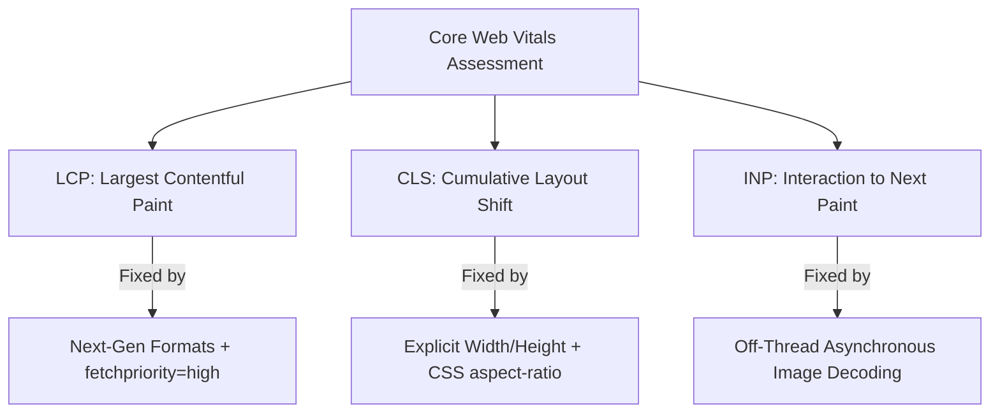
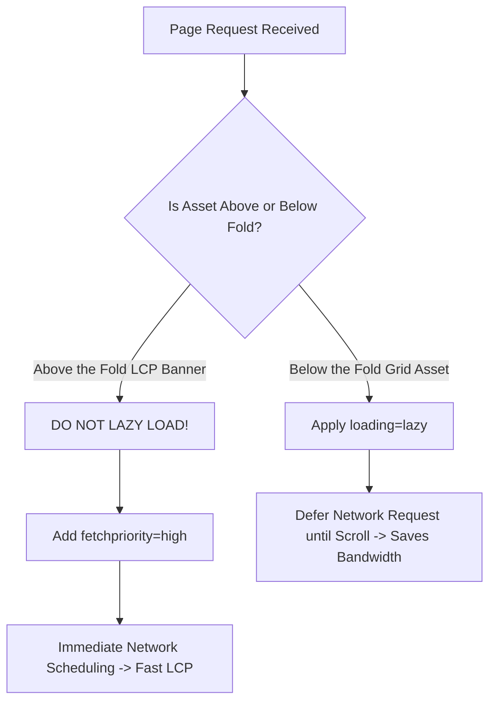

# Core Web Vitals & Image Optimization: How to Fix LCP Image Delays

Google's Core Web Vitals metrics evaluate web performance based on real-world user experience. Among these metrics, **Largest Contentful Paint (LCP)** measures how quickly a page's primary visual content loads, directly influencing search engine rankings and conversion rates.

In most web applications, the LCP element is a large hero banner, featured product photo, or background image. Unoptimized image assets account for over **70% of LCP performance failures**, causing page load delays and hurting SEO rankings.

This guide analyzes how Google measures Largest Contentful Paint, breaks down the four sub-parts of LCP image load times, explains how to use priority hints like `fetchpriority="high"`, details CSS layout strategies for eliminating Cumulative Layout Shift (CLS), and provides a step-by-step optimization workflow for passing Google's Core Web Vitals assessment.

---

## Technical Overview: The 3 Core Web Vitals Metrics

Google evaluates web performance using three Core Web Vitals metrics:

| Metric Name | What It Measures | Target Threshold (Good) | Primary Image-Related Cause |
| :--- | :--- | :--- | :--- |
| **LCP (Largest Contentful Paint)** | Visual load speed of main content | **$\le 2.5$ seconds** | Heavy, uncompressed hero banner images |
| **CLS (Cumulative Layout Shift)** | Visual layout stability | **$\le 0.10$** | Images missing explicit width/height dimensions |
| **INP (Interaction to Next Paint)**| User input responsiveness | **$\le 200$ milliseconds** | Main-thread blocking during heavy image decoding |



---

## Deconstructing the 4 Sub-Parts of LCP Image Delay

To fix LCP image delays effectively, you must understand the four distinct time phases that make up the total LCP metric:

$$\text{Total LCP} = \text{Time to First Byte (TTFB)} + \text{Resource Load Delay} + \text{Resource Load Time} + \text{Element Render Delay}$$

```mermaid
gantt
    title LCP Image Loading Timeline Breakdown
    dateFormat  X
    axisFormat %s s
    section Network Stream
    TTFB (Server Response)            :a1, 0, 4
    Resource Load Delay (Discovery)   :a2, 4, 9
    Resource Load Duration (Download) :a3, 9, 17
    section Browser Thread
    Element Render Delay (Decode/Paint):a4, 17, 21
```



Let's examine how each phase impacts performance and how to optimize it:

### 1. Time to First Byte (TTFB)
*   **What it is:** The time it takes for the browser to receive the first byte of data from the web server after requesting the page.
*   **The Fix:** Use a global Content Delivery Network (CDN) with edge caching and configure fast DNS lookup handling to keep TTFB under **800 milliseconds**.

### 2. Resource Load Delay (The Discovery Bottleneck)
*   **What it is:** The delay between the browser receiving the HTML response and discovering that the LCP image needs to be downloaded.
*   **The Cause:** Hiding the LCP image URL inside external CSS files (e.g. `background-image: url(...)`) or injecting it via client-side JavaScript frameworks.
*   **The Fix:** Include an explicit `` or `<picture>` tag directly in the initial HTML markup so the browser's preload scanner discovers the URL immediately.

### 3. Resource Load Time (Download Duration)
*   **What it is:** The time required for the browser to download the image file over the network.
*   **The Fix:** Convert images to modern formats like **AVIF** or **WebP** and compress them to keep file sizes **under 150KB**.

### 4. Element Render Delay
*   **What it is:** The delay between the image finishing its download and the browser rendering it on the screen.
*   **The Cause:** Main-thread blocking caused by heavy JavaScript execution or synchronous image decoding.
*   **The Fix:** Add `decoding="async"` to image tags to allow the browser to decode image bytes on a background thread.

---

## Priority Hints: `fetchpriority="high"` vs. `loading="lazy"`

A common mistake in web development is applying lazy loading to all images on a page, including the main hero banner.



### The Rules for Loading Attributes:

#### 1. For Above-the-Fold LCP Images (Hero Banners & Product Featured Shots):
*   **NEVER use `loading="lazy"`.** Applying `loading="lazy"` to an LCP image tells the browser to defer downloading it, delaying your LCP score by several seconds and causing the page to fail Google's Core Web Vitals assessment.
*   **ALWAYS use `fetchpriority="high"`.** Adding `fetchpriority="high"` instructs the browser's preload scanner to schedule the download immediately, ahead of non-critical CSS or JavaScript files:
    ```html
    
    ```

#### 2. For Below-the-Fold Images (Product Grids, Footer Logos, Gallery Shots):
*   **ALWAYS use `loading="lazy"`.** Applying `loading="lazy"` defers downloading below-the-fold assets until the user scrolls near them, reducing initial bandwidth consumption and allowing the LCP element to download faster:
    ```html
    
    ```

---

## Eliminating Cumulative Layout Shift (CLS) with CSS Layout Reservation

Cumulative Layout Shift (CLS) measures layout stability as a page loads. When an image tag lacks explicit dimensions, the browser cannot reserve the required layout space before the file finishes downloading, causing surrounding text and buttons to jump unexpectedly.

### 1. Declaring HTML Width and Height Attributes
Always include explicit `width` and `height` attributes directly on the `` tag:
```html

```
These attributes do not force a fixed display size; instead, they define the image's intrinsic aspect ratio ($1200:675 = 16:9$), allowing the browser to reserve the correct layout space before the image loads.

### 2. Reserving Layout Space with CSS `aspect-ratio`
Combine HTML dimension attributes with the CSS `aspect-ratio` property in your stylesheet:
```css
.hero-banner-image {
  width: 100%;
  height: auto;
  aspect-ratio: 16 / 9;
  background-color: #f3f4f6; /* Gray placeholder block prevents shift */
}
```
Defining the aspect ratio in CSS reserves the exact layout slot before the image downloads, keeping your CLS score at **0.00**.

---

## Responsive Image Delivery using HTML `<picture>` and `srcset`

Serving a large $1920\times1080$ pixel desktop image to a mobile screen wastes mobile data and delays LCP load times. Use responsive image markup to serve appropriately scaled images based on the user's viewport:

```html
<picture>
  <!-- Serve AVIF to compatible modern browsers -->
  <source 
    type="image/avif"
    srcset="/images/banner-480.avif 480w, /images/banner-800.avif 800w, /images/banner-1200.avif 1200w"
    sizes="(max-width: 600px) 100vw, (max-width: 1200px) 50vw, 1200px"
  >
  
  <!-- Fallback to WebP for standard browsers -->
  <source 
    type="image/webp"
    srcset="/images/banner-480.webp 480w, /images/banner-800.webp 800w, /images/banner-1200.webp 1200w"
    sizes="(max-width: 600px) 100vw, (max-width: 1200px) 50vw, 1200px"
  >
  
  <!-- Default img fallback -->
  
</picture>
```

---

## Step-by-Step LCP Image Optimization Checklist

To ensure your web pages pass Google's Core Web Vitals assessment, run your assets through this checklist:

*   **Format Selection:** Convert images to modern formats like **AVIF** or **WebP** to reduce file sizes by up to 80%.
*   **LCP Priority Hints:** Add `fetchpriority="high"` to your above-the-fold hero image and remove any `loading="lazy"` attributes from it.
*   **Lazy Loading:** Apply `loading="lazy"` and `decoding="async"` to all below-the-fold images.
*   **Layout Reservation:** Declare explicit `width` and `height` attributes on all image tags and configure CSS `aspect-ratio` properties to prevent layout shifts (CLS).
*   **Pre-Compression:** Use our free, browser-based [Image Compressor](/tools/image-compressor) to compress images locally before uploading.

---

## Frequently Asked Questions

### What causes Largest Contentful Paint (LCP) image delays?
LCP image delays are primarily caused by uncompressed image files, lazy-loading above-the-fold assets, hiding image URLs inside external CSS or JavaScript files, and server response delays (high TTFB).

### Should I apply lazy loading to my hero banner?
No. Never lazy-load your Largest Contentful Paint (LCP) element, such as your main hero banner. Lazy-loading above-the-fold images delays their rendering, hurting your LCP score. Instead, set their fetch priority to high: `fetchpriority="high"`.

### What does `fetchpriority="high"` do?
The `fetchpriority="high"` attribute instructs the browser's preload scanner to prioritize downloading an image ahead of other non-critical resources (like scripts or stylesheets), helping the image render faster.

### How do I prevent Cumulative Layout Shift (CLS) caused by images?
To prevent CLS, declare explicit `width` and `height` attributes on your `` tags and use the CSS `aspect-ratio` property to reserve the required layout space before the image downloads.

### Why is AVIF better for LCP than JPEG?
AVIF files are up to **50% smaller than JPEGs** at equivalent visual quality. Smaller file sizes take less time to download over the network, allowing the LCP element to render sooner.

### How can I compress hero banners for web delivery securely?
To compress your hero banners and product photos without exposing assets to third-party cloud databases, use our free, browser-based [Image Compressor](/tools/image-compressor). The tool runs locally in your browser, keeping your files private and secure.
