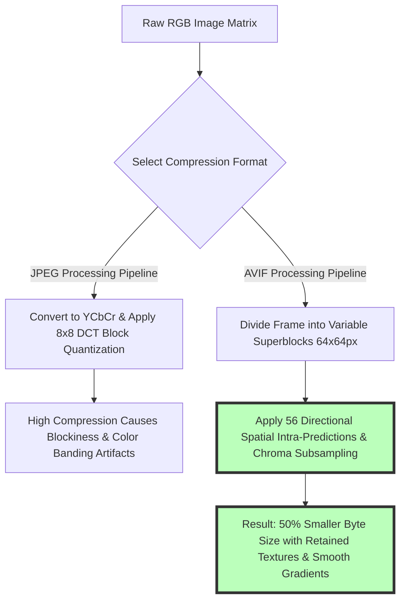

# Difference Between AVIF and JPG: Compression, File Size & HDR Guide

Choosing the right digital image format is one of the most impactful decisions web developers, e-commerce managers, software engineers, and digital photographers make when optimizing modern websites. As visual media accounts for over 60% of total network bytes downloaded on modern web pages, image format selection directly impacts Google Core Web Vitals performance (specifically Largest Contentful Paint - LCP), search engine optimization (SEO) rankings, server bandwidth hosting costs, and mobile user experience.

While **JPEG (JPG)** has served as the universal digital imaging standard for over 30 years, next-generation image formats like **AVIF (AV1 Image File Format)** have reshaped image compression standards. Derived from Alliance for Open Media's AV1 open-source video codec, AVIF provides superior lossy and lossless compression efficiency, reducing file sizes by **40% to 60% compared to JPEG** while introducing advanced features like 10-bit/12-bit High Dynamic Range (HDR) color, wide color gamuts (Display P3), and alpha channel transparency.

This guide evaluates the technical differences between AVIF and JPG, details **AV1 directional intra-prediction math vs. JPEG Discrete Cosine Transform (DCT)**, analyzes HDR color depth and transparency capabilities, compares browser compatibility (95%+ global support), and outlines how to convert and serve AVIF graphics using HTML5 `<picture>` tags.

---

## Master Specification Comparison: AVIF vs. JPEG (JPG)

To evaluate how next-generation AVIF compares against legacy JPEG, review this comprehensive technical specification matrix:

| Feature / Metric | AVIF (AV1 Image Format) | JPEG / JPG (Joint Photographic Experts Group) |
| :--- | :--- | :--- |
| **Development Standard** | Alliance for Open Media (AOMedia, 2019)| ISO/IEC 10918-1 (1992) |
| **Compression Architecture** | **AV1 Video Keyframe (Intra-Coding)**| Discrete Cosine Transform (DCT) |
| **Average File Size Savings**| **50% Smaller than JPEG** | Standard Baseline Reference |
| **Color Bit Depth** | **8-bit, 10-bit, & 12-bit (HDR)** | Restricted to 8-bit (SDR) |
| **Transparency (Alpha Channel)**| **YES (8-bit Lossy & Lossless Alpha)**| ❌ NO (Solid Backgrounds Only) |
| **Wide Color Gamuts** | **YES (Display P3, Rec. 2020)** | ⚠️ Limited (sRGB Only) |
| **Browser Support (2026)** | **95%+ Global Support** (Chrome, Safari, Firefox, Edge)| 100% Universal Legacy Support |
| **Encoding Speed** | Moderate / Heavy CPU Processing | Extremely Fast (Hardware Acceleration) |

---

## Compression Mechanics: AV1 Intra-Prediction vs. JPEG DCT

How does AVIF achieve a 50% file size reduction over JPEG while maintaining superior visual quality?



### 1. JPEG Compression Mechanics (1992 Technology)
JPEG processes images by dividing frames into fixed $8\times8$ pixel blocks:
1. Colors are converted from RGB to $YCbCr$ (Luminance, Blue-Difference, Red-Difference).
2. The encoder applies a **Discrete Cosine Transform (DCT)** to each $8\times8$ block.
3. High-frequency spatial frequencies are discarded during quantization. At higher compression levels, JPEG introduces visible **$8\times8$ block grid artifacts** and harsh mosquito noise around high-contrast text edges.

### 2. AVIF AV1 Compression Mechanics (Next-Gen Technology)
AVIF leverages state-of-the-art AV1 video intra-frame coding:
* **Variable Superblocks ($64\times64$ to $4\times4$):** AVIF dynamically partitions images into variable-sized superblocks, allowing complex detailed areas to receive high precision while flat background areas use large blocks.
* **56 Directional Spatial Intra-Predictions:** The encoder predicts pixel trends across 56 directional angles, encoding only the tiny residual mathematical error.
* **Chroma Subsampling (4:4:4, 4:2:2, 4:2:0):** AVIF retains crisp color boundaries without color bleeding.

---

## Color Depth & Visual Quality: 8-Bit SDR vs. 10-Bit/12-Bit HDR

Modern displays—such as Apple OLED Super Retina screens, 4K HDR televisions, and high-end desktop monitors—demand extended dynamic range and wider color gamuts:

```
+-----------------------------------------------------------------------+
|  COLOR DEPTH GRADIENT COMPARISON                                      |
|                                                                       |
|  JPEG 8-Bit SDR (256 Shades Per Channel / 16.7M Colors):              |
|  [ Dark ] ===|=== Color Banding Step Artifacts ===|=== [ Bright ]     |
|                                                                       |
|  AVIF 10-Bit HDR (1024 Shades Per Channel / 1.07B Colors):             |
|  [ Dark ] ================= Smooth Continuous Gradient =============== [ Bright ] |
+-----------------------------------------------------------------------+
```

### Key Visual Quality Differences:
* **8-Bit SDR (JPEG):** JPEG is strictly locked to 8-bit color channels ($2^8 = 256$ shades per channel, yielding 16.7 million total colors). In smooth sky gradients or dark shadow areas, 8-bit JPEG produces ugly **color banding steps**.
* **10-Bit & 12-Bit HDR (AVIF):** AVIF supports 10-bit ($2^{10} = 1024$ shades, 1.07 billion colors) and 12-bit color depths ($2^{12} = 4096$ shades, 68.7 billion colors). This enables buttery smooth sky gradients and high-contrast HDR highlights on OLED displays.

---

## Transparency & Alpha Channel Support

One of the largest architectural drawbacks of JPEG is its complete lack of transparency support:

* **JPEG:** Cannot store transparency. Attempting to save a transparent PNG logo as JPEG forces the encoder to fill transparent areas with solid white or black boxes.
* **AVIF:** Fully supports **8-bit alpha channel transparency** in both lossy and lossless modes. An AVIF transparent logo is up to **70% smaller than a transparent PNG-24 file**, making AVIF ideal for web design overlays.

---

## HTML5 `<picture>` Tag Responsive Format Negotiation

How should web developers deploy AVIF images today while maintaining 100% fallback compatibility for legacy software?

```html
<!-- HTML5 Responsive Format Negotiation Pattern -->
<picture>
  <!-- Serve AVIF to modern browsers (95%+ support) for 50% byte savings -->
  <source srcset="/images/hero-banner.avif" type="image/avif">
  
  <!-- Fallback WebP for older browsers -->
  <source srcset="/images/hero-banner.webp" type="image/webp">
  
  <!-- Ultimate legacy JPEG fallback -->
  
</picture>
```

By using the HTML5 `<picture>` element, modern web browsers automatically download the ultra-compact AVIF file, while legacy browsers smoothly fall back to WebP or JPEG.

---

## Step-by-Step AVIF Conversion & Deployment Workflow

Follow this simple workflow to convert and deploy AVIF graphics using our free tools:

1. **Select Source Images:** Gather your master PNG, JPEG, or WebP graphics.
2. **Convert to AVIF:** Drag and drop files into our free [AVIF Converter](/tools/avif-to-jpg) or [Image Converter](/tools/image-converter).
3. **Adjust Compression:** Set AVIF quality between **65% and 75%** for maximum file size savings with zero visual degradation.
4. **Deploy `<picture>` Tags:** Implement the HTML5 responsive markup on your web server.

---

## Step-by-Step AVIF vs. JPG Optimization Checklist

Before publishing web images, verify your format strategy against this checklist:

* **File Size Savings Audit:** Verify AVIF provides a **40%+ file size reduction** compared to JPEG.
* **Alpha Transparency Retention:** Confirm transparent logos exported to AVIF retain transparent backgrounds.
* **HTML5 Fallback Implementation:** Ensure `<picture>` tags contain a valid fallback `` src pointing to a JPEG file.
* **Local Privacy Verification:** Confirm conversion occurred 100% locally in browser memory without server uploads.

---

## AVIF Film Grain Synthesis (FGS) Modeling

Standard lossy image encoders smooth out high-frequency film grain, consuming huge bitrate budgets trying to encode random noise. AVIF utilizes **Film Grain Synthesis (FGS)**:
* **Parametric Noise Extraction:** During encoding, the AV1 encoder strips high-frequency film noise and models the noise statistically as compact parametric parameters.
* **Decoder Grain Generation:** Upon decoding, the browser GPU synthesizes realistic film grain overlay procedurally, preserving authentic film aesthetics at ultra-low file sizes.

---

## Next-Gen Format Ecosystem: AVIF vs. JPEG XL vs. WebP

Understanding where AVIF fits in the modern image format ecosystem:
* **AVIF vs. WebP:** AVIF is **20% to 30% smaller than WebP** at equivalent visual quality, especially for complex photography and HDR content.
* **AVIF vs. JPEG XL (JXL):** While JPEG XL excels at lossless re-compression of existing JPEGs and progressive decoding, AVIF enjoys broader native browser support across Chrome, Safari, Firefox, and mobile operating systems.

---

## Frequently Asked Questions

### What is the main difference between AVIF and JPG?
The main difference is compression efficiency and features. **AVIF uses next-generation AV1 video keyframe compression**, making files **40% to 60% smaller than JPG** while adding support for 10-bit HDR color and transparent backgrounds.

### Is AVIF better than JPG for website performance?
Yes. Serving AVIF images significantly reduces total page byte weight, accelerating **Largest Contentful Paint (LCP)** load times and improving Google Core Web Vitals SEO rankings.

### Does AVIF support transparent backgrounds?
Yes. Unlike JPG (which does not support transparency), AVIF supports full **8-bit alpha channel transparency**, providing transparent graphics at a fraction of PNG file sizes.

### Are AVIF images supported by all browsers in 2026?
AVIF enjoys over **95%+ global browser support**, including Chrome, Safari, Firefox, Edge, iOS Safari, and Android Chrome. Using HTML5 `<picture>` tags ensures fallback support for legacy software.

### Why is AVIF encoding slower than JPG?
AVIF uses advanced 56-directional intra-prediction algorithms to analyze image pixels, which requires more CPU computation during encoding. However, modern client-side WebAssembly converters process AVIF files in seconds.

### How can I convert JPG images to AVIF for free?
Upload your JPG photos to our free [Image Converter](/tools/image-converter) or [AVIF Converter](/tools/avif-to-jpg). The tool converts your files to AVIF 100% locally in your web browser with zero server uploads.
