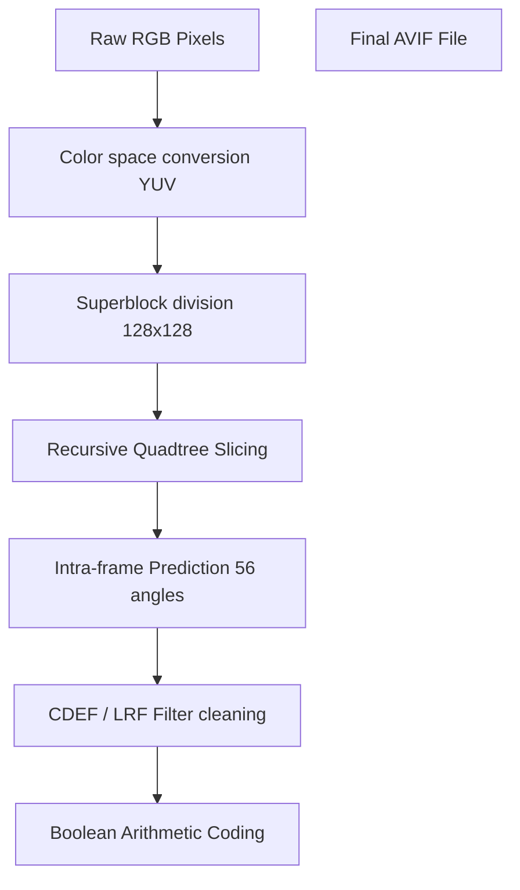

# Difference Between AVIF and WebP: Next-Gen Web Formats Compared

When optimizing website assets for maximum loading speeds and visual quality, choosing between **AVIF (AV1 Image File Format)** and **WebP** represents the cutting edge of web performance optimization. Both are next-generation image formats recommended by Google to replace legacy formats (JPEG and PNG). However, AVIF uses newer, more advanced video coding tools that produce smaller file sizes than WebP, especially for high-impact visual assets.

Understanding the difference between AVIF and WebP allows web developers and designers to build faster pipelines that improve mobile page speeds and Core Web Vitals.

This comprehensive guide compares AVIF and WebP, details their compression algorithms, analyzes color depth capabilities, and explains how to implement a secure fallback rendering structure.

---

## Technical Comparison: AVIF vs. WebP

Here is a side-by-side comparison of the core features of both formats:

| Feature | AVIF (Next-Gen Standard) | WebP (Modern Standard) |
| :--- | :--- | :--- |
| **Code Base** | AV1 Video Codec (AOMedia) | VP8 Video Codec (Google) |
| **Max Color Depth** | **12-bit (Supports HDR)** | 8-bit (Standard sRGB) |
| **Compression Efficiency**| **~20% smaller than WebP** | Baseline modern compression |
| **Superblock Partitioning**| **Recursive Quadtree ($128\times128$ to $4\times4$)** | Fixed Macroblocks ($16\times16$ to $4\times4$) |
| **Directional Prediction** | **56 Angles** | 4 Angles / Directional |
| **Banding Resistance** | **High (Excellent gradient rendering)** | Moderate (Can show banding in 8-bit) |
| **Browser Compatibility** | ~93% (Modern standard) | **98%+ (Universal modern support)** |

---

## The Compression Pipeline: AV1 Superblocks vs. VP8 Macroblocks

The primary difference between AVIF and WebP lies in their compression algorithms. AVIF leverages the advanced coding tools of the newer AV1 video codec, while WebP is based on the legacy VP8 video codec.

### 1. WebP Compression (VP8 Macroblocks)
WebP lossy compression divides images into $16\times16$ pixels blocks called **macroblocks**. 
*   **Prediction:** The encoder predicts the colors of each macroblock based on already decoded adjacent blocks using 4 basic intra-prediction directions.
*   **Transformation:** It applies a Discrete Cosine Transform (DCT) or Walsh-Hadamard Transform (WHT) to the residuals (differences) and encodes the data. While efficient, the fixed $16\times16$ block layout can lead to grid-like compression noise at low quality settings.

### 2. AVIF Compression (AV1 Superblocks & Quadtree Division)
AVIF compresses images using the intra-frame coding tools of the AV1 codec:



*   **Superblocks:** Instead of fixed $16\times16$ blocks, AV1 divides images into large $128\times128$ (or $64\times64$) areas called **superblocks**.
*   **Recursive Slicing:** Each superblock can be recursively split into smaller coding blocks using a quadtree structure, supporting block sizes down to $4\times4$ pixels. This allows the encoder to use large blocks for uniform areas (like skies) and small blocks for detailed textures.
*   **Directional Predictions:** AV1 uses 56 directional intra-prediction modes to project colors along exact angles.
*   **Loop Filters:** AVIF applies a Constrained Directional Enhancement Filter (CDEF) and a Loop Restoration Filter (LRF) during decoding to clean up ringing artifacts and restore fine textures.

---

## Color Depth and High Dynamic Range (HDR) Support

A major advantage of AVIF over WebP is support for wide color gamuts:

*   **WebP is limited to 8-bit color:** WebP supports up to 256 color values per channel (16.7 million total colors). This can cause visible color banding in smooth gradients, such as sunset skies or shadow areas.
*   **AVIF supports 10-bit and 12-bit color depth:** AVIF supports up to 4,096 color values per channel (68 billion total colors). This prevents banding and allows AVIF to display high dynamic range (HDR) images with peak highlights and deep shadow details.

---

## Implementing Web-Safe Fallbacks (The `<picture>` Rule)

While WebP is supported by over 98% of browsers, AVIF support is slightly lower at around 93%. Older Safari versions (on iOS 15 or macOS Big Sur) cannot decode AVIF files natively.

To take advantage of AVIF's superior compression without breaking images for older devices, always use the HTML5 `<picture>` element to serve fallback options:

```html
<picture>
  <!-- Serve AVIF to compatible browsers -->
  <source srcset="/images/product.avif" type="image/avif">
  
  <!-- Serve WebP as the modern default fallback -->
  <source srcset="/images/product.webp" type="image/webp">
  
  <!-- Fall back to standard JPEG for legacy browsers -->
  
</picture>
```
Using this responsive fallback system ensures all visitors receive the smallest possible file their browser can support.

---


---

## Chroma Subsampling Differences: AV1 vs. VP8

While both AVIF and WebP support YUV chrominance subsampling (such as 4:2:0, 4:2:2, and 4:4:4), they handle color details differently.
*   **WebP (VP8):** Compresses color data using VP8's default color spaces, which can sometimes result in color bleeding on high-contrast borders (like red text on a black background).
*   **AVIF (AV1):** Uses advanced chroma prediction tools that estimate color details based on brightness data. This prevents color bleeding and preserves sharp edges, making AVIF the better choice for graphics containing both detailed photos and text overlays.

---

## AVIF Tile-Grids vs. WebP Macroblocks

Decoding high-resolution images requires significant processing power, which can cause lag or battery drain on mobile devices.
*   **WebP Decoding:** WebP decodes images serially, processing macroblocks one-by-one in a single thread. This can cause rendering delays for ultra-high-resolution images.
*   **AVIF Parallel Decoding:** AVIF supports **Tile Grids**, allowing an image to be divided into independent tiles that can be decoded in parallel across multiple CPU cores. This reduces rendering times for high-resolution graphics on modern mobile hardware.


---

## Assessing Decoding Latency Overhead in Mobile Devices

While saving bandwidth is critical, the time it takes a browser to decode an image file also affects page performance and mobile battery life.
*   **The CPU Bottleneck:** AVIF uses the AV1 codec, which requires more complex math to decode than WebP's VP8 codec. On low-end mobile devices, decoding large AVIF files can increase CPU usage, delay rendering times, and drain the battery faster if hardware-accelerated decoders are not present on the device.
*   **The Solution:** Use AVIF for large above-the-fold visual elements (like hero banners) where file size savings are greatest, and use WebP for smaller, repeated elements (like product listings) to keep CPU overhead low, preserve mobile battery life, and ensure smooth scrolling.


---

## AV1 Codec Licensing and Industry Support

The development of AVIF was driven by the industry's need for a modern, royalty-free image standard to replace patent-encumbered formats like HEIC.
*   **The Alliance for Open Media (AOMedia):** Developed the AV1 codec as a royalty-free standard supported by major tech companies, including Google, Apple, Microsoft, Amazon, and Netflix. This broad backing has speeded up AVIF adoption globally.
*   **WebP's Legacy:** WebP was developed solely by Google, which initially limited its adoption in non-Chrome browsers. AVIF's broad industry backing has led to faster integration across operating systems, graphic libraries, and web browsers, making it a highly sustainable choice for future web development. Furthermore, since AOMedia members represent major operating system and device manufacturers, hardware-accelerated AV1 decoding blocks are now standard on modern smartphones, computers, and TVs, eliminating the CPU decoding bottleneck.

## Frequently Asked Questions About AVIF and WebP

### What is the difference between AVIF and WebP?
The main difference is **compression efficiency and color depth**. AVIF files are typically **20% smaller** than equivalent WebP files. Additionally, AVIF supports 10-bit and 12-bit High Dynamic Range (HDR) color, whereas WebP is limited to 8-bit standard color.

### Does AVIF compress images better than WebP?
Yes. AVIF uses the advanced coding tools of the AV1 video codec (such as recursive quadtree partitioning and loop filters), which allows it to compress photographic content and graphics with text more efficiently than WebP.

### Should I convert WebP to AVIF?
Converting an existing WebP to AVIF will not improve visual quality, as WebP compression is already lossy. However, when exporting new images from raw sources, saving them as AVIF will produce smaller file sizes than WebP at equivalent quality.

### Are there compatibility issues with AVIF?
Yes. AVIF is supported by approximately **93% of browsers**, whereas WebP has over **98% compatibility**. Older Safari and iOS versions may struggle to decode AVIF. Always use HTML5 `<picture>` tags to provide a WebP or JPEG fallback.

### Does AVIF support transparency?
Yes. AVIF supports alpha-channel transparency. It stores transparency data as a separate auxiliary image item in the container, which is compressed using a grayscale AV1 bitstream to ensure clean edges.

### How can I convert my images to AVIF?
To convert JPEGs, PNGs, or WebP files to AVIF locally without uploading them to third-party servers, use our free, browser-based [WebP to AVIF Converter](/tools/webp-to-avif). The tool runs locally in your browser, keeping your files secure and private.
