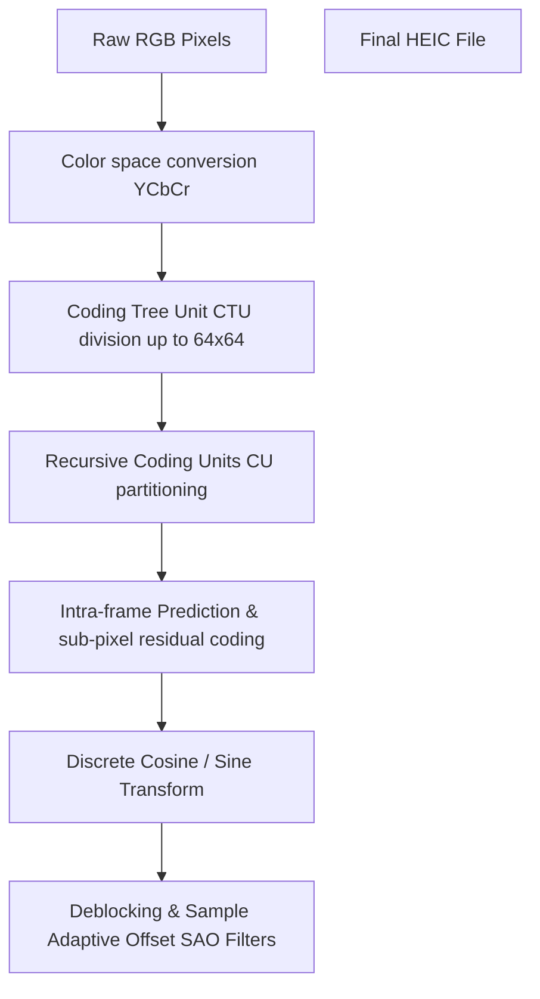

# Difference Between HEIC and JPG: Apple HEIF vs. JPEG Compared

In 2017, Apple introduced the **HEIC (High Efficiency Image Container)** format as the default image format for iOS devices. Designed to replace the aging **JPEG** format, HEIC allows iPhones and iPads to capture high-quality photos at half the file size of equivalent JPEGs, saving storage space on Apple devices. However, because HEIC is based on high-efficiency video coding technologies, it suffers from limited browser compatibility, making it unsuitable for direct web publishing.

Understanding the difference between HEIC and JPG is crucial for photographers, web developers, and mobile users managing digital media portfolios.

This comprehensive guide compares HEIC and JPG, details their compression methods, analyzes web support issues, and explains how to convert files for general sharing.

---

## Technical Comparison: HEIC vs. JPG

Here is a side-by-side comparison of the core features of both formats:

| Feature | HEIC (High Efficiency Image Container) | JPG / JPEG (Joint Photographic Experts Group) |
| :--- | :--- | :--- |
| **Container Standard** | ISOBMFF (ISO/IEC 23008-12) | JFIF / EXIF |
| **Compression Standard** | HEVC / H.265 Video Codec | DCT (Discrete Cosine Transform) |
| **Average File Size** | **~50% smaller than JPEG** | Baseline (100%) |
| **Max Color Depth** | **16-bit (Supports Display P3)** | 8-bit (Standard sRGB) |
| **Transparency (Alpha)** | **Yes** | No |
| **Image Sequences** | **Yes (Supports Live Photos)** | No (Static single frames only) |
| **Browser Compatibility** | Extremely Limited (No native Chrome/Firefox support) | **100% (Universal)** |
| **Best Use Case** | iOS local storage, photography capture | Web publishing, universal email attachments |

---

## The Compression Pipeline: HEVC Coding Tree Units vs. JPEG 8x8 Blocks

The primary difference between HEIC and JPG lies in their compression algorithms. While JPEG uses baseline block quantization developed in the early 1990s, HEIC leverages the advanced video coding tools of the **HEVC (H.265)** codec.

### 1. JPEG Compression Limitations
JPEG divides images into fixed **$8\times8$ pixel blocks**. It applies a Discrete Cosine Transform (DCT) to convert spatial pixel values into frequency coefficients, and then discards high-frequency detail during quantization. 

Because the $8\times8$ block grid is fixed, highly compressed JPEGs frequently show grid-like blocky artifacts and fuzzy noise (ringing artifacts) around sharp edges.

### 2. HEIC Compression (Coding Tree Units)
HEIC compresses images using the advanced spatial prediction tools of the HEVC codec:

*   **Coding Tree Units (CTUs):** Instead of fixed $8\times8$ blocks, HEIC divides images into large areas called **Coding Tree Units (CTUs)** (up to $64\times64$ pixels).
*   **Recursive Partitioning:** Each CTU can be recursively split into smaller Coding Units (CUs), Prediction Units (PUs), and Transform Units (TUs). This allows the compressor to use large blocks for uniform areas (like skies) and small blocks for fine details, maximizing compression efficiency.
*   **Intra-Prediction Angles:** HEVC supports 33 directional intra-prediction angles (compared to JPEG's none) to predict color gradients and edges.
*   **Sample Adaptive Offset (SAO) Filter:** HEIC applies a SAO filter during decoding to smooth block boundaries and reduce edge noise, resulting in clean gradients at half the size of a JPEG.

---

## Live Photos, Depth Maps, and Multi-Image Containers

Because HEIC is based on the **ISO Base Media File Format (ISOBMFF)**, it acts as a flexible container rather than a single static frame:

*   **Apple Live Photos:** A single HEIC file can contain a sequence of images alongside an AAC audio track, enabling Apple's "Live Photos" feature without needing separate video files.
*   **Auxiliary Images & Transparency:** HEIC supports alpha-channel transparency and can store auxiliary images (such as depth maps captured by dual camera systems). This depth data allows iOS to apply portrait mode effects (like adjusting background blur) after the photo has been taken.

---

## The Web Compatibility Barrier: Why HEIC Fails on the Web

Despite its superior compression, **HEIC is not supported natively by web browsers**:

*   **The Browser Support Gap:** Neither Google Chrome, Mozilla Firefox, Microsoft Edge, nor Opera can decode HEIC files natively. If you embed an `` tag on a webpage, the image will appear broken for nearly all visitors.
*   **Licensing Hurdles:** HEVC/H.265 is subject to high patent licensing fees. Open-source browsers (like Firefox and Chrome) refuse to pay these royalties, preventing native decoding.
*   **The Solution:** For web publishing, always convert HEIC files to compatible web formats like WebP, AVIF, or JPEG before uploading.

---

---

## HEVC Coding Tree Units (CTU) vs. JPEG 8x8 Blocks

The primary reason HEIC compresses images to half the size of JPEG is the use of **Coding Tree Units (CTUs)**.
*   **JPEG Blocks:** JPEG is limited to fixed $8\times8$ pixel blocks, which cannot adapt to image details.
*   **HEIC CTUs:** HEIC uses flexible CTUs up to $64\times64$ pixels. The encoder can recursively split these CTUs into smaller Coding Units (CUs), Prediction Units (PUs), and Transform Units (TUs). This allows it to compress large, flat areas (like skies) in a single block while reserving smaller blocks for detailed textures, saving significant file space.

---

## Converting HEIC to JPEG via WebAssembly (Wasm)

Because HEIC is not supported natively by web browsers, developers use local conversion solutions.
*   **The Old Method:** Uploading HEIC files to a server to convert them to JPEG, which consumes bandwidth and compromises user privacy.
*   **The Modern Wasm Method:** Using WebAssembly (Wasm) ports of image decoders (like libheif) to convert HEIC files to JPEG directly inside the user's browser. Since the conversion runs locally on the client's device, your files remain private and secure without needing server uploads.

---

## HEVC Patent Licensing & Open-Web Standard Barriers

The primary reason HEIC is not supported natively by web browsers is the complex patent licensing system of the **HEVC (H.265)** video codec.
*   **The Licensing Problem:** Unlike open-source, royalty-free codecs like AV1 and VP8, HEVC is managed by multiple patent pools (including Access Advance and MPEG LA) that require developers and browser vendors to pay high licensing fees.
*   **The Open-Web Barrier:** Open-source browsers (like Mozilla Firefox) cannot include proprietary decoders without paying royalties, which conflicts with their open-web principles. As a result, browser vendors have chosen to support open standards like WebP and AVIF instead of HEIC.

---

## HEIC Live Photo Container Synchronization Mechanics

HEIC's container structure allows it to synchronize multiple media tracks in a single file.
*   **The Container Layout:** HEIC uses the ISOBMFF container to package both a static high-resolution HEVC photo and a short 1080p H.265 video clip.
*   **Synchronization Tags:** The file contains synchronization metadata that links the timeline of the video clip to the exposure point of the photo. When a user presses the screen on an iOS device, the Photos app plays the synchronized video track, providing a seamless live photo experience that static JPEG files cannot support.

## Frequently Asked Questions About HEIC and JPG

### What is the difference between HEIC and JPG?
The main difference is **compression efficiency and features**. HEIC files are compressed using the HEVC (H.265) codec, which makes them **50% smaller** than equivalent JPEGs. Additionally, HEIC supports transparency, wide color depths (Display P3), and image sequences (Live Photos), which JPEG does not.

### Can I open HEIC files on Windows?
Yes, but you may need to install extensions. Windows 10 and 11 require the **HEIF Image Extensions** and **HEVC Video Extensions** from the Microsoft Store to view and open HEIC files natively in the Photos app.

### Why does Apple use HEIC instead of JPG?
Apple uses HEIC to save storage space on iOS devices. Since HEIC files are half the size of JPEGs at equivalent quality, iPhone users can store twice as many high-resolution photos on their device.

### Can I upload HEIC files directly to my website?
No. Web browsers (including Chrome, Firefox, and Edge) do not support the HEIC format natively due to HEVC licensing fees. To display images on a website, you must convert HEIC files to WebP, AVIF, or JPEG.

### How can I stop my iPhone from saving photos as HEIC?
To force your iPhone to save photos as standard JPEGs, navigate to **Settings > Camera > Formats** on your device and select **Most Compatible** instead of *High Efficiency*.

### How can I convert HEIC to JPG securely?
To convert HEIC photos to compatible JPEGs locally without uploading your files to third-party servers, use our free, browser-based [HEIC to JPG Converter](/tools/heic-to-jpg). The tool runs locally in your browser, keeping your files secure and private.
