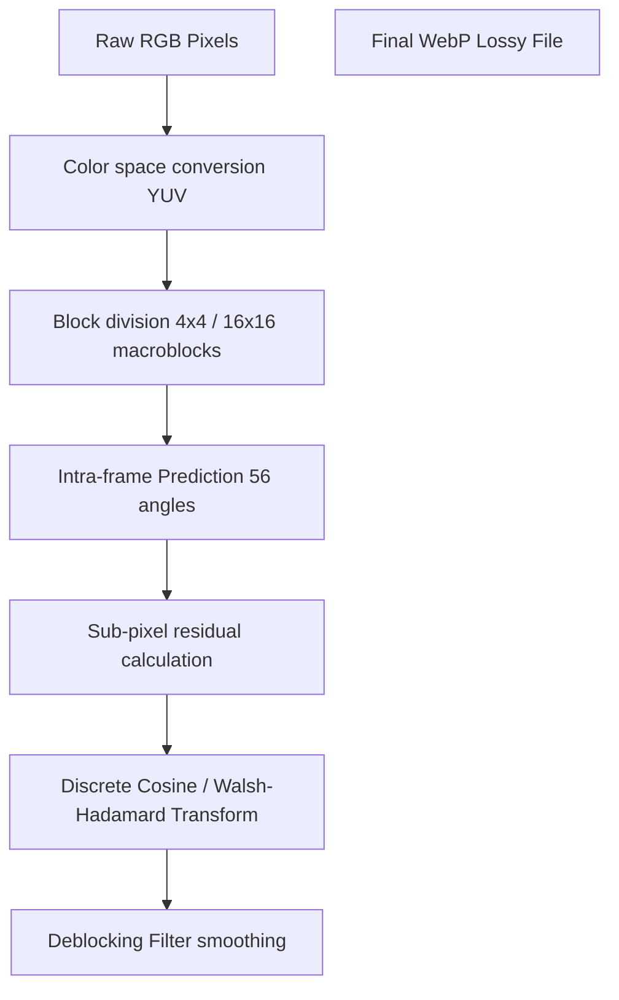

# Difference Between JPG and WebP: E-Commerce Formats Compared

When optimizing photographs, blog graphics, or product galleries for the web, choosing between **JPG (Joint Photographic Experts Group)** and **WebP** is a critical decision. While JPEG has been the standard format for digital photography for over three decades, WebP has become the preferred choice for modern web development. WebP uses advanced compression techniques to produce files that are significantly smaller than JPEGs at equivalent visual quality.

Understanding the difference between JPG and WebP allows webmasters and merchants to speed up their stores, improve mobile user experiences, and boost search engine rankings.

This comprehensive guide compares JPG and WebP, details their compression pipelines, analyzes edge artifacts, and explains when to use each format.

---

## Technical Comparison: JPG vs. WebP

Here is a side-by-side comparison of the core features of both formats:

| Feature | JPG / JPEG (Legacy) | WebP (Modern) |
| :--- | :--- | :--- |
| **Compression Type** | Lossy | **Lossy & Lossless (Hybrid)** |
| **Compression Algorithm** | DCT (Discrete Cosine Transform) | VP8 (Lossy) / Predictive Coding (Lossless) |
| **Transparency (Alpha)** | No | **Yes (8-bit transparency)** |
| **Animation Support** | No | **Yes (Replaces animated GIFs)** |
| **Edge Rendering Quality**| Low (Ringing artifacts around text) | **High (Intra-prediction + Deblocking filter)** |
| **Avg. File Size** | Baseline (100%) | **25% to 35% smaller than JPEG** |
| **Browser Compatibility** | 100% (Universal) | 98%+ (Modern standard) |

---

## The Compression Pipeline: DCT Quantization vs. VP8 Predictive Coding

The primary difference between the two formats is the mathematical approach they use to compress lossy pixel data.

### 1. JPEG Compression (DCT & Block Quantization)
JPEG compresses images by dividing the YCbCr color channels into $8\times8$ pixel blocks. It applies a **Discrete Cosine Transform (DCT)** to convert the spatial pixel values of each block into frequency coefficients. 

During the lossy **Quantization** step, the frequency coefficients are divided by values in a Quantization Table (DQT) and rounded to the nearest integer. Because high-frequency coefficients (representing sharp details) are divided by larger values, they are rounded to zero, discarding detail to achieve compression.

### 2. WebP Lossy Compression (VP8 keyframe Predictive Coding)
WebP's lossy compression is based on the intra-frame encoding technology of the **VP8 video codec**:



*   **Intra-Prediction:** Instead of compressing every block independently, WebP uses intra-prediction. It analyzes neighboring, already-decoded blocks and projects pixel colors along exact angles to predict the color of the current block.
*   **Residual Coding:** The encoder calculates the difference (residual) between the predicted block and the actual block. It transforms this residual using DCT or Walsh-Hadamard Transforms (WHT).
*   **In-Loop Deblocking Filter:** During decoding, WebP applies a deblocking filter directly inside the decoding loop. This filter smooths block boundaries, removing the blocky grids common in highly compressed JPEGs.

---

## Edge Rendering & Compression Noise (Ringing Artifacts)

A major drawback of JPEG compression is how it handles sharp edges, such as text, illustration outlines, or graphic borders:

*   **JPEG Ringing Artifacts:** Because JPEG uses $8\times8$ frequency blocks, it struggles to represent sudden color shifts (sharp edges) accurately without using high frequencies. When these high frequencies are quantized (rounded to zero), it creates fuzzy noise (ringing artifacts) around the edges.
*   **WebP Edge Preservation:** WebP's intra-prediction and deblocking filter prevent ringing noise, allowing WebP to preserve sharp edges and rendering text cleanly even at low quality settings.

```
[ Sharp Text Outline ]                  [ JPEG Compression Noise ]
  +-------------------------+             +-------------------------+
  |      Clean Border       |   ───>      |  ~.  Fuzzy Ringing  .~  |
  |      (Solid Edge)       |             |  (Noise around border)  |
  +-------------------------+             +-------------------------+
```

---

## Web Vitals & E-Commerce Conversions

For e-commerce stores, converting product galleries from JPG to WebP has a direct impact on page performance:

*   **Largest Contentful Paint (LCP):** LCP measures when the largest visual element on the page (usually a product photo) becomes visible. WebP files are **25% to 35% smaller** than JPEGs at equivalent quality, allowing product pages to load faster and improving LCP scores.
*   **Bandwidth Savings:** Serving WebP images reduces bandwidth usage on mobile connections, lowering bounce rates and increasing sales.

---


---

## VP8 Intra-Prediction Mode Splicing Math

WebP's VP8 algorithm predicts pixel values within each block using four primary intra-prediction modes:
*   **H_PRED (Horizontal Prediction):** Predicts each pixel's color based on the pixel to its left.
*   **V_PRED (Vertical Prediction):** Predicts each pixel's color based on the pixel above it.
*   **DC_PRED (DC Prediction):** Predicts all pixels in a block using the average color of the surrounding decoded pixels.
*   **TM_PRED (True Motion Prediction):** Predicts pixels based on horizontal and vertical color trends, plus the top-left diagonal pixel.
By selecting the best mode for each block, WebP reduces duplicate data, allowing it to compress photographic content much more efficiently than JPEG's static $8\times8$ blocks.

---

## PageSpeed Metrics: LCP, FID, and CLS Real-world Impact

Image optimization directly improves your website's **Core Web Vitals** scores:
*   **Largest Contentful Paint (LCP):** Serving product galleries in WebP instead of JPG reduces file sizes, helping the largest above-the-fold image render faster on mobile networks.
*   **Cumulative Layout Shift (CLS):** Always define `width` and `height` attributes on your images to prevent layout shifts. WebP's smaller file sizes also reduce the time it takes the browser to parse and display the layout, improving the overall user experience.


---

## Analyzing Image Quality Metrics: PSNR and SSIM Comparisons

To measure quality loss during compression, engineers use mathematical metrics:
*   **Peak Signal-to-Noise Ratio (PSNR):** Measures the logarithmic ratio between the maximum possible power of a signal and the corrupting noise that affects its representation. While useful for raw pixel measurements, it does not correlate perfectly with human perception.
*   **Structural Similarity Index (SSIM):** A perception-based metric that measures luminance, contrast, and structure changes.
*   **The Comparison:** At equivalent file sizes, WebP files consistently score higher on the SSIM index than JPEGs. This proves that WebP preserves human-perceived structure and contrast better than JPEG's blocky frequency shifts, especially at lower quality settings.


---

## Dynamic Quantization Matrices and Macroblock Slicing Details

The key difference in lossy compression quality lies in how the formats allocate data across the image.
*   **JPEG's Static Tables:** JPEG uses static quantization tables that apply the same division factors across the entire image. This means detailed areas and flat areas are compressed using the same scale, which can lead to visible artifacts in flat regions.
*   **WebP's Dynamic Macroblock Slicing:** WebP divides the image into macroblocks and dynamically adjusts the quantization parameters for each block. This allows the encoder to apply lighter compression to areas with fine detail (like faces or text) and heavier compression to flat areas (like background walls), optimizing visual quality at smaller sizes. Additionally, the VP8 encoder uses dynamic coefficient thresholding to adaptively zero out high frequency noise that the human eye cannot resolve, yielding a much tighter and cleaner bitstream layout than legacy JPEG decoders can support.

## Frequently Asked Questions About JPG and WebP

### What is the main difference between JPG and WebP?
The main difference is that **WebP offers higher compression efficiency**. WebP lossy files are **25% to 35% smaller** than equivalent JPEGs at equivalent visual quality. Additionally, WebP supports transparent backgrounds and animations, which JPEG does not.

### Does converting JPG to WebP lose quality?
Converting a JPG to **WebP Lossless** preserves the exact quality of the source JPG, but does not improve it. Converting a JPG to **WebP Lossy** uses lossy compression, which discards some details, though this is often imperceptible at standard settings.

### Can WebP support transparent backgrounds?
Yes. WebP supports transparent alpha channels. If you have transparent graphics, WebP can compress them losslessly to replace heavy PNG files, saving up to 26% in file size.

### Why do WebP files render text cleaner than JPEGs?
JPEGs compress images in independent $8\times8$ frequency blocks, which creates fuzzy noise (ringing artifacts) around sharp borders like text. WebP uses intra-prediction and a deblocking filter to smooth block boundaries and preserve clean edges.

### Are all browsers compatible with WebP?
Yes. WebP is supported natively by over **98% of modern web browsers**, including Google Chrome, Apple Safari, Mozilla Firefox, Microsoft Edge, and Opera. Legacy browsers fall back to JPEGs using HTML5 `<picture>` tags.

### How can I convert my JPG files to WebP?
To convert JPEGs to WebP locally without uploading your files to third-party servers, use our free, browser-based [JPG to WebP Converter](/tools/jpg-to-webp). The tool runs locally in your browser, keeping your files secure and private.
