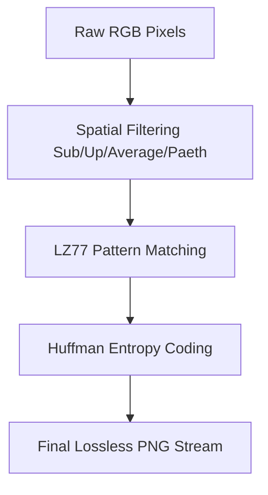

# Difference Between PNG and JPG: Quality & Compression Compared

When choosing image formats for web design, photography, or digital archiving, understanding the differences between **PNG (Portable Network Graphics)** and **JPG (Joint Photographic Experts Group)** is essential. These two standards are the most common image formats on the internet, yet they use completely different mathematical approaches to store and compress pixel data.

Using the wrong format can result in blurry text, bloated page sizes, slower load times, and poor search engine rankings.

This comprehensive guide compares PNG and JPG, details their underlying compression algorithms, analyzes transparency support, and explains when to use each format.

---

## Technical Comparison: PNG vs. JPG

Here is a side-by-side comparison of the core features of both formats:

| Feature | PNG (Portable Network Graphics) | JPG / JPEG (Joint Photographic Experts Group) |
| :--- | :--- | :--- |
| **Compression Type** | **Lossless (No quality loss)** | Lossy (Discards details to save space) |
| **Compression Algorithm** | DEFLATE (LZ77 + Huffman) | DCT (Discrete Cosine Transform) + Huffman |
| **Transparency (Alpha)** | **Yes (Full 8-bit alpha channel)** | No (Fills background with black or white) |
| **Ideal Content** | Sharp line art, logos, text, screenshots | Photographs, complex gradients, backgrounds |
| **Color Support** | Up to 48-bit Truecolor (RGB) | 24-bit RGB (8-bit per channel) |
| **Generation Loss** | **None (Can be edited repeatedly)** | Accumulates compression artifacts on every save |
| **Sizing** | Larger file sizes | Smaller file sizes |

---

## The Compression Pipeline: DEFLATE vs. DCT

The fundamental difference between PNG and JPG lies in their compression methods. One preserves every pixel, while the other discards details.

### 1. PNG Lossless Compression (DEFLATE & Filtering)
PNG uses a lossless compression pipeline that combines **2D Spatial Filtering** and the **DEFLATE algorithm**:



*   **2D Spatial Filtering:** Before compressing, PNG processes the pixel data row-by-row. It predicts each pixel's color based on neighboring pixels (using methods like Sub, Up, Average, or Paeth) and records only the difference (residual). This creates long runs of identical values, making the data easier to compress.
*   **LZ77 Compression:** The filtered stream is processed using the LZ77 algorithm, which replaces repeated pixel patterns with references to previous occurrences.
*   **Huffman Coding:** Finally, Huffman coding replaces common data sequences with shorter bit codes, producing a smaller file without discarding any pixel data.

### 2. JPG Lossy Compression (Discrete Cosine Transform)
JPG uses a lossy pipeline designed to discard visual details that the human eye is less sensitive to:
*   **Color Conversion (YCbCr):** Converts RGB pixels to the YCbCr color space to separate brightness (Y) from color data (Cb/Cr).
*   **Chrominance Subsampling:** Reduces the resolution of the color channels (typically 4:2:0 subsampling), which halves the color data size without a noticeable change in quality.
*   **Discrete Cosine Transform (DCT):** Divides the image into $8\times8$ pixel blocks and applies the DCT formula to convert the spatial pixel data into frequency coefficients.
*   **Quantization:** High-frequency details are divided by values in a Quantization Table (DQT) and rounded to the nearest integer. High frequencies are rounded to zero, which discards detail but allows the data to compress efficiently using Huffman coding.

---

## Transparency and Alpha Channels

A major difference between the formats is support for **Transparency**.

*   **PNG supports full 8-bit alpha transparency:** A PNG file can store an auxiliary transparency channel (alpha channel) alongside the Red, Green, and Blue channels. This allows for semi-transparent pixels (translucency), enabling drop shadows and soft edges that blend seamlessly with any background color.
*   **JPG does not support transparency:** The JPEG standard has no concept of transparency. If you convert a transparent PNG to JPG, the transparent areas are filled with a solid color (typically black or white). This makes JPG unsuitable for transparent icons, cutouts, or logos.

```
[ PNG Logo with Transparency ]          [ JPG Logo Conversion ]
  +-------------------------+             +-------------------------+
  |    *  Logo Graphic  *   |   ───>      | ██ *  Logo Graphic  * ██|
  |  (Transparent Backdrop) |             | (Backdrop filled white) |
  +-------------------------+             +-------------------------+
```

---

## Generation Loss and Digital Editing

If you edit and save images frequently, consider **Generation Loss**:

*   **PNG is immune to generation loss:** Because PNG is lossless, you can open, modify, and save a PNG file thousands of times without losing detail or introducing blur.
*   **JPG suffers from generation loss:** Every time you open, edit, and save a JPEG file, it undergoes YCbCr conversion, DCT block partitioning, and quantization. This causes compression errors to accumulate, leading to visible blur and color distortion (generation loss). Always keep a lossless PNG source file for editing, and export to JPG only when publishing.

---

## Web Performance and Core Web Vitals

For website performance, choose formats that balance loading speed and quality:

1.  **Photographs:** Always use JPG (or next-gen WebP/AVIF) for photographs. A photographic PNG file can be 5 to 10 times larger than an optimized JPG, slowing down your page speeds and harming your SEO rankings.
2.  **Logos and Icons:** Use SVG or transparent PNG for logos. Using JPG for logos creates compression noise (ringing artifacts) around sharp edges, making text look blurry.

---


---

## Chroma Subsampling Formats in JPEG

To understand why JPG compression is so efficient, we must look at how color data is subsampled. The human eye has about 120 million rod cells (which detect brightness) but only 6 million cone cells (which detect color). JPEG exploits this by compressing color data while keeping brightness data intact. 
*   **YUV 4:4:4:** No subsampling is applied. Color is stored at full resolution. This is equivalent to PNG, preserving sharp borders.
*   **YUV 4:2:2:** Color resolution is halved horizontally but remains full vertically.
*   **YUV 4:2:0:** Color resolution is halved both horizontally and vertically, saving 50% of the raw data size. While this is efficient, it causes colors to bleed at high contrast boundaries, which is why text looks blurry in JPGs compared to PNGs.

---

## Decoding Speed and CPU Overhead Comparison

When loading a page, the browser must decode the image files before rendering them on the screen.
*   **PNG Decoding:** PNG decoding is simple and fast because it uses the DEFLATE algorithm, which runs with low CPU and memory overhead. This makes PNG ideal for low-powered mobile devices or systems rendering hundreds of interface elements.
*   **JPEG Decoding:** JPEG decoding requires significant processing power to perform Inverse Discrete Cosine Transforms (IDCT) on each $8\times8$ block. However, modern CPUs have built-in hardware acceleration for JPEG, making it highly efficient.


---

## Real-World Web Performance & Byte Savings Benchmarks

When deploying graphics across large content delivery networks (CDNs), every kilobyte saved reduces bandwidth costs and accelerates page load times.
*   **The Photograph Test:** Compressing a high-detail $2000\times1500$ pixel photograph as a PNG results in a file size of approximately **4.5 MB**. The same photograph compressed as a JPG at 80% quality results in only **350 KB**, representing a **92% reduction in file size** with no visible loss in quality on standard mobile or desktop monitors.
*   **The Interface Icon Test:** Compressing a flat vector logo with a transparent background as a PNG results in a file size of **15 KB**. The same logo converted to a JPG (filling the background with solid white) results in **45 KB** and introduces visible blur (ringing artifacts) around the letters, proving that lossless PNG (or SVG) is the only suitable choice for text and interface elements.

## Frequently Asked Questions About PNG and JPG

### What is the difference between PNG and JPG?
The main difference is that **PNG is a lossless format** (preserves all pixel data and supports transparency), whereas **JPG is a lossy format** (discards high-frequency details to create smaller files, but does not support transparency).

### Which format is better for website images?
For photographs, **JPG** (or modern WebP/AVIF fallback) is better because it produces smaller file sizes that speed up page load times. For logos, icons, line art, and graphics with text, **PNG** or **SVG** is better because they preserve sharp edges.

### Why do JPEGs not support transparent backgrounds?
The JPEG specification was designed in the early 1990s to compress photographic content. It divides images into $8\times8$ blocks using a three-channel color space (YCbCr) and lacks the extra alpha channel needed to store transparency information.

### What is generation loss in JPG files?
Generation loss occurs because JPG is a lossy format. Every time you open, edit, and save a JPG file, the compressor applies lossy quantization again. This discards more detail each time, causing compression noise and blur to accumulate.

### Does converting PNG to JPG lose quality?
Yes. Converting a PNG to JPG uses lossy compression, which discards high-frequency details. While this reduction in quality may not be visible in photographs, it can create noticeable blur around text or sharp graphic edges.

### How can I convert PNG to JPG without uploading my files?
To convert PNG graphics to compatible JPEGs without uploading your files to third-party servers, use our free, browser-based [PNG to JPG Converter](/tools/png-to-jpg). The tool runs locally in your browser, keeping your files private and secure.
