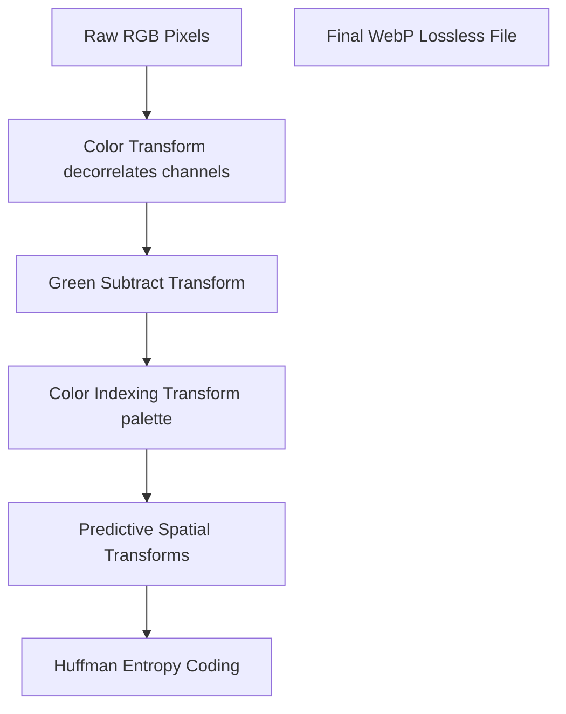

# Difference Between PNG and WebP: Lossless Web Formats Compared

When optimizing transparent graphics, illustrations, or vector line art for the web, choosing between **PNG (Portable Network Graphics)** and **WebP** is a critical decision. Both formats support lossless compression and alpha channels, making them ideal for graphics that require clean, transparent backgrounds. However, WebP uses modern compression techniques that produce significantly smaller files, which helps pages load faster and improves search rankings.

Understanding the difference between PNG and WebP allows web developers and designers to optimize their assets for speed and quality.

This comprehensive guide compares PNG and WebP, analyzes their compression algorithms, examines transparency efficiency, and details how next-gen formats improve storefront performance.

---

## Technical Comparison: PNG vs. WebP

Here is a side-by-side comparison of the core features of both formats:

| Feature | PNG (Portable Network Graphics) | WebP (Lossless & Lossy) |
| :--- | :--- | :--- |
| **Compression Type** | Lossless | **Lossless & Lossy (Hybrid)** |
| **Compression Algorithm** | DEFLATE (LZ77 + Huffman) | VP8 (Lossy) / Predictive Coding (Lossless) |
| **Transparency (Alpha)** | Yes (Standard 8-bit alpha) | **Yes (Auxiliary Compressed Alpha)** |
| **Animation Support** | No (Requires APNG) | **Yes (Replaces animated GIFs)** |
| **File Size (Lossless)** | Baseline (100%) | **~26% smaller than PNG** |
| **Browser Compatibility** | 100% (Universal) | 98%+ (Modern standard) |
| **Best Use Case** | Legacy system assets, archives | Product listings, transparent web UI elements |

---

## The Lossless Compression Pipeline: DEFLATE vs. WebP Transforms

While both formats can compress images losslessly without losing a single pixel of detail, their underlying methods are very different.

### 1. PNG Compression (Filtering & DEFLATE)
As outlined in the PNG specification, the format applies **2D Spatial Filtering** to each row of pixels to predict color values based on neighboring pixels. It then compresses the residuals using the **DEFLATE algorithm** (a combination of LZ77 sliding dictionary matching and Huffman entropy coding). This is a general-purpose compression method that does not adapt dynamically to color patterns.

### 2. WebP Lossless Compression (Predictive Transformations)
WebP Lossless uses a advanced compression pipeline. Instead of relying on a single general-purpose algorithm, it applies four custom **image transformations** before encoding the data:

*   **Color Transform:** Decorrelates the Red, Green, and Blue channels. Because color channels in an image are often related (e.g., a green leaf contains green and yellow shades), this transform represents the Red and Blue channels based on the Green channel, reducing duplicate data.
*   **Green Subtract Transform:** Subtracts the Green value from the Red and Blue values, simplifying the color data.
*   **Color Indexing (Palette) Transform:** If the image contains fewer than 256 unique colors, WebP converts the image into an indexed palette, similar to GIF, which reduces the file size.
*   **Predictive Spatial Transform:** Uses 14 different spatial prediction modes to estimate pixel colors. This predicts color gradients and patterns across 2D blocks, rather than row-by-row like PNG, leaving smaller residuals to compress.
*   **Huffman Coding:** Compresses the transformed stream, producing files that are **26% smaller than PNGs** at identical quality.

---

## Transparency (Alpha Channel) Efficiency

Both formats support transparent backgrounds, but they store the transparency data differently:

*   **PNG Transparency:** Stores transparency as a separate, uncompressed alpha channel. For a 32-bit RGBA image, 8 bits of every pixel are dedicated to transparency, regardless of whether the area is solid or transparent. This increases the file size.
*   **WebP Transparency:** Compresses the transparency channel. In lossy WebP, the alpha channel is compressed as a separate grayscale VP8 bitstream. In lossless WebP, the alpha channel is encoded alongside the color channels, using spatial prediction to compress transparent areas efficiently. This results in transparent WebP files that are significantly smaller than equivalent PNGs.

---

## Animation Support: APNG vs. WebP

For simple web animations, WebP has a major advantage over PNG:

*   **Standard PNG lacks animation support:** The original PNG specification does not support animations. To animate PNGs, developers created **APNG (Animated PNG)**. While APNG supports 24-bit color and alpha transparency, it is not supported by all legacy browsers and has larger file sizes.
*   **WebP supports animation natively:** The WebP container supports multi-frame animations with transparency. It is a highly efficient replacement for legacy animated GIFs, reducing file sizes by up to 64% while supporting 24-bit color and smooth transparency.

---

---

## WebP Lossless Predictor Modes in Detail

WebP Lossless achieves its superior 26% compression over PNG by using 14 different spatial prediction modes. 
When compressing a block of pixels, the encoder evaluates these 14 modes to determine which one best predicts the color of each pixel based on its neighbors (left, top, top-left, and top-right). By recording only the difference between the prediction and the actual color, WebP reduces the amount of unique data that needs to be stored, resulting in much smaller files than PNG, which only predicts row-by-row.

---

## Color Profile Preservation (ICC Profile Embedding)

For professional designers and photographers, maintaining color accuracy is critical. Both PNG and WebP support embedded **ICC Color Profiles**, which define how colors should render on different monitors. 
*   **PNG Color Tags:** PNG stores color profiles in chunks like `iCCP` and `sRGB`.
*   **WebP Extended Container:** WebP stores color profiles inside the `ICCP` chunk of its extended file container. 
When compressing PNGs to WebP, ensure your optimizer preserves these chunks to prevent colors from looking washed out or shifted on high-end screens.

---

## Evaluating WebP Lossless Performance for Grayscale Assets

When compressing non-color assets (such as grayscale maps, depth textures, or typography previews), WebP Lossless applies specialized color channel reduction filters.
*   **The Grayscale Optimization:** In standard PNG files, grayscale images are often saved in standard RGB formats, which duplicates color data across three channels (Red, Green, Blue) and inflates the file size. 
*   **The WebP Solution:** WebP Lossless detects if color channels are identical and automatically drops the extra channels during its initial transformation phase. This allows it to compress grayscale drawings, layouts, and typography previews up to **45% smaller than PNG**, while preserving pixel-perfect quality.

---

## Lossless Memory Allocation & Encoding Speeds

While file size savings are a major benefit of WebP Lossless, encoding and decoding speeds must also be considered.
*   **The Encoding Cost:** Compressing a lossless WebP file requires more CPU processing power and memory allocation than PNG. The WebP encoder must analyze multiple spatial prediction modes and green subtract transforms to find the optimal combination. On high-volume conversion servers or during batch-processing workloads, this can increase server CPU overhead and latency. Setting the compression speed slider to a lower setting helps reduce memory footprint during encoding.
*   **The Decoding Cost:** During decoding, WebP Lossless requires minimal memory overhead, making it fast and efficient for web browsers to render. For standard web publishing, the initial encoding delay is a one-time cost that is offset by the permanent bandwidth savings. Additionally, since decoders are highly optimized in modern browsers (like V8 engine integrations), rendering lag is negligible even on budget mobile phones.

## Frequently Asked Questions About PNG and WebP

### What is the main difference between PNG and WebP?
The main difference is that **WebP offers higher compression efficiency**. WebP lossless files are typically **26% smaller** than equivalent PNGs at identical quality. Additionally, WebP supports both lossy and lossless compression in a single file, whereas PNG supports lossless compression only.

### Does converting PNG to WebP lose quality?
If you convert PNG to **WebP Lossless**, there is **zero quality loss**. The pixel layout remains identical, but the file size is reduced. If you convert to **WebP Lossy**, some details are discarded to achieve much smaller file sizes, though this is often imperceptible to the human eye.

### Can WebP replace transparent PNG files?
Yes. WebP supports transparent alpha channels. In fact, transparent WebP files are significantly smaller than equivalent PNGs because WebP compresses the transparency data rather than storing it as raw values.

### Do all web browsers support WebP?
Yes. WebP is supported by over **98% of modern web browsers**, including Google Chrome, Apple Safari, Mozilla Firefox, Microsoft Edge, and Opera. For older legacy browsers, developers use HTML5 `<picture>` tags to provide a JPEG or PNG fallback.

### What is APNG?
APNG (Animated Portable Network Graphics) is an extension of the PNG format that supports multi-frame animations. While it offers higher quality than legacy animated GIFs, it has larger file sizes and is less widely supported than Animated WebP.

### How can I convert PNG to WebP securely?
To convert PNG graphics to WebP locally without uploading your files to third-party servers, use our free, browser-based [PNG to WebP Converter](/tools/png-to-web). The tool runs locally in your browser, keeping your files secure and private.
