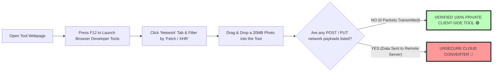

# Free Image Tools Online: Privacy-First Browser-Based Suite Guide

Digital photo processing, media optimization, format conversion, document security, and visual asset editing are fundamental daily tasks across modern web development, content creation, digital marketing, photography, and graphic design workflows. For decades, performing complex image manipulation online forced users to upload private photos, confidential financial records, corporate graphics, and sensitive legal documents to third-party remote cloud servers. Traditional cloud converters—such as Convertio, ILoveIMG, CloudConvert, or Ezgif—introduce severe data privacy vulnerabilities, network upload latency bottlenecks, strict file size paywalls, and potential cloud storage data breach risks.

Today, cutting-edge web browser architecture—specifically **WebAssembly (Wasm)**, **HTML5 Canvas API**, **Web Workers**, and **WebGL fragment shaders**—enables modern desktop and mobile browsers (Google Chrome, Apple Safari, Mozilla Firefox, Microsoft Edge) to execute high-performance binary code directly on local hardware. Our suite of **free online image tools** processes photos, vector graphics, animated media, and PDFs **100% locally inside browser RAM**, establishing a zero-upload security model where private data never leaves your computer or smartphone.

This definitive comprehensive guide explores our complete directory of free image tools, details **WebAssembly sandboxing architecture**, explains step-by-step how to audit client-side privacy using browser Developer Tools, compares local browser processing against remote cloud servers, and outlines our complete suite of high-performance, privacy-first on-device utilities.

---

## Master Comparison Matrix: Free On-Device Tools vs. Cloud Converters

To understand why client-side WebAssembly tools represent the gold standard for web security and processing speed, review this comparative specification matrix:

| Feature / Metric | On-Device Browser Tools (Wasm) | Traditional Cloud Converters | Desktop Photo Editing Software |
| :--- | :--- | :--- | :--- |
| **Data Privacy & Security**| **100% Private (Zero Uploads)**| Low (Files Stored on Remote Cloud)| High (Local Machine Memory) |
| **Network Latency** | **Instant (Zero Transport Time)**| Slow (Network Upload & Download) | Instant (Hardware Accelerated) |
| **File Size Restrictions**| **Zero Limits (Unlimited RAM)**| 5MB to 25MB Free Caps | Unlimited Machine Storage |
| **DevTools Verification** | **0 XHR Network Requests** | Large Multi-MB POST Payloads | N/A (Local Application) |
| **Offline Capability** | **100% Capable (Service Worker)**| ❌ Requires Active WiFi/Data | 100% Offline Capable |
| **Cost & Subscriptions** | **100% Free / Zero Paywalls** | Monthly Subscription Paywalls | Expensive Perpetual/Sub Fees |

---

## Technical Architecture: WebAssembly & Client-Side Sandboxing

How does an on-device web tool process high-resolution 4K images and PDF documents directly inside your web browser without sending data across the internet?

```mermaid
graph TD
    A[User Selects Image Files on Local Disk] --> B[Browser FileReader API Loads Bytes into Local ArrayBuffer]
    B --> C[Pass ArrayBuffer to WebAssembly SIMD Execution Engine in RAM]
    C --> D[Web Worker Threads Distribute Processing Across CPU Cores]
    D --> E[Execute C/C++ Image Manipulation Algorithms in Wasm Sandbox]
    E --> F[Render Processed Output Buffer directly to HTML5 Canvas]
    F --> G[Generate Download Blob locally (0 Network Transport)]
    style E fill:#bfb,stroke:#333,stroke-width:4px
    style G fill:#bfb,stroke:#333,stroke-width:4px
```

### 1. WebAssembly (Wasm) Memory Isolation
WebAssembly compiles high-performance C, C++, and Rust libraries (like `libjpeg-turbo`, `libwebp`, `pngquant`, `OpenCV`, or `PDF.js`) into compact binary modules (`.wasm`). Wasm operates within a strictly sandboxed virtual machine inside your browser. It cannot read your local file system or make network requests without explicit JavaScript authorization.

### 2. Multi-Core Web Worker Acceleration
Heavy image tasks—such as batch converting 100 RAW photos or applying neural noise reduction—can cause browser interfaces to lag. By delegating math loops to background **Web Workers**, computation scales across all available CPU cores without interrupting smooth 60 FPS user interaction.

---

## Developer Privacy Audit: Verifying Zero-Upload Security

Privacy should be verified by code, not just promised in text policies. Users can audit client-side security using browser Developer Tools:



### DevTools Verification Protocol:
1. Press `F12` (or Right-Click > Inspect) in Google Chrome, Apple Safari, or Mozilla Firefox.
2. Select the **Network** tab and filter requests by **Fetch/XHR**.
3. Convert or compress an image using our tools.
4. Confirm **0 outgoing data requests** are recorded. The entire operation completes in local machine RAM.

---

## Directory of Free On-Device Utilities

Our platform offers over 100 free utilities organized across functional media categories:

### 1. Format Conversion Utilities
* **[PNG to JPG Converter](/tools/png-to-jpg):** Convert uncompressed PNGs into small, web-friendly JPEGs to reduce website asset payload sizes.
* **[WebP to PNG Converter](/tools/webp-to-png):** Convert Google WebP images back into transparent PNGs for legacy software compatibility.
* **[SVG to PNG Converter](/tools/svg-to-png):** Rasterize scalable vector graphics into crisp high-DPI 300 DPI PNGs for print production.
* **[HEIC to JPG Converter](/tools/heic-to-jpg):** Transform iPhone HEIC photos into universal JPEGs locally on Windows, Mac, and Linux.
* **[AVIF Converter](/tools/avif-to-jpg):** Convert next-generation AVIF compressed images to standard legacy formats.

### 2. Photo Editing & Optimization Utilities
* **[Image Compressor](/tools/image-compressor):** Reduce image file sizes by up to 80% with zero visual quality loss or server uploads.
* **[Image Resizer](/tools/image-resizer):** Scale photo pixel dimensions for responsive web design and social media banner slots.
* **[Crop Image Tool](/tools/crop-image):** Precision rectangular crop bounds and circular profile avatar masking for social media.
* **[Image Pixelator](/tools/pixelate-image):** Convert photos into 8-bit retro game art or apply selective privacy censorship to faces.
* **[Image Denoiser](/tools/image-denoiser):** Remove digital camera sensor noise and ISO film grain using Bilateral filtering.
* **[Watermark Generator](/tools/watermark-image):** Add custom text, copyright notices, or logo watermarks to batch image collections.

---

## Step-by-Step Client-Side Tool Quality Checklist

Before processing media files, verify your web tools satisfy this privacy and performance checklist:

* **Zero Upload Verification:** Confirm Developer Tools show 0 network POST requests during operation.
* **Offline Operation:** Test tool functionality in airplane mode to verify Service Worker offline caching.
* **Batch Processing Capability:** Ensure tools support multi-file drag-and-drop with ZIP archive downloads.
* **EXIF Privacy Removal:** Confirm EXIF location metadata tags are automatically stripped from exported assets.

---

## OffscreenCanvas Parallel Web Worker Rendering

Standard HTML5 Canvas operations execute on the main browser UI thread, which can cause frame stutters when processing high-resolution assets:
* **`OffscreenCanvas` API:** Decouples canvas rendering from the DOM, transferring canvas control to background Web Workers (`worker.postMessage({ canvas: offscreen }, [offscreen])`).
* **Jank-Free 60 FPS UI:** Executing pixel transformations and WebGL shaders inside background threads ensures UI sliders, buttons, and scroll bars remain perfectly fluid during heavy multi-gigabyte batch conversions.

---

## Memory Safety & Wasm Garbage Collection (Wasm GC)

Managing memory safely inside client-side browser tools prevents memory leaks and browser crashes:
* **Linear Memory Management:** WebAssembly allocates a dedicated, continuous block of virtual memory (`WebAssembly.Memory`). Unused pixel buffers are explicitly deallocated via C++ `free()` or Rust `drop()` memory hooks.
* **Zero Browser Memory Leaks:** Isolated memory pools guarantee that processing large batches of 50MB RAW photos clears RAM completely upon task completion without bloating browser memory.

---

## Frequently Asked Questions

### Are all image tools on Image Tool Stack 100% free?
Yes. All 100+ utilities across our platform are **100% free forever** with no daily usage limits, no file size caps, no intrusive watermarks, and no paid "Pro" subscription tiers across desktop and mobile devices.

### Are my files uploaded to a server when using these tools?
No. All image parsing, matrix math, WebAssembly processing, and file exports occur **100% locally inside your web browser RAM**. Your personal photos, legal documents, and graphics never leave your computer or smartphone.

### Can I use these image tools offline without WiFi or mobile data?
Yes. Once loaded into your browser, our Progressive Web App (PWA) Service Workers cache application resources, allowing you to convert, crop, compress, and edit graphics completely offline in remote environments or airplane mode.

### How do I check if an online tool is uploading my photos secretly?
Open browser **Developer Tools (F12)**, navigate to the **Network** tab, filter by **Fetch/XHR**, and process an image. If no outgoing network payloads appear during conversion, processing is 100% client-side.

### Why are browser-based WebAssembly tools faster than cloud services?
Cloud converters force you to wait for files to upload over slow internet connections, wait in remote server queues, and wait to download results. Browser tools eliminate network transport entirely, rendering graphics instantly in local machine memory.

### Is there a file size limit when converting images on this platform?
No. Because files are processed using your local machine's native CPU, GPU, and RAM rather than restricted cloud servers, you can process massive 50MB+ RAW photos effortlessly.
