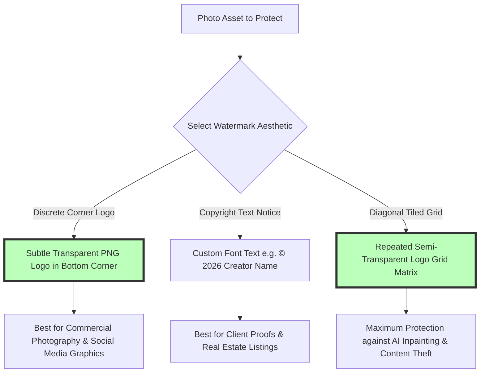

# How to Add a Watermark to Images Online Free: Batch Text & Logo Guide

Protecting original visual content, digital photography, real estate property listings, artwork portfolios, branding graphics, and product media from unauthorized online distribution, copyright theft, and scraping is a critical necessity for content creators, commercial photographers, e-commerce sellers, agency designers, and digital artists. Adding a clean custom text overlay or brand logo watermark establishes clear copyright ownership, prevents competitors from stealing visual assets, deters automated scraper bots, and drives brand attribution whenever images are reshared across social media platforms like Instagram, Pinterest, Twitter, Facebook, and LinkedIn.

However, content creators and photographers frequently encounter frustrating operational friction when watermarking images online: cloud watermarking services like Watermark.ws, Watermarkly, or Visual Watermark that force users to upload confidential photos to remote third-party cloud servers, tools that restrict batch processing behind paid monthly subscriptions, interfaces that apply ugly third-party branding logos unless you upgrade to a "Pro" account, or laggy web apps that compress exported graphics into blurry lower-resolution JPEGs.

This definitive guide provides a comprehensive tutorial on **how to add a watermark to images online**, details **client-side HTML5 Canvas watermarking mechanics**, explains text vs. logo overlay math, outlines watermark opacity and positioning geometry, and demonstrates how to process large photo batches securely and privately directly inside your local web browser.

---

## Master Comparison Matrix: Watermarking Tools & Features

To evaluate how browser-based watermarking utilities compare to traditional cloud services and desktop photo editors, review this specification matrix:

| Feature / Metric | On-Device Browser Watermarker | Cloud Watermarking Services | Desktop Photoshop / Lightroom |
| :--- | :--- | :--- | :--- |
| **Privacy & Security** | **100% Private (Local Memory)**| Low (Uploaded to Remote Cloud)| High (Local Machine Hardware) |
| **Processing Speed** | **Instant (Zero Upload Latency)**| Slow (Network Dependent) | Fast (Hardware Accelerated) |
| **Watermark Types** | **Custom Text, Logo PNG, Tile Grid**| Fixed Presets / Gated Logos | Infinite Custom Layer Options |
| **Batch Watermarking** | **Unlimited Parallel Files (ZIP)**| 2 to 5 Images (Paywall Limits) | Batch Actions / Export Presets |
| **Opacity & Placement** | **0–100% Opacity / 9-Point Grid**| Basic Slider / Locked Grids | Full Layer Opacity & Blend Modes |
| **Cost & File Limits** | **100% Free / Zero Watermarks**| Subscription Paywalls & Caps | Expensive Monthly Subscriptions |

---

## Technical Mechanics: Client-Side HTML5 Canvas Watermark Overlay Math

How does an on-device watermarking tool overlay custom text or PNG logos onto high-resolution photos without server reliance?

```mermaid
graph TD
    A[Source Image Loaded into Browser Memory] --> B[Initialize Offscreen HTML5 Canvas matching Image Dimensions]
    B --> C[Draw Source Photo: ctx.drawImage sourceImg, 0, 0]
    C --> D{Select Watermark Type: Text or PNG Logo?}
    D -- Custom Text Overlay --> E[Configure ctx.font, ctx.fillStyle, and ctx.globalAlpha]
    E --> F[Calculate Text Coordinates based on 9-Point Anchor Grid]
    D -- Brand Logo PNG --> G[Apply Logo Scaling Matrix & Alpha Transparency]
    G --> H[Draw Logo at Target Coordinates (X, Y)]
    F --> I[Export Watermarked RGBA Canvas to PNG/JPEG Blob]
    H --> I
    style F fill:#bfb,stroke:#333,stroke-width:4px
    style H fill:#bfb,stroke:#333,stroke-width:4px
```

### 1. Watermark Coordinate Grid Anchor Math
To place a watermark consistently across images of varying resolutions, the tool calculates placement coordinates $(X_{wm}, Y_{wm})$ relative to photo width $W_{img}$ and height $H_{img}$:

* **Bottom-Right Corner Anchor (Margin $M$):**
  $$X_{wm} = W_{img} - W_{logo} - M, \quad Y_{wm} = H_{img} - H_{logo} - M$$
* **Center Anchor:**
  $$X_{wm} = \frac{W_{img} - W_{logo}}{2}, \quad Y_{wm} = \frac{H_{img} - H_{logo}}{2}$$

### 2. Tiled Grid Watermark Geometry
For maximum theft prevention, tiled watermarks repeat text or logo patterns diagonally across the entire canvas:
$$\text{Row Step} = H_{logo} + \text{Padding}, \quad \text{Col Step} = W_{logo} + \text{Padding}$$
Applying a $45^\circ$ canvas rotation transformation (`ctx.rotate(-Math.PI / 4)`) creates a professional anti-scraping grid matrix across the photo.

---

## Watermark Types: Text Overlay vs. Transparent PNG Logo vs. Tiled Grid

Choosing the right watermarking technique balances brand visibility against aesthetic presentation:



---

## Step-by-Step Tutorial: How to Add Watermarks to Images Online

Follow this simple step-by-step tutorial to watermark photo batches securely using our free tool:

### Step 1: Upload Source Photo Collection
Drag and drop your JPEG, PNG, WebP, or HEIC images into our free [Watermark Generator](/tools/watermark-image). You can process dozens or hundreds of photos simultaneously in a single session.

### Step 2: Choose Watermark Type (Text or Logo)
* **Text Watermark:** Type your custom text copyright notice (e.g., `© 2026 Your Brand Name`), select custom font typography family, text pixel size, and text color vectors.
* **Logo Watermark:** Upload your official brand logo file (preferably a transparent **PNG-24 or WebP** vector icon for clean alpha channel background integration).

### Step 3: Adjust Opacity and Position
* Move the **Opacity Slider** (30% to 50% opacity is recommended for subtle brand attribution that doesn't obscure primary photo subjects).
* Select a 9-point grid anchor (Bottom-Right, Center, Top-Left) or toggle **Diagonal Cross-Hatch Tile Grid** for full-screen anti-scraping protection.

### Step 4: Process and Download Batch
Click "Apply Watermark & Download All". All canvas drawing operations run locally in browser RAM, and your watermarked photos are compiled into a single organized **ZIP archive file** ready for instant download.

---

## Step-by-Step Copyright & Watermarking Checklist

Before publishing watermarked assets online, run your photos through this quality checklist:

* **Opacity Balance:** Verify watermark opacity is subtle (30%–50%) to maintain photo aesthetics while preventing theft.
* **Transparent Logo Format:** Upload transparent **PNG-24 or WebP** logos to avoid white box backgrounds.
* **High-Resolution Anchor Scaling:** Confirm watermark text scales proportionally on high-res camera photos.
* **Local Processing Check:** Confirm processing occurred 100% locally in browser memory without server uploads.

---

## Dynamic EXIF Metadata & Timestamp Overlay Watermarking

For field inspectors, construction managers, insurance adjusters, and archival photographers, burning EXIF capture metadata into images provides tamper-evident proof:
* **EXIF Tag Parsing:** Client-side JavaScript extracts EXIF tags (such as `DateTimeOriginal`, `GPSLatitude`, `GPSLongitude`, `CameraModel`).
* **Automated Canvas Stamp:** The canvas compositing engine draws date stamps, GPS coordinates, and camera serial numbers directly into specified image corners during batch processing.

---

## Anti-AI Inpainting & Scraper Theft Protection Strategies

Modern generative AI content-aware fill models (inpainting AI) can sometimes remove simple corner watermarks. Protecting visual assets in 2026 requires advanced watermarking strategies:
* **High-Frequency Noise Injection:** Adding subtle, semi-transparent noise overlays inside logo graphics prevents AI inpainting algorithms from cleanly detecting watermark boundaries.
* **Multi-Tile Cross Hatching:** Spacing semi-transparent $30\%$ opacity logo tiles diagonally across complex texture gradients ensures AI removal leaves visible smudging artifacts, rendering stolen assets unusable for commercial resale.

---

## Frequently Asked Questions

### What is the best free online image watermarker in 2026?
The best online watermarker is **Image Tool Stack's [Watermark Generator](/tools/watermark-image)**. It adds text and logo watermarks to image batches 100% locally in your web browser with zero server uploads, custom opacity controls, 9-point grid positioning, and instant ZIP downloads across desktop and mobile devices.

### How do I watermark multiple photos at once for free?
Drag and drop your photo collection into our [Watermark Generator](/tools/watermark-image), configure your text or logo watermark, select your target placement anchor, and click download. The tool processes all photos simultaneously in browser RAM and exports a convenient ZIP file.

### What is the best watermark opacity setting?
An opacity setting between **30% and 50%** is ideal. This keeps the watermark clearly visible for copyright protection without distracting viewers from the photo's main subject or altering overall visual aesthetics.

### Should I use a text watermark or a logo PNG watermark?
Use a **transparent PNG logo** for professional brand marketing on social media channels. Use a **text copyright notice** (e.g., `© 2026 Creator Name`) or **tiled diagonal grid** for client proofs and real estate listings to prevent unauthorized content scraping.

### Will watermarking an image reduce its original resolution?
No. Our client-side watermarking tool composits watermarks directly onto your source canvas at **100% native pixel dimensions** without applying unnecessary downsampling or re-compression loss.

### Is my photo collection uploaded to a server when watermarking?
No. All HTML5 Canvas drawing, alpha blending, positioning calculations, and ZIP archive generation happen **100% inside your local web browser RAM**. Your private photos, legal documents, and graphics never leave your device.