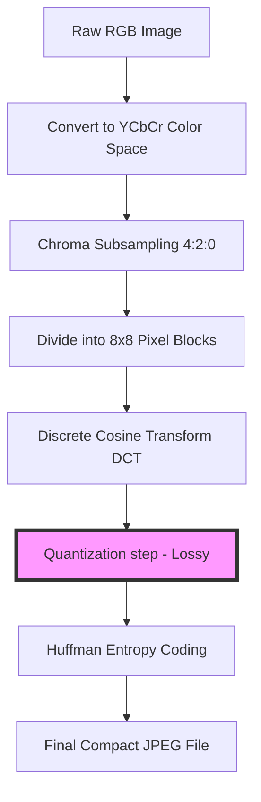

# How to Compress Images Without Losing Quality: Technical Guide

In the modern digital landscape, image optimization is critical for web performance, SEO, storage management, and bandwidth conservation. While reducing image file sizes is straightforward, doing so while maintaining high visual quality requires understanding how compression algorithms work.

Improper compression can lead to blocky artifacts, color shifts, and blurry text, rendering assets unprofessional. Fortunately, modern compression standards allow you to shrink image files by up to **80%** with virtually zero noticeable change in visual quality (known as "visually lossless" compression).

This guide analyzes the technical mechanics of lossy and lossless compression, details the mathematics of image codecs, and provides a step-by-step workflow for optimizing your creatives securely.

---

## Technical Comparison: Lossless vs. Lossy Compression

To compress images effectively, you must understand the difference between the two primary types of compression:

| Feature | Lossless Compression | Lossy Compression |
| :--- | :--- | :--- |
| **Data Integrity** | 100% of original pixel data is preserved | Redundant visual details are discarded |
| **Typical File Formats**| PNG, GIF, RAW, TIFF (lossless) | JPEG, WebP (lossy), AVIF (lossy) |
| **Compression Ratio** | Moderate (Typically 10% to 30%) | High (Typically 50% to 90%) |
| **Processing Mechanics**| Entropy coding (Huffman, LZW, DEFLATE) | Quantization, DCT, Subsampling |
| **Best Use Case** | Vector logos, screenshots, text graphics | Photography, continuous-tone scenes |
| **Generation Loss** | None (Safe for repeated edits) | Accumulates with each saving cycle |

---

## The Mathematics of Lossy JPEG Compression

The JPEG compression standard, created in 1992, remains the most widely used format for digital photography. To reduce file size, JPEG exploits limitations in human vision—specifically, our inability to perceive high-frequency detail and slight color variations as easily as changes in brightness.

The JPEG compression pipeline involves several distinct mathematical phases:

### 1. Color Space Conversion (RGB to YCbCr)
First, the image is converted from the standard RGB color model to the **YCbCr** color space:
*   **Y (Luminance):** The brightness component.
*   **Cb (Chrominance Blue):** The blue-difference color component.
*   **Cr (Chrominance Red):** The red-difference color component.

Because the human eye has higher sensitivity to brightness than color variations, we can compress the color channels (Cb and Cr) more aggressively than the brightness channel (Y) without affecting perceived quality.

### 2. Chroma Subsampling
After color space conversion, the color channels are downsampled using **Chroma Subsampling** schemes:
*   **4:4:4 (No Subsampling):** Full resolution for all channels.
*   **4:2:2 (Moderate Subsampling):** Reduces horizontal color resolution by half.
*   **4:2:0 (Aggressive Subsampling):** Reduces both horizontal and vertical color resolution by half. 
Using $4:2:0$ subsampling instantly reduces the uncompressed file size by **50%** before any additional compression is applied.

### 3. Discrete Cosine Transform (DCT)
The image channels are divided into grids of **$8\times8$ pixel blocks**. The system then applies the **Discrete Cosine Transform (DCT)** to convert the spatial pixel values of each block into a frequency space representing variations in brightness and color:
$$F(u, v) = \frac{1}{4} C(u) C(v) \sum_{x=0}^{7} \sum_{y=0}^{7} f(x, y) \cos\left[\frac{(2x+1)u\pi}{16}\right] \cos\left[\frac{(2y+1)v\pi}{16}\right]$$
This step concentrates the most important visual information (low frequencies) in the top-left corner of the $8\times8$ matrix, while less visible details (high frequencies) are shifted to the bottom-right.

### 4. Quantization
**Quantization** is the only lossy step in the JPEG pipeline. The frequency coefficients calculated in the DCT phase are divided by corresponding values from a **Quantization Table** and rounded to the nearest integer:
$$F_Q(u, v) = \text{round}\left( \frac{F(u, v)}{Q(u, v)} \right)$$
Higher compression settings divide by larger numbers in the quantization table. This rounds many high-frequency coefficients to zero, creating long sequences of zeros that are highly compressible. However, if the divisor is too high, it discards important visual detail, resulting in blocky artifacts.

---

## The Lossless PNG Optimization Pipeline

**PNG (Portable Network Graphics)** is a lossless format designed for web graphics, logos, and screenshots. It achieves file size savings without discarding any pixel data by combining two processing stages:

### 1. Delta Filtering
Before compressing, the PNG encoder processes each row of pixels using one of five mathematical filters to make the data more uniform:
*   **None (0):** Leaves pixel values unchanged.
*   **Sub (1):** Records the difference between the current pixel and the pixel to its left.
*   **Up (2):** Records the difference between the current pixel and the pixel directly above it.
*   **Average (3):** Uses the average of the left and top pixels as a predictor.
*   **Paeth (4):** Computes a linear function of the left, top, and top-left pixels to select the closest predictor.

By converting raw pixel values into small difference offsets, the filter stage makes the image data much more repetitive and easier to compress.

### 2. DEFLATE Compression
Once filtered, the data is compressed using the **DEFLATE** algorithm, which combines two entropy coding techniques:
*   **LZ77:** A sliding window algorithm that replaces repeated sequences of data with references to previous occurrences in the file.
*   **Huffman Coding:** Assigns shorter bit codes to frequently occurring symbols and longer codes to rare symbols.

---

## Next-Generation Image Codecs: WebP & AVIF

Modern web architectures use next-generation image codecs to achieve better compression than JPEG and PNG:

*   **WebP (VP8 Engine):** Created by Google, WebP supports both lossy and lossless compression. WebP lossy compression uses spatial prediction vectors derived from surrounding pixel blocks to predict the contents of a block, encoding only the difference (residual error). This results in files that are **25% to 34% smaller** than equivalent JPEGs.
*   **AVIF (AV1 Engine):** AVIF uses the open AV1 video codec standard. It supports advanced chroma subsampling configurations and high-precision color depths (10-bit and 12-bit). AVIF files are typically **50% smaller** than JPEGs and **20% smaller** than WebPs at equivalent visual quality.

---

## Step-by-Step Compression Workflow

To optimize your images effectively without losing quality, follow this workflow:

### 1. Choose the Correct Format
*   **JPG:** Use for photographic assets, continuous gradients, and complex textures where lossy compression is acceptable.
*   **PNG:** Use for illustrations, logos, and layouts with text.
*   **WebP/AVIF:** Use as the default web delivery format. Serve them using HTML `<picture>` elements to provide compatibility fallbacks.

### 2. Scale Dimensions First
Before applying compression, check the image dimensions. If you have a $4000\times3000$ pixel camera photo, but you only need it to display as a $800\times600$ pixel banner, scale the dimensions down first using a [Bulk Image Resizer](/tools/bulk-resizer). Resizing reduces the pixel count and instantly shrinks the file size before any compression is applied.

### 3. Compress Locally
Use a client-side compressor like our on-device [Image Compressor](/tools/image-compressor). Because it runs locally in your browser's memory, your images are compressed on your CPU without being uploaded to third-party servers.

### 4. Find the Quality Sweet Spot
When compressing JPEGs or WebPs, set the quality slider between **80% and 85%**. This quality range achieves a good balance, reducing file sizes by up to 80% while keeping compression artifacts invisible to the human eye.

---

## Frequently Asked Questions

### How can I compress an image without losing quality?
To compress an image without losing quality, use a **lossless** format like PNG or compress JPEGs using a quality setting between **80% and 85%**. This quality range reduces the file size significantly while keeping visual quality identical to the original.

### What is the difference between lossy and lossless compression?
Lossless compression reduces file size by optimizing how pixel data is stored without discarding any information. Lossy compression permanently discards minor details and color variations that are less visible to the human eye.

### Why does JPEG compression create blocky artifacts?
JPEG divides images into $8\times8$ pixel blocks for frequency analysis. Under high compression settings, the quantization step rounds most of the frequency coefficients in a block to zero. This discards the detailed transitions between blocks, resulting in visible grid-like patterns (blocky artifacts).

### Can I convert a JPEG to a PNG to restore quality?
No. Once an image is saved as a JPEG, the discarded visual information is permanently lost. Converting it to PNG will only increase the file size without restoring any of the original detail.

### How does WebP achieve smaller file sizes than JPEG?
WebP uses advanced intra-frame prediction algorithms derived from the VP8 video codec. These algorithms analyze neighboring pixel blocks to predict the contents of a block, encoding only the difference (residual error) rather than the raw pixel values.

### How can I compress sensitive documents safely?
To compress sensitive documents (like IDs, invoices, or passports) without exposing them to external databases, use our free, browser-based [Image Compressor](/tools/image-compressor). The tool runs locally in your browser, ensuring your files never leave your device.