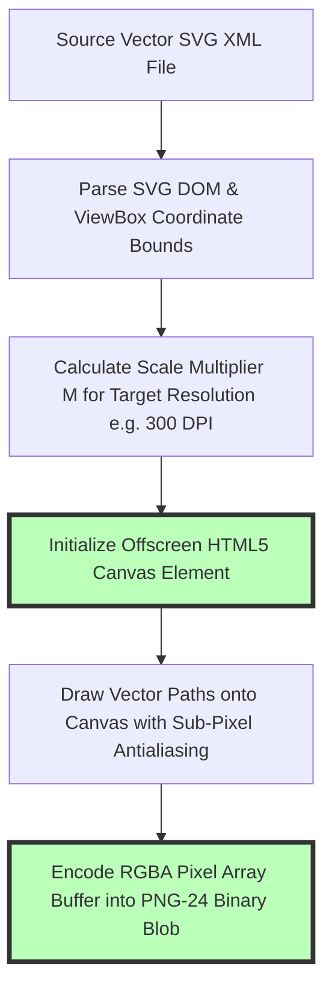
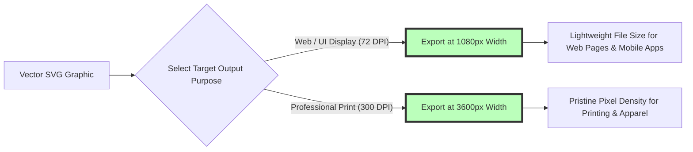

# How to Convert SVG to PNG: High-Resolution & 300 DPI Guide

Scalable Vector Graphics (SVG) are the foundation of digital vector design, web logos, responsive typography, UI icon sets, and vector illustrations. Defined using XML code paths rather than fixed pixel grids, SVG vector graphics scale infinitely without losing visual sharpness or introducing pixelation. However, many production applications—such as social media publishing, office presentation software (Microsoft PowerPoint, Google Slides), merchandise print production (t-shirts, posters, stickers), mobile app asset pipelines, and legacy graphic software—require high-resolution **PNG (Portable Network Graphics)** files.

However, content creators and graphic designers often encounter frustrating roadblocks when attempting to convert SVG vectors to PNG online: cloud conversion web apps like Convertio or CloudConvert that force users to upload private vector files to third-party servers, tools that export blurry low-resolution 72 DPI images, platforms that replace transparent vector backgrounds with solid white boxes, or services that lock high-resolution rasterizations behind paid monthly subscriptions.

This guide provides a comprehensive tutorial on **how to convert SVG to PNG**, details **vector XML rasterization math**, explains high-DPI resolution scaling (such as 300 DPI for print), outlines transparent alpha channel preservation, and demonstrates how to rasterize vector graphics locally in your browser.

---

## Master Comparison Matrix: SVG Rasterization Methods

To understand how browser-based SVG converters compare to cloud tools and professional vector editors, review this specification matrix:

| Feature / Metric | On-Device Browser Converter | Cloud Conversion Services | Professional Desktop Editors |
| :--- | :--- | :--- | :--- |
| **Privacy & Security** | **100% Private (Local Memory)**| Low (Uploaded to Remote Cloud) | High (Local Machine Hardware) |
| **Processing Speed** | **Instant (Zero Upload Latency)**| Slow (Network Dependent) | Fast (CPU / GPU Hardware) |
| **Resolution Scaling** | **Custom Width/Height & Scale (8x)**| Fixed Dimensions / Preset Caps| Infinite Custom DPI Settings |
| **Transparency Retention**| **8-Bit Alpha Channel (PNG-24)**| Variable / Solid White Boxes | Full Alpha Channel Control |
| **Batch Processing** | **Unlimited Parallel Files (ZIP)**| 2 to 5 Files (Paywall Limits) | Batch Actions / Scripts |
| **Cost & File Limits** | **100% Free / Zero Caps** | Subscription Paywalls | Expensive Monthly Subscriptions |

---

## Technical Mechanics: How Vector SVG Math is Rasterized into PNG Pixels

How does a web browser convert resolution-independent XML vector math into a high-definition raster PNG pixel grid?

### 1. XML ViewBox Coordinate Scaling Math
An SVG file defines vector objects using mathematical shapes (`<path>`, `<circle>`, `<polygon>`). The SVG `viewBox="0 0 W_vb H_vb"` attribute defines the internal coordinate ratio.
* To export a PNG at target width $W_{target}$ and height $H_{target}$, the rasterization engine calculates scale multiplier $M$:
  $$M = \frac{W_{target}}{W_{vb}}$$
* Every vector path point, stroke width, and control handle is scaled by $M$, allowing a $100\times100$ unit vector SVG to render as a crisp $4000\times4000$ pixel PNG without pixelation.

### 2. Sub-Pixel Antialiasing & Alpha Channel Retention
Vector curved boundaries are smoothed using sub-pixel antialiasing. By blending edge pixel transparency ($A = 0.0 \dots 1.0$), vector lines remain silky smooth on any background color. Disabling default white canvas backgrounds guarantees the exported PNG retains its **8-bit alpha channel transparency**.

---

## DPI Resolution Math: Screen (72 DPI) vs. Professional Print (300 DPI)

Setting the correct pixel dimensions before rasterization is essential to prevent blurry print output:

### Print Pixel Resolution Formula:
To calculate required pixel dimensions for physical print projects (t-shirts, merchandise, posters, or business cards):
$$\text{Pixel Width} = \text{Print Width (Inches)} \times \text{Target DPI}$$

* **Example (12-Inch Shirt Print at 300 DPI):** $12 \text{ in} \times 300 \text{ DPI} = 3600 \text{ pixels}$.
* Exporting your SVG at **$3600\times3600\text{px}$** guarantees pristine print clarity without blurry edges.

---

## Step-by-Step Tutorial: How to Convert SVG to PNG

Follow this simple tutorial to convert SVG vectors to high-resolution PNG graphics using our free tool:

### Step 1: Upload SVG Files
Drag and drop your vector SVG graphics into our free [SVG to PNG Converter](/tools/svg-to-png). You can upload individual vector assets or entire multi-file batch illustration collections simultaneously.

### Step 2: Configure Resolution & Scale Multiplier
* Select a scale multiplier ($2\times$, $4\times$, $8\times$) or enter explicit pixel target dimensions (e.g., $3600\times3600\text{px}$ for 300 DPI high-definition physical print output).

### Step 3: Confirm Transparent Alpha Channel
Verify background transparency is toggled to preserve 8-bit alpha channel transparent backgrounds without solid white box fill.

### Step 4: Rasterize and Download
Click "Convert & Download". The browser parses XML vector paths and encodes PNG-24 binaries locally in RAM, packaging converted graphics into a clean **ZIP archive** ready for instant download.

---

## Step-by-Step Vector Conversion Quality Checklist

Before publishing or printing converted PNG graphics, run your assets through this checklist:

* **Resolution Verification:** Confirm output pixel width satisfies target print density (e.g., 3600px for 300 DPI print).
* **Alpha Channel Retention:** Verify background transparency is preserved without solid white boxes.
* **Font Outline Expansion:** Ensure SVG text elements use system fonts or are converted to outlines (`<path>`) before conversion.
* **Local Processing Check:** Confirm conversion occurred 100% locally in browser memory without server uploads.

---

## SVG Transformation Matrix Handling (`transform="matrix(...)"`)

Complex vector illustrations utilize affine transformation matrices to position, scale, and rotate grouped XML elements (`<g>`):
* **Matrix Transformation Math:** The renderer evaluates $3\times3$ affine matrices to transform vector coordinates $(x, y)$ to $(x', y')$:
  $$\begin{bmatrix} x' \\ y' \\ 1 \end{bmatrix} = \begin{bmatrix} a & c & e \\ b & d & f \\ 0 & 0 & 1 \end{bmatrix} \begin{bmatrix} x \\ y \\ 1 \end{bmatrix}$$
* **Canvas Transformation Synchronization:** Our client-side rasterization engine synchronizes SVG transform strings directly into the 2D canvas context (`ctx.transform(a, b, c, d, e, f)`), ensuring nested vector shapes, clip paths, and linear/radial gradients align with mathematical precision.

---

## Color Space Preservation: sRGB vs. Wide Color Gamut (Display P3)

Preserving brand color accuracy during vector rasterization requires proper color space management:
* **sRGB Color Standard:** Standard sRGB color tagging guarantees consistent vector logo color reproduction across all consumer desktop monitors, budget mobile displays, and web browsers.
* **Display P3 Wide Gamut:** For high-end digital signage and modern Apple Retina displays, rasterizing SVG vectors into wide-gamut PNGs preserves 25% more vivid green and red color tones without clipping color gamuts.

---

## Frequently Asked Questions

### What is the best way to convert SVG to PNG for free in 2026?
The best way to convert SVG to PNG is using **Image Tool Stack's [SVG to PNG Converter](/tools/svg-to-png)**. It converts vector SVG graphics to high-resolution PNGs 100% locally in your web browser with zero server uploads, custom DPI resolution scaling, transparent background preservation, and zero file size caps across desktop and mobile devices.

### How do I convert SVG to PNG at 300 DPI high resolution?
Upload your SVG file to our [SVG to PNG Converter](/tools/svg-to-png), set the width multiplier to $4\times$ or enter explicit pixel dimensions matching your print requirements (e.g., $3600\times3600\text{px}$ for 12 inches at 300 DPI), and download your crisp high-definition PNG file.

### Will converting SVG to PNG keep background transparency?
Yes. Our converter preserves the **8-bit alpha channel transparency** embedded in your SVG XML code, exporting a clean transparent PNG without adding unwanted white background boxes or artifact edges.

### Why does my converted PNG look blurry or pixelated?
If a converted PNG looks blurry, the output pixel width was set too low. Increasing the output dimensions (e.g., to $3000\text{px}+$ width) before rasterization guarantees razor-sharp pixel density for both screen displays and print production.

### Is my vector graphic uploaded to a server during conversion?
No. All XML parsing, DOM rendering, HTML5 Canvas rendering, and PNG binary encoding happen **100% inside your local web browser RAM**. Your vector graphics, brand assets, and private illustrations never leave your computer or mobile device.

### Can I batch convert multiple SVG vector files at once?
Yes. Drag and drop dozens of SVG files into our batch converter to process them simultaneously and download all converted PNG graphics in a single organized ZIP archive.