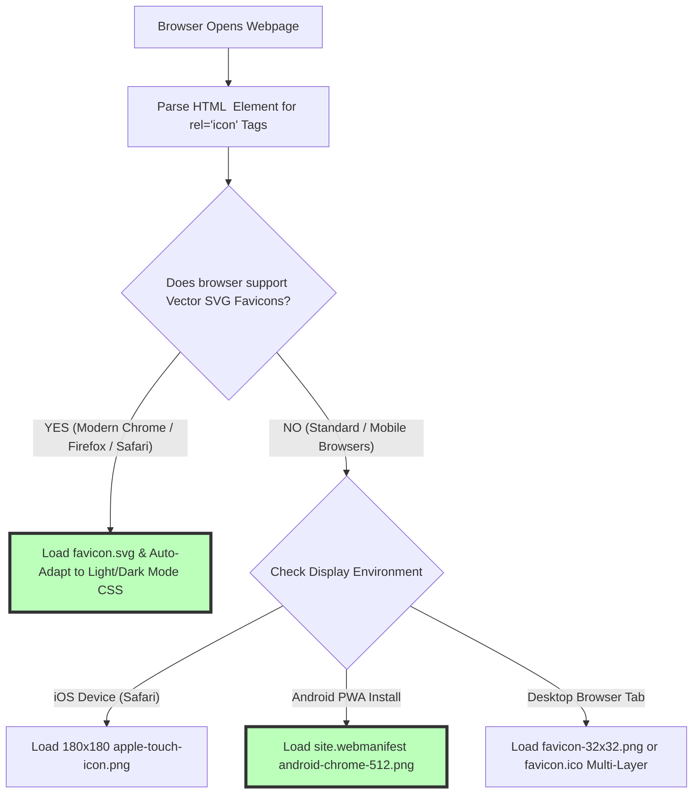

# How to Create a Favicon: ICO, PNG, SVG & HTML Head Tags Guide (2026)

A website favicon (short for "favorite icon") is one of the most critical visual branding assets for modern web applications, corporate websites, e-commerce stores, and blogs. Displayed alongside page title tags in web browser tabs, bookmark lists, mobile home screen shortcuts, search engine results pages (SERPs), and desktop application taskbars, a clean, high-resolution favicon establishes instant brand recognition, builds trust, and improves user navigation across open browser tabs.

However, web developers and UI/UX designers frequently face confusing technical complexities when configuring favicons: outdated tutorials recommending dozens of redundant legacy `.ico` files, missing high-DPI Apple touch icons, un-optimized SVGs that break on dark mode browser themes, missing Web App Manifest files for Progressive Web Apps (PWAs), or aggressive browser caching that prevents updated icons from rendering.

This guide provides a comprehensive tutorial on **how to create a favicon in 2026**, details **modern multi-resolution file standards (`favicon.ico`, `favicon.png`, `apple-touch-icon.png`, `favicon.svg`)**, outlines HTML `<head>` markup implementation, explains dark mode theme compatibility, and demonstrates how to generate favicons locally in your browser.

---

## Master Specification Matrix: Modern 2026 Favicon File Standards

In 2026, web developers no longer need to generate 20+ legacy icon sizes. A streamlined, modern favicon stack consists of **five essential files**:

| Asset Filename | Dimensions & Format | Target Platform / Purpose | HTML `<head>` Tag |
| :--- | :--- | :--- | :--- |
| **`favicon.ico`** | **16x16, 32x32, 48x48 Multi-Layer ICO**| Legacy browsers, desktop taskbars, bookmarks | `<link rel="icon" href="/favicon.ico" sizes="any">` |
| **`favicon-32x32.png`** | **32x32 PNG-24 (Alpha Transparency)** | Standard modern browser tabs (Chrome, Firefox) | `<link rel="icon" type="image/png" sizes="32x32" href="/favicon-32x32.png">` |
| **`apple-touch-icon.png`**| **180x180 PNG-24** | iOS Home Screen shortcuts (iPhones & iPads)| `<link rel="apple-touch-icon" href="/apple-touch-icon.png">` |
| **`android-chrome-512.png`**| **512x512 PNG-24** | Android Home Screen & PWA Splash Screens | Included in `site.webmanifest` |
| **`favicon.svg`** | **Vector SVG (Scalable)** | Modern high-DPI browsers & Dark Mode theme adapt | `<link rel="icon" type="image/svg+xml" href="/favicon.svg">` |

---

## Technical Mechanics: How Browsers Select & Render Favicons

How does a web browser evaluate HTML header tags to select the crispest icon for a user's display?



### 1. Vector SVG Favicons with Dark Mode Media Queries
Modern browsers (Chrome 80+, Firefox 41+, Safari 13+) support SVG favicons. You can embed CSS `@media (prefers-color-scheme: dark)` directly inside your SVG code to automatically adjust stroke and fill colors when a user toggles dark mode:

```xml
<svg xmlns="http://www.w3.org/2000/svg" viewBox="0 0 100 100">
  <style>
    path { fill: #000000; }
    @media (prefers-color-scheme: dark) {
      path { fill: #ffffff; }
    }
  </style>
  <path d="M10 10 H 90 V 90 H 10 Z" />
</svg>
```

### 2. Multi-Layer ICO Binaries
The `.ico` format is a container binary holding multiple embedded PNG images ($16\times16$, $32\times32$, and $48\times48$ pixels) in a single file. Legacy software extracts the exact layer size matching the operating system display scaling ratio.

---

## Standard 2026 HTML `<head>` Implementation Code

Copy and paste this production-ready HTML markup into the `<head>` section of your website:

```html
<!-- Modern 2026 Production Favicon Stack -->
<!-- 1. Multi-size legacy fallback (sizes="any" prevents Chrome from ignoring ICO) -->
<link rel="icon" href="/favicon.ico" sizes="any">

<!-- 2. High-res vector SVG for modern browsers -->
<link rel="icon" type="image/svg+xml" href="/favicon.svg">

<!-- 3. Standard 32x32 PNG for desktop browser tabs -->
<link rel="icon" type="image/png" sizes="32x32" href="/favicon-32x32.png">

<!-- 4. Apple Touch Icon for iOS home screen shortcuts -->
<link rel="apple-touch-icon" href="/apple-touch-icon.png">

<!-- 5. Web App Manifest for Android & Progressive Web Apps -->
<link rel="manifest" href="/site.webmanifest">
```

### Web Manifest JSON Specification (`site.webmanifest`):
```json
{
  "name": "My Web Application",
  "short_name": "App",
  "icons": [
    { "src": "/android-chrome-192x192.png", "sizes": "192x192", "type": "image/png" },
    { "src": "/android-chrome-512x512.png", "sizes": "512x512", "type": "image/png" }
  ],
  "theme_color": "#ffffff",
  "background_color": "#ffffff",
  "display": "standalone"
}
```

---

## Step-by-Step Tutorial: How to Create a Favicon Online

Follow this simple tutorial to create a complete favicon package from any source logo using our free tool:

### Step 1: Design a High-Contrast Master Logo
Create a square 1:1 ratio master logo ($512 \times 512$ pixels or scalable SVG format). Ensure the icon design uses simple, bold geometric shapes and vibrant, high-contrast colors so it remains crisp and legible at tiny $16 \times 16$ pixel tab icon sizes.

### Step 2: Upload to On-Device Favicon Generator
Drag and drop your master PNG, WebP, or vector SVG file into our free client-side [Favicon Generator](/tools/favicon-generator).

### Step 3: Generate Multi-Size Icon Assets
Click "Generate Favicon Package". Our client-side WebAssembly engine resizes the master graphic into all modern required dimensions ($16\text{px}$, $32\text{px}$, $180\text{px}$, $512\text{px}$) using Lanczos3 sinc kernel downsampling and compiles a multi-layer `favicon.ico` binary locally inside browser RAM.

### Step 4: Download Archive & Deploy HTML Tags
Download the complete ZIP package containing your icon assets and copy the production-ready HTML `<head>` code directly into your web application or website template.

---

## Step-by-Step Favicon Quality & Verification Checklist

Before publishing your favicon stack to production servers, verify your icons against this checklist:

* **Dark Mode Visibility:** Test your favicon in both light mode and dark mode browser themes.
* **Google Search Eligibility:** Confirm `android-chrome-512.png` is at least **$48\times48\text{px}$** to qualify for Google Search desktop and mobile SERP icon displays.
* **Cache Invalidation:** Append version query strings (`/favicon.ico?v=2`) if updating existing icons to bypass aggressive browser caching.
* **Local Processing Check:** Confirm icon generation occurred 100% locally in browser memory without server uploads.

---

## Lanczos3 Kernel Downsampling for Tiny Favicon Pixel Sharpening

Downsampling a 512x512 master logo down to tiny 16x16 and 32x32 pixel dimensions often causes blurry edges if basic bilinear interpolation is used:
* **Lanczos3 Sinc Filter Kernel:** Our generator uses a 3-lobe Lanczos sinc filter windowing function to downsample images:
  $$L(x) = \begin{cases} \text{sinc}(x) \cdot \text{sinc}(x/3) & \text{if } -3 < x < 3 \\ 0 & \text{otherwise} \end{cases}$$
* **High Contrast Edges:** Lanczos3 anti-aliasing preserves sharp high-frequency edge contrasts, ensuring tiny 16x16 tab icons remain readable without smudging logo typography.

---

## Maskable Android PWA Icon Geometry (`purpose: "any maskable"`)

Android devices enforce adaptive icon shapes (circles, squircles, rounded rectangles) for home screen web app shortcuts:
* **Safe Zone Padding Math:** To prevent Android OS from clipping your logo edges when applying circular or squircle masks, place core logo graphics inside the central 80% safe zone diameter ($410\times410\text{px}$ on a $512\times512\text{px}$ canvas).
* **Manifest Purpose Attribute:** Tagging icons with `"purpose": "any maskable"` inside `site.webmanifest` instructs Android devices to scale background fills seamlessly behind adaptive icon masks.

---

## Frequently Asked Questions

### What is the standard favicon size in 2026?
The modern standard favicon setup includes a **$32\times32\text{px}$ PNG** for desktop browser tabs, a **$180\times180\text{px}$ PNG** for Apple iOS home screens, a **$512\times512\text{px}$ PNG** for Android/PWA splash screens, a multi-layer **`favicon.ico`** (16px, 32px, 48px), and a **vector SVG** for scalable high-DPI displays.

### How do I convert a PNG logo into a favicon.ico file?
Upload your square PNG logo to our free [Favicon Generator](/tools/favicon-generator). The tool resizes the master graphic using Lanczos3 downsampling and compiles a multi-layer `.ico` container file containing 16x16, 32x32, and 48x48 pixel layers 100% locally in your browser.

### Why is my updated favicon not showing up in my browser?
Web browsers cache favicons aggressively in local disk storage. To force a visual update, clear your browser cache, open the favicon URL directly (`https://yourdomain.com/favicon.ico`) in a new tab to force a hard refresh, or append a version query string (`?v=2`) to your HTML tags.

### Does Google display favicons in search results?
Yes. Google displays favicons next to search result snippets on desktop and mobile SERPs. To qualify, your favicon must be accessible to Googlebot, maintain a 1:1 square aspect ratio, and measure at least **$48\times48$ pixels** or larger.

### Can I use SVG files as favicons?
Yes. Modern browsers (Chrome, Firefox, Safari, Edge) support SVG favicons (`<link rel="icon" type="image/svg+xml" href="/favicon.svg">`), allowing icons to scale crisp on 4K Retina displays and adapt dynamically to dark mode user themes via CSS media queries.

### Is my logo uploaded to a server when generating favicons?
No. All image scaling, Lanczos3 downsampling, multi-layer ICO compilation, and ZIP package generation happen **100% inside your local web browser RAM**. Your brand logo never leaves your computer or smartphone.