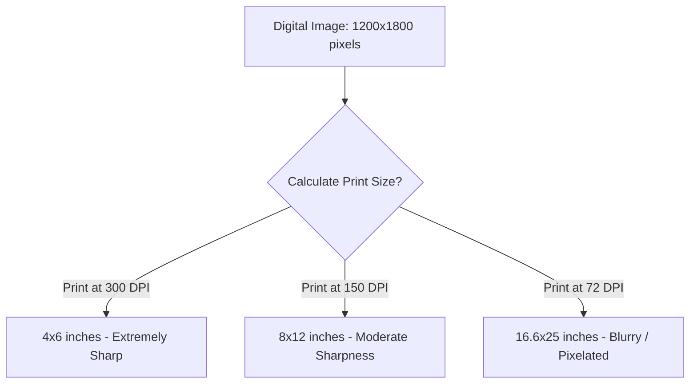
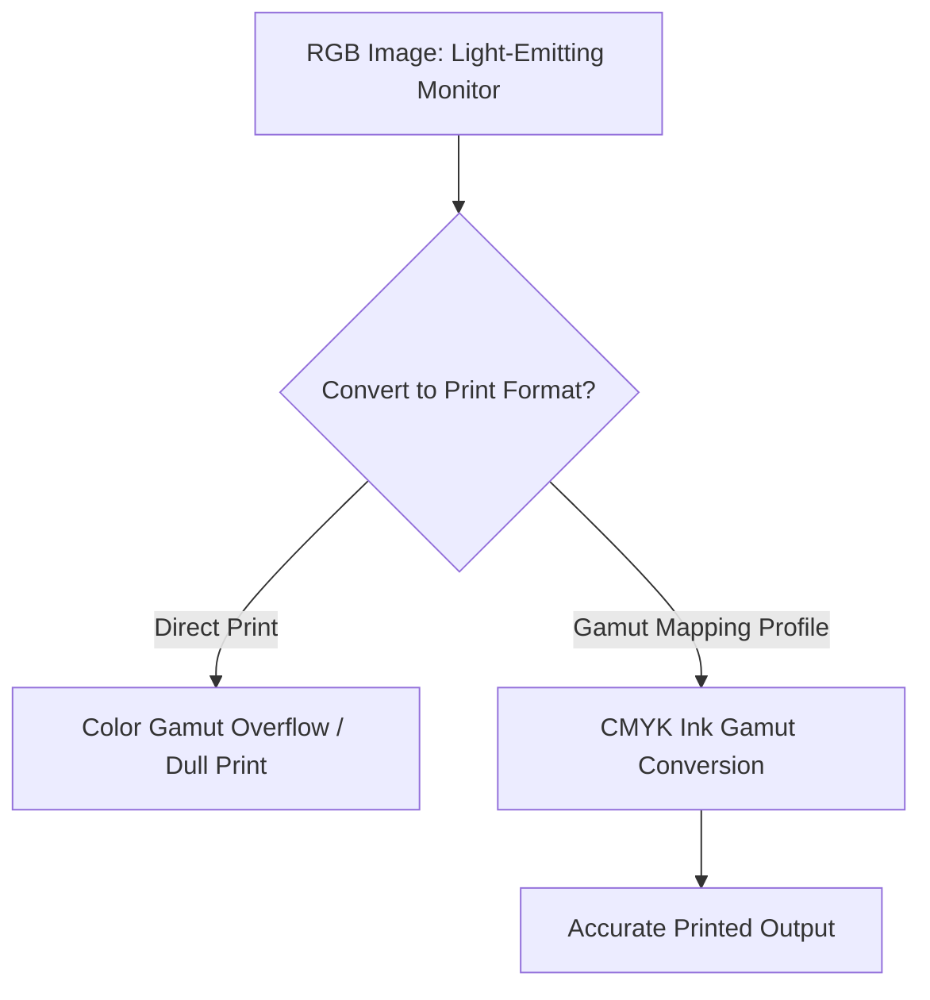

# How to Fix Blurry Photos for Print: Resolution & Interpolation Guide

Transitioning digital images from a screen to physical print media is a common challenge for designers and photographers. A photograph that looks sharp on a smartphone or high-end monitor can easily print as a blurry, pixelated, or noisy mess.

This issue occurs because digital screens and physical printing presses measure resolution and render color using fundamentally different technologies. 

This guide explains the mathematics of image resolution, compares image interpolation algorithms, details color space conversions, and provides a step-by-step pre-press checklist for preparing crisp print layouts.

---

## The Mathematics of Print Resolution (PPI vs. DPI)

To resolve printing blur, you must understand the distinction between **PPI** (Pixels Per Inch) and **DPI** (Dots Per Inch):

*   **PPI (Pixels Per Inch):** Measures the density of digital pixels in a raster file or on a digital screen. A standard laptop screen displays images at **72 to 140 PPI**, while high-density mobile screens reach **300 to 450 PPI**.
*   **DPI (Dots Per Inch):** Measures the density of physical ink dots deposited by a printing press or inkjet printer. Professional printing presses require **300 DPI** to produce smooth, continuous tones and sharp details.

The relationship between pixel dimensions, print size, and print density is defined by the following formula:
$$\text{Pixels} = \text{Print Dimensions (inches)} \times \text{Target DPI}$$

Using this formula, we can calculate the exact pixel dimensions required for standard print layouts at professional 300 DPI density:

| Standard Print Size | Physical Size (Inches) | Required Resolution at 300 DPI | Megapixels |
| :--- | :--- | :--- | :--- |
| **Standard Photo** | $4\times6\text{ in}$ | $1200\times1800\text{ px}$ | $2.16\text{ MP}$ |
| **Medium Photo** | $5\times7\text{ in}$ | $1500\times2100\text{ px}$ | $3.15\text{ MP}$ |
| **Large Photo** | $8\times10\text{ in}$ | $2400\times3000\text{ px}$ | $7.20\text{ MP}$ |
| **US Letter Sheet** | $8.5\times11\text{ in}$ | $2550\times3300\text{ px}$ | $8.41\text{ MP}$ |
| **A4 Document** | $8.27\times11.69\text{ in}$ | $2480\times3508\text{ px}$ | $8.70\text{ MP}$ |
| **A3 Poster** | $11.69\times16.54\text{ in}$ | $3508\times4960\text{ px}$ | $17.4\text{ MP}$ |

If you attempt to print a low-resolution web image (e.g. $800\times600$ pixels) on a standard letter-size page, the printer will be forced to stretch the pixels to fill the page, resulting in visible pixelation.

---

## Image Resampling and Interpolation Algorithms

When an image lacks the required pixel density for print, you must enlarge (resample) it. Resampling changes the pixel grid dimensions by estimating the color values of new pixels inserted between the existing ones. 

Several interpolation algorithms can be used for this task, each offering a different balance of speed and quality:

### 1. Nearest Neighbor Interpolation
Nearest Neighbor is the simplest interpolation method. It finds the closest pixel in the original image and duplicates its color value:
$$f(x, y) = g(\text{round}(x), \text{round}(y))$$
*   **Pros:** Extremely fast and introduces no blending blur.
*   **Cons:** Creates jagged, stair-stepped edges (aliasing) and blocky pixel grids. It is not suitable for printing photographs.

### 2. Bilinear Interpolation
Bilinear interpolation estimates pixel values using a weighted average of the $2\times2$ surrounding pixels:
$$f(x, y) = (1-t)(1-s)p_{00} + t(1-s)p_{10} + (1-t)sp_{01} + tsp_{11}$$
*   **Pros:** Smoother transitions than Nearest Neighbor.
*   **Cons:** Tends to blur sharp edges and fine details, making large enlargements look soft.

### 3. Bicubic Interpolation
Bicubic interpolation uses a cubic spline formula to calculate color values over a $4\times4$ grid of surrounding pixels (16 points total).
*   **Pros:** Produces sharper results than Bilinear interpolation, making it the standard choice for photo editing software.
*   **Cons:** Can introduce halos and ringing artifacts around high-contrast edges.

### 4. Lanczos Resampling
Lanczos resampling uses a sinc filter to calculate pixel values over an $8\times8$ grid (64 points total):
$$L(x) = \begin{cases} \text{sinc}(x) \text{sinc}(x/a) & \text{if } -a < x < a \\ 0 & \text{otherwise} \end{cases}$$
*   **Pros:** Excellent at preserving high-frequency detail and sharp edges, making it ideal for resizing photos.
*   **Cons:** Requires more processing power and can introduce minor ringing artifacts.

### 5. AI Super-Resolution (Convolutional Neural Networks)
AI Super-Resolution uses machine learning models trained on millions of paired low-resolution and high-resolution images. Instead of using mathematical interpolation, the model analyzes the context of the image (such as hair, textures, or text) and synthesizes new, high-frequency details.
*   **Pros:** The best method for large enlargements. It can recover fine details that mathematical algorithms cannot.
*   **Cons:** Requires significant GPU processing power. Our browser-based [AI Image Upscaler](/best-free-image-upscaler-online) uses on-device APIs to run these models locally.

---

## RGB to CMYK Gamut Mappings

Computer monitors display colors using the additive **RGB** model (Red, Green, Blue light), while printing presses use the subtractive **CMYK** model (Cyan, Magenta, Yellow, Black ink).

The RGB color model can display a wider range of colors (gamut) than CMYK, particularly bright, saturated colors.

When you print an RGB file, the printer driver converts the RGB values to CMYK:
$$\begin{aligned}
K &= 1 - \max(R, G, B) \\
C &= \frac{1 - R - K}{1 - K} \\
M &= \frac{1 - G - K}{1 - K} \\
Y &= \frac{1 - B - K}{1 - K}
\end{aligned}$$
If your image contains colors outside the CMYK gamut (such as neon colors), this conversion will shift them to the closest printable CMYK values, making the printed colors look dull. To maintain color accuracy, convert and soft-proof your images in the CMYK color space before sending them to the printer.

---

## Step-by-Step Print Pre-Flight Checklist

Before sending your designs to a professional print shop, run your assets through this pre-flight checklist:

*   **File Format:** Save master print files in a lossless format like **TIFF** or vector **PDF**. Avoid highly compressed JPEGs or web-only formats like WebP.
*   **Resolution:** Verify that the image has a density of at least **300 DPI** at its final physical print size. If it is too small, use our [AI Image Upscaler](/best-free-image-upscaler-online) to enlarge it.
*   **Color Space:** Convert and save your final layouts in the **CMYK** color space using a standardized profile (e.g. GRACoL or FOGRA39).
*   **Bleed Margins:** Add a bleed margin of at least **0.125 inches (3mm)** around your design to prevent white borders after the printed paper is cut.

---

## Frequently Asked Questions

### Why do my photos look sharp on my screen but blurry when printed?
Screens display images at a relatively low density of **72 to 140 PPI**, which is sufficient for light-emitting displays. Professional printers require a much higher density of **300 DPI** to lay down enough ink dots for a sharp print. If you try to print a low-resolution web image, the printer must stretch the pixels, resulting in a blurry print.

### What is the difference between PPI and DPI?
PPI (Pixels Per Inch) measures the density of digital pixels in a raster file or on a digital screen. DPI (Dots Per Inch) measures the density of physical ink dots deposited on paper by a printing press or inkjet printer. Note that some print technologies require multiple ink dots to render a single digital pixel, meaning DPI demands are hardware-dependent and often exceed standard PPI settings.

### Can I fix a blurry photo using Photoshop?
Yes. You can use image resampling options (like Bicubic Sharper or Preserve Details 2.0) to enlarge the image. If you do not have a Photoshop subscription, you can use our free, browser-based [AI Image Upscaler](/best-free-image-upscaler-online) to achieve similar results.

### Is TIFF better than JPEG for printing?
Yes. TIFF is a lossless format that preserves all image detail and supports CMYK color profiles. JPEG uses lossy compression that can introduce artifacts around sharp edges, making it less suitable for high-quality printing.

### How do I calculate the maximum print size for a photo?
To find the maximum print size of an image at professional quality (300 DPI), divide its pixel width and height by 300. For example, a $3000\times2400$ pixel image can be printed up to $10\times8$ inches.

### How can I convert my images to print-ready formats safely?
To convert web images (like WebP or HEIC) into lossless formats (like PNG or TIFF) without exposing your files to external databases, use our free, browser-based [Image Converter](/image-converter). The tool runs locally in your browser, keeping your files private and secure.
